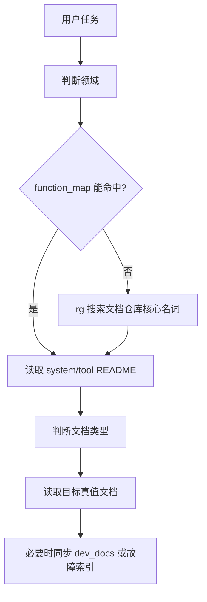

# AI语义检索规则

## 定位

本文档定义 agent 如何从用户任务语义找到正确文档，而不是在 `AGENTS.md` 中无限枚举关键词。

核心原则：

1. 先判断领域：属于哪个 system、tool，还是全局 workflow。
2. 再判断文档类型：方案、契约、导览、测试、影响面、过程记录或故障经验。
3. 查不到时先搜索索引和文档仓库，不直接凭记忆实现。

## 三步检索算法



## 领域判断

优先使用：

- `docs/00_nav/function_map.md`
- `docs/00_nav/repo_map.md`
- 目标系统或工具的 `README.md`

如果无法命中，使用 `rg` 搜索文档仓库：

```powershell
rg -n "<用户提到的核心名词>" E:\Mod_Dev\designer_territoryMod\docs
```

搜索命中后，不直接打开随机片段下结论，应先回到命中文件所在系统或工具的 `README.md`，再按目录层级阅读。

## 文档类型判断

| 任务语义 | 读取位置 |
| --- | --- |
| 目标、功能、主流程、阶段职责、边界、方案取舍 | `10_product/` |
| 数据结构、字段、schema、输入输出、配置、MCP 参数、状态枚举、版本 | `20_contracts/` |
| 代码入口、类职责、模块映射、流程实现、review 清单、从实现反查文档 | `30_code_guide/代码导览.md`；编写或重构规则见 `docs/00_nav/代码导览编写规范.md` |
| 测试、自测、验收、回归、结构校验、失败现象、影响范围 | `40_tests/` |
| 影响面、上下游、风险、验收口径变化 | `40_tests/影响面.md` |
| 新系统、新工具、大重构、从 0 到 1 | `docs/00_nav/从0到1设计开发流程.md` |
| 项目结构健康、package 迁移、系统边界、workflow 组织 | `docs/00_nav/实现仓库结构规范.md` |
| bug、异常、测试失败、多轮不收敛 | `docs/00_nav/Bug修复流程.md` |
| 调试过程、失败验证、故障复盘 | 实现仓库 `dev_docs/` |

## 索引维护要求

新增或重建系统 / 工具时，必须维护这些入口：

- `docs/00_nav/function_map.md`
- `docs/systems/<系统>/README.md` 或 `docs/tools/<工具>/README.md`
- 对应 `10_product/`、`20_contracts/`、`30_code_guide/`、`40_tests/` 中本轮涉及的文档

系统或工具 README 应维护常见术语、别名和关键对象。全局 `AGENTS.md` 不负责长期维护领域关键词表。

未开发系统不应只因被提到就创建完整文档入口或实现仓库空 package。只有进入实际重建或实现时，才按从 0 到 1 流程补齐系统入口。

## 不确定时的处理

如果文档仓库没有当前真值入口，agent 应：

1. 明确说明找不到对应 system / tool 入口。
2. 用 `rg` 列出最接近的候选文档。
3. 根据任务风险决定：
   - 小补丁：可继续实现，但验收时说明未找到真值入口。
   - 方案、契约、测试或影响面任务：先补文档入口，再继续实现。
4. 不把旧 `workFlow`、旧 whitepaper 或 `90_archive/` 当作当前真值。

## 与 AGENTS.md 的关系

`AGENTS.md` 只保留最短触发规则，本文档维护完整检索算法。以后新增系统、工具或术语时，优先更新 `function_map.md` 和对应 README，不扩写 `AGENTS.md`。
