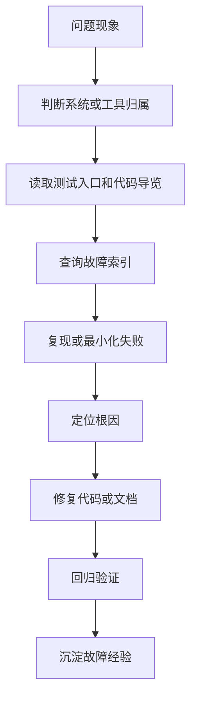

# Bug修复流程

## 定位

本文档用于 bug、异常、测试失败、行为不符和多轮调试不收敛的处理。它比从 0 到 1 开发流程更轻，重点是复现、定位、修复、回归和沉淀故障经验。

## 适用触发

出现以下情况时，agent 必须先读取本文档：

- 用户描述 bug、失败现象、异常日志、运行结果不符合预期。
- 自动测试、结构校验、构建或联调失败。
- 同类问题多轮修复后仍不收敛。
- 发现代码和文档契约不一致。
- 需要把故障根因和修复思路沉淀到 `dev_docs`。

## 处理流程



## 必读入口

| 情况 | 优先读取 |
| --- | --- |
| 不清楚系统 / 工具归属 | `docs/00_nav/function_map.md`，再用 `rg` 搜索核心名词 |
| 测试失败或验收不通过 | 对应 `40_tests/测试入口.md` |
| 不知道代码入口 | 对应 `30_code_guide/代码导览.md` |
| 字段、配置、输入输出不一致 | 对应 `20_contracts/` |
| 主流程或阶段职责不清 | 对应 `10_product/` |
| 类似问题可能出现过 | 实现仓库 `dev_docs/<systems|tools>/<名称>/故障索引.md` |

## 修复规则

agent 应优先完成以下动作：

1. 复现问题，或说明无法复现的原因。
2. 明确问题属于实现 bug、契约失真、测试入口过期、方案边界不清，还是环境问题。
3. 修复最小必要范围，不回滚用户或其他 agent 的无关改动。
4. 修复后运行对应测试或结构校验。
5. 如果 bug 暴露出契约、测试入口、代码导览或影响面失真，必须同步修正文档仓库。

## 自修上限

同一类问题最多自行连续修复两轮。第三次仍不收敛时，agent 必须暂停并输出：

```text
问题现象：
已尝试修复：
为什么没有收敛：
当前 debug 产物：
怀疑的设计偏差：
需要用户判断：
```

## 故障索引

当 bug 有复用价值时，必须写入实现仓库对应故障索引：

- 系统：`dev_docs/systems/<系统>/故障索引.md`
- 工具：`dev_docs/tools/<工具>/故障索引.md`

故障索引不记录流水账，只记录可检索摘要：

| 现象 | 根因 | 修复点 | 验证 | 记录 |
| --- | --- | --- | --- | --- |
| 简短描述用户或测试看到的问题 | 触发 bug 的真实原因 | 关键代码、契约或配置修复 | 运行的测试或校验 | 指向任务记录或提交 |

如果故障修复过程复杂，再创建或更新 `dev_docs/.../active/YYYYMMDD_中文任务名/任务记录.md`。
