# 地貌驱动主线 Workflow

## 定位

本文定义 Geomantia 当前主线的宏观 workflow。它用于约束 W / T / C 各阶段如何分工，以及 AI、程序、GIS、原版 jigsaw / prefab 执行层之间如何交接。

本文不是字段契约，也不规定完整 schema。后续进入具体系统实现时，字段、版本、枚举和示例应写入对应 `docs/systems/<系统>/20_contracts/`。

旧 `workFlow` 和旧 C 阶段资料只作为 `docs/90_archive/` 下的历史参考，不再作为当前真值。

## 核心取舍

1. 地形事实由 GIS 和程序解算，不让 AI 逐步扫描或逐块求解。
2. AI 负责风格、偏好、比例、语法、结构池倾向和人工可 review 的策略判断。
3. 程序负责地貌分类、候选选址校验、功能区落图、边界几何、约束场和预算求解。
4. 原版 jigsaw / prefab 仍是结构物化的主要执行层，但会被边界、碰撞、地形、水体和预算约束包住。
5. Landform Patch 不是 Function Zone。一个大平原可以承载多个有名字、有比例、有边界的功能区。
6. W 阶段可以产出粗尺度 patch，但它只用于国度落脚、首都选点和宏观判断，不替代 C1 的城市局部精细 TerrainPatchMap。

## 总流程

```mermaid
flowchart LR
  W["W: WorldSurveyContext<br/>世界粗扫、粗Patch与宏观约束"] --> T["T: RealmProfile<br/>国度配置"]
  T --> S["T→C: CitySiteCandidate<br/>城市选址门"]
  S --> C1["C1: TerrainPatchMap<br/>地貌标记图"]
  C1 --> C2["C2: CityGrammarPlan<br/>城市语法"]
  C2 --> C3["C3: FunctionZoneMap<br/>功能区落图"]
  C3 --> C4["C4: BoundaryTreatment + RoadNetwork<br/>边界与道路"]
  C4 --> C5["C5: AnchorPlan<br/>关键建筑与公共空间"]
  C5 --> C6["C6: GenerationConstraintField<br/>生成约束场"]
  C6 --> C7["C7: PoolPlan<br/>结构池与预算"]
  C7 --> C89["C8/C9: Materialization<br/>强化 jigsaw / prefab 物化"]
  C89 --> F["失败回写 + 调试 trace"]
  F --> C6
```

## 阶段职责

| 阶段 | 目标 | 主执行方 | 产物形态 | 不做 |
| --- | --- | --- | --- | --- |
| W：WorldSurveyContext | 低成本粗扫世界，形成宏观地貌、海陆、气候、生物群系、粗尺度 patch 和生成约束背景。 | 程序为主，AI 总结主题。 | 世界级上下文、粗尺度区域摘要、粗 WorldPatchMap、带网格坐标的选点预览图、初始约束。 | 不做城市精细规划，不做全世界逐方块扫描。 |
| T：RealmProfile | 生成国度风格、生活偏好、材料、宗教、产业、地貌偏好、结构池倾向，并确定城市生成的数量、规模和条件。 | AI + 程序校验。 | 国度配置、扩张偏好、城市名册和城市生成条件。 | 不直接指定每座建筑，不逐步求解 jigsaw。 |
| T→C：CitySiteCandidate | 根据城市类型和国度偏好搜索候选位置，例如港口城找海岸、河城找河湾、山城找山麓或台地。 | 程序评分，AI 可 review 取舍。 | 城市候选点、候选范围、选址理由。 | 不在候选阶段生成完整功能区。 |
| C1：TerrainPatchMap | 对城市候选范围做更细地貌解算，得到地貌类型、地貌区、面积、坡度、水距、岸线和调试预览等事实。 | GIS / 程序。 | 地貌标记图、地貌区摘要、预览图和 manifest。 | 不决定功能区名称，不判断建筑是否可建，不放结构。 |
| C2：CityGrammarPlan | 根据国度配置、城市类型和地貌底图确定功能比例、功能区偏好、边界风格和城市组织方式。 | AI + 程序约束。 | 城市语法计划。 | 不输出逐格最终图，不手写 jigsaw 深度。 |
| C3：FunctionZoneMap | 按地貌 patch、道路、水体和国度偏好生成功能区。 | 程序为主，AI 可 review 语义合理性。 | 功能区地图、命名功能区、面积比例。 | 不把一个地貌等同于一个功能，不让市场等可重复功能只能出现一次。 |
| C4：BoundaryTreatment + RoadNetwork | 把功能区边界变成道路、城墙、水岸、绿化带、软过渡等实际对象，并生成道路网络。 | 程序。 | 边界处理图、道路网络。 | 不在边界阶段放完整建筑群。 |
| C5：AnchorPlan | 先落关键建筑和关键公共空间，例如主广场、港务核心、神庙、城门、宫殿、中心市场。 | 程序 + AI 策略。 | Anchor 列表、保留区、优先级。 | 不让普通 jigsaw 抢占关键位置。 |
| C6：GenerationConstraintField | 为 jigsaw / prefab 构建边界、碰撞、地形、水体、道路、保留区和密度约束。 | 程序。 | 约束场和可生成区域。 | 不改城市语义，只表达硬约束和软代价。 |
| C7：PoolPlan | 为每个功能区配置 start pool、template pool、权重、max depth / radius / piece budget。 | AI 给倾向，程序求预算。 | 结构池计划和生成预算。 | 不让 AI 任意填写无法解释的步长和深度。 |
| C8/C9：Materialization | 执行强化 jigsaw / prefab，放置结构，失败回写，导出 trace 和调试信息。 | 原版机制 + 强化求解器。 | 已放置结构、失败记录、调试 trace。 | 不回到 AI 逐步手工摆放。 |

## 过程分组

当前开发文档按大过程组织，而不是把 C1-C8 当作八个互不相干的小系统。

| 过程 | 覆盖阶段 | 当前文档归属 | 说明 |
| --- | --- | --- | --- |
| 城市规划过程 | C1-C4 | `systems/city/` | 从局部地貌事实生成城市语法、功能区、边界处理和道路网络。 |
| 结构落地过程 | C5-C8/C9 | 后续 Materialization 系统；当前先在 `systems/city/` 记录交接口径 | 从规划结果生成 anchor、约束场、结构池预算，并执行 jigsaw / prefab 物化。 |

## 功能区生成规则

地貌只回答“哪里适合什么”，不直接回答“这里必须是什么”。功能区应按容量、比例、连接性和城市语法生成。

- 大 patch 可以被道路、水体、anchor 和比例预算切成多个功能区。
- 小 patch 可以和相邻 patch 合并，形成跨地貌功能区。
- 可重复功能应生成具名实例，例如 `东市`、`南市`、`港口鱼市`，而不是只生成一个 `市场`。
- 公共空间按比例决定大小和层级，例如主广场、区级广场、小型街坊空地。
- 功能区边界要能转化为对象，不能只停留在线条：道路、墙、水岸、绿化带、台阶、坡道、软过渡都可以是边界处理。

## Jigsaw 预算原则

`max depth`、`radius` 和 `piece budget` 不应由 AI 直接拍数值。AI 可以给出风格倾向和优先级，例如密集、松散、低矮、沿水展开、围绕广场展开。程序再根据以下信息求预算：

- 功能区面积和形状。
- 边界内缩后的可用范围。
- anchor 和道路保留区。
- 期望密度和建筑体量。
- 结构池 piece 的平均 footprint。
- 当前机器预算、重试次数和失败历史。

预算是生成约束，不是审美文案。C8/C9 执行失败后，应把失败原因回写给 C6 / C7，而不是要求 AI 逐块修正。

## W 粗 Patch 口径

W 阶段保留，并在世界粗扫后生成粗尺度 patch。因为 W 的采样 step 很大，这里的 patch 只表达宏观地理块：大陆边缘、海岸带、大平原、高地、山脉、盆地、森林带、沙漠带、河流廊道等。

W 粗 patch 的用途：

- 给国度分配和扩张提供宏观地理事实。
- 给 T1 / T2 的 AI review 提供可读地图。
- 在选择首都时，导出带网格坐标的预览图，让 AI 直接返回格网坐标或候选点。
- 给程序做坐标合法性校验、snap 和落盘。

W 粗 patch 不用于决定城市内部边界、功能区、道路和结构落点。城市进入 C 链后，C1 仍需要在候选范围内用更细 step 生成局部 TerrainPatchMap。

## 调度节奏

W / T 阶段适合在新世界早期或新手村缓冲期异步完成，用大 step 粗扫、粗 patch 和国度配置先定世界基调。T 阶段锁定国度、城市名册、城市数量、理论规模和城市生长种子；城市边界和功能区要等 C 阶段读取局部 GIS 后再确定。

C1-C4 城市规划适合跟随城市候选、玩家推进或规划任务按需生成。它们尽量基于 GIS 先验和缓存，不要求大范围 chunk FULL 预生成。

C5-C8/C9 只在需要生成 anchor、约束场、结构池预算、物化城市、加载相关区域或执行调试任务时进入。执行层要保留 trace，便于判断失败来自地形、边界、池配置、碰撞还是原版 jigsaw 本身。

## 旧资料使用口径

- 旧 W / T 文档可以参考世界主题、国度扩张、粗扫和宏观约束的想法。
- 旧 C 阶段不迁回主线。AI image、逐步 AI 求解、旧 C1-C9 字段和手动 jigsaw 设计只作为反例或历史背景。
- 从旧归档提取任何设计时，都必须按本 workflow 重新归位到 W、T、GIS、City、Structure 或 TerraSense 的当前文档中。

## 后续落文档顺序

1. GIS 已是当前系统，继续维护 `docs/systems/gis/`。
2. 国度规划系统已进入 `docs/systems/realm_planning/`，承接 T：RealmProfile、国度扩张、CitySeedRegistry 和 T 到 C 的交接。
3. City 已建立 `docs/systems/city/`，承接 C1-C4 城市规划过程，并暂存 C5-C8 结构落地交接口径。
4. Structure / Materialization 开始实现时，新建对应系统或工具文档，承接 C5-C9，并从 City 文档迁移或拆分结构落地交接内容。
5. TerraSense 升级时，在 `docs/tools/TerraSense/` 记录“start 结构 place 后整体结构范围和类型识别”的辅助能力。
