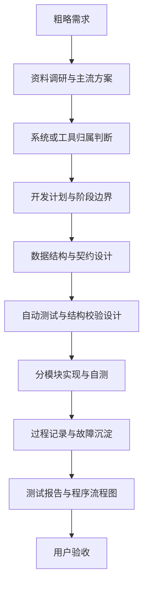

# 从0到1设计开发流程

## 定位

本文档用于新系统、新工具、大重构或全新功能链路的设计与开发。它是流程提醒和阶段门，不替代具体系统或工具下的方案、契约、代码导览和测试文档。

当任务只是已有方案下的实现时使用 `开发流程.md`；只需定位异常时使用 `故障诊断流程.md`；用户已明确要求修复时使用 `故障修复流程.md`。

## 适用触发

出现以下情况时，agent 必须先读取本文档：

- 用户提出粗略需求，需要从 0 到 1 形成系统或工具能力。
- 需要制定开发计划、主流程、数据结构或验收方式。
- 需要重建旧系统、拆分系统边界或改变阶段职责。
- 需要引入新的 MCP 工具、配置契约、结构化产物或自动测试链路。
- 需要产出给用户 review 的程序流程图、测试报告或结构校验报告。

## 阶段流程

## 阶段要求

| 阶段 | 必要产物 | 写入位置 |
| --- | --- | --- |
| 粗略需求 | 目标、输入、输出、不做事项、成功标准 | 对话中先确认；必要时写入 `10_product/` |
| 资料调研与主流方案 | 可选方案、取舍理由、风险 | `10_product/功能设计/` 或开发计划 |
| 系统或工具归属判断 | system / tool 名称、上下游边界 | 对应 `README.md` |
| 开发计划与阶段边界 | 任务拆分、阶段门、人工介入点 | `10_product/开发计划.md` 或功能设计 |
| 数据结构与契约设计 | 字段、类型、必填性、枚举、版本、示例 | `20_contracts/` |
| 自动测试与结构校验设计 | 测试入口、校验规则、回归范围 | `40_tests/测试入口.md`，复杂系统可另建专项测试文档 |
| 分模块实现与自测 | 每个小模块的实现结果和验证证据 | 实现仓库代码；必要时 `dev_docs/.../任务记录.md` |
| 过程记录与故障沉淀 | 关键决策、失败验证、bug 根因、修复方式 | 实现仓库 `dev_docs/` |
| 测试报告与程序流程图 | 测试结论、剩余风险、主执行流程图 | `40_tests/结果报告.md` 或任务记录 |
| 用户验收 | 用户需判断的问题、产物路径、风险 | 对话验收；必要时同步 `40_tests/影响面.md` |

## 结构入口闸门

新系统或新工具只有进入实际重建或实现时，才创建当前真值入口和实现仓库 package。规划阶段可以在开发计划中记录候选系统，但不要预建空目录。

进入实现前必须：

1. 先明确 system / tool 名称、职责边界和不做事项。
2. 建立 `docs/systems/<系统>/README.md` 或 `docs/tools/<工具>/README.md`。
3. 只为本轮真实落地的能力创建实现包和测试入口。
4. 避免创建只有 `package-info.java` 的未来占位包。

## 数据结构闸门

数据结构是本流程的强制维护对象。只要出现结构化产物、MCP 输入输出、配置表、状态枚举或阶段间传递对象，就必须：

1. 在 `20_contracts/` 建立或更新当前真值。
2. 写清字段语义、类型、必填性、默认值、单位、版本或兼容策略。
3. 提供最小示例或关键片段。
4. 同步检查自动测试是否能发现字段缺失、类型错误和版本错配。
5. 如果实现代码和契约不一致，先明确冲突，再决定修代码还是修契约。

## 自动测试与结构校验闸门

开始实现前，应先说明自动验证如何覆盖核心风险：

- 契约校验：字段、类型、必填、枚举、版本。
- 流程校验：主链是否跑通，关键阶段是否产出预期对象。
- 回归校验：修复或新增能力是否影响已有入口。
- 可视或 review 校验：需要截图、debug 图、流程图或报告时，提前定义产物路径。

不能只用“能运行”替代结构校验；不能只用人工观感替代契约校验。

## 分模块开发记录

开发过程中，不要求每个小改动都写 `dev_docs`。但以下情况必须记录：

- 完成一个可独立验收的小模块。
- 修改了接口、数据契约、阶段职责或主流程。
- 出现失败验证、反复试验或定位到非显然 bug。
- 需要保留调试思路，方便未来遇到类似问题复查。

记录写入实现仓库：

- 系统：`dev_docs/systems/<系统>/active/YYYYMMDD_中文任务名/任务记录.md`
- 工具：`dev_docs/tools/<工具>/active/YYYYMMDD_中文任务名/任务记录.md`
- 工作流或跨系统规则：`dev_docs/workflows/<主题>/active/YYYYMMDD_中文任务名/任务记录.md`

## 交付与验收

方案契约、开发执行和验收执行必须视为三个独立角色阶段。开发完成后先结束可写角色，再按 `验收流程.md` 运行；验收失败只报告，不在验收阶段回写实现。

进入用户验收前，agent 必须提供：

- 本轮目标和边界是否完成。
- 修改了哪些系统 / 工具文档。
- 数据契约是否建立或更新。
- 自动测试和结构校验结果。
- 程序主流程图或执行过程说明。
- 需要用户判断的 1-3 个问题。
- 剩余风险和下一步建议。

如果本轮影响 `10_product/`、`20_contracts/`、`30_code_guide/`、`40_tests/` 或 `影响面.md`，必须先同步文档仓库，再要求用户验收。
