# 地貌驱动主线

本文只描述当前实现中的 W、T 和 City D3-D7 责任边界。字段、版本和接口分别以目标系统 `20_contracts/` 为准。

## 当前主链

```mermaid
flowchart LR
  W["W 世界粗扫"] --> T1["T1/T2 国度核心选择"]
  T1 --> T3["T3 行动力势力扩张"]
  T3 --> T4["T4 城市候选与首都选择"]
  T4 --> D3["D3 城市局部地貌复核"]
  D3 --> D4["D4 单次 CityBlueprint"]
  D4 --> D56["D5 预案与 D6 模板锁定"]
  D56 --> O["Foundation / Landscape / LandUse / Decoration"]
  O --> A["execute_d5 激活"]
  A --> G["worldgen 分片落地"]
  G --> D7["D7 ledger / 观测 / 道路 / 城墙"]
```

## 阶段职责

| 阶段 | 当前职责 | 不做 |
| --- | --- | --- |
| W | 生成世界粗尺度地貌、provider provenance、Patch 和预览。 | 不规划国度内部或城市。 |
| T1/T2 | 通过候选图和 Patch Explorer 选择国度核心，冻结首都意图。 | 不决定城市内部坐标。 |
| T3 | 使用 action budget、地形成本和竞争关系扩张国度。 | 不生成城市建筑。 |
| T4 | 在 owned territory 形成城市候选、AI 首都选择和 CitySeedRegistry。 | 粗览证据不替代 D3。 |
| D3 | 对候选城市做局部地貌扫描、terrain field 和选址复核。 | 不生成结构或景观。 |
| D4 | AI 一次提交 CityBlueprint v0.9；程序编译固定模板 Group，冻结 outdoorPlan。 | 不让 AI 逐轮补坐标，不执行户外刷地。 |
| D5/D6 | 生成 reservation/mask 预案，并用当前世界 NBT 锁定模板 identity 和几何。 | 不生成道路，不加载目标 chunk 取高度。 |
| D6 后户外编译 | 生成单一 Foundation、Landscape Parcel、LandUse SurfacePrint 和 Decoration。 | 不用 LandUse 伪造道路，不使用固定景观图形。 |
| execute_d5/worldgen | 激活计划，在 createStructures/FEATURES 按 owner 分片落地。 | 不 late paste，不回填已到 FEATURES 的旧 chunk。 |
| D7 | 汇总 ledger 与现场方块观测，驱动 RoadWeaver 和城墙后处理。 | 不补放缺失建筑，不改 D4/D6 identity。 |

## AI 与程序边界

- AI 决定国度与城市风格、结构 Group、空间关系、Foundation/Landscape profile 和景观填充权重。
- 程序负责地貌事实、候选校验、固定模板几何、Parcel 生长、区域接力、worldgen 执行和幂等 ledger。
- 正式 CityBlueprint 只提交一次；D4 之后不再调用 AI 修补执行结果。
- 视觉或方案判断交给用户；程序错误进入独立诊断/修复流程，不能在验收中自动改代码。

## 已移除主线

当前实现不再包含 FunctionZoneMap 先行、BuildableAreaMap、D6 StructurePool、configured structure、外部 Jigsaw、多 start 面积补偿或 late materialization。legacy/debug endpoint 若仍在代码中，只用于显式诊断，其输入输出以 City MCP 契约为准。

## 系统入口

- GIS：`../systems/gis/README.md`
- 国度规划：`../systems/realm_planning/README.md`
- City：`../systems/city/README.md`
