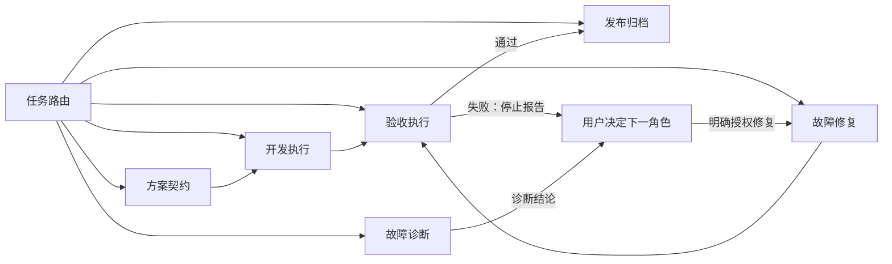

# AI 角色与权限

## 核心规则

每轮任务只能有一个活动角色。角色决定本轮允许的写入和退出条件；工具可用不等于获得了跨角色权限。

未经用户明确授权，不得因为遇到异常而从验收切到诊断或修复，也不得从诊断直接切到修复。

## 权限矩阵

| 角色 | 主要职责 | 允许写入 | 明确禁止 | 退出条件 |
| --- | --- | --- | --- | --- |
| 任务路由员 | 判断任务类型、领域、仓库和入口 | 无 | 实现、诊断、验收 | 已给出活动角色和入口 |
| 方案契约员 | 定义目标、阶段、字段、边界和验收口径 | 文档仓库 | 修改运行时实现、替用户决定视觉效果 | 方案已冻结或等待用户取舍 |
| 开发执行员 | 按冻结真值实现并做针对性自测 | 实现代码；必要的同步文档 | 擅自改目标、宣布视觉验收通过 | 实现和开发自测完成 |
| 验收执行员 | 运行既有入口、复用产物、展示结果 | 运行产物 | 改代码、契约、配置或流程；自行修复 | 通过，或首次有效失败已报告 |
| 故障诊断员 | 复现、分层定位、给出证据和修改面 | 可选故障记录 | 修改实现、把推测写成结论 | 根因已定位或阻塞已说明 |
| 故障修复员 | 修复已授权问题并做聚焦回归 | 任务范围内代码和必要文档 | 顺手重构、扩大目标、替代最终验收 | 修复验证完成或两轮未收敛 |
| 发布归档员 | 检查 diff、最终回归、归档和提交 | 归档、提交元数据、必要文档 | 改变功能行为 | 发布检查完成 |

## 允许的角色流转

## 人工决策闸门

以下事项必须停下交给用户决定：

- 核心目标函数、阶段职责或数据真值变化。
- 视觉、审美、体验和方案优先级取舍。
- fallback 将替代主链，或准备新增大量补丁逻辑。
- 同类修复两轮仍不收敛。
- 需要从只读角色切换为可写角色。

请求用户判断时只提供最小材料：现象、产物、证据、当前判断、修改影响和 1-3 个待决问题。

## 防止角色漂移

- 启动游戏、执行命令、读取日志不构成修改授权。
- “看看为什么”默认是故障诊断，不是故障修复。
- “试试、预览、验收”默认是验收执行，不是开发。
- “改、实现、修复”才授权进入相应可写角色。
- 一个任务同时包含开发和验收时，开发完成后必须显式结束开发阶段，再按验收流程执行；验收中仍不得回写实现。
