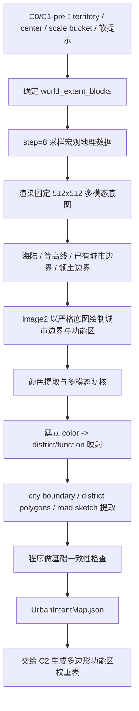

# C1 城市画布与 Image2 意图图

## 功能目标

C1 从“程序按参数生成城市外形”升级为“宏观多模态底图 + image2 城市规划草图 + CV 解析”的城市画布阶段。

目标是解决城市外形蠢、边界与地形关系弱、早期 buildableGroups 过硬的问题。C1 的地图分辨率预期较粗，当前按 `step = 8` 理解，不做施工级地形判断。

当前实现中，`city_c1_generate` 仍复用 `create_city` 老流程，由程序从中心 chunk 扩张并分配层级。新 C1 文档不继续沿用这套参数契约：第一版 image2 重构只保留领土与中心锚点，把最终城市边界大小、轮廓和功能区交给 image2 意图图决定。

## 核心流程



## C0/C1-pre 保留项

| 类别 | 输入 | 当前来源 | 本版处理 |
| --- | --- | --- | --- |
| 硬输入 | `territory_id` | `CityConfig.territoryId` / T 阶段结果 | 用来读取领土边界、其他城市冲突和宏观地理上下文 |
| 硬输入 | `center_x / center_z` | `CityConfig.centerX / centerZ` | 作为 512 底图取景中心和城市锚点，第一版不用 image2 重新选点 |
| 规模分档 | `city_scale_bucket` | 新字段 | 只决定 C1 底图覆盖范围，不决定最终城市边界面积 |
| 软提示 | `city_role` | 新字段或 AI/配置推导 | 表达首都、港城、边镇、贸易城等城市定位 |
| 软提示 | `density` | `CityConfig.density`，当前语义是 `low / mid / high` | 表达同等规模下的建造紧凑程度，不表示大中小城市 |
| 软提示 | `ecology` | `CityConfig.ecology` | 表达保留植被、适应地形或强清理倾向 |
| 软提示 | `water_policy` | `allow_water_city`、海陆底图和城市角色推导 | 表达是否允许港口、滨水、跨水或避水规划 |

后续如果要把“选簇、选落点”也交给 image2，应单独升级为 C0 或 C1-pre，不和第一版 C1 画布重构混在一起。T 阶段或旧 C1 的候选簇只负责帮助上游选出 `center_x / center_z`，不进入 `UrbanIntentMap` 正式契约。

这里需要明确拆分两个概念：`city_scale_bucket` 是城市占地和取景范围的“大中小”，`density` 是同样占地内建筑和功能的紧凑程度。比如小镇可以是高密度矿镇，大城也可以是低密度园林城。

## 旧字段删除口径

新 C1 正式契约不再接收或输出旧 C1 的 `target_chunk_count / bias / layers / layer_count / layer_thresholds / selected_cluster_ref`。

这些旧字段如果还存在于当前实现，只能由 `C1.5 ImageIntent Adapter` 在过渡期内部读取，用于推导新的 `city_scale_bucket`、`city_role`、`density`、`ecology` 或 `water_policy`。推导完成后，落盘的 `UrbanIntentMap` 只写新字段，不能把旧字段以 `legacy`、`summary`、`hint` 等名字重新塞回正式契约。

旧字段迁移原则：

| 旧字段 | 新口径 |
| --- | --- |
| `target_chunk_count` | 迁移为 `city_scale_bucket`，只影响底图覆盖范围 |
| `bias` | 删除；方向偏好由底图地理、城市角色和 image2 规划自然表达 |
| `layers / layer_count / layer_thresholds` | 删除；圈层由 `city_boundary / district_polygons / road_sketch` 表达 |
| `selected_cluster_ref` | 删除；候选簇只服务上游落点选择，不进入城市意图图 |

## 512 画布与 step 的关系

`512 x 512` 是发给 LLM/image2 的固定图像尺寸，`step = 8` 是世界地理采样精度。二者不能强行绑定。

不要求：

```text
1 image pixel = 1 个 step=8 采样单元
```

推荐关系：

```text
city_scale_bucket -> world_extent_blocks
world_extent_blocks / step -> source_grid_size
source_grid_size -> 缩放渲染为 512 x 512
```

## 城市规模分档

| `city_scale_bucket` | 建议覆盖范围 | step=8 采样网格 | 512 图渲染方式 |
| --- | --- | --- | --- |
| `small` 小镇 / 小城市 | `1024 x 1024` blocks | `128 x 128` | 放大到 512 |
| `normal` 普通城市 | `2048 x 2048` blocks | `256 x 256` | 放大到 512 |
| `large` 大城 | `3072 x 3072` blocks | `384 x 384` | 缩放到 512 |
| `capital` 首都 / 超大城 | `4096 x 4096` blocks | `512 x 512` | 原比例渲染到 512 |

注意：`city_scale_bucket` 只决定“给 image2 看多大范围的世界”，不要求 image2 输出的城市边界填满该范围。最终城市边界大小、凹凸和贴合地形的形状，由 `city_boundary` 结构化结果决定。

底图必须写出坐标映射：

```json
{
  "image_size": [512, 512],
  "source_step_blocks": 8,
  "world_extent_blocks": 2048,
  "pixel_to_block": 4,
  "world_origin": [x0, z0],
  "city_center": [cx, cz],
  "city_scale_bucket": "normal"
}
```

这里 `pixel_to_block` 可以小于、等于或大于 `source_step_blocks`，只要映射清楚即可。

## C1 底图信息

| 信息 | 说明 | 用途 |
| --- | --- | --- |
| 海陆 | 陆地、水域、海岸线 | 让 LLM/image2 判断城市是否应贴海、避水、做港口 |
| 等高线 / 高度分层 | 粗略地势 | 让 LLM/image2 理解山脊、谷地、高低台地 |
| 河流 / 湖泊 / 海岸线 | 大水系 | 支持港口、桥、滨水区判断 |
| 已有城市边界 | 其他城市或占地边界 | 避免规划重叠，支持城市间距离感 |
| 领土边界 | 当前城市允许范围 | 限制城市轮廓外扩 |
| 明显大障碍 | 大型不可规划区域 | 只处理宏观障碍，不做局部施工禁区 |

## image2 输出图层

| 图层 | 说明 | 后续用途 |
| --- | --- | --- |
| `city_boundary` | 初版城市边界 | 限定城市规划范围 |
| `district_polygons` | 多边形功能区 | 给 C2 生成功能区权重表 |
| `district_weight_hints` | 功能权重提示 | 表达每个多边形内的主次功能 |
| `road_sketch` | 主路、入口、桥、广场连接草图 | 后续进入道路规划 |
| `anchor_points` | 城门、广场、港口、地标锚点 | 给 C2-C8 提供语义吸引点 |

## 颜色策略

不要求 image2 使用固定 palette。第一版只要求 image2 在城市边界、功能区、道路和锚点之间使用高区分度颜色，避免相邻功能区颜色过近。

生成完成后，再走一次“多模态复核 + 颜色提取”：

1. 程序从图中提取主要颜色簇。
2. 多模态大模型观察图像、底图和颜色簇，给出 `color -> district/function` 映射。
3. 程序按该映射提取多边形、道路草图和锚点。
4. 若颜色簇过近、语义不清或同色多义，则要求重画或进入人工修正。

这样可以减少前置 palette 约束，让 image2 更自由地画清楚区域，同时避免后续程序完全猜颜色含义。

## 基础检查

- 城市轮廓不能越出允许领土范围。
- 城市轮廓不能覆盖其他城市边界。
- 主要道路草图应能连到至少一个入口或锚点。
- 功能区多边形应大体位于城市边界内。
- 功能区之间允许接触，但不应出现大量无法解释的碎片。
- CV 解析结果必须输出 overlay 预览，便于人工和 AI 复查。

这些检查只用于宏观规划质量控制，不替代后续 `step = 1` 的施工级地形校验。

## 本阶段不做

- 不直接输出最终功能区。
- 不直接选择结构模板。
- 不让 image2 决定最终施工合法性。
- 不在 C1 做精细坡度、solid base、水下、结构 footprint 等施工级判断。
