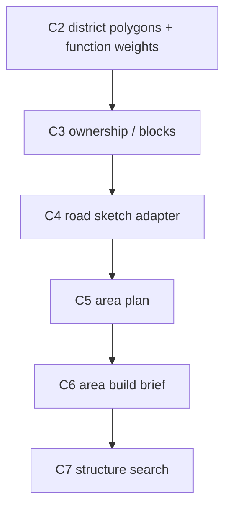

# C2 多边形功能区权重表

## 功能目标

C2 负责把 C1/image2 输出的城市边界、功能区多边形、道路草图和锚点，整理成“多边形功能区图 + 功能权重表”。

第一版不强求连续栅格热力图。它保留原先“多边形功能区图”的直观表达，只把每个功能区从单一标签升级为主次功能权重。

## 为什么先用多边形 + 权重表

旧功能区模式容易出现：

- 一个区域只能是 `market` 或 `residential`，混合城市感弱。
- C7/C8 只能按单标签找结构，候选过窄。
- 港口、市场、仓储、住宅等真实城市混合关系很难表达。

多边形功能区权重表允许一个区域同时具备多种倾向，例如：

```json
{
  "district_id": "d_waterfront_market_01",
  "dominant_function": "market",
  "function_weights": {
    "market": 0.55,
    "port": 0.25,
    "warehouse": 0.15,
    "residential": 0.05
  }
}
```

这比连续权重场更容易给人和 LLM 检查，也更贴近当前“多边形功能区图”的原始设计。

## 输入

| 输入 | 说明 |
| --- | --- |
| `UrbanIntentMap` | C1 解析出的 city boundary、district polygons、road sketch、anchor |
| C1 宏观地理信息 | 海陆、等高线、已有城市边界、领土边界 |
| 城市类型 | 港口城、内陆城、边境城、首都等 |
| 结构画像摘要 | 可选，来自开局前结构标记辅助 Mod，用于判断结构池支持哪些功能 |

## 输出

| 输出 | 说明 |
| --- | --- |
| `district_polygons` | 功能区多边形 |
| `district_function_weights` | 每个功能区的主次功能权重 |
| `placement_context_hints` | waterfront、road_frontage、plaza_edge 等宏观位置提示 |
| `district_seed_candidates` | 后续 C3 ownership 的片区种子 |
| `mixed_zone_notes` | 说明混合区的主次功能关系 |

## 与 C3-C6 的关系



C2 只表达功能区意图和主次权重，不决定最终建筑。最终能否放结构仍由单功能区 `step = 1` 精细底图、C6-C9、结构画像和 runtime 约束判断。

C2 阶段允许 LLM 复查颜色映射、功能区语义和 `road_sketch` 的粗略含义，但此时道路仍未完成识别。最终道路网络必须等 C4 产出 `C4RoadNetwork`，area 策略必须等 C5 产出 `C5AreaPlan`。

## 权重使用原则

- 权重表示该多边形内的主次功能，不是硬标签。
- 允许同一多边形多个功能并存。
- 第一版权重附着在多边形上，不必细到每个格子。
- 权重需要可解释来源，例如来自水岸、道路、广场、城市类型或 image2 hint。
- 后续进入具体功能区时，再切到 `step = 1` 局部图做施工级判断。

## 本阶段不做

- 不生成最终道路 block。
- 不生成最终 area。
- 不选择模板。
- 不输出连续数学热力图作为第一版硬目标。
- 不绕过 C8/C9 的真实落地校验。
