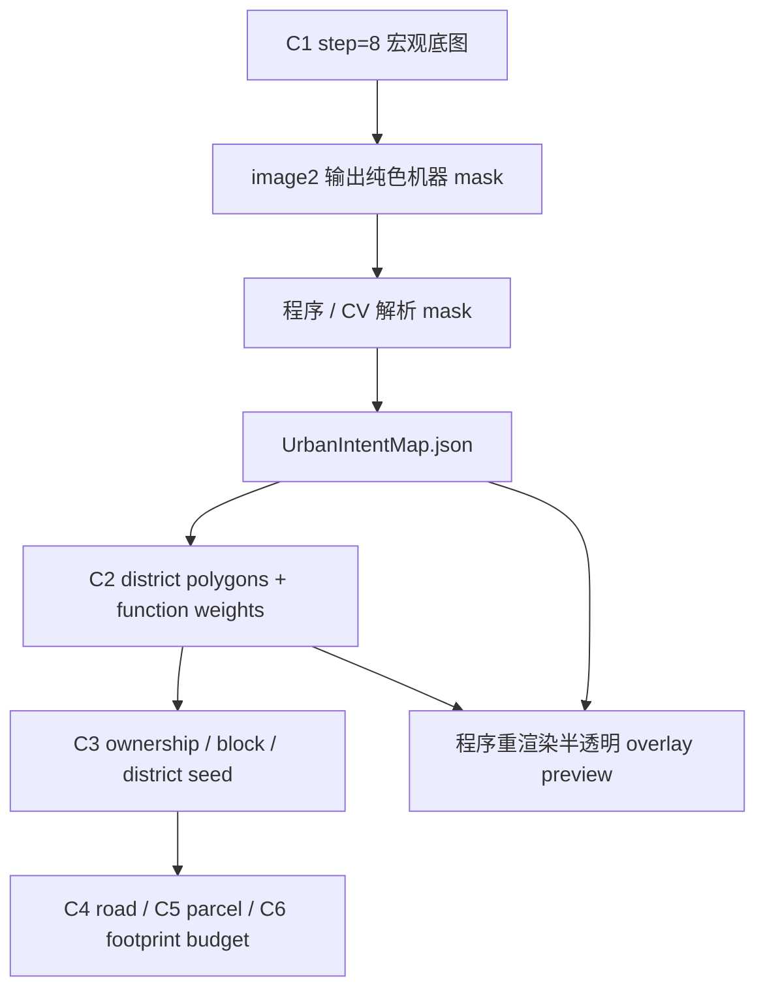

# C3 意图图到 Ownership 转换

## 功能目标

C3 负责把 C1/C2 的城市意图结果转换成现有主链可追踪的 ownership / block / district seed 数据。

本阶段的核心不是重新规划城市，而是把已经校验过的城市边界、功能区多边形、道路草图和锚点落到世界坐标与后续阶段能消费的数据结构中。

第一版必须明确一条边界：C3 不直接读取半透明视觉图，也不把 image2 输出像素当成施工真值。C3 只消费结构化数据。

## 图像产物口径

为避免半透明色、抗锯齿、纹理和底图颜色污染解析结果，第一版采用“纯色机器 mask -> 结构化数据 -> 半透明预览图”的链路。

| 产物 | 生成者 | 用途 | 是否是真值 |
| --- | --- | --- | --- |
| `base_map.png` | 程序 | 给 image2 和人类理解地形、海陆、边界 | 否，是输入参考 |
| `intent_mask.png` | image2 | 机器解析城市边界、功能区、道路、锚点 | 否，是解析源 |
| `UrbanIntentMap.json` | 程序 / CV / 校验器 | C1 结构化意图图 | 是，宏观意图真值 |
| `district_function_weights.json` | C2 | 功能区权重表 | 是，功能意图真值 |
| `c3_ownership_blocks.json` | C3 adapter | 后续 C4-C6 可消费的片区和街坊种子 | 是，C3 转换真值 |
| `intent_overlay_preview.png` | 程序 | 半透明叠底图预览，供人和 AI 复核 | 否，只是可视化 |

## image2 mask 规范

`intent_mask.png` 是给程序解析的机器图，不要求好看，但必须稳定。

| 要求 | 说明 |
| --- | --- |
| 不透明纯色 | 不使用 alpha、半透明、阴影、渐变或纹理 |
| 高对比颜色 | 城市边界、功能区、道路、锚点之间颜色差异足够大 |
| 固定画布 | 与 C1 输入底图一样使用 `512 x 512` |
| 明确图层 | 边界、功能区、道路、锚点不能混成同一颜色语义 |
| 少碎片 | 避免大量点状噪声和无法解释的小斑块 |
| 可复核 | 解析后必须输出 overlay preview 和解析报告 |

半透明视觉图不能作为正式解析源。如果需要半透明效果，只能在程序得到 `UrbanIntentMap.json` 和 C2 权重表后重新渲染。

## 输入

| 输入 | 来源 | 用途 |
| --- | --- | --- |
| `UrbanIntentMap.json` | C1 | 城市边界、功能区多边形、道路草图、锚点、坐标映射、基础检查 |
| `district_function_weights` | C2 | 每个功能区的主次功能权重 |
| `coordinate` | C1 | 像素坐标、采样网格、世界 block 坐标转换 |
| `base_map` | C1 | 领土边界、已有城市边界、海陆和高度等宏观上下文 |
| 现有 C3 schema | 实现仓库 | ownership / block / seed 的兼容输出目标 |

## 输出

| 输出 | 说明 |
| --- | --- |
| `district_seed` | 从功能区多边形生成的稳定片区种子 |
| `ownership_polygon` | 映射到世界坐标后的可追踪片区边界 |
| `block_seed` | 给 C4/C5 继续切路网和 parcel 的街坊初始数据 |
| `function_weights` | 从 C2 继承的功能权重，不压扁成单标签 |
| `road_hints` | 从 `road_sketch` 和锚点转换来的道路求解提示 |
| `anchor_refs` | gate、plaza、port、bridge、landmark 等锚点引用 |
| `conversion_report` | 裁剪、清理、合并、丢弃和 warning 记录 |

## 核心转换流程

1. 读取 `UrbanIntentMap.coordinate`，建立 `pixel -> block -> world` 映射。
2. 将 `city_boundary` 和 `district_polygons` 从图像坐标转换到世界坐标。
3. 将所有功能区多边形裁剪到城市边界内。
4. 清理过小碎片、极细长噪声和无法解释的孤岛。
5. 对重叠或缝隙执行可解释修正，并写入 `conversion_report`。
6. 为每个功能区生成稳定 `district_id`，继承 C2 `function_weights`。
7. 根据道路草图和锚点生成 `road_hints`，交给 C4 道路求解，不在 C3 直接铺路。
8. 生成 `district_seed`、`ownership_polygon` 和 `block_seed`。
9. 用结构化结果重新渲染 `intent_overlay_preview.png`，供人工和 AI 复核。

## 权重继承原则

| 规则 | 说明 |
| --- | --- |
| 保留多权重 | C3 不把 `market + port + warehouse` 压成单一 `market` |
| dominant 只作摘要 | `dominant_function` 可用于日志和 UI，但不是唯一功能真值 |
| 权重不等于硬约束 | 后续 C6-C9 仍需按地形、结构画像和运行时结果判断 |
| 来源可追踪 | 每个 ownership / block 应能追溯到原始 `district_id` 和权重来源 |

## 道路和锚点处理

C3 只把道路草图转成提示，不直接决定最终道路。

| 来源 | C3 输出 | 后续消费 |
| --- | --- | --- |
| `road_sketch.main_roads` | `road_hints.main_axis` | C4 主路求解 |
| `road_sketch.entries` | `road_hints.entries` | C4 城门、入口和外部连接 |
| `anchor_points.plaza` | `anchor_refs.plaza` | C4 广场连接、C5 parcel 切分 |
| `anchor_points.port` | `anchor_refs.port` | C4 桥/滨水路、C6 港口预算 |
| `anchor_points.landmark` | `anchor_refs.landmark` | C7 工头计划和结构候选召回 |

## 异常边界

| 问题 | 处理 |
| --- | --- |
| mask 颜色不稳定 | 拒绝进入 C3，回到 C1/CV 重新生成或人工修正 |
| 多边形越出城市边界 | 裁剪到城市边界内，并记录 warning |
| 多边形大量重叠 | 优先按 C2 置信度和面积处理，严重时要求人工复核 |
| 多边形碎片过多 | 小碎片清理或合并到最近同类区，写入 `conversion_report` |
| 坐标映射缺失 | 阻断转换，不能猜测世界坐标 |
| 道路草图断裂 | 输出 road warning，交给 C4 或人工修正 |

## 本阶段不做

- 不直接选择结构模板。
- 不生成最终道路。
- 不切最终 parcel。
- 不做 step=1 施工级坡度、水下、solid base 检查。
- 不把半透明 overlay 当作机器解析源。
- 不让 C3 改写 C2 功能权重含义。

## 验收口径

| 验收项 | 标准 |
| --- | --- |
| mask 解析稳定 | 固定 `intent_mask.png` 多次解析得到一致多边形数量和 ID |
| 坐标映射正确 | overlay 预览与原始底图、城市边界、领土边界对齐 |
| 权重继承完整 | C3 输出中每个 district/block 能追溯到 C2 权重 |
| 兼容旧链路 | 第一版输出可临时转换为现有 C3/C6 可消费数据 |
| 视觉复核 | 半透明 overlay 由程序从 JSON 重渲染，不影响真值 |
