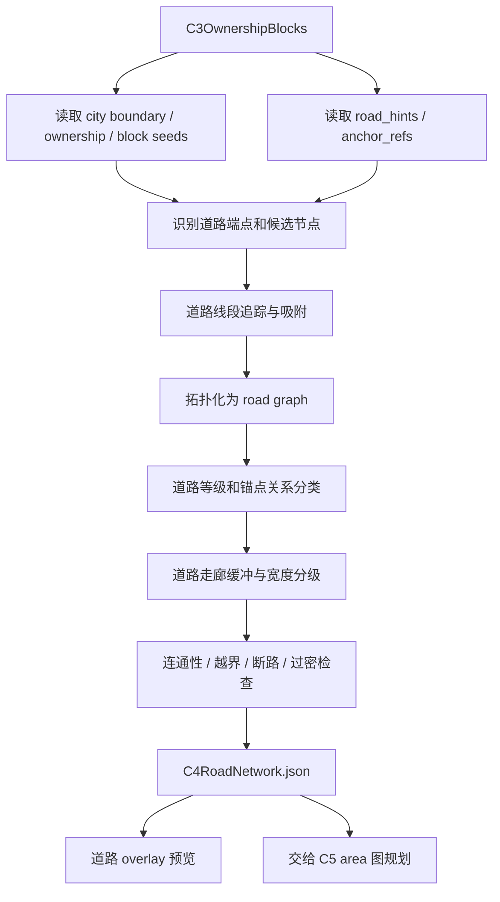

# C4 道路草图识别与网络化

## 功能目标

C4 负责把 image2 在 C1 意图图里已经画出的道路草图，转换成可追踪、可校验、可供 C5 使用的道路网络。

本阶段的核心不是重新规划道路，也不是直接铺最终道路方块，而是识别、吸附、拓扑化和走廊化：把 C1/CV 解析出的 `road_sketch`，经 C3 坐标转换后的 `road_hints / anchor_refs`，整理成 `road_nodes / road_edges / road_corridors`。

第一版需要明确两条边界：

- 道路大形由 image2 在 C1 画出，C4 不凭空新增主路或重画城市路网。
- 当前实现仓库里的 `CitySemanticStages.C4Plan` / `C4_FunctionPlan.json` 是旧语义功能计划，不等同于新 C4 道路网络。新案子建议使用 `C4RoadNetwork` 作为产物名，避免和旧 C4 混淆。

## 核心流程

## 输入

| 输入 | 来源 | 用途 |
| --- | --- | --- |
| `C3OwnershipBlocks` | C3 | 城市边界、ownership 多边形、block seed、road hint 和 anchor 引用 |
| `district_function_weights` | C2，经 C3 继承 | 决定道路服务优先级和 frontage 倾向 |
| `coordinate` | C1/C3 | 图像、采样网格、世界坐标映射 |
| `base_map` 摘要 | C1/C3 | 海陆、等高线、已有城市边界、领土边界等宏观约束 |
| `road_network_policy` | 配置或默认策略 | 道路等级识别、吸附阈值、宽度映射、小修补策略 |

## 输出

| 输出 | 说明 |
| --- | --- |
| `road_nodes` | 从道路草图端点、交叉点、锚点吸附得到的道路节点 |
| `road_edges` | 从道路草图追踪出的道路边，包含等级、路径、宽度和约束 |
| `road_corridors` | 从道路边缓冲出来的走廊，用于 C5 生成 area 边界和临路关系 |
| `intersection_areas` | 主要路口、广场、城门口、桥头等扩大区域 |
| `frontage_hints` | 给 C5/C6 的临路、背街、滨水、广场边等位置提示 |
| `recognition_report` | 识别置信度、连通性、越界、过水、断路和修复记录 |
| `preview` | 程序渲染的道路 overlay 预览 |

## 道路分级

| 等级 | 作用 | 第一版口径 |
| --- | --- | --- |
| `arterial` | 城市入口、主轴、跨区主路 | 必须连到至少一个 entry 或城市核心锚点 |
| `collector` | 功能区之间的区级道路 | 连接 district / block seed 到主路 |
| `local_hint` | area 临路提示 | 只作为 C5 area 规划提示，不在 C4 展开完整小路 |
| `bridge` | 跨水或跨谷连接 | 只预留桥走廊和桥头节点，不选择桥结构 |
| `plaza_link` | 广场、地标、城门口连接 | 可扩大为 `intersection_area` |
| `waterfront` | 港口、滨水区沿线道路 | 受 `water_policy`、港口锚点和岸线约束 |

## 识别节点

| 节点类型 | 来源 | 说明 |
| --- | --- | --- |
| `entry` | `road_hints.entries` 或城市边界与外部连接推导 | 城市对外入口，主路必须覆盖 |
| `junction` | 道路线段交叉点或吸附点 | 道路拓扑节点 |
| `plaza` | `anchor_refs.plaza` 与道路草图交汇 | 可扩大为 intersection area |
| `port` | `anchor_refs.port` 与滨水道路草图 | 需要滨水路或服务路连接 |
| `bridge_head` | `road_hints.bridge_candidates` 或道路跨水段端点 | 只表示桥头，不表示最终桥结构 |
| `district_access` | 道路贴近 district / block seed 的接入点 | 给 C5/C6 标注 frontage |

## 网络化策略

1. 读取 C1/CV 已识别的 `road_sketch`，以及 C3 转换后的 `road_hints`。
2. 将 road polyline 端点、交叉点和锚点吸附到稳定节点，避免近距离重复点。
3. 将草图线段拓扑化为 `road_edges`，保留 image2 画出的走向，不重新规划主路。
4. 根据颜色层、线宽、锚点关系和功能权重，分类为 `arterial / collector / local_hint / bridge / plaza_link / waterfront`。
5. 对轻微断裂、端点未贴合、锚点附近短缺口做小修补，并写入 `recognition_report`。
6. 如果主路缺失、大面积断裂、核心锚点完全不可达，应阻断并回到 C1/image2 重画，而不是由 C4 自行大改。
7. 将 road edge 缓冲为 road corridor，并按等级写入宽度建议。
8. 输出连通性、越界、过密、碎片切割和无法服务节点等检查结果。

## 功能权重对道路的影响

| 功能权重 | 道路倾向 |
| --- | --- |
| `market / commercial` | 草图路贴近时标为更高 frontage |
| `civic / landmark` | 草图路与广场/地标相交时扩大 intersection area |
| `port / warehouse` | 草图路贴水或贴港口时标为 waterfront / service |
| `residential_low` | 草图路可标为 quiet_back 或 collector 低优先级 |
| `residential_high` | 草图路可标为 collector frontage |
| `workshop / industry` | 草图路贴近城市边缘时标为 service frontage |
| `defense / gate` | 草图路连接 entry / gate 时标为 arterial 或 gate_mouth |

## 校验口径

| 校验项 | 标准 |
| --- | --- |
| 主图连通 | image2 画出的 `arterial` 和 `collector` 应能拓扑成主连通分量，除非报告中明确解释 |
| 入口覆盖 | 至少一个城市 entry 连入草图主路；多 entry 城市应给出未连通原因 |
| 边界约束 | 普通道路不越出 `city_boundary`，不覆盖其他城市边界 |
| 水域约束 | 普通道路不穿水；跨水必须标为 `bridge` 或 `waterfront` |
| 锚点可达 | plaza、port、gate 等强锚点应有道路连接 |
| 密度控制 | 道路不应把功能区切成大量无法使用的碎片 |
| C5 可消费 | `road_corridors` 必须能作为 C5 生成 area 的边界、保留区域或 frontage hint |

## 与 C5 的交接

C4 输出的是道路走廊和道路图，不输出最终 area。

交给 C5 的核心内容包括：

- `road_corridors`：道路预留空间，用于生成 area 边界。
- `frontage_hints`：哪些边适合临街、滨水、广场边或背街。
- `intersection_areas`：广场、桥头、城门口等需要保留的非普通建设区。
- `blocked_by_roads`：C5 不应再拿去切成普通 `buildable_area` 的道路区域。

## 本阶段不做

- 不重新规划城市道路大形。
- 不凭空新增主路、环路或跨区支路；大问题回到 C1/image2 重画。
- 不继续生成或审核功能白名单。
- 不切最终 area。
- 不选择结构模板。
- 不执行道路方块铺设。
- 不选择桥、城门、广场等具体结构。
- 不做 step=1 级别的坡度、水下、solid base 施工合法性判断。
- 不把道路当作功能区的附属字段塞回 C2；道路是独立层。
