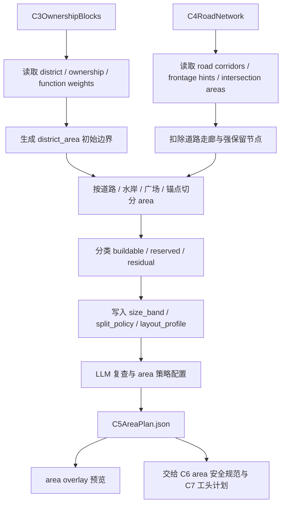

# C5 Area 图规划与保留策略

## 功能目标

C5 负责把 C3 的功能区、ownership / block seed，以及 C4 的道路网络、道路走廊和锚点关系，整理成后续 C6/C7 可消费的 `area` 图。

本阶段不再把主名词定为 `parcel`。第一版统一使用 `area`，因为城市里会出现“一个建筑占完整功能区”“一个地标需要整块保留”“道路边角只适合装饰或缓冲”的情况。`parcel` 可以作为未来更细粒度子概念存在，但不是 C5 主产物。

C5 的一句话职责：

> C5 把 C3/C4 的功能区、道路和锚点，切成带层级、带风格 profile、带保留策略的 area 图；它不放结构，不定最终 footprint，但要保证后续 C6/C7 有清晰、可用、不太碎的施工候选空间。

## 核心流程

## 名词与层级

| 名词 | 说明 | 主要来源 | 后续用途 |
| --- | --- | --- | --- |
| `district_area` | 功能区级 area，继承 C2/C3 的功能区语义 | C3 district / ownership | 作为 C5 切分和保留的父级 |
| `buildable_area` | 可给 C6/C7 继续使用的建设候选空间 | C5 切分 | C6 生成安全规范，C7 选择结构方向 |
| `reserved_area` | 广场、桥头、港口 yard、城门口、地标庭院等保留地 | C4 intersection / anchor / C5 策略 | 保留为空地、大结构、组合结构或缓冲 |
| `residual_area` | 边角料、装饰带、绿地、缓冲区、小碎片 | C5 清理 | C7 可决定装饰、绿化、摊位或合并 |

`area` 可以有父子关系。一个大型建筑可以直接占用完整 `district_area`，也可以占用一个 `buildable_area`。如果某块地被标成 `single_landmark` 或 `single_structure_candidate`，C5 不必为了形式完整继续硬切。

## 输入

| 输入 | 来源 | 用途 |
| --- | --- | --- |
| `C3OwnershipBlocks` | C3 | 功能区边界、ownership、block seed、功能权重 |
| `C4RoadNetwork` | C4 | 道路走廊、路口区域、临街/滨水/广场边提示 |
| `district_function_weights` | C2，经 C3 继承 | 判断 area 的主次功能和布局倾向 |
| `anchor_refs` | C3 / C4 | 城门、广场、港口、桥头、地标等保留点 |
| `area_policy` | 配置或默认策略 | 控制最小面积、切分强度、碎片合并和保留策略 |

## 输出

| 输出 | 说明 |
| --- | --- |
| `district_areas` | 继承功能区语义的父级 area |
| `buildable_areas` | 可施工候选 area，不保证最终一定放结构 |
| `reserved_areas` | 公共空间、大建筑、组合结构或道路缓冲的预留 area |
| `residual_areas` | 边角、碎片、装饰和绿化候选 |
| `area_adjacency` | area 与道路、广场、水岸、相邻 area 的关系 |
| `area_style_profiles` | 每个 area 的布局 profile 和切分倾向 |
| `planning_report` | 切分、合并、保留、碎片处理和 warning |
| `preview` | area overlay 预览，供人和 AI 复查 |

## 自适应 area 粗细

C5 不固定把功能区切成大量小块，而是输出“可拆可合”的 area。

| 场景 | C5 处理 |
| --- | --- |
| 道路、广场、水岸边界 | 必须尊重，不能把道路走廊切成普通建设地 |
| 市场、商业、高密住宅 | 可以按道路 frontage 切成中等 area |
| 低密住宅、园林、自然村落 | 少切、允许不规则 area 和院落空间 |
| 城堡、神庙、市政、地标 | 保留大 area，优先 `keep_whole` |
| 港口、仓储、工坊 | 保留 yard、服务路和较大 buildable area |
| 过小碎片 | 标为 `residual_area`，不伪装成正常建设地 |

每个 area 至少写入：

| 字段 | 值域 | 说明 |
| --- | --- | --- |
| `split_policy` | `keep_whole / split_later / can_merge / can_trim` | 后续是否允许继续切、合并或裁边 |
| `size_band` | `tiny / small / medium / large / huge` | 只表达大小层级，不锁具体结构 footprint |
| `layout_profile` | 见下表 | 给 C6/C7 的布局风格提示 |

## reserved_area 策略

`reserved_area` 的核心作用是防止重要公共空间和大结构用地被小建筑吃掉。它不等于永远空着，而是告诉下游“这里不是普通填充地”。

| 策略 | 说明 |
| --- | --- |
| `open_space` | 广场、庭院、绿地、港口空场 |
| `single_landmark` | 一个大建筑或地标占用整块 area |
| `compound` | 一组结构围合，如神庙群、城堡内院 |
| `service_yard` | 港口、仓库、市场后场、工业作业区 |
| `gate_mouth` | 城门口缓冲和集散空间 |
| `bridge_head` | 桥头缓冲、转向和连接空间 |

## layout_profile

C5 不为每种城市风格写一套排列函数。第一版使用少量通用切分算子，再用 `layout_profile` 参数控制风格。

通用算子包括：

- 沿道路 frontage 切长条。
- 从边界 inward inset，留庭院或广场。
- 按主方向切块。
- 合并小碎片。
- 保留整块给 landmark。
- 沿水岸生成 waterfront strip。

| profile | 倾向 |
| --- | --- |
| `organic_residential` | 低密住宅，不规则、大院子、少切 |
| `dense_street_front` | 商业或高密住宅，贴路、小到中块 |
| `waterfront_strip` | 港口或滨水，长条、朝水、保留服务路 |
| `civic_courtyard` | 市政或宗教，保留中庭、前场或广场 |
| `industrial_yard` | 工坊或仓储，大块、服务路、边缘化 |
| `landmark_compound` | 整块保留，后续 C7/C8 组合结构 |

## 碎片处理

C5 需要先把明显垃圾空间分类，不能把它们作为普通建设候选直接丢给 C7。

| 碎片类型 | C5 标注 |
| --- | --- |
| 极小碎片 | `residual_area` |
| 靠路边角 | `decor / greenery / stall / buffer` |
| 靠广场 | `plaza_edge` |
| 靠水 | `waterfront_detail` |
| 可并入相邻 area | 写入 `merge_candidate` |

最终碎片是做花坛、摊位、装饰、绿化，还是并入旁边建筑群，可以交给 C7 工头定。C5 只负责保证“垃圾空间不会伪装成正常建设地”。

## LLM 复查与配置边界

C5 可以使用多模态 LLM 辅助配置 area 策略，但必须基于结构化产物和 overlay 预览，不直接让 LLM 拿像素坐标当真值。

LLM 在 C5 可以做：

- 对照 image2 意图图、C4 道路 overlay 和 C5 area overlay，检查 area 是否切得过碎或过粗。
- 为 area 建议 `layout_profile`、`reserved_strategy`、`split_policy` 和 `size_band`。
- 检查地标、广场、港口、城门口、桥头是否被保留下来。
- 标注哪些 residual area 适合装饰、绿化、摊位、缓冲或合并。

LLM 在 C5 不做：

- 不修改 C4 道路网络真值，只能提出 `requires_road_review` 或回到 C4/C1 的建议。
- 不选择最终结构模板。
- 不决定最终 footprint。
- 不绕过 C6/C7/C8 的结构搜索和 jigsaw 求解。
- 不把视觉判断覆盖程序的坐标、面积和拓扑计算。

## 与 C6/C7 的交接

交给 C6 的重点：

- 每个 `buildable_area` 的多边形、大小层级和可用边界。
- area 周边的道路、广场、水岸、背街关系。
- 是否允许继续切分或裁边。
- 是否有保留地、缓冲地和不可施工空间。

C6 只把这些信息整理成安全规范，不反向修改 C5 的 area 设计，也不替 C7 写建筑建议。C7 仍然可以读取 `step = 1` 地图。

交给 C7 的重点：

- area 的功能权重和布局 profile。
- reserved_area 的策略，如 `single_landmark / compound / open_space`。
- residual_area 的建议用途。
- area 与锚点、道路、相邻区域的叙事关系。

## 本阶段不做

- 不放置结构。
- 不选择具体结构模板。
- 不做 area 安全规范。
- 不执行 jigsaw 求解。
- 不生成最终道路。
- 不修改 C2 功能权重或 C4 道路网络。
- 不做 step=1 施工级坡度、水下、solid base 合法性判断。
