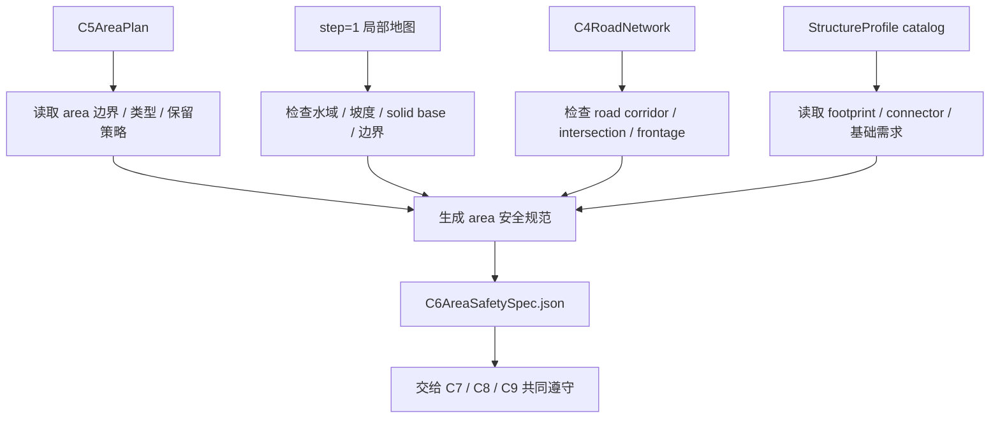

# C6 Area 安全规范

## 功能目标

C6 保留在语义层，负责为 C5 产出的 area 建立统一安全规范。它读取 `step = 1` 局部地图、C5 area 图、C4 道路上下文和结构画像库，输出每个 area 的安全边界、风险等级、允许例外和复核要求。

C6 的存在不是为了节省 C7 的上下文。C7 可以继续读取 `step = 1` 地图，也可以结合风格和主题发挥。C6 只负责把“哪些安全线不能随便碰、哪些风险需要显式承认、哪些情况需要人工复核”先结构化出来。

一句话职责：

> C6 给每个 area 制定施工前安全规范：标出硬禁区、软风险、例外条件和复核要求；它不做设计，不替 C7 规划建筑，也不限制 C7 的表达空间。

## 核心流程



## 输入

| 输入 | 来源 | 用途 |
| --- | --- | --- |
| `C5AreaPlan` | C5 | area 类型、边界、保留策略、layout profile |
| `step=1 local map` | 地形扫描 / 运行时查询 | 让 C6 和 C7 都能读取的精细地图 |
| `C4RoadNetwork` | C4 | 道路走廊、路口、桥头、滨水、广场边等安全边界 |
| `StructureProfile catalog` | 结构标记辅助 Mod | 读取结构 footprint、connector、基础需求和硬约束 |
| C5 / 人工 review | C5 / 用户 | 继承人工特别关心的保留地、地标和边界要求 |

## 输出

| 输出 | 说明 |
| --- | --- |
| `area_safety_specs` | 每个 area 的安全规范 |
| `hard_constraints` | C7/C8/C9 不能随意违反的硬约束 |
| `soft_risks` | 可接受但需要承认和复核的风险 |
| `exception_policy` | 哪些例外允许 C7 继续尝试，哪些必须人工确认 |
| `review_requirements` | 需要 C7/C8/C9 输出证据或人工评估的点 |
| `c6_report` | 缺失输入、冲突和 warning |

## C6 做什么

| 类别 | C6 行为 |
| --- | --- |
| 安全线标注 | 标出水域、道路走廊、路口、桥头、城门口、地标庭院等不能随意覆盖的区域 |
| 风险分级 | 对坡度、水下、solid base、边界贴合、道路缓冲冲突做 `low / medium / high` 风险分级 |
| 例外规则 | 写清哪些情况允许 C7 做特殊规划，如桥、码头、悬挑、山地建筑 |
| 复核要求 | 对高风险或例外规划要求 C8/C9 输出证据，必要时转人工评估 |
| 结构硬事实引用 | 引用结构 footprint / connector / 基础需求，但不替 C7 选择结构 |

## C6 不做什么

| 不做 | 说明 |
| --- | --- |
| 不做设计 | 不决定 area 应该建什么，也不写建筑建议 |
| 不替 C7 读图 | C7 仍然可以读取 `step = 1` 地图和 overlay |
| 不节省上下文作为核心目标 | C6 的价值是安全规范，不是把信息藏起来 |
| 不选择模板 | 不指定最终结构模板或结构族 |
| 不给最终坐标 | 不输出 placement、rotation、jigsaw 起点或 child 坐标 |
| 不做最终落地判定 | 最终能否落地由 C8/C9 的真实校验决定 |
| 不恢复旧矩形槽位主线 | 旧 rect guidance 只能作为 debug/fallback，不是新 C6 主真值 |

## 安全规范示例

```json
{
  "area_id": "ba_market_03",
  "area_type": "buildable_area",
  "safety_level": "normal",
  "hard_constraints": [
    {
      "type": "keep_road_corridor_clear",
      "target_ref": "corridor_main_01",
      "reason": "主路走廊不能被普通建筑覆盖"
    }
  ],
  "soft_risks": [
    {
      "type": "large_structure_risk_high",
      "severity": "medium",
      "reason": "area 可用宽度不足，大型结构可能挤占临街缓冲"
    }
  ],
  "exception_policy": {
    "allow_c7_override": true,
    "requires_reason": true,
    "requires_human_review": false
  },
  "review_requirements": [
    "C8 若选择 L 级结构，需要输出 footprint 与道路缓冲不冲突的证据"
  ]
}
```

这不是建筑建议。它只告诉 C7：可以发挥，但要知道主路走廊是硬边界，大型结构需要额外证据。

## 与 C5 的关系

C5 负责空间设计，C6 负责安全规范。

| C5 产物 | C6 处理 |
| --- | --- |
| `buildable_area` | 检查普通建设安全线和风险 |
| `reserved_area` | 标注不能被普通建筑吞掉的保留意图 |
| `residual_area` | 标注装饰、绿化、摊位或合并时的安全边界 |
| `layout_profile` | 只作为上下文，不修改 C5 的风格意图 |
| `split_policy` | 只记录，不重新切分 area |

## 与 C7 的关系

C7 是工头计划，C6 是安全规范。

| C6 提供 | C7 决定 |
| --- | --- |
| 哪些硬约束不能随意碰 | 规划结构族、节点节奏、叙事和风格 |
| 哪些风险需要显式承认 | 是否保守、激进、地标优先或装饰优先 |
| 哪些例外需要理由 | 是否发起 override，并写明原因 |
| 哪些点需要人工复核 | 是否继续推进、降级或暂停给用户评估 |

C7 可以在 C6 的安全规范内自由发挥。若 C7 要越过 C6 的软风险，必须写理由；若要越过硬约束，必须进入人工评估或由 C8/C9 证明这是合法特例。

## 与 C8/C9 的关系

C8/C9 是最终落地校验和执行层。C6 不替它们做最终判定，但 C6 可以要求它们输出证据。

| C6 要求 | C8/C9 响应 |
| --- | --- |
| `requires_footprint_evidence` | 输出 footprint 与安全边界关系 |
| `requires_connector_evidence` | 输出 connector / jigsaw 求解证据 |
| `requires_terrain_evidence` | 输出地形、solid base、水下等运行时检查结果 |
| `requires_human_review` | 暂停或标记给人工评估 |

## 旧 C6 迁移口径

当前实现里的 C6 已经具备一些可复用能力：

- build area / polygon index。
- `RectGuidance`。
- 结构 footprint 统计。
- connector 预留估算。
- growth buffer 估算。

新 C6 可以复用这些能力来生成安全规范，但不能让旧矩形主线重新主导城市设计。

| 旧概念 | 新口径 |
| --- | --- |
| `C6_BuildAreaLayout.json` | 迁移期兼容输出，不作为新主真值 |
| `RectGuidance` | 可作为安全检查或 debug/fallback 的辅助信息 |
| `PrimaryModule` | 迁移期给旧 C7/C8 使用，新主线以 C7 工头计划为准 |
| 矩形槽位 | 不再主导城市形态 |

## 验收口径

| 验收项 | 标准 |
| --- | --- |
| 安全规范完整 | 每个可建设或保留 area 都有硬约束、软风险和复核要求 |
| 不做设计 | C6 输出中没有建筑建议、最终结构族、施工顺序或最终模板 |
| 不限制 C7 发挥 | C7 可以读取 step=1 地图，并可在写明理由后处理软风险 |
| 硬约束可追踪 | 每条硬约束能追溯到道路、地形、area、结构硬事实或人工要求 |
| 例外机制清楚 | override、人工评估、C8/C9 证明路径有明确字段 |
| 兼容旧链路 | 迁移期可继续生成旧 C6 layout / rect guidance，但新文档真值以 `C6AreaSafetySpec` 为准 |

## 本阶段不做

- 不重新切 area。
- 不修改 C5 `layout_profile` 或 `reserved_strategy`。
- 不写建筑建议。
- 不选择结构模板。
- 不写工头计划。
- 不决定最终节点数量。
- 不输出 placement、rotation 或 jigsaw 约束。
- 不执行真实落地校验。
