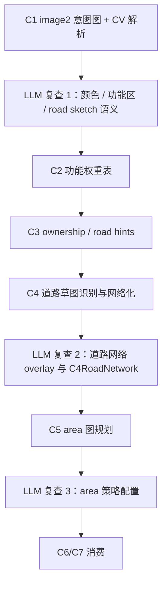

# LLM 复查与策略配置

## 功能目标

LLM 复查与策略配置不是一个独立替代 C1-C5 的阶段，而是穿插在关键产物生成后的辅助检查层。

它的目标是让多模态模型看懂 image2 原图、程序 overlay 和结构化 JSON 之间是否一致，并在合适层级补充语义策略。它不能代替 CV、坐标映射、道路网络化、面积计算、结构搜索和 jigsaw 求解。

## 总体原则

| 原则 | 说明 |
| --- | --- |
| 结构化结果优先 | LLM 必须同时看 overlay 和 JSON 摘要，不能只凭原图描述当真值 |
| 分阶段复查 | C1/C2 复查功能区和 road sketch 语义；C4 后复查道路网络；C5 后配置 area 策略 |
| 不越级拍板 | 道路未到 C4 前不能配置最终道路网络，area 未到 C5 前不能配置最终施工候选 |
| 程序计算兜底 | 坐标、面积、拓扑、连通性、越界由程序决定，LLM 只能提出问题或策略建议 |
| 人工介入明确 | 当 LLM 认为视觉产物合理但程序报告严重冲突，或用户审美不满意时，必须进入人工评估 |

## 复查节点

## LLM 复查 1：C1/C2 意图复查

| 项目 | 内容 |
| --- | --- |
| 输入 | C1 base map、image2 输出图、CV color clusters、UrbanIntentMap 摘要、overlay preview |
| 可以做 | 确认 `color -> district/function` 映射；检查功能区是否贴合地形；给功能权重初稿提供解释；识别锚点类型；说明道路草图颜色和线宽含义 |
| 不可以做 | 不生成最终道路网络；不切 area；不选择结构；不覆盖程序的多边形和坐标映射 |
| 输出 | `intent_review`、`color_mapping_review`、功能权重建议、需要重画或人工修正的问题 |

此时道路只能叫 `road_sketch`。LLM 可以解释“这条粗线像主路”“这里可能是桥”，但最终道路识别必须等 C4。

## LLM 复查 2：C4 道路网络复查

| 项目 | 内容 |
| --- | --- |
| 输入 | image2 原图、C4 道路 overlay、`C4RoadNetwork.json` 摘要、recognition report |
| 可以做 | 检查 road graph 是否符合原图意图；确认 arterial / collector / bridge / waterfront / plaza_link 语义；指出断路、漏路、过密或误吸附；建议 `requires_redraw` 或 `requires_human_review` |
| 不可以做 | 不凭空新增主路；不替代 C4 的拓扑和连通性计算；不选择桥、城门或道路结构模板 |
| 输出 | `road_network_review`、道路等级语义建议、需要回 C4/C1 的问题 |

C4 之后才允许讨论“道路配置”。C4 之前只能讨论道路草图语义。

## LLM 复查 3：C5 area 策略配置

| 项目 | 内容 |
| --- | --- |
| 输入 | image2 原图、C4 overlay、C5 area overlay、`C5AreaPlan.json` 摘要 |
| 可以做 | 建议 `layout_profile`、`reserved_strategy`、`split_policy`、`size_band`；检查 area 是否过碎或过粗；检查广场、港口、桥头、城门口、地标庭院是否保留；给 residual area 建议用途 |
| 不可以做 | 不修改道路网络真值；不选择最终结构模板；不决定最终 footprint；不替代 C6/C7/C8 的结构搜索和 jigsaw 求解 |
| 输出 | `area_strategy_review`、接受/拒绝的策略建议、人工评估点 |

## 建议输出字段

LLM 复查结果可以作为上游产物的附属 review 字段保存，也可以独立落盘为 review JSON。

| 字段 | 说明 |
| --- | --- |
| `stage` | `intent_review / road_network_review / area_strategy_review` |
| `input_refs` | 原图、overlay、JSON 摘要和配置引用 |
| `checked_items` | 本轮检查项 |
| `suggestions` | 策略建议，不直接等同真值 |
| `accepted_suggestions` | 被程序或人工接受的建议 |
| `rejected_suggestions` | 被拒绝的建议和原因 |
| `warnings` | 仍可继续但需要关注的问题 |
| `requires_redraw` | 是否建议回 image2 重画 |
| `requires_human_review` | 是否需要用户评估 |
| `confidence` | 复查置信度 |

## 需要人工评估的情况

- 视觉上城市设计不好看、不符合用户审美或主题。
- image2 原图意图和程序解析结果明显不一致。
- C4 报告连通性严重问题，但 LLM 认为只是识别失败或视觉误判。
- C5 area 多次自修后仍过碎、过粗或违背城市风格。
- AI 为了让测试通过，开始绕开阶段职责，例如在 C5 重规划道路、在 C7 反向修改 area。

## 本功能不做

- 不直接调用 image2 重画。
- 不直接编辑 C2/C4/C5 的结构化真值。
- 不承担 CV 解析、图论网络化、几何切分、结构搜索或 jigsaw 求解。
- 不替代用户对视觉表现、开发路线和核心算法设计的评估。
