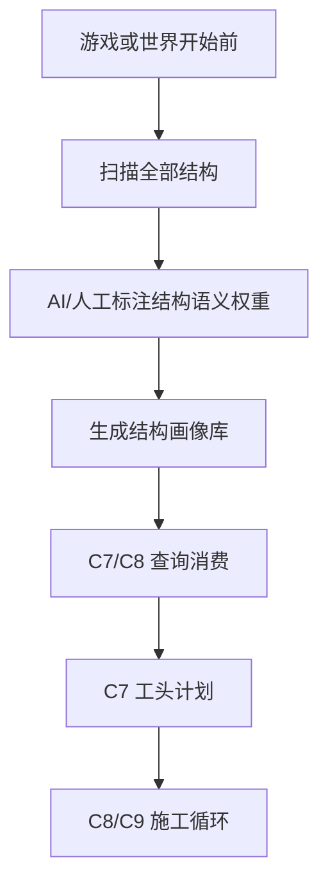
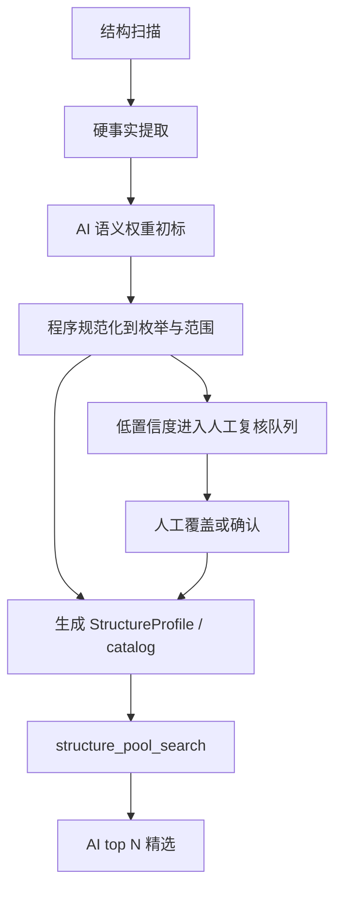

# 结构标记辅助 Mod

## 功能目标

结构标记辅助 Mod 是游戏或世界开始前运行的离线预处理系统，负责把全部结构从“单标签列表”升级为“结构画像库”。它不属于 C7-C9 的施工循环。

它继续服务两个原始目标：

1. 让 AI 知道结构大概是什么功能。
2. 避免一次把大量结构配置发给 AI，降低上下文压力。

新目标是在这两个目标之上，支持 C2-C8 的权重搜索：

- 程序按功能区权重、位置上下文、尺寸和硬约束先召回候选。
- AI 只看 top N 摘要并做精选。
- C8/C9 仍按硬事实和运行时结果做最终裁判。

## 运行时机



结构画像库应在城市生成前尽量准备好。C7 开始后，系统只查询和消费画像，不在每个施工节点重新给结构池打标签。

## 标注分层

| 类型 | 来源 | 是否可由 AI 决定 | 示例 |
| --- | --- | --- | --- |
| 硬事实 | 扫描、NBT、运行时 | 否 | size、footprint、connector、rotation、jigsaw pool |
| 硬约束 | 扫描、程序规则、人工规则 | 否，可由 AI 建议 | avoid_water、max_slope、requires_solid_base |
| 语义权重 | AI 标注、人工覆盖 | 是 | function_candidates、style_score、semantic_role |
| 放置倾向 | AI 初标、程序复核 | 是，但不得当硬约束 | road_frontage、plaza_edge、waterfront、quiet_backstreet |
| 可信来源 | 程序记录 | 否 | scanner、manual_override、ai_tagging、heuristic |

## 推荐工作流



## 搜索方式

结构搜索不再只问“有没有 market 标签”，而是计算：

```text
score =
  dot(district.function_weights, structure.function_affinity)
+ dot(city.style_weights, structure.style_score)
+ placement_context_match
+ pool_affinity
+ piece_usage_bonus
- constraint_risk
```

AI 最终看到的是摘要：

```json
{
  "template_id": "trek:village/plains/houses/plains_butcher_shop_1",
  "score": 1.82,
  "why": ["market=0.70", "residential=0.40", "road_frontage 适合", "M 尺寸匹配"],
  "size": [9, 10],
  "role": "START",
  "risks": ["需要道路正面"]
}
```

## 接口建议

| 接口 | 用途 |
| --- | --- |
| `structure_pool_search` | 输入功能区权重、位置上下文、尺寸和硬过滤条件，返回 top N 摘要 |
| `structure_template_detail` | 输入少量 template_id，返回 connector、placement、constraints、jigsaw 详情 |
| `structure_label_review_queue` | 返回低置信度或冲突结构，供人工复核 |
| `structure_profile_submit` | 提交 AI 或人工标注结果 |

## 不允许 AI 直接决定的字段

- `footprint`
- `allowed_rotations`
- `connector_dirs`
- `jigsaw target / pool`
- `requires_solid_base`
- `avoid_water`
- `max_slope`
- `runtime bounding box`

AI 可以提供建议和证据，但这些字段必须来自扫描、运行时、手动规则或程序校验。

## 与 C7-C9 的关系

- C7 使用结构画像库生成工头计划和候选结构池。
- C8 使用结构详情进行节点放置和 jigsaw 求解。
- C9 只执行和复核，不反向参与结构标注。
- C8/C9 的失败可以形成后续搜索惩罚或 negative hint，但不等同于重新标注结构功能。
