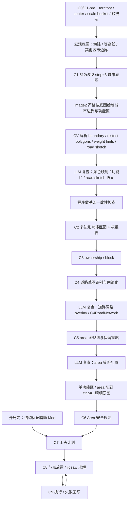

# C 大重构系统概述（2026-05-06 版）

## 系统目标

本版重构目标是把城市 C 链路从“早期硬切功能区 + 后续补救摆结构”，升级为“宏观多模态底图 + 多边形功能区权重 + 结构画像库 + C7-C9 施工循环”的城市生成系统。

核心问题：

- 现有 C1 城市外形过于程序化，轮廓和地形关系不自然。
- 后续功能区设计偏硬，容易把区域提前锁死成单一 `market / residential / civic`。
- 结构池标签目前能帮助 AI 理解结构，也能压缩上下文，但搜索仍偏单标签过滤。

本版核心方向：

- 结构标记辅助 Mod 是游戏或世界开始前的离线预处理系统，先把全部结构标好。
- C0/C1-pre 只保留当前“选落点”的结果：`territory_id` 与 `center_x / center_z` 是硬输入，城市规模改为新的 `city_scale_bucket`。
- C1 使用固定 `512 x 512` 多模态画布和 `step = 8` 左右的宏观地理采样，只表达海陆、等高线、已有城市边界和主要地理信息。
- 画布尺寸、采样 step、世界覆盖范围必须分离：不要求 `1 像素 = 1 个 step 单元`。
- `image2` 以 C1 底图为严格底图，画初版城市边界、功能区多边形和功能权重提示。
- 程序负责图层解析、基础一致性检查、功能区权重表生成和结构搜索。
- AI 只在合适层级做语义判断，不直接决定施工合法性；LLM 复查与策略配置按 C1/C2、C4、C5 分层介入。
- C7 开始进入工头计划，C8/C9 才是逐节点放置、求解、执行、回写的循环过程。

## 总体流程

## 阶段粗略职责

| 阶段 | 目标职责 | 本版变化 |
| --- | --- | --- |
| 开局前 | 结构标记辅助 Mod | 离线扫描和 AI 标注全部结构，生成结构画像库 |
| C0/C1-pre | 城市前置配置 | 硬保留 `territory_id` 与 `center_x / center_z`；用 `city_scale_bucket` 表达大中小城市；`density / ecology / water_policy / city_role` 只作为规划软提示；旧 `targetChunkCount / bias / layers` 不进入新契约 |
| C1 | 宏观城市底图 | 使用固定 `512 x 512` 画布和 `step = 8` 左右采样，表达海陆、等高线、城市/领土边界、主要地理信息 |
| C2 | 多边形功能区图 + 权重表 | 保留多边形功能区，但每个功能区带功能权重，不再只有单标签 |
| C3 | ownership / blocks | 把功能区多边形、道路骨架、锚点转成可追踪街坊和片区 |
| C4 | 道路草图识别与网络化 | 不重新规划道路；把 image2 已画出的 road sketch 识别、吸附、拓扑化为 `C4RoadNetwork` |
| C5 | Area 图规划与保留策略 | 在道路、锚点和功能区之间生成 `district_area / buildable_area / reserved_area / residual_area`，不提前放结构 |
| C6 | Area 安全规范 | 保留在语义层，为 area 标注硬约束、软风险、例外规则和复核要求；不做设计、不替 C7 读图 |
| C7 | 工头计划 | 基于 C5 area 意图、C6 安全规范、step=1 地图和结构画像生成工头计划 |
| C8 | 节点放置 / jigsaw | 子 agent 按工头计划逐个放置结构并求解拼图方块 |
| C9 | 执行与回写 | 执行、复核、失败回写，回到 C8 继续下一节点或重试 |

## 本版重点文档

- [C1 城市画布与 Image2 意图图](./功能设计/C1城市画布与Image2意图图.md)
- [C2 功能权重场](./功能设计/C2功能权重场.md)
- [C3 意图图到 Ownership 转换](./功能设计/C3意图图到Ownership转换.md)
- [C4 道路草图识别与网络化](./功能设计/C4道路草图识别与网络化.md)
- [C5 Area 图规划与保留策略](./功能设计/C5Area图规划与保留策略.md)
- [C6 Area 安全规范](./功能设计/C6Area安全规范.md)
- [LLM 复查与策略配置](./功能设计/LLM复查与策略配置.md)
- [结构标记辅助 Mod](./功能设计/结构标记辅助Mod.md)
- [UrbanIntentMap 草案](../../../20_contracts/city/c_refactor/配置表/UrbanIntentMap.md)
- [C3OwnershipBlocks 草案](../../../20_contracts/city/c_refactor/配置表/C3OwnershipBlocks.md)
- [C4RoadNetwork 草案](../../../20_contracts/city/c_refactor/配置表/C4RoadNetwork.md)
- [C5AreaPlan 草案](../../../20_contracts/city/c_refactor/配置表/C5AreaPlan.md)
- [C6AreaSafetySpec 草案](../../../20_contracts/city/c_refactor/配置表/C6AreaSafetySpec.md)
- [StructureProfile 草案](../../../20_contracts/city/c_refactor/配置表/StructureProfile.md)

## 第一阶段建议

第一阶段不要一次推倒 C1-C9，建议先做 `C1.5 ImageIntent Adapter`：

1. 读取 `step = 8` 宏观地图，包含海陆、等高线、已有城市边界、领土边界和主要地理信息。
2. 按 `city_scale_bucket` 决定底图覆盖范围，再统一渲染成 `512 x 512` 给 LLM/image2。
3. 调用或接入 image2，以该图为严格底图绘制城市边界和多边形功能区图。
4. 第一版要求 image2 输出不透明纯色机器 mask，不使用半透明、渐变、阴影或纹理作为机器解析源。
5. 用 CV 解析城市边界、功能区多边形、功能权重提示和道路草图。
6. 程序生成 `UrbanIntentMap.json` 和 C2 权重表后，再重渲染半透明 overlay 预览供人和 AI 复核。
7. 输出 `UrbanIntentMap.json`，其中功能语义先采用“多边形 + 权重表”，不强求连续栅格热力图。
8. 提供 C3 兼容转换，把新意图图临时转成现有 C3/C6 可消费数据。
9. 基于 C3 `road_hints` 把 image2 道路草图网络化为 `C4RoadNetwork`，并用 LLM 复查道路 overlay 与道路等级语义。
10. 基于 C3/C4 生成 `C5AreaPlan`，把功能区切成带层级、带 layout profile、带保留策略的 area 图。
11. 基于 `C5AreaPlan` 和 `step = 1` 局部地图生成 `C6AreaSafetySpec`，只做安全规范，不生成设计方案。
12. 用同一座城市对比旧 C1 与新 C1.5 的城市轮廓自然度、功能区合理性和后续 C6-C9 成功率。

## 关键原则

- image2 是城市规划师手绘层，不是施工真值。
- image2 第一版只负责输出机器可解析的纯色 mask；半透明视觉图由程序基于结构化 JSON 重渲染。
- 第一版保留旧选簇/落点流程，image2 接管城市边界大小、城市轮廓和功能区规划图。
- `512 x 512` 是多模态展示规范，`step = 8` 是地理采样精度，`world_extent_blocks` 由城市规模决定。
- `city_scale_bucket` 表示城市大中小，`density` 表示同等规模下建造紧凑程度，二者不能混用。
- 旧 C1 字段 `targetChunkCount / bias / layers` 不进入新契约；过渡期 adapter 可以内部读取，但落盘只能写新字段。
- CV 解析结果必须经过基础一致性检查和坐标映射校验。
- 第一版城市语义采用“多边形功能区图 + 功能权重表”，后续再视需要升级为连续权重场。
- 结构标签升级为结构画像，但它属于开局前离线预处理，不属于 C7-C9 施工循环。
- C1 不做施工级禁区判断；精细坡度、solid base、水下等检查留到功能区 `step = 1` 和 C8/C9。
- 道路系统单独成层，不再作为功能区内部附属逻辑。
- 新 C4 是道路草图识别与网络化，不等同于当前实现里的旧 `C4_FunctionPlan.json` 功能语义计划。
- 新 C5 的主名词是 `area`，不是固定切碎的 `parcel`；`reserved_area` 和 `residual_area` 是正式施工上下文。
- 新 C6 是语义安全规范层，不是旧矩形槽位主线；它不做设计，不替 C7 读图，不选择结构模板，不决定最终落地。
- LLM 复查是辅助层：C1/C2 复查颜色、功能区和 road sketch 语义；C4 后复查道路网络；C5 后配置 area 策略，不能越级替代下游计算。

## 与现有系统关系

当前 `main_module` 文档仍描述 C7-C8 主模块建造当前稳定链路。本重构计划是上游和结构池搜索方式的下一代方向，落地前需要分阶段兼容现有：

- `C7 foreman_plan`
- `C8 node session`
- `C8 jigsaw solver`
- `C9 execution`

短期内不要求废弃这些链路，而是让新 C1/C2/结构画像逐步提供更好的输入。
