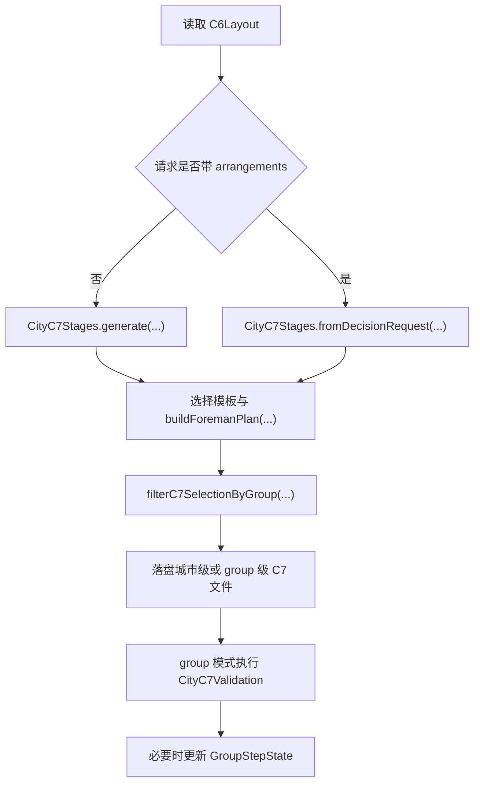

# C7 工头计划

## 功能目标

`C7` 负责把 `C6` 的建造区结果整理成“工头可以直接消费”的主模块计划，而不是直接产出最终落地结构。

当前稳定目标是：

- 为每个 group 产出一个 `foreman_plan`
- 固定一个 `start_node`
- 给出阶段列表 `phase_list`
- 给出模板池、connector 目标规则与全局约束

## 入口条件

当前主入口是 `city_c7_generate`：

| 参数 | 是否必填 | 说明 |
| --- | --- | --- |
| `city_id` | 是 | 城市编号 |
| `group_id` | 否 | 传入后只回包并落盘当前 group |
| `strict_tag_source` | 否 | 是否启用严格标签过滤 |
| `arrangements` | 否 | 若传入则走 `fromDecisionRequest(...)`，否则走程序 fallback 生成 |

## 当前核心流程

## 当前有效结论

- 主模块主链使用 `foreman_plan` 作为面向 `C8` 的直接输入。
- `group` 级文件默认只保留一个主工头计划。
- `start_node`、`phase_list`、`template_pool_refs` 和 `connector_target_rules` 是当前最稳定的计划骨架。
- `strict_tag_source` 仍然影响候选模板过滤，并通过回包字段暴露 `strict_filter_failure_reason`。

## 主要输出

| 对象 | 关键字段 | 用途 |
| --- | --- | --- |
| `C7Selection` | `foreman_plan`、`foreman_plans`、`phase_list` | 作为城市级 / group 级计划总对象 |
| `ForemanPlan` | `group_id`、`build_area_id`、`start_node`、`phase_list` | 作为 `C8` 会话生成的直接上游 |
| `StartNode` | `node_id`、`allowed_connector_dirs`、`template_pool_id`、`candidate_template_ids` | 定义唯一开工节点 |
| `TemplatePoolRef` | `template_pool_id`、`template_ids` | 暴露本轮可用模板池 |

## 异常边界

- 缺少 `city_id` 或 `C6Layout` 时，入口直接失败。
- `group` 级请求在校验失败时会返回 `422`，重复失败达到阻塞条件时返回 `409`。
- `C7` 只负责生成计划，不在本阶段处理实际坐标求解与运行时碰撞。

## 关联文档

- 系统概述：`../系统概述.md`
- 契约：`../../../20_contracts/city/main_module/配置表/C7工头计划.md`
- 代码实现：`../../../30_code_guide/city/main_module/功能实现/C7工头计划.md`
- 测试入口：`../../../40_tests/city/main_module/测试入口.md`
