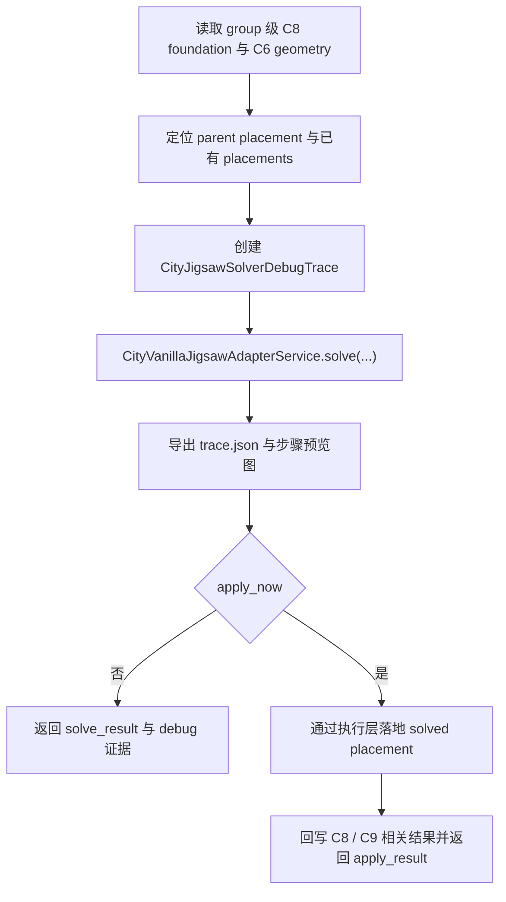

# C8 子节点 Jigsaw 求解

## 功能目标

当主模块已经存在 parent placement，但下一步 child 结构不能只靠人工给定坐标时，当前主链通过 `city_jigsaw_solve` 走一条独立的单步 `jigsaw` 求解能力。

当前能力目标是：

- 基于当前 parent placement 与 parent connector 发起一次 child 求解
- 输出可回放的 `jigsaw_solver_debug/<runId>` 调试证据
- 在需要时通过 `apply_now` 直接把求解结果交给执行层落地

## 入口条件

当前主入口是 `city_jigsaw_solve`：

| 参数 | 是否必填 | 说明 |
| --- | --- | --- |
| `city_id` | 是 | 城市编号 |
| `group_id` | 否 | group 级求解时传入 |
| `build_area_id` | 否 | 定位目标 foundation |
| `parent_node_id` | 是 | 已存在的 parent placement 节点 |
| `parent_connector_id` | 是 | 本次求解要使用的 parent jigsaw |
| `selected_template_id` | 是 | 要求求解的 child 模板 |
| `selected_connector_dir` | 否 | AI 期望连接方向 |
| `selected_rotation` | 否 | 当前仅作为请求信息保留 |
| `apply_now` | 否 | 是否把求解结果直接交给执行层落地 |

## 当前核心流程

## 当前有效结论

- 当前 solver 只处理单次 child 扩展，深度固定为 1。
- 当前 solver 只处理水平 `jigsaw`；垂直 `jigsaw` 仍返回占位型 pending 结果。
- 当前求解会优先读取 parent runtime jigsaw 的原始 `pool`，再在该 pool 中筛出 AI 指定模板，而不是再造一个脱离式临时 pool。
- 当前调试目录固定输出在 `group/<groupId>/jigsaw_solver_debug/<runId>/`。

## 当前主要证据

| 产物 | 说明 |
| --- | --- |
| `trace.json` | 记录请求上下文、parent connector 解析、vanilla piece 结果、校验与 apply 结果 |
| 步骤预览图 | 记录运行时 jigsaw、connector、child 结果和 apply 前后状态 |
| `solve_result` | 结构化回包，供 MCP 和调试工具继续消费 |

## 当前异常边界

- 缺少 `parent_node_id`、`parent_connector_id` 或 `selected_template_id` 时直接拒绝。
- parent placement 不存在、build area 不存在、catalog 元数据缺失时直接返回结构化 reject。
- `apply_now` 不是独立执行链，只是把求解结果继续交给执行层系统。

## 关联文档

- 系统概述：`../系统概述.md`
- 契约：`../../../20_contracts/city/main_module/配置表/C8子节点Jigsaw求解.md`
- 代码实现：`../../../30_code_guide/city/main_module/功能实现/C8子节点Jigsaw求解.md`
- 调试回放工具：`../../../10_product/devtools/code_process_viewer/功能设计/Jigsaw求解器回放.md`
- 下游执行层：`../../c9_execution/01_scope.md`
