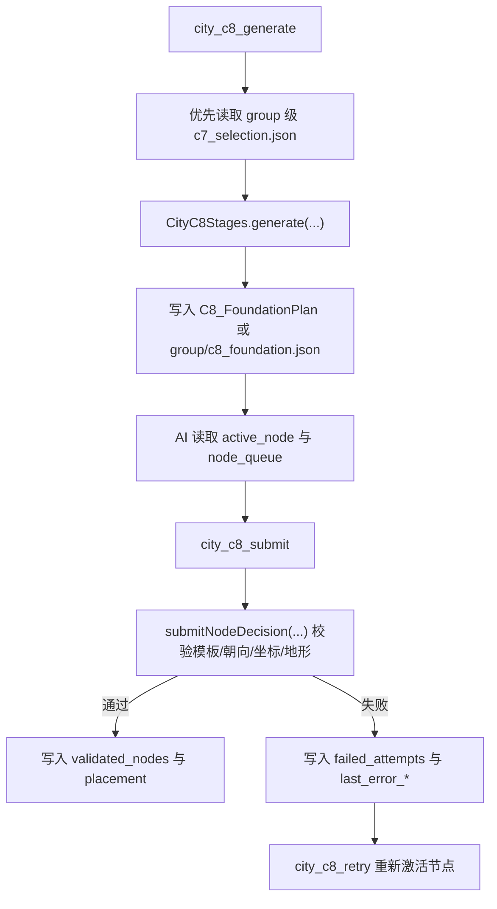

# C8 节点会话与提交

## 功能目标

`C8` 负责把 `C7` 工头计划转换成可持续推进的施工会话，并在每次 AI 决策提交后完成程序校验、状态推进和失败记录。

当前稳定职责包括：

- 生成 `foundation` 会话
- 提供当前 `active_node`
- 维护 `node_queue / validated_nodes / failed_attempts`
- 支持 `submit` 与 `retry`

## 入口

| 入口 | 作用 |
| --- | --- |
| `city_c8_generate` | 根据 `C6 + C7 + height/scan` 生成施工会话 |
| `city_c8_data` | 读取当前城市级或 group 级 `C8` 会话 |
| `city_c8_submit` | 对当前节点提交模板、方向、旋转与可选坐标 |
| `city_c8_retry` | 将失败节点重新放回会话推进 |

## 当前核心流程

## 当前有效结论

- `group` 级主链已优先消费 `group/<groupId>/c7_selection.json` 与 `group/<groupId>/c8_foundation.json`，不再默认回退到城市级旧产物。
- `FoundationItem` 是当前会话真值对象，兼容保留 `placements` 仅用于旧链路与执行层消费。
- `city_c8_submit` 的重点不是“接受 AI 文本”，而是接受结构化节点决策并立即返回结构化校验结果。
- `retry` 会回写同一份 `C8` 会话，不再额外产生平行会话文件。
- `city_c8_submit` 在 `apply_now=true` 时，当前会额外输出一套专用调试产物 `group/<groupId>/c8_submit_debug/<runId>/`，用于定位 start/普通节点的执行层落地问题。

## 当前稳定会话视图

| 字段 | 说明 |
| --- | --- |
| `session_state` | 当前建造区会话状态 |
| `queue_summary` | 当前待决策、已校验、失败与总数摘要 |
| `active_node` | 当前需要 AI 决策的节点 |
| `node_queue` | 等待推进的节点队列 |
| `validated_nodes` | 已通过程序校验的节点 |
| `failed_attempts` | 历史失败尝试记录 |
| `foundation_context` | 基台与高度上下文 |

## 当前提交边界

- `selected_template_id`、`selected_connector_dir`、`selected_rotation` 是标准提交字段。
- `x / z` 仅在根节点或特例节点允许直接传入。
- `terrain_relax_profile` 作为可选放宽参数参与当前节点校验。
- `city_c8_submit` 失败时返回 `422`，并把结构化错误码写入回包与会话。

## `apply_now` 调试证据

- 当前 `city_c8_submit(apply_now=true)` 会生成：
  - `trace.json`
  - `01_request_context.png`
  - `02_validation_result.png`
  - `03_apply_result.png`
- `trace.json` 中额外包含 `04_world_snapshot`，会在同一 runtime placement bounds 内记录落地前后的世界块统计。
- 这套证据的目标不是替代 `jigsaw_solver_debug`，而是补齐 start/普通节点落地时缺失的专用 trace，方便排查“只落半截”“视觉像被砍掉”等问题。

## 关联文档

- 系统概述：`../系统概述.md`
- 契约：`../../../20_contracts/city/main_module/配置表/C8节点会话.md`
- 代码实现：`../../../30_code_guide/city/main_module/功能实现/C8节点会话与提交.md`
- 下游执行层：`../../c9_execution/01_scope.md`
