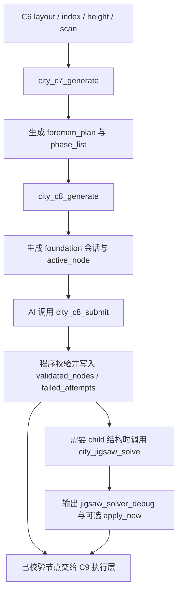

# 主模块建造系统概述

## 系统目标

主模块建造系统当前负责把城市主模块从 `C6` 建造区结果推进到“可由 AI 逐节点决策、可由程序校验、可交给执行层消费”的状态。

当前稳定主链为：

1. `C7` 生成工头计划
2. `C8` 生成施工会话并维护节点队列
3. `C8` 接收节点提交、失败重试与子节点 `jigsaw` 求解
4. 将已校验节点交给 `C9` 执行层系统消费

## 责任边界

### 本系统负责

- 基于 `C6` 结果生成主模块工头计划
- 维护 `C8` 施工会话、活跃节点、失败记录和已校验节点
- 提供 `city_c8_submit`、`city_c8_retry`、`city_jigsaw_solve` 等主模块决策入口
- 为下游 `C9` 执行层准备可消费的节点与调试产物

### 本系统不负责

- 不再回到旧的整图排列方式枚举路线
- 不把道路接口和次级建筑重新揉回主模块文档
- 不把 `BuildQueue` 运行时执行细节继续写在主模块系统里

`C9` 的队列生成、运行时校验、立即落地和执行器拆分真值，统一继续查看 `../c9_execution/`。

## 上下游依赖

| 类型 | 对象 | 说明 |
| --- | --- | --- |
| 上游 | `C6Summary / C6Layout / C6Index` | 提供建造区、分组、polygon 与 block index |
| 上游 | `HeightData / C2ScanData` | 提供 start 选点、预览与运行时校验所需环境数据 |
| 上游 | `C3.5 catalog` | 提供模板、connector 与 pool 元数据 |
| 下游 | `C9` 执行层系统 | 消费 `validated_nodes` 与 `PlacementNode` 进入队列与执行 |
| 下游 | `group` 级产物目录 | 落盘 `c7_selection.json`、`c8_foundation.json`、`jigsaw_solver_debug/<runId>` |

## 当前核心子功能

1. [C7 工头计划](./功能设计/C7工头计划.md)
   - 生成 `foreman_plan`、阶段列表、起始节点和模板池引用。
2. [C8 节点会话与提交](./功能设计/C8节点会话与提交.md)
   - 生成施工会话，维护 `active_node / node_queue / validated_nodes / failed_attempts`。
3. [C8 子节点 Jigsaw 求解](./功能设计/C8子节点Jigsaw求解.md)
   - 基于当前 parent placement 发起单步 child 求解，并输出 debug trace 与预览。

## 当前稳定产物

| 产物 | 默认位置 | 作用 |
| --- | --- | --- |
| `C7_TemplateSelection.json` | 城市目录 | 保存城市级 `C7` 计划 |
| `group/<groupId>/c7_selection.json` | group 目录 | 保存 group 级 `C7` 工头计划 |
| `C8_FoundationPlan.json` | 城市目录 | 保存城市级 `C8` 会话 |
| `group/<groupId>/c8_foundation.json` | group 目录 | 保存 group 级 `C8` 会话 |
| `group/<groupId>/jigsaw_solver_debug/<runId>/` | group 目录 | 保存 `city_jigsaw_solve` 调试产物 |

## 当前主链

## 阅读入口

- 功能设计：`./功能设计/`
- 契约：`../../../20_contracts/city/main_module/配置表/`
- 代码导览：`../../../30_code_guide/city/main_module/代码导览.md`
- 测试入口：`../../../40_tests/city/main_module/测试入口.md`
- 影响面：`../../../40_tests/city/main_module/影响面.md`
- 下游执行层：`../c9_execution/01_scope.md`
