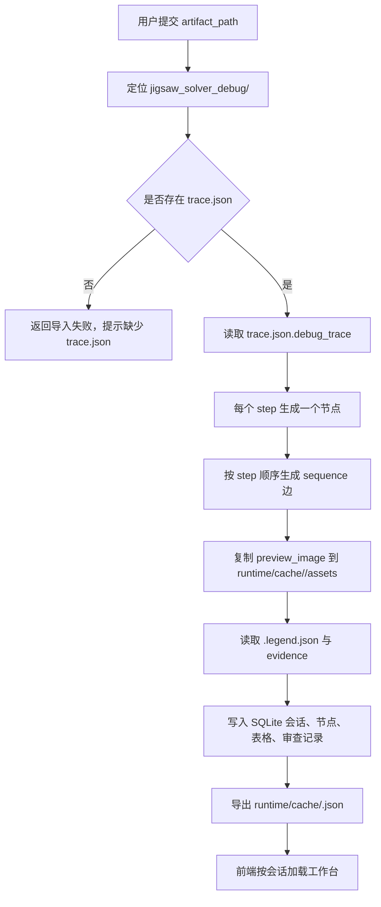

# Jigsaw 求解器回放

## 功能目标

Jigsaw 求解器回放用于把一次真实 `city_jigsaw_solve` 调试产物整理成可回看的只读会话。

首版目标固定为：

- 读取真实 `jigsaw_solver_debug/<runId>` 目录。
- 将 `trace.json.debug_trace` 逐步映射为流程节点。
- 将预览图、legend、evidence、源码入口和审查标记统一展示到单页工作台。
- 不触发求解，只消费已经生成的调试产物。

## 入口条件

- 已存在一个真实 `jigsaw_solver_debug/<runId>` 目录。
- 目录中至少包含 `trace.json`。
- 若存在步骤预览图和 `*.legend.json`，导入时一并读取。

## 核心流程

## 输入结构

| 对象 | 字段 | 用途 |
| --- | --- | --- |
| `trace.json` | `debug_run_id` | 会话主键与缓存文件名 |
| `trace.json` | `city_id` `group_id` `task_id` | 会话上下文 |
| `trace.json.debug_trace[]` | `step_key` | 节点顺序与源码映射键 |
| `trace.json.debug_trace[]` | `title_zh` | 节点标题 |
| `trace.json.debug_trace[]` | `goal_zh` `action_summary_zh` `implementation_zh` `result_zh` | 节点详情文本 |
| `trace.json.debug_trace[]` | `status` | 节点状态颜色与风险等级 |
| `trace.json.debug_trace[]` | `preview_image` | 步骤预览图 |
| `trace.json.debug_trace[]` | `evidence` | 证据表格来源 |
| `<step_key>.legend.json` | 任意键值 | 预览图 legend 表格来源 |

## 节点生成规则

| 规则项 | 说明 |
| --- | --- |
| 节点粒度 | `debug_trace` 每个 `step` 固定生成一个节点 |
| 连边方式 | 相邻步骤之间固定生成 `sequence` 边 |
| 节点标题 | 优先使用 `title_zh`，缺失时回退 `step_key` |
| 节点状态 | 使用 `status` 归一化后展示 |
| 节点证据 | `evidence` 和 `legend` 各自展开为表格 |
| 源码入口 | 按 `step_key` 映射到固定源码文件与行号 |

## 首版固定步骤

首版至少需要正确回放以下步骤：

- `request_context`
- `runtime_jigsaws`
- `parent_connector_resolution`
- `vanilla_piece_result`
- `validation_result`
- `apply_result`

## 页面展示要求

| 区域 | 展示内容 |
| --- | --- |
| 左侧 | 步骤流程与步骤列表 |
| 中间 | 当前步骤预览图 |
| 右侧 | 目标、动作摘要、实现说明、结果摘要、源码入口 |
| 下方 | `evidence` / `legend` 表格 |
| 侧栏 | 审查结论与备注 |

## 异常与边界

| 场景 | 处理方式 |
| --- | --- |
| `trace.json` 缺失 | 导入失败，明确返回错误 |
| `debug_trace` 为空 | 导入失败，明确返回错误 |
| `preview_image` 缺失 | 允许导入，但节点标记证据不完整 |
| `legend` 缺失 | 允许导入，仅展示 evidence 表 |
| 同一 `debug_run_id` 重复导入 | 由 `replace_existing` 控制是否覆盖 |

## 非目标

- 不触发 `city_jigsaw_solve`
- 不做实时刷新
- 不做多人协作
- 不做复杂权限系统
- 不拆独立前端工程

## 关联文档

- 系统概述：`../系统概述.md`
- 展示契约：`../../../20_contracts/devtools/code_process_viewer/配置表/展示模型.md`
- 代码导览：`../../../30_code_guide/devtools/code_process_viewer/代码导览.md`
- 测试入口：`../../../40_tests/devtools/code_process_viewer/测试入口.md`
- 影响面：`../../../40_tests/devtools/code_process_viewer/影响面.md`
