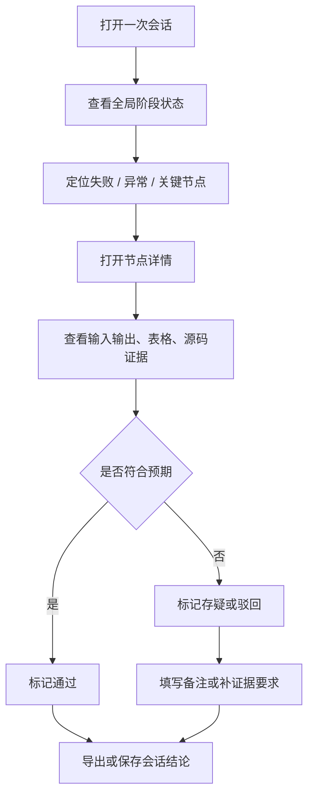

# 过程审查工作台

## 功能目标

过程审查工作台用于让用户在一次代码分析完成后，快速浏览整条过程链路，并判断结果是否符合预期。

它的核心不是“画一张流程图”，而是回答四个问题：

1. 过程走到了哪一步。
2. 每一步拿到了什么输入输出。
3. 哪一步最可疑，应该先看哪里。
4. 这次结果相比上一次是变好还是变坏。

## 入口条件

- 后端已经生成一次可浏览的会话。
- 会话中至少包含：
  - 节点
  - 边
  - 节点状态
  - 节点详情
  - 结构化表格快照

## 页面组成

| 区域 | 说明 | 前端职责 |
| --- | --- | --- |
| 顶部会话栏 | 显示会话名、分支、提交号、时间、状态 | 展示和切换 |
| 左侧流程图区 | 展示阶段节点与依赖关系 | 绘制、缩放、筛选、高亮 |
| 右侧详情面板 | 展示当前节点输入输出、耗时、异常、源码引用 | 按节点切换内容 |
| 下方数据表格区 | 展示对象结构、字段值、差异项 | 表格展示、排序、搜索 |
| 审查面板 | 展示检查点、人工结论、风险标记 | 展示和提交轻量标记 |

## 推荐首版最小功能

### 必须有

1. 节点流程图
2. 节点状态颜色区分
3. 节点详情侧栏
4. 数据结构表格
5. 关键证据入口
6. 审查结论标记

### 强烈建议首版一起做

1. 多次运行结果对比
2. 节点搜索和筛选
3. 失败节点自动聚焦
4. 导出审查报告

## 首版节点怎么生成

首版不采用“让 AI 每完成一步就自由写一个节点”的方式，而是采用更稳定的方案：

- 后端按检查点自动开节点
- AI 只补节点摘要
- 用户只做审查结论

### 为什么不用全 AI 自建节点

如果完全交给 AI 自建节点，会出现几个问题：

1. 粒度不稳定。
2. 容易漏掉真实失败过程。
3. 不利于不同会话之间做稳定对比。
4. 多 agent 混跑时结构会越来越乱。

### 首版开节点规则

只有进入以下检查点时，系统才新开一个节点：

| 场景 | 节点类型 |
| --- | --- |
| 一次任务开始 | `session_start` |
| 一批上下文读取完成 | `context_scan` |
| 一次计划确认完成 | `plan` |
| 一次连续修改完成 | `change_batch` |
| 一次验证完成 | `verify` |
| 出现失败、卡点、重试 | `issue` |
| 最终给出结果 | `delivery` |

### 首版不开节点的动作

以下动作默认只作为节点内证据，不单独开节点：

- 打开一个文件
- 搜索一次关键词
- 调用一次简单工具
- 回复一句普通说明
- 单条无结论日志

这样可以避免图炸掉。

## 用户审查流程

## 为了让用户更好介入，建议补的能力

仅靠图和表格还不够，至少还需要下面这些能力：

| 能力 | 建议级别 | 为什么重要 |
| --- | --- | --- |
| 节点证据链 | 必须 | 用户要能看到这个节点的结论是从哪段代码、哪份日志、哪个中间结果来的 |
| 审查检查点 | 必须 | 用户不用每次自己想“该看什么”，系统直接提示重点节点 |
| 节点备注 | 必须 | 用户可以留下“这里不对”“这里要补日志”的判断 |
| 结果对比 | 强烈建议 | 最容易判断本次修改有没有偏离需求 |
| 风险标签 | 强烈建议 | 把“高风险 / 待确认 / 设计偏离”直接挂到节点上 |
| 会话快照冻结 | 建议 | 防止后续重复运行把已审查内容冲掉 |

## 节点详情展示建议

当前节点详情建议固定展示以下字段：

| 模块 | 字段 |
| --- | --- |
| 基础信息 | 节点名、阶段、状态、耗时、开始时间、结束时间 |
| 输入 | 输入摘要、上游节点、输入参数 |
| 输出 | 输出摘要、结构化对象、结果状态 |
| 证据 | 源码文件、函数名、日志片段、异常堆栈、生成说明 |
| 审查 | 人工结论、备注、是否需要补证据 |

## 为什么“前端纯展示”仍需要轻量审查动作

如果前端完全不能留下任何审查结果，用户每次看完仍然要回到别处记笔记，会打断流程。

因此当前建议的最小交互是：

- 标记通过
- 标记存疑
- 标记驳回
- 标记待补证据
- 填一段备注

这些动作依然属于“轻量展示交互”，业务判断和持久化逻辑由后端承担，不违背前端纯展示的原则。

## 首版技术边界建议

| 项目 | 当前建议 |
| --- | --- |
| 后端语言 | Go |
| API 风格 | REST 为主，必要时补 SSE 推送运行状态 |
| 前端部署 | 由 Go 服务统一托管静态资源 |
| 流程图方案 | 基于节点和边的前端可视化库 |
| 数据表格 | 前端只接收后端整理好的表格模型 |
| 存储 | 首版可用本地文件或 SQLite 保存会话与审查记录 |
| 网络部署 | 单机启动，默认端口 `6657`，局域网可访问，后续通过反向代理挂域名 |

## 风险与边界

1. 如果后端不产出结构化节点与证据链，前端再漂亮也只是空壳。
2. 如果没有会话快照和对比，用户很难判断“本次修改是不是更符合需求”。
3. 如果没有最基础的鉴权，局域网和公网访问都会有隐患。

## 关联文档

- 系统概述：`../系统概述.md`
- 数据契约：`../../../20_contracts/devtools/code_process_viewer/配置表/展示模型.md`
- 测试入口：`../../../40_tests/devtools/code_process_viewer/测试入口.md`
- 影响面：`../../../40_tests/devtools/code_process_viewer/影响面.md`
