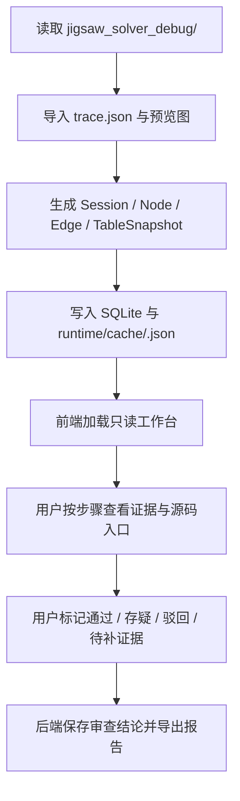

# 代码过程浏览可视工具系统概述

## 系统目标

代码过程浏览可视工具用于把“代码解释 / 代码分析 / 代码生成过程”结构化为可浏览、可回看、可审查的 Web 工作台。

当前已经落定的首个实现对象不是泛化过程流，而是 `Jigsaw` 求解器真实调试回放。

当前首版目标：

- 后端运行在单台机器上。
- 前端以纯展示为主，负责流程图、节点详情和数据结构表格呈现。
- 用户可通过局域网访问该工具，后续可平滑扩展到域名访问。
- 首版只读导入 `city_jigsaw_solve` 生成的 `jigsaw_solver_debug/<runId>` 调试产物。
- 用户能在浏览过程中快速判断：
  - 过程有没有按预期走
  - 哪个节点有问题
  - 当前结果是否符合需求

## 非目标

当前阶段不把本系统定义为：

- 在线代码编辑器
- 云端多租户平台
- 复杂协同审批系统
- 直接修改源码的 IDE 替代品

## 责任边界

### 前端负责

- 流程图展示
- 节点状态展示
- 数据结构表格展示
- 条件筛选、搜索、折叠、回看
- 审查结果与证据入口展示

### 后端负责

- 过程数据采集与整理
- 流程节点、边、阶段、状态计算
- 数据结构快照生成
- 会话存储、回放、对比
- 局域网/公网访问接口
- 鉴权、日志、导出、缓存

## 上下游依赖

| 类型 | 对象 | 说明 |
| --- | --- | --- |
| 上游 | 代码解释器 / 分析器 / AI 代理 | 提供阶段节点、输入输出、异常、日志、源码引用 |
| 上游 | 本地代码仓库 | 提供文件路径、函数位置、提交版本等上下文 |
| 下游 | Web 前端 | 展示图结构、表格和证据明细 |
| 下游 | 用户审查动作 | 对节点进行关注、通过、驳回、备注 |
| 下游 | 报告导出 | 输出阶段报告、问题清单、会话快照 |

## 核心子功能

1. 会话管理
   - 按一次分析任务生成一个可回看的会话。
2. 过程图展示
   - 以节点和边展示整个分析链路。
3. 节点详情面板
   - 查看输入、输出、状态、耗时、源码引用、日志引用。
4. 数据结构表格
   - 以表格展示节点产出的结构化对象、配置和差异。
5. 审查介入
   - 让用户快速标记“通过 / 存疑 / 驳回 / 待补证据”。
6. 快照与对比
   - 支持同一任务多次运行结果对比。
7. 访问与部署
   - 单机部署、局域网访问，后续支持域名和反向代理。

## 首版回放对象

| 项目 | 首版约定 |
| --- | --- |
| 调试来源 | `city_jigsaw_solve` 真实调试目录 |
| 输入目录 | `jigsaw_solver_debug/<runId>` |
| 最低输入要求 | 必须存在 `trace.json` |
| 附带资源 | 步骤预览图、`*.legend.json` 若存在则一并导入 |
| 导入方式 | `POST /api/import/jigsaw-debug` 手工导入或启动时自动导入 |
| 存储方式 | SQLite + `runtime/cache/<debug_run_id>.json` |
| 默认端口 | `6657` |

## 首版节点生成原则

为了避免节点过多、过碎、全靠 AI 自由发挥，当前 Jigsaw 回放首版固定采用：

- 系统自动生成事实节点
- AI 补充节点摘要和审查提示
- 用户补充人工结论

也就是：

1. 后端负责按 `trace.json.debug_trace` 步骤自动建节点。
2. AI 不负责“发明节点事实”，只负责把节点说明写得更容易读。
3. 用户最终用审查标记判断这一步是否符合需求。

## 首版固定步骤

首版先固定围绕 Jigsaw 求解器的 6 个关键步骤展开：

| 步骤键 | 说明 |
| --- | --- |
| `request_context` | 求解请求上下文与运行参数 |
| `runtime_jigsaws` | 运行时拼图输入整理 |
| `parent_connector_resolution` | 父连接器解析 |
| `vanilla_piece_result` | 原版片段求解结果 |
| `validation_result` | 校验结果 |
| `apply_result` | 应用结果 |

## 为什么前端纯展示仍然够用

前端只负责展示，不等于只能“看图”。为了让用户更好介入过程，前端至少还应提供以下展示型审查能力：

- 按阶段筛选
- 按状态高亮
- 按节点查看证据
- 按版本对比差异
- 标记关注节点
- 导出审查结果

这些能力本质上仍是“展示 + 轻交互”，复杂逻辑和状态落库由后端处理。

## 首版推荐补充能力

为了让用户更容易介入并判断结果是否符合需求，首版建议除“流程图 + 表格”外，再补以下能力：

| 能力 | 是否建议首版纳入 | 作用 |
| --- | --- | --- |
| 源码证据跳转 | 是 | 点节点后能直接看到对应文件、函数、代码片段或日志来源 |
| 审查检查点面板 | 是 | 让用户知道本次应该重点看哪些节点 |
| 会话快照与多次结果对比 | 后续预留 | 首版先把单次真实回放跑通，再扩展对比视图 |
| 问题节点标记与备注 | 是 | 方便用户介入和留下判断依据 |
| 只读分享链接 | 建议尽早预留 | 方便局域网内分享结果给其他人看 |
| 鉴权与访问令牌 | 是 | 局域网与未来域名访问都需要基本防护 |
| 导出 Markdown / HTML 报告 | 建议首版纳入 | 便于归档和离线复盘 |

## 总体流程

## 部署原则

1. 首版默认同机部署：
   - Go 后端同时提供 API 和静态前端资源。
2. 首版默认局域网访问：
   - 只需开放一个 HTTP 端口即可。
   - 默认开发端口先使用 `6657`。
3. 后续扩展到域名时：
   - 优先通过 Nginx / Caddy 反向代理。
   - 补齐 HTTPS、访问令牌、来源限制和日志审计。

## 关联文档

- 功能设计：`./功能设计/过程审查工作台.md`
- 功能设计：`./功能设计/Jigsaw求解器回放.md`
- 数据契约：`../../../20_contracts/devtools/code_process_viewer/配置表/展示模型.md`
- 代码导览：`../../../30_code_guide/devtools/code_process_viewer/代码导览.md`
- 测试入口：`../../../40_tests/devtools/code_process_viewer/测试入口.md`
- 影响面：`../../../40_tests/devtools/code_process_viewer/影响面.md`
