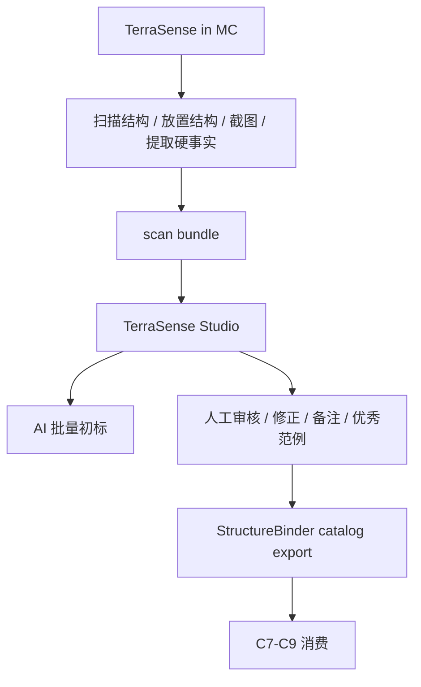

# TerraSense 结构策展工具方案

## 功能目标

TerraSense 的目标从“按名字关键词给结构打标签”升级为“结构素材策展工具”。

它需要把各种结构 mod、datapack 和原版结构整理成 StructureBinder 可消费的可信结构画像库，让城市生成器在 C7-C9 阶段能按功能、风格、位置倾向、硬约束和 jigsaw 真值选择结构，而不是继续依赖脆弱的名字关键词。

## 当前问题

现有结构标记主要依赖路径和名字猜测，例如 `house / tower / farm / road` 之类关键词。

这种方式无法判断：

- 结构真实外观和质量。
- 正面、入口、可连接方向。
- 是否适合临街、临水、广场边、山坡或背街。
- 是主建筑、次级建筑、装饰、地标还是道路节点。
- 与哪些结构组合更好看。
- 是否适合某类国度、城市功能区或新手村。

因此它不能支撑高质量城市设计，只能作为临时占位。

## 系统形态

TerraSense 第一版应拆成两个部分：

| 模块 | 运行环境 | 职责 |
| --- | --- | --- |
| TerraSense in MC | Minecraft / Forge | 扫描结构、放置结构、截图、提取尺寸/palette/jigsaw 等硬事实 |
| TerraSense Studio | 脱离 MC 的本地工具 | 浏览截图与元数据，AI 初标，动态术语表匹配，人工审核，导出结构画像 |
| StructureBinder Exporter | Studio 或独立脚本 | 把已审核术语冻结为静态枚举，导出 `C3_5_StructureCatalog.preprocessed.json` 和下一代 `StructureProfile` |

## 最小交付能力

### 1. 批量扫描与截图

TerraSense in MC 至少需要：

- 扫描所有已加载 `.nbt` structure。
- 按 namespace、目录和关键词筛选。
- 批量放置结构到固定摄影场。
- 输出正交或斜俯视截图，至少两张角度。
- 导出结构硬事实：
  - `structure_id`
  - 来源 namespace / path / mod hint
  - size / footprint / height
  - block palette
  - jigsaw 原始字段
  - connector 派生字段

### 2. 断点续扫

批量任务必须能中断和恢复。

建议维护 `scan_index.json`：

| 状态 | 说明 |
| --- | --- |
| `pending` | 尚未扫描 |
| `scanned` | 已有截图与硬事实 |
| `ai_done` | 已有 AI 初标 |
| `reviewed` | 人工已审核 |
| `failed` | 扫描、截图或 AI 失败 |

### 3. AI 批量初标

AI 只负责给建议，不是真值。

输入：

- 结构截图。
- `data.json` 硬事实。
- jigsaw / connector 信息。
- 可选的同类优秀范例。

输出建议：

- 功能倾向。
- 风格倾向。
- 位置倾向。
- 用途角色。
- 结构质量说明。
- 适合/不适合场景。
- 置信度与证据。

### 4. 人工审核编辑器

TerraSense Studio 是给协作者使用的核心工具。它必须不依赖启动 MC。

最小功能：

- 浏览结构截图。
- 查看硬事实和 AI 初标。
- 通过动态术语表编辑功能、风格、位置倾向、用途角色。
- 标记审核状态。
- 写人工备注。
- 标为优秀范例。
- 快速跳到上一个/下一个待审核结构。

### 5. 动态术语表

TerraSense 标记阶段使用动态术语表，StructureBinder 消费阶段只使用冻结后的静态枚举。

这个边界用于同时满足两个目标：

- 标记时允许新增词，避免协作者和 AI 被现有枚举卡住。
- 导出时统一名词，保证后续索引、检索和 C7-C9 查询稳定。

动态术语表不是简单白名单，而是可审核的受控词汇表。它至少覆盖：

| 词表类型 | 用途 |
| --- | --- |
| `function` | residential、market、port、warehouse、military、religious 等功能 |
| `style` | medieval、eastern、industrial、ruin、coastal、magic 等风格 |
| `placement` | road_frontage、waterfront、plaza_edge、corner、slope 等位置倾向 |
| `usage` | main_building、secondary_building、decoration、landmark、starter_village_core 等用途 |
| `template_role` | start、child、connector、roof、wall、room、corridor 等 jigsaw 内部角色 |
| `quality` | excellent、usable、needs_fix、reject 等质量标签 |

标记流程：

1. AI 或人工先提出原始标签。
2. Studio 在动态术语表中检索 canonical term、alias 和近似词。
3. 如果找到可信相似词，直接归一到已有 canonical term。
4. 如果没有相似词，先新增为 `proposed` 术语，再允许当前结构引用它。
5. 人工审核时决定批准、改名、合并、废弃或保留待定。
6. 导出给 StructureBinder 时，只把 `approved` 术语冻结为静态枚举；`proposed` 默认不得进入正式运行时索引。

因此“实在没有就先加进白名单再标记”是允许的，但新增词默认应是 `proposed`，不能直接污染正式枚举。

### 6. 优秀范例库

优秀范例不是单纯标签，而是给后续城市设计 agent 检索参考的高质量案例。

每个优秀范例至少记录：

- 为什么好。
- 适合什么城市、功能区或新手村。
- 适合与哪些结构组合。
- 不适合什么场景。
- 作为主建筑、地标、街边填充还是装饰。

## 结构分类口径

第一版只分两类，避免过早设计复杂分类。

| 类型 | 判断口径 | 说明 |
| --- | --- | --- |
| `single` | 该模板可以作为独立语义单元使用 | 一栋完整房子、一座塔、一个神庙、一个摊位、一个装饰物、一个完整废墟 |
| `jigsaw_system` | 需要 start + templates / pool 组合后才形成完整语义 | 村庄房屋系统、道路系统、地牢房间系统、城墙段系统、大型建筑模块系统 |

分类核心不是“有没有 jigsaw 方块”，而是：

> 这个模板能不能独立表达一个玩家和 AI 都能理解的结构含义。

因此存在一个重要兼容情况：

- 有些模板带 jigsaw connector，但本身仍是完整建筑，例如原版村庄房屋。
- 这类模板仍可标为 `single`，并额外记录 `has_jigsaw_connectors=true`。
- 它既能独立放置，也能参与 jigsaw 连接。

`jigsaw_system` 的审核对象不应只是单个碎片，而应包含：

- `start_templates`
- `child_templates`
- `pool_refs`
- `template_roles`
- `connectors`
- `sample_assemblies`

如果单个模板只是屋顶、走廊、墙段、楼梯、房间片段，不能独立表达完整语义，则不要强行按完整建筑标注功能，而应把它归入所属 `jigsaw_system` 下的 template role。

## 标注字段建议

| 字段 | 说明 |
| --- | --- |
| `profile_type` | `single` 或 `jigsaw_system` |
| `independent_semantic_unit` | 是否能作为独立语义单元使用 |
| `has_jigsaw_connectors` | 是否带 jigsaw connector |
| `function_affinity` | market、residential、port、warehouse、civic、religious、farm、military 等功能权重 |
| `style_affinity` | medieval、eastern、nomadic、industrial、ruin、magic、coastal 等风格权重 |
| `placement_affinity` | road_frontage、waterfront、plaza_edge、corner、quiet_backstreet、slope 等位置倾向 |
| `usage_affinity` | main_building、secondary_building、decoration、landmark、road_node、starter_village_core |
| `template_role` | start、child、middle、end、connector、decor、roof、wall、room、corridor 等 jigsaw 内部角色 |
| `system_ref` | 若是 jigsaw 子模板，指向所属系统或 pool |
| `quality_tags` | excellent、usable、needs_fix、reject |
| `review_state` | pending、approved、rejected、needs_review |
| `vocabulary_terms` | 本结构引用的动态术语表 canonical term、状态和版本 |
| `evidence` | AI 或人工给出的标注依据 |
| `manual_notes` | 人工备注 |

## StructureBinder 消费目标

当前 StructureBinder 已经消费：

- `template_output/C3_5_StructureCatalog.preprocessed.json`
- `template_output/C3_5_FunctionEnumTable.json`

当前 C7-C9 主要读取：

| 字段 | 当前用途 |
| --- | --- |
| `structure_id` | C7/C8/C9 模板 id |
| `size / size_tier / piece_role` | 候选过滤和节点计划 |
| `function_candidates` | `StructureTemplateQueryService` 按功能查询 |
| `style_score` | 风格评分预留 |
| `placement` | origin offset、footprint、entry、terrain probe |
| `constraints` | rotation、水/坡度/solid base 等硬约束 |
| `connectors` | C8 jigsaw 求解和后续节点展开 |
| `weight_profile` | 排列与权重预留 |
| `tag_source` | 判断是否可信、是否人工覆盖或扫描来源 |

TerraSense 导出必须优先保证这些字段稳定。

## 导出格式

第一版导出两个层级。

### 兼容导出

给当前 StructureBinder 直接消费：

- `C3_5_StructureCatalog.preprocessed.json`
- `C3_5_FunctionEnumTable.json`

兼容导出必须是静态产物。它只能包含已审核通过并冻结的术语，不直接暴露 TerraSense Studio 内部的 `proposed` 动态词。

### 下一代画像导出

给 C 大重构和权重搜索使用：

- `StructureProfile.jsonl`
- 或按 namespace 分片的 `StructureProfile/*.json`

`StructureProfile` 需要对齐：

- `hard_facts`
- `hard_constraints`
- `function_affinity`
- `style_affinity`
- `placement_affinity`
- `usage_affinity`
- `vocabulary_snapshot`
- `tag_source`
- `evidence`

## 与 C7-C9 的关系

| 阶段 | 消费方式 |
| --- | --- |
| C7 | 按功能、风格、尺寸、用途和位置倾向召回候选结构，生成工头计划 |
| C8 | 读取 placement、constraints、connectors 和 jigsaw 真值进行节点放置与求解 |
| C9 | 按已验证 placement 执行结构放置，并记录失败回写 |

TerraSense 不参与 C7-C9 运行时决策。它只负责在开局前或开发期提供可信结构画像。

## 关键原则

- AI 初标不是最终真值，人工审核结果才是可信标签。
- 名字关键词只能作为低置信度提示，不得作为高质量城市生成的主依据。
- 结构分类按“是否能独立表达语义”判断，不按是否存在 jigsaw 方块粗暴判断。
- 带 jigsaw connector 的完整建筑可以是 `single`，但必须记录连接能力。
- jigsaw 碎片不应被强行标成完整建筑，应回到所属系统和 template role 下解释。
- TerraSense 标记阶段使用动态术语表；StructureBinder 运行时消费静态、冻结后的枚举和画像。
- 新增术语默认进入 `proposed` 状态，审核通过前不得进入正式 StructureBinder catalog 索引。
- 硬事实必须来自扫描、NBT、runtime 或人工规则，不能由 AI 编造。
- jigsaw / connector 真值必须保留原始 runtime 语义，不能压扁成单个 facing。
- 审核编辑器必须能脱离 MC 使用，方便协作者长期整理素材库。
- 导出产物必须能直接被 StructureBinder 消费，否则标注价值无法闭环。

## 第一阶段建议

1. 先稳定批量截图和硬事实导出。
2. 新增 `scan_index.json`，支持断点续扫。
3. 做一个脱离 MC 的最小审核编辑器。
4. 把 AI 初标改成批处理，可失败重试，不阻塞人工审核。
5. 导出当前 `C3_5_StructureCatalog.preprocessed.json`。
6. 用 StructureBinder 的 `StructureTemplateQueryService` 和 C7-C8 链路验证导出结果。
