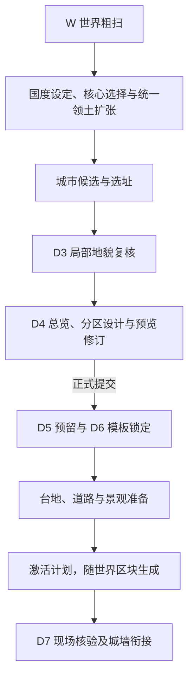

# 地貌驱动产品主线

本页只串联当前实现的职责。具体规则由各系统入口维护；下一轮设计讨论见[城市设计与完整落地](城市设计与完整落地/README.md)，尚未接管实现。

| 负责部分 | 职责与入口 |
| --- | --- |
| 地貌事实 | [GIS](../systems/gis/README.md) 提供采样、地貌和地图，支持不同尺度的规划。 |
| 国度与城市定位 | [国度规划](../systems/realm_planning/README.md) 负责国度设计、统一领土扩张和城市候选；粗尺度选址不替代 D3 局部复核。 |
| 单城设计与生成 | [City](../systems/city/README.md) 负责 D3—D7。D4 可编译、预览和修订，最终接受一份设计后进入后续生成；“正式提交一次”不表示只尝试一次布局。 |

AI 负责设计与决策，程序提供实际材料并落实设计。具体允许怎样修改、怎样适配地形以及怎样处理失败，分别以系统中的实现当前案为准。本页不另存一套限制。

“设计已提交”“等待世界生成”和“实际城市已生成”分别表达不同状态。当前模板、道路、景观和生成边界见 City 入口，字段和接口见所属系统契约。
