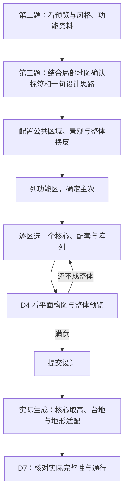

# 城市设计与完整落地

**设计中案总览 · 2026-10-05**。AI 根据地图和素材设计城市，程序把建筑、景观、桥路和台地作为一个整体落实。核心、台地与阶段分工已确认；尚未接管代码实现。

## 各部分在哪里

| 系统 | 要解决的事 |
| --- | --- |
| 国度规划 | [风格与功能选择](../../systems/realm_planning/10_product/案子/城市风格与功能选择/README.md)：第二题也能看风格和功能资料；第三题承接结果。 |
| Structure Studio | [风格素材与配套](../../tools/structure_studio/10_product/风格素材与配套.md)：特色／通用分类，以及桥、树木等配套结构。 |
| City · 设计 | [按功能区设计城市](../../systems/city/10_product/案子/具体流程的案子/30_D4蓝图编译/按功能区设计城市/README.md)：按主次查素材、选必需项与填充项、阵列看图。 |
| City · 外观 | [分项风格与换皮](../../systems/city/10_product/案子/具体流程的案子/00_跨阶段主线/城市分项风格与换皮/README.md)：房屋、植被、桥路分别选风格，整体统一、局部精修。 |
| City · 台地 | [主建筑与分层台地](../../systems/city/10_product/案子/具体流程的案子/60_LandUse与城市基面/主建筑与分层台地/README.md)：每区台地跟随核心落地高度，相邻小区组合出层次。 |
| City · 生成 | [城市设计完整落地](../../systems/city/10_product/案子/具体流程的案子/40_D5至D7边界与激活/城市设计完整落地/README.md)：地形适配保护设计，必需建筑不能被悄悄丢掉。 |

## 已确认的三点

- **一区一个核心**：每个实际参与阵列的功能区有一个核心；多个同类区相邻组合成大片区域，不强行并成一个大阵列。同类区可以选不同核心模型。
- **台地随核心取高**：实际生成时确定核心的落地地面高度，本区共享台地沿用该高度；不同区分别取高并衔接。
- **D4 设计，实际生成适配**：D4 保留地图、地形偏好与布局检查，不因少量水域或普通高差拒绝设计。后续处理台地、支撑和桥路，生成后核对完整性。

2026-10-05 用户确认：“嗯嗯，写进案子吧，问题也可以收了”。本轮三项讨论已关闭。现有实验题面和代码尚未切换到本案。
