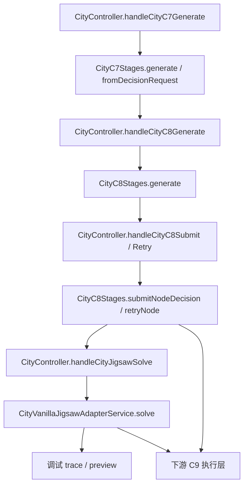

# 主模块建造代码导览

## 当前目标

本目录描述主模块建造系统在实现仓中的最新代码落点，帮助读者从系统文档快速跳到具体功能实现。

当前实现仓库固定为：

- `E:\mc_dev\StructureBinder-rebuild\StructureBinder`

## 主要入口类

| 类 | 职责 |
| --- | --- |
| `server/mcp/CityController.java` | 暴露 `city_c7_*`、`city_c8_*`、`city_jigsaw_solve`、`city_c9_*` 入口并做 group 级文件选择 |
| `world/city/stage/c7/CityC7Stages.java` | 生成工头计划、fallback 选择与 `foreman_plan` |
| `world/city/stage/c8/CityC8Stages.java` | 生成施工会话、提交校验、失败重试、area geometry 计算 |
| `world/city/stage/c8/CityVanillaJigsawAdapterService.java` | 基于 runtime jigsaw 与 catalog 执行单步 child 求解 |
| `world/city/stage/c8/CityJigsawSolverDebugTrace.java` | 落盘 `trace.json` 与调试步骤 |
| `world/city/stage/c8/CityJigsawSolverPreviewExporter.java` | 输出 jigsaw 求解预览图 |

## 推荐阅读顺序

1. `CityController` 中的 `handleCityC7Generate / handleCityC8Generate / handleCityC8Submit / handleCityC8Retry / handleCityJigsawSolve`
2. `CityC7Stages`
3. `CityC8Stages`
4. `CityVanillaJigsawAdapterService`
5. 如需继续看执行层，再跳到 `../c9_execution.md`

## 功能实现导航

- [C7 工头计划](./功能实现/C7工头计划.md)
- [C8 节点会话与提交](./功能实现/C8节点会话与提交.md)
- [C8 子节点 Jigsaw 求解](./功能实现/C8子节点Jigsaw求解.md)

## 当前主链

## 关联文档

- 系统概述：`../../../10_product/city/main_module/系统概述.md`
- 契约：`../../../20_contracts/city/main_module/配置表/`
- 测试入口：`../../../40_tests/city/main_module/测试入口.md`
- 影响面：`../../../40_tests/city/main_module/影响面.md`
