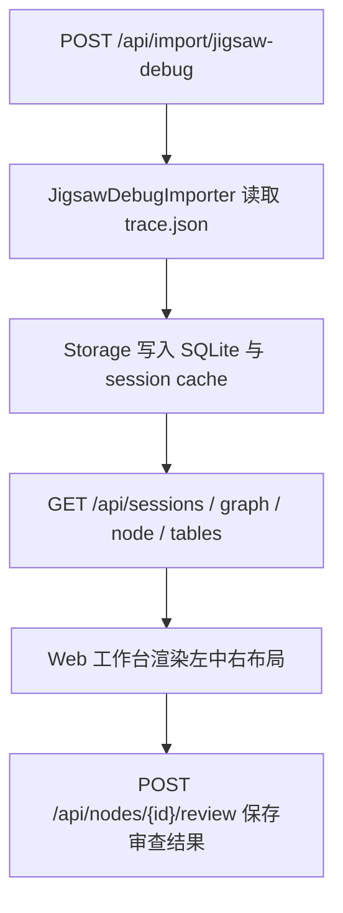

# 代码过程浏览可视工具代码导览

## 当前目标

本文件描述首版 Go + Web 实现建议的代码分层，便于后续从文档跳到实现。

当前实际工程落点固定为实现仓库顶层独立目录：

- `E:\mc_dev\StructureBinder-rebuild\StructureBinder\code_process_viewer`

## 推荐目录

| 路径 | 职责 |
| --- | --- |
| `go.mod` | 独立 Go 模块依赖声明 |
| `cmd/code_process_viewer/` | 程序入口 |
| `internal/importer/jigsawdebug/` | 读取 `jigsaw_solver_debug/<runId>` 并归一化为会话 Bundle |
| `internal/session/` | 会话模型、步骤状态归一化、源码映射、报告拼装 |
| `internal/storage/` | SQLite 存储、JSON 缓存导出 |
| `internal/httpapi/` | HTTP API、静态页面、预览图资源访问 |
| `web/` | 内嵌静态页面资源 |
| `runtime/` | `db/` `cache/` `tmp/` 运行期目录 |

## 推荐主链

## 为什么建议 Go 同时托管 API 和静态资源

1. 单机部署最简单。
2. 局域网访问时只暴露一个服务端口。
3. 后续挂域名时更容易放到统一反向代理后面。

## 当前实现建议

| 模块 | 建议 |
| --- | --- |
| 会话存储 | 首版固定用 SQLite |
| 图数据生成 | 导入器按 `debug_trace` 顺序统一产出节点与边 |
| 表格模型 | 后端统一整理 `evidence` 和 `legend` 为键值表 |
| 源码引用 | 节点详情中按 `step_key` 固定映射 |
| 审查标记 | Review 接口写库并持久化 |
| 导出能力 | 首版先支持 Markdown 报告 |

## 后续落地时优先实现顺序

1. Jigsaw 调试产物导入器
2. SQLite 存储与缓存导出
3. Graph / Node / Table 查询 API
4. 审查标记保存
5. Markdown 报告导出

## 关联文档

- 系统概述：`../../../10_product/devtools/code_process_viewer/系统概述.md`
- 功能设计：`../../../10_product/devtools/code_process_viewer/功能设计/过程审查工作台.md`
- 功能设计：`../../../10_product/devtools/code_process_viewer/功能设计/Jigsaw求解器回放.md`
- 数据契约：`../../../20_contracts/devtools/code_process_viewer/配置表/展示模型.md`
