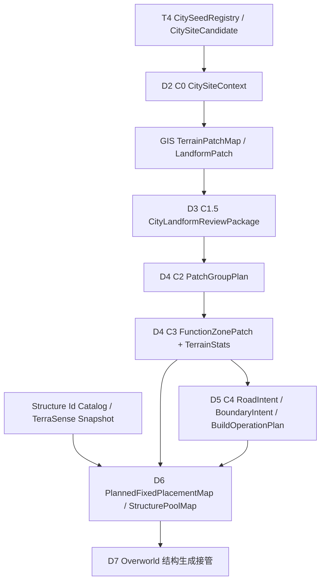

# City 系统 v0.1 开发计划：城市构造最小闭环与 TerraSense 结构画像接入

## Summary

City v0.1 的目标不是一次性生成完整城市，而是把 T4 城市种子进入 C 阶段后的最小可验证链路跑通：

```text
CitySeed / CitySiteCandidate
-> CitySiteContext
-> 局部 TerrainPatchMap / LandformPatch
-> CityLandformReviewPackage
-> PatchGroupPlan
-> FunctionZonePatch + FunctionZoneTerrainStats
-> RoadIntent / BoundaryIntent
-> BuildOperationPlan / WorldMutationReport
-> PlannedFixedPlacementMap / StructurePoolMap
-> D7 Overworld 结构生成接管
```

本轮以小村镇为目标，优先让产物可 review、可回放、可测试、可交给结构落地层消费。D5 首版允许通过 WorldEdit 后端真实落地道路、边界和缓冲区；D6 只做结构选择与固定落点规划：固定大小结构由程序给候选落点、AI 选 `landingCandidateId`，非固定结构才配置剩余可见面积占比；jigsaw / prefab 求解、`/place structure` 执行、住宅 / 市场 / 神庙等功能建筑最终生成属于 D7 之后的结构生成接管。

## 背景

当前 City 方案已明确：

- C1-C4 属于 City 主责：局部地貌事实、城市语法、功能区、道路和边界。
- D6 是 City 到结构落地的结构选择与固定落点输入，不替代 D7 的结构生成接管。
- D7 进入 Overworld 内选择性接管原版结构生成，优先完整放置 D6 固定结构，再按剩余面积比例生成非固定结构。
- TerraSense 是结构素材画像来源。结构功能标记可以逐步完善，但结构产物格式已经可以作为 D6 结构选择与固定落点规划的消费目标。

因此本开发计划把工作拆为两条并行线：

| 线 | 目标 |
| --- | --- |
| TerraSense 导出适配 | 把 `ScanWorkspace` 中的审核结果和硬事实冻结成 City / StructureBinder 可消费的结构画像快照。 |
| City v0.1 主链 | 从 T4 城市种子生成功能区、道路、结构池意图、anchor 和保留区。 |

## 本阶段真正要解的问题

```text
输入：
  - T4 CitySeed / CitySiteCandidate
  - RealmProfile / RealmTerritoryMap
  - GIS 局部 TerrainPatchMap / LandformPatch
  - TerraSense 导出的结构画像快照

输出：
  - CityPlanningPackage
  - CityLandformReviewPackage
  - FunctionZonePatch[] / FunctionZoneMap
  - RoadIntent / BoundaryIntent
  - BuildOperationPlan / WorldMutationReport
  - StructureChoicePlan / FixedPlacementSelectionPlan / PlannedFixedPlacementMap / StructurePoolMap
  - D7 structure placement request inputs

不做的事情：
  - 不重新决定国度边界
  - 不把 LandformPatch 直接当 FunctionZone
  - 不让 AI 输出最终结构坐标
  - 不在 D2-D6 放置真实功能建筑
  - 不在 City 层计算 jigsaw max_depth / radius / piece_budget
  - 不在 D6 调用 `/place structure`、解 jigsaw 或 paste template
  - 不把 TerraSense 的 pending / proposed 工作区内容当正式运行时 catalog

成功标准：
  - 一个 village / port 级城市能稳定产出 2-4 个功能区
  - 功能区能回溯 GIS patch evidence
  - 入口到核心区连通
  - 每个结构池候选能解释 function / style / placement / usage / hard facts 来源
  - 必需 anchor 有候选范围、保留区、优先级和失败策略
  - 产物包含 JSON、preview 图和质量报告
```

## 范围

本轮包含：

- 建立 TerraSense 导出快照到 City / StructureBinder 消费的适配口径。
- 补齐 City v0.1 主链所需契约对象。
- 实现 C0 城市局部范围锁定。
- 接入 GIS 局部地貌 patch 产物。
- 生成 C1.5 地理分块 review 图包。
- 实现 C2 AI patch group 草案与 C3 程序校验 / 实体化。
- 实现 C4 粗道路与边界意图。
- 实现 D6 结构选择与固定落点规划。
- 为 D7 Overworld 结构生成接管准备可消费的固定结构落点图和非固定结构池图。
- 建立 synthetic、契约测试、真实存档 smoke 和可视验收。

本轮不包含：

- 不开发完整城市编辑器。
- 不实现大城、多城区、城墙完整闭环。
- 不实现 C6 / C7 / C8 的完整结构落地求解。
- 不要求 TerraSense 完成所有结构的人工功能标记。
- 不在正式 catalog 中默认消费 `review_state != approved` 或 `vocabulary.status != approved` 的结构。
- 不把 AI 初标、路径关键词或 proposed 术语当最终真值。

## 数据流



## TerraSense 导出适配

TerraSense 内部工作区和正式消费快照必须分层。

| 层 | 产物 | 使用口径 |
| --- | --- | --- |
| 扫描工作区 | `scan_manifest.json`、`data.json`、`scan_config.json`、截图 | TerraSense 内部扫描和 Studio 审核使用。 |
| 审核工作区 | `vocabulary.json`、`ai_suggestion.json`、`review.json` | 允许 `pending`、`needs_review`、`proposed`，不直接作为正式运行时 catalog。 |
| 正式导出快照 | `C3_5_FunctionEnumTable.json`、`C3_5_StructureCatalog.preprocessed.json`、`StructureProfile.jsonl`、`StructureVocabulary.snapshot.json` | City / StructureBinder 消费，只默认包含 approved 结构和 approved 术语。 |

### 导出器输入

| 输入 | 说明 |
| --- | --- |
| `scan_manifest.json` | 结构索引、sample type、路径和状态。 |
| `vocabulary.json` | 动态术语表，导出时冻结为 snapshot。 |
| `structures/<id>/data.json` | 硬事实：尺寸、footprint、palette、jigsaw、connector、assembly 信息。 |
| `structures/<id>/review.json` | 人工审核真值。 |
| `structures/<id>/ai_suggestion.json` | 仅作为审核参考和 evidence，不作为正式真值。 |

### 导出器输出

| 输出 | 说明 |
| --- | --- |
| `C3_5_FunctionEnumTable.json` | 兼容当前 StructureBinder 的功能枚举，只包含 approved function term。 |
| `C3_5_StructureCatalog.preprocessed.json` | 当前兼容结构 catalog，保留 `function_candidates`、尺寸、placement、constraints、connectors、tag_source。 |
| `StructureProfile.jsonl` | 下一代结构画像，一行一个结构，保留 function / style / placement / usage / quality 权重或 affinity。 |
| `StructureVocabulary.snapshot.json` | 本次导出冻结词表，记录 term、status、version 和导出时间。 |
| `export_report.json` | 导出统计、跳过原因、proposed 术语、未审核结构和 warning。 |

### 导出规则

| 规则 | 说明 |
| --- | --- |
| approved gate | 正式导出默认只包含 `review_state=approved` 的结构。 |
| vocabulary gate | 正式导出默认只包含 `status=approved` 的术语。 |
| debug mode | 可支持 `includeProposed=true` 调试导出，但必须写入 `catalog_mode=debug`，不得覆盖正式 catalog。 |
| hard facts | `size`、`footprint.origin_offset`、`jigsaw_points`、`connectors`、`placement_command` 不得由 AI 或人工标注覆盖。 |
| function mapping | `curation.function` 映射为兼容层 `function_candidates`，同时保留下一代 `function_affinity`。 |
| tag source | 写清 `tag_source.manual_review=true`、`tag_source.vocabulary_snapshot_id`、`tag_source.terrasense_export_version`。 |
| reject gate | `quality.reject` 或 `review_state=rejected` 不进入城市生成候选。 |

### City 消费方式

City / D6 不读取 TerraSense 工作区原始目录，只读取导出快照或结构 ID 目录。

`StructureProfileCatalog` / `StructureChoicePlan` / `StructurePoolMap` 可消费结构画像中的这些信息作为 AI 选择或校验参考：

| 字段来源 | 用途 |
| --- | --- |
| `function_affinity` / `function_candidates` | 匹配功能区类型和主要建筑角色。 |
| `style_affinity` | 匹配 `RealmProfile` 和 `CityGrammarPlan` 风格。 |
| `placement_affinity` | 匹配水岸、路边、广场边、坡地、贴地等位置意图。 |
| `usage_affinity` | 区分主建筑、次级建筑、装饰、地标、jigsaw assembly。 |
| `template_role` | 区分 start、child、connector、system_root 等模板职责。 |
| `quality_tags` | 过滤 reject / needs_fix，优先 excellent / usable。 |
| `hard_facts.size` / `footprint` | 区分 `fixed_footprint` 与 `variable_area`，过滤明显超出功能区的固定结构。 |
| `jigsaw_points` / `connectors` | 给 D7+ 保留 runtime jigsaw 真值；D6 不解析这些字段。 |

## 开发分期

### D0：文档和契约闸门

目标：进入实现前补齐 City v0.1 和 TerraSense 导出适配的契约。

产物：

- 更新 City `20_contracts/数据契约/城市规划数据契约.md`。
- 更新 City `20_contracts/数据契约/结构落地交接契约.md`。
- 必要时新增 TerraSense 导出适配契约或更新 `StructureCurationExport.md`。

需要补齐的对象：

| 对象 | 归属 | 说明 |
| --- | --- | --- |
| `CitySiteContext` | City C0 | 城市局部范围、grid、裁剪口径和 T4 seed 引用。 |
| `CityLandformReviewPackage` | City C1.5 | 给 AI / 人类 review 的地理分块图包。 |
| `PatchGroupPlan` | City C2 | AI 输出的 GIS patch 分组和功能区草案。 |
| `FunctionZonePatch` | City C3 | City 自己的功能区 patch，不等同 GIS patch。 |
| `FunctionZoneTerrainStats` | City C3 | 功能区面积、形状、高度、坡度、水体、岸线统计。 |
| `RoadIntent` / `BoundaryIntent` | City C4 | 道路、边界、缓冲区和 access point。 |
| `BuildOperationPlan` / `WorldMutationReport` | City C4 | WorldEdit 执行计划和真实世界修改报告。 |
| `StructureChoicePlan` | City D6 | AI 提交并经程序校验的固定结构 / 非固定结构选择。 |
| `FixedPlacementSelectionPlan` | City D6 | AI 对程序固定落点候选的选择，只引用 `landingCandidateId`。 |
| `PlannedFixedPlacementMap` | City D6 | 经程序全局校验后的固定大小结构落点计划。 |
| `StructurePoolMap` | City D6 | 非固定结构在剩余可见面积中的生成菜单和比例预算。 |
| `AnchorPlan` | D7+ | 后续结构生成接管需要时再扩展的关键公共空间需求；首版固定大小结构落点已由 D6 承担。 |
| `ReservedAreaMap` | D7+ | 后续结构生成接管需要时再展开的道路、公共空间、边界保留区。 |
| `StructureProfile` | TerraSense 导出 | 下一代结构画像快照。 |

完成口径：

- 契约字段有类型、必填性、单位、版本和引用关系。
- 正式 catalog 和 debug catalog 的过滤规则写清。
- D6 与 D7 结构生成接管的边界写清。

### D1：TerraSense 导出适配器

目标：从 TerraSense 工作区生成正式结构画像快照。

实现建议：

- 在 TerraSense Studio 或独立脚本中新增 exporter。
- 输入 workspace 根目录，输出 `exports/`。
- 生成 `export_report.json`，记录进入 / 跳过 / warning。
- 支持 `official` 和 `debug` 两种 catalog mode。

完成口径：

- 有 approved 结构时能导出 `C3_5_StructureCatalog.preprocessed.json`。
- 没有 approved 结构时不静默成功，必须输出空 catalog 和可解释 warning。
- `proposed` 术语不会进入 official catalog。
- `jigsaw_assembly` 样本能保留 `placement_command` 和 `footprint.origin_offset`。

测试：

| 测试 | 预期 |
| --- | --- |
| approved 单体结构 | 进入 official catalog。 |
| pending 结构 | official 跳过，report 记录原因。 |
| proposed function | official 跳过或降级，debug 可显式包含。 |
| reject quality | 不进入城市生成候选。 |
| jigsaw assembly | 输出 `profile_type=jigsaw_system`、assembly footprint 和 command。 |

### D2：C0 城市局部上下文

目标：从 T4 `CitySeed` 和 `CitySiteCandidate` 锁定城市局部范围。

输入：

- `CitySeed`
- `CitySiteCandidate`
- `RealmProfile`
- `RealmTerritoryMap`

输出：

- `CitySiteContext`

完成口径：

- 支持 `hamlet` / `village` 首版范围。
- 范围裁剪到所属国度允许区域。
- `grid.cellStepBlocks` 根据规模和预算确定，不沿用 W 粗扫 step。
- 输出范围、锚点、入口候选和局部坐标转换。

测试：

- 边境城市不会把核心规划区裁出国度外。
- 港口 / 水岸城市允许保留上下文水体，但核心功能区仍在允许范围内。
- 同一 seed 多次运行范围稳定。

### D3：C1 / C1.5 局部地貌图包

目标：消费 GIS 局部 `TerrainPatchMap` / `LandformPatch`，生成可 review 的城市地理分块图包。

输入：

- `CitySiteContext`
- GIS 局部 patch 产物

输出：

- `CityLandformReviewPackage`
- `landform_review_map.png`
- patch 薄索引：`mapLabel`、GIS patch id、成员 cell、metrics、邻接

完成口径：

- 每个 GIS patch 有稳定 `mapLabel`，例如 `平原01`、`海岸02`。
- review 图基于 GIS patch 成员 cell 真实渲染 patch 填色、边界、编号、水体、城市锚点、网格和必要国度边界上下文。
- JSON 只复述 GIS metrics / tag / adjacency，不写功能暗示表。

测试：

- AI 输入包中不存在未注册 patch label。
- 低置信、fragment、edgeDirty patch 会进入 warning 或降级字段。
- 预览图和 JSON 坐标能够互相回查。

### D4：C2 / C3 功能区草案与实体化

目标：AI 按地理分块图设计 patch group，程序实体化为 City 功能区。

输入：

- `CityLandformReviewPackage`
- 外部 AI / Codex 生成并提交的 `PatchGroupPlan`
- D3 已落盘的 `city_landform_review_package.json`

输出：

- `PatchGroupPlan`
- `FunctionZonePatch[]`
- `FunctionZoneMap`
- `FunctionZoneTerrainStats`
- `function_zone_preview.png`

实现原则：

- AI 只能引用存在的 `mapLabel` 或 `landformPatchId`。
- 一个 GIS patch 可完整引用；需要拆分时只能声明 `splitRequested=true`。
- 程序负责引用校验、功能类型校验、面积校验和成员 cell 合并。
- 不因水体、坡度、悬崖等在 City 层直接否掉结构可能性。
- D4 首版优先使用 D3 中的 GIS patch `memberCells` 合并出功能区 mask，产物标记 `patch_member_cells_union`；只有 D3 缺少成员格子时才显式降级为 envelope。
- D4 不内置 LLM 调用；AI 生成发生在 MCP 调用方侧，运行时只接收 JSON、校验、实体化和导出报告。

失败返回：

| 失败 | 处理 |
| --- | --- |
| 引用不存在 patch | hard block，要求重跑 C2。 |
| 远距离拼接无理由 | warning 或 needs_review。 |
| 功能类型不在配置 | hard block，不自动映射到 `unknown`。 |
| `splitRequested` 过多 | warning，避免首版过度裁剪。 |

完成口径：

- 小村镇稳定生成 2-4 个功能区。
- 支持同类多实例，例如 `北居住区`、`水岸市场`。
- 每个功能区都有 `landformPatchRefs`、`cellShape` / `memberCells` 和 `FunctionZoneTerrainStats`。
- `city_plan_d4` 写出 `patch_group_plan.json`、`function_zone_map.json`、`function_zone_terrain_stats.json`、`function_zone_preview.png`、`quality_report.json`。

### D5：C4 道路、边界与缓冲区真实落地

目标：把功能区之间的关系转成道路、边界和缓冲区意图，生成 `BuildOperationPlan`，并通过 WorldEdit 后端真实执行基础世界编辑。

输入：

- `FunctionZoneMap`
- `FunctionZoneTerrainStats`
- `CityGrammarPlan`
- `CitySiteContext`

输出：

- `RoadIntent`
- `BoundaryIntent`
- `BuildOperationPlan`
- `BuildableAreaMap`
- `WorldMutationReport`
- `accessPoints[]`
- `city_planning_preview.png`
- `city_buildability_preview.png`

首版算法建议：

- 选择一个核心功能区作为中心节点。
- 从城市入口到核心区生成一条主路；当前实现使用 A* 网格代价场，避让非目标功能区、水岸和高坡度区域，失败时才降级为 L 型折线并写 warning。
- 主要功能区到核心区至少有一条可解释路径，次路可复用已生成道路的低代价网格。
- D4 功能区仍定义语义归属；D5 根据 `BuildOperationPlan` 栅格化道路、边界、缓冲区和小模板 reserved footprint，并输出 `BuildableAreaMap` 供 C5/结构落地扣除可建区域。
- `city_plan_d5` 只生成计划和预览，不修改世界。
- `city_execute_d5` 必须显式传 `confirmWorldMutation=true`，读取 D5 计划并通过 WorldEdit 修改世界。
- 边界处理按邻接关系和地貌上下文给出道路、水岸、绿化缓冲、软过渡或墙体提示。
- 真实落地只包含清植被、铺道路 / 缓冲区、替换地表和小型基础设施模板，不放置功能建筑。

完成口径：

- 入口到核心区连通。
- 主要功能区连通或有明确无法连通原因。
- 每个功能区能说明原始面积、reserved 面积和剩余可建面积，并用 `city_buildability_preview.png` 可视化。
- 水岸、道路、软过渡、栅栏、墙、台阶等边界意图和真实落地报告可被 C5 / C6 消费。

### D6：结构选择与固定落点规划

目标：程序根据 D3 地貌图包、D4 功能区、D5 道路 / 边界 / 可建区和 TerraSense 结构画像先过滤候选；MCP 调用方侧的 AI / Codex 再选择固定大小结构和非固定结构。固定大小结构不填占比，由程序生成预选落点，AI 只选择 `landingCandidateId`；非固定结构才填写目标可见面积占比。D6 只生成计划、校验结果和预览图，不放置结构。

输入：

- `CityLandformReviewPackage`
- `FunctionZoneMap`
- `FunctionZoneTerrainStats`
- `RoadIntent` / `BoundaryIntent`
- `BuildableAreaMap`
- `TerraSenseStructureProfileSource`
- 由 TerraSense export snapshot 归一得到的 `StructureProfileCatalog`
- 外部 AI / Codex 提交的 `StructureChoicePlan`
- 外部 AI / Codex 提交的 `FixedPlacementSelectionPlan`

输出：

- `FilteredStructureCatalog`
- `terrasense_profile_source.json`
- `structure_profile_catalog.json`
- `StructureChoicePlan`
- `FixedPlacementCandidateSet`
- `FixedPlacementSelectionPlan`
- `PlannedFixedPlacementMap`
- `StructurePoolMap`
- `structure_choice_preview.png`
- `fixed_placement_preview.png`

D6 hard boundary：

- 不调用 `/place structure`。
- 不解 jigsaw pool。
- 不 paste template。
- 不直接读取 TerraSense `ScanWorkspace.structures/*` 原始扫描目录，只读取导出快照或显式 debug catalog。
- 不让 AI 自由填写最终 block 坐标。
- 不让 AI 给固定大小结构填写面积占比。
- 不在 D6 判断非固定 jigsaw 一定能长满。
- 不填 jigsaw `max_depth`、`radius`、`piece_budget`。

完成口径：

- 每个功能区有过滤后的固定结构 / 非固定结构候选，或明确 hard block / needs_review。
- TerraSense 导入必须优先支持 `StructureProfile.jsonl`，兼容 `C3_5_StructureCatalog.preprocessed.json`，并记录 `catalogMode`。
- 正式模式不得消费 TerraSense `pending`、`needs_review`、`reject` 或 proposed 术语结构。
- 固定结构 footprint + clearance 肯定超出功能区时必须被过滤。
- 固定结构选择不含 `targetVisibleAreaRatio`；非固定结构选择必须含 `targetVisibleAreaRatio`。
- Java 校验 `zonePatchId`、`functionType`、`structureId`、`footprintMode`、`landingCandidateId`、`weight` 和目标占比。
- 输出 `filtered_structure_catalog.json`、`structure_choice_plan.json`、`fixed_placement_candidate_set.json`、`fixed_placement_selection_plan.json`、`planned_fixed_placement_map.json`、`structure_pool_map.json` 和 `quality_report.json`。
- D6 输出可被 D7 当作“固定结构完整放置计划 + 非固定结构候选菜单”消费，但不代表世界中已经生成。

### D7：Overworld 结构生成接管

目标：在 Overworld 内选择性接管城市影响范围的结构生成。普通区域仍走原版和其他 mod 的结构生成；命中城市结构范围时，City-aware backend 先按 D6 `PlannedFixedPlacementMap` 完整放置固定大小结构，再按 `StructurePoolMap` 对非固定结构触发原版 / Forge structure placement 尝试。

D7 负责：

- chunk 生成阶段命中城市范围。
- 优先处理 D6 选定的固定大小结构落点。
- 根据剩余可见面积预算选择非固定 structureId。
- 调用原版 / Forge structure placement 能力。
- 记录成功、失败、跳过和兼容策略。
- 后续再扩展更细约束场、失败 trace 和回退策略。

### D8：StructureLandingIntent 汇总

目标：把 C1-C5 产物索引成下游结构落地可消费的交接包。

输出：

- `StructureLandingIntent`
- `quality` / `warnings` / `hardBlocks`

完成口径：

- `planningPackageRef`、功能区图、道路图、边界图、anchor、保留区、pool intent 都可追踪。
- hard / soft 约束来源能回溯到 C1-C5 产物。
- 后续 Materialization 可直接读取交接包，不需要反查 AI 草案。

## 实现包建议

具体 package 可按实现仓库结构规范再细化，首版建议按边界分层：

```text
systems/city/
  application/
    CityPlanningService
    CitySiteContextBuilder
    CityLandformReviewBuilder
    PatchGroupPlanNormalizer
    FunctionZoneMaterializer
    RoadBoundaryIntentBuilder
    StructureChoicePlanner
    FixedPlacementPlanner
    AnchorPlanBuilder
    StructureLandingIntentAssembler
  domain/
    model/
    quality/
    geometry/
  infrastructure/
    gis/
    terrasense/
    preview/
    json/
```

TerraSense export adapter 可先放 TerraSense 仓库；StructureBinder 侧只实现导出快照读取器：

```text
systems/city/infrastructure/terrasense/
  TerraSenseCatalogReader
  StructureProfileIndex
  StructurePoolMatcher
```

## 自动测试计划

### 契约测试

| 用例 | 预期 |
| --- | --- |
| 缺少 schemaVersion | 阻断。 |
| 缺少 cityId / realmId / grid | 阻断。 |
| patch label 引用不存在 | 阻断。 |
| `StructureChoicePlan` 引用不存在 zone，或 `FixedPlacementSelectionPlan` 引用不存在 `landingCandidateId` | 阻断。 |
| `AnchorPlan` 必需 anchor 无 failurePolicy | 阻断。 |

### synthetic 场景

| 场景 | 验收重点 |
| --- | --- |
| 平坦内陆村 | 生成 civic / residential / farm 或 production，主路连通。 |
| 河岸村镇 | 水岸功能区从 review 图中选择 shore / water 相关 patch，harbor 或 crossing 可解释。 |
| 山麓矿城 | production 从 review 图中选择 slope / cliff / ridge 相关 patch，但 City 不提前否掉结构池。 |
| 边境高地 | defense / gate anchor 关联边境 planning context。 |
| 林地村落 | 林业或隐居功能区从 review 图中选择森林 / 资源相关 patch。 |

### TerraSense 导出测试

| 用例 | 预期 |
| --- | --- |
| approved function term | 进入 `C3_5_FunctionEnumTable.json`。 |
| proposed function term | official catalog 不包含，debug catalog 可包含且标记。 |
| approved structure | 进入结构 catalog 和 `StructureProfile.jsonl`。 |
| pending / rejected structure | official catalog 跳过并写 report。 |
| jigsaw assembly | 保留 command、origin offset、profile type 和 usage / template role。 |

### 真实存档 smoke

1. 运行 W / T，获得一个 village 或 port `CitySeed`。
2. 生成 `CitySiteContext`。
3. 导出局部 `TerrainPatchMap` 和 `CityLandformReviewPackage`。
4. 运行 AI `PatchGroupPlan`。
5. 生成 `FunctionZonePatch[]` 和 `FunctionZoneTerrainStats`。
6. 生成 C4 道路 / 边界 / 缓冲区意图，导出 BuildOperationPlan，并可通过 WorldEdit 执行。
7. AI / Codex 读取结构画像和 D3-D5 产物生成 `StructureChoicePlan`，再从程序候选中生成 `FixedPlacementSelectionPlan`。
8. 运行 D6 生成 `PlannedFixedPlacementMap`、`StructurePoolMap`、`structure_choice_preview.png` 和 `fixed_placement_preview.png`。
9. 导出综合 preview 和质量报告；真实结构生成留给 D7。

## 可视产物

每轮最小验收应包含：

| 文件 | 说明 |
| --- | --- |
| `landform_review_map.png` | GIS patch 分块图，供 C2 使用。 |
| `function_zone_preview.png` | 功能区图。 |
| `city_planning_preview.png` | 功能区 + 道路 + 边界综合图。 |
| `structure_choice_preview.png` | D6 固定结构 / 非固定结构选择和风险标记。 |
| `fixed_placement_preview.png` | D6 固定大小结构预选落点和 AI 选择结果。 |
| `quality_report.json` | hard block、warning、score 和引用追踪。 |

## 质量门

| 阶段 | hard block |
| --- | --- |
| D2 | 城市核心区越出所属国度允许范围。 |
| D3 | review 图和 patch 索引无法互相回查。 |
| D4 | AI 引用不存在 patch 或未知功能类型。 |
| D5 | 入口到核心功能区不连通且无失败说明；执行阶段缺少显式确认。 |
| D6 | `StructureChoicePlan` 引用不存在功能区、非法 structureId、固定结构填写占比、固定落点引用不存在，或声称已经生成结构。 |
| D7 | 结构生成接管在普通区域影响原版 / 其他 mod 结构生成、裁切固定大小结构，或缺少失败 / 跳过报告。 |
| D8 | `StructureLandingIntent` 缺少保留区、约束输入或预算输入。 |

## 人工介入点

以下节点必须给用户 review，不由实现自行决定：

| 节点 | 用户判断 |
| --- | --- |
| C1.5 review 图 | 地貌分块和 patch 编号是否可读。 |
| C2 功能区草案 | 城市功能区是否符合风格和地貌直觉。 |
| C4 综合规划图 | 道路和边界大形是否像城市，而不是随机连线。 |
| D6 结构选择与固定落点 | 固定结构落点是否合理且不越界，非固定结构比例是否符合功能区和国度风格。 |
| D7 生成接管策略 | 是否只在城市影响范围内接管结构生成。 |

## 推荐实施顺序

1. 补齐 D0 契约，冻结 City v0.1 对象名和版本。
2. 实现 TerraSense D1 导出适配器，至少能导出 debug catalog。
3. 在 StructureBinder 侧实现 TerraSense export reader 和结构画像索引。
4. 实现 D2 `CitySiteContext`。
5. 接入 GIS 局部 patch，完成 D3 review 图包。
6. 实现 D4 C2/C3 功能区实体化和校验。
7. 实现 D5 道路 / 边界 / 缓冲区计划和 WorldEdit 执行后端。
8. 实现 D6 结构选择与固定落点规划。
9. 实现 D7 Overworld 结构生成接管。
10. 后续再扩展 anchor、保留区、约束场和 trace。
11. 跑 synthetic + TerraSense export + 真实存档 smoke。

## 风险

- TerraSense 功能标记还未完整，正式 catalog 早期可能结构少；需要 debug catalog 支持开发，但不能污染正式运行时。
- AI PatchGroupPlan 如果缺少严格引用校验，容易引用不存在的 patch；D4 不要求 AI 回填 GIS tag / metric。
- 功能区和地貌 patch 的拆分 / 合并容易过度复杂，首版应限制 `splitRequested` 数量。
- C4 道路如果追求视觉效果过早，会拖慢主链；首版先保连通、可解释和真实可见。
- D6 如果把整套 `jigsaw_assembly` 当作固定大小单栋建筑，需要依赖 `footprintMode` 和尺寸画像先拦截；真正 jigsaw 解释留给 D7。

## 非目标提醒

City v0.1 的成功不是“城市已经能完整生成出来”，而是“城市规划层和结构生成接管层能稳定交接”。只要能从一个真实 T4 城市种子生成可解释的功能区、道路、D6 固定结构落点计划和非固定结构比例预算，本轮就算达成目标。
