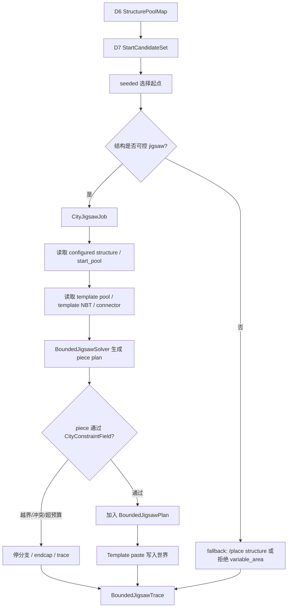

# City 系统 v0.2 开发计划：D7+ 受控 Jigsaw 物化

## Summary

City v0.1 已经完成 D6-D7 最小可玩闭环：D6 从 TerraSense 结构画像中选择结构并规划固定结构落点，D7 在 chunk 覆盖达标后通过 `/place structure` 等价入口真实放置 configured structure，并输出 `StartCandidateSet`、`PlacedStructureMap`、`StructureGenerationTrace` 和预览图。

v0.2 解决的是另一层问题：`variable_area` 的 jigsaw 结构不能只约束起点，还需要在 piece 展开过程中遵守城市功能区、道路、fixed footprint、hard reserved 和剩余面积预算。当前 `/place structure <外部结构>` 会把后续 piece 展开交给 Minecraft / mod 的黑盒结构生成器，D7 只能控制起点和加载范围，不能逐 piece 阻止越界。

因此 v0.2 的目标是新增 D7+ 受控 jigsaw 物化能力：

```text
外部 configured structure / jigsaw pool / template
  -> 识别是否支持受控展开
  -> 读取 start pool、template 和 jigsaw connector
  -> 用 D7 StartCandidateSet 作为起点
  -> 逐 piece 生成计划
  -> 每个 piece 放置前通过 CityConstraintField
  -> 合法则 paste template
  -> 越界停分支 / endcap / 少生成 / trace
```

本计划不推翻 v0.1。v0.1 的 `/place structure` 路径继续保留，用于固定结构、真实 smoke、不可控结构 fallback 和兼容性诊断；v0.2 只在 `variable_area` 且结构被判定为可控 jigsaw 时替换 D7 的真实放置流程。

## 核心决策

| 决策 | 说明 |
| --- | --- |
| 不全局 mixin 原版 jigsaw | 不拦截世界上所有 vanilla / mod 结构生成，避免影响城市外自然生成和其他 mod。 |
| 不为每个外部结构手写 `geomantia:*` wrapper | 面向整合包时，结构来源会持续来自 Trek、T&T、原版和其他 mod；不能把每个结构都改写成项目自有注册结构。 |
| 在 City D7+ 专用路径中替换 `/place structure` 黑盒流程 | D7 已经有结构池、起点、预算和 trace；受控 jigsaw 只接管城市结构落地任务，不影响其他区域。 |
| 外部 mod 提供素材，Geomantia 控制展开规则 | 读取外部 datapack jigsaw pool 和 template；不重写建筑外观，只重写展开和落地判定。 |
| 先支持标准 vanilla-like jigsaw | 优先支持 `minecraft:jigsaw` configured structure、标准 template pool、`single_pool_element` 和结构模板中的 jigsaw block。 |
| 不支持的结构必须显式标记 | 自定义 Structure 子类、自定义 pool element、无法读取 template 或 connector 的结构，不得声称受控。 |

## 范围

本轮包含：

- 新增 D7+ 受控 jigsaw 物化方案和阶段边界。
- 定义结构可控性识别口径。
- 定义 `CityJigsawJob`、`CityConstraintField`、`BoundedJigsawPlan`、`BoundedJigsawTrace` 等核心对象。
- 设计从外部 configured structure / jigsaw pool / template 到受控 piece plan 的读取流程。
- 设计 piece 级 validator、分支停止、endcap、预算停止和 trace 规则。
- 保留 v0.1 `/place structure` fallback 和真实验收路径。
- 规划自动测试、真实存档验收和兼容性边界。

本轮不包含：

- 不全局修改 Minecraft 原版结构生成器。
- 不改变城市外 vanilla / mod 结构自然生成。
- 不要求一次性支持所有 mod 自定义 Structure 子类。
- 不让 AI 选择 jigsaw piece、重试坐标、深度、半径或 piece budget。
- 不把 jigsaw pool ID 或 NBT template 路径当 D7 对外真实 `structureId`。
- 不把 `fixed_footprint` 裁切成可变结构。
- 不把生成后审计当作受控生成能力。

## 当前 v0.1 与 v0.2 的关系

| 能力 | v0.1 已有 | v0.2 增强 |
| --- | --- | --- |
| 固定结构放置 | D7 读取 D6 `PlannedFixedPlacementMap`，通过 `/place structure` 完整放置或失败。 | 保留；后续可选择 template paste 优化，但不进入受控 jigsaw 分支裁切。 |
| variable 起点 | 程序生成 `StartCandidateSet`，seeded random 选择起点。 | 继续复用，作为受控 jigsaw 的唯一合法起点来源。 |
| chunk-driven | chunk 未加载时等待并写 trace。 | 继续复用；受控 solver 只在所需 chunk 覆盖后执行真实 paste。 |
| jigsaw 展开 | 由外部 `/place structure` 黑盒处理，D7 只能管起点。 | 由 `BoundedJigsawMaterializer` 读取 pool / template 并逐 piece 过 validator。 |
| 边界控制 | 起点 footprint 和估算 required bounds。 | piece 级 allowed area、道路、fixed、runtime footprint、预算控制。 |
| trace | 记录结构尝试、等待、失败和已放置结构。 | 增加 piece / branch 级停止、endcap、unsupported 和预算停止原因。 |

## 主流程



## 结构可控性识别

D7+ 在处理 `StructurePoolMap.variableSelections[]` 时，先对 `structureId` 做能力分类。

| 分类 | 条件 | 处理 |
| --- | --- | --- |
| `bounded_jigsaw_supported` | registry 中是标准 `minecraft:jigsaw` 或可解析为 vanilla-like jigsaw；start pool、template pool、template NBT 和 jigsaw connector 可读取。 | 进入 `BoundedJigsawMaterializer`。 |
| `uncontrolled_delegate` | registry 可识别，但结构类型或内部生成逻辑不可解析。 | 允许按配置 fallback 到 v0.1 `/place structure`，但 trace 必须标记不受控。 |
| `fixed_footprint_only` | TerraSense 已给出可靠固定 footprint，但内部展开不适合 variable_area。 | 只能进入 D6 fixed candidate，不能作为 variable_area。 |
| `unsupported_pool_element` | pool 中存在首版不支持的 element / processor / projection 组合。 | 结构化失败或降级，不进入受控生成。 |
| `rejected_for_city_variable_area` | 无可靠 footprint、无法读取 pool、registry 缺失或被 TerraSense quality reject。 | D6 / D7 过滤或失败 trace。 |

识别结果需要写入 trace 和调试报告，不能把不可控结构伪装成受控结构。

## 核心对象

### CityJigsawJob

D7+ 对单个 variable_area 任务的运行时对象。

| 字段 | 说明 |
| --- | --- |
| `jobId` | 稳定任务 ID，来自 cityId、zonePatchId、selectionId、structureId 和 attemptIndex。 |
| `cityId` / `zonePatchId` | 城市和功能区引用。 |
| `sourceStructureId` | D6 选择的外部 configured structure ID。 |
| `startCandidateId` | 来自 `StartCandidateSet` 的起点候选 ID。 |
| `anchorBlock` / `rotation` | 程序选出的起点和朝向。 |
| `targetVisibleAreaBlocks` | 来自 `targetVisibleAreaRatio` 和剩余可见面积。 |
| `maxPieceCount` | 程序推导的安全上限，防止无限展开。 |
| `constraintFieldRef` | 当前城市约束场引用。 |
| `seedKey` | 可复现随机 key。 |

### CityConstraintField

把 City D4-D7 已知约束转成 piece validator 可查询的结构。

| 约束 | 来源 | 说明 |
| --- | --- | --- |
| `allowedArea` | FunctionZoneMap + BuildableAreaMap | 允许 variable piece 进入的功能区可建区域。 |
| `roadReservedArea` | RoadIntent / BuildOperationPlan / BuildableAreaMap | 道路和道路边缘 hard reserved。 |
| `boundaryReservedArea` | BoundaryIntent / BuildOperationPlan | 边界、缓冲区、水岸处理和软过渡保留。 |
| `fixedFootprints` | PlannedFixedPlacementMap / PlacedStructureMap | D6 固定结构 footprint / clearance 和已真实放置占用。 |
| `runtimeOccupiedArea` | PlacedStructureMap / ledger | 本轮或历史 D7 已放置结构占用。 |
| `waterPolicy` | FunctionZoneTerrainStats / profile tags | 按结构功能判断可贴水、可跨水或禁水。 |
| `terrainPolicy` | GIS / runtime terrain sample | 坡度、高差、地表和支撑条件。 |
| `visibleAreaBudget` | StructurePoolMap + remainingVisibleArea | 目标面积和最大可接受面积。 |

首版可以用 2D footprint 约束，后续再补 3D clearance、门口朝向和道路连接点。

### BoundedJigsawPlan

受控 solver 的输出计划，只有计划中通过 validator 的 piece 才允许写世界。

| 字段 | 说明 |
| --- | --- |
| `planId` | 稳定计划 ID。 |
| `jobId` | 来源 `CityJigsawJob`。 |
| `pieces[]` | 通过验证、准备 paste 的 piece 列表。 |
| `stoppedBranches[]` | 被拒绝、停止或 endcap 的分支。 |
| `estimatedFootprint` | 所有 accepted piece 的合并 footprint。 |
| `visibleAreaCost` | 已接受 piece 的面积成本。 |
| `requiredChunkRange` | 执行 paste 前必须加载的 chunk 范围。 |
| `quality` | 受控展开质量、停止比例和 warning。 |

`pieces[]` 至少包含：

| 字段 | 说明 |
| --- | --- |
| `pieceId` | 稳定 piece ID。 |
| `templateId` | template 资源 ID。 |
| `poolId` | 来源 template pool。 |
| `anchorBlock` / `rotation` | paste 位置和朝向。 |
| `footprint` | 该 piece 的世界 footprint。 |
| `connectorRefs` | 被消费和暴露的 connector。 |
| `validatorResult` | 放置前 validator 结果。 |

### BoundedJigsawTrace

记录每次受控 jigsaw 展开的可解释结果。

| 字段 | 说明 |
| --- | --- |
| `jobId` / `sourceStructureId` / `startCandidateId` | 来源追踪。 |
| `capability` | 结构可控性分类。 |
| `acceptedPieces[]` | 成功加入计划并写入世界的 piece。 |
| `rejectedPieces[]` | 因冲突、越界、预算、terrain 等被拒绝的 piece。 |
| `stoppedBranches[]` | 停止原因和是否使用 endcap。 |
| `fallbackUsed` | 是否降级到 `/place structure` 或跳过。 |
| `failureSummary` | 按 reasonCode 聚合。 |
| `metrics` | accepted piece 数、停止分支数、面积消耗、越界阻止次数。 |

## Piece 级规则

| 情况 | 处理 |
| --- | --- |
| piece footprint 完全在 `allowedArea` 内，且不冲突 | 接受，加入 `BoundedJigsawPlan`。 |
| piece 会压道路、hard reserved、fixed footprint 或 runtime occupied | 拒绝该候选 piece，记录 `JIGSAW_PIECE_RESERVED_CONFLICT`。 |
| piece 越出目标功能区 | 停止该分支，记录 `JIGSAW_BRANCH_OUT_OF_ALLOWED_AREA`。 |
| piece 会导致面积超过目标预算 | 停止继续扩展，记录 `JIGSAW_AREA_BUDGET_REACHED`。 |
| pool / connector 有 terminal 或 endcap | 尝试放置 endcap；endcap 也必须过 validator。 |
| 没有 terminal / endcap | 分支少生成，记录 `JIGSAW_BRANCH_TRUNCATED_NO_ENDCAP`。 |
| 结构整体 accepted piece 为空 | 本次任务失败或 fallback，记录 `JIGSAW_NO_ACCEPTED_PIECE`。 |

固定结构不适用这些分支停止规则。`fixed_footprint` 仍然只能完整放置或失败。

## 实现分期

### P0：文档与契约冻结

目标：在实现前冻结 v0.2 对象名、状态枚举和测试口径。

产物：

- 本开发计划。
- 更新 `城市规划数据契约.md`：补充 `CityJigsawJob`、`CityConstraintField`、`BoundedJigsawPlan`、`BoundedJigsawTrace` 字段。
- 更新 `测试入口.md`：补充受控 jigsaw 自动测试和真实验收。
- 必要时新增 `结构落地交接契约.md` 的 D7+ 小节。

完成口径：

- v0.1 `/place structure` 与 v0.2 受控 jigsaw 的职责边界写清。
- 不支持结构的 fallback / reject 行为写清。
- reasonCode 枚举能覆盖 unsupported、越界、冲突、预算和 endcap。

### P1：Jigsaw 结构可控性探测

目标：从 MC registry / datapack 中识别一个 `structureId` 是否能被受控展开。

实现要点：

- 读取 configured structure registry，确认 `structureId` 存在。
- 判断结构类型是否 vanilla-like jigsaw。
- 提取 start pool、size、max distance、heightmap / start height、terrain adaptation 等字段。
- 读取 template pool 和 fallback。
- 标记 unsupported element / processor / projection。

完成口径：

- `minecraft:village_plains` 或一个已知标准 jigsaw fixture 能被识别为可控或给出明确 unsupported 原因。
- Trek / T&T 中标准 pool 结构能给出分类结果。
- registry 缺失、pool 缺失、template 缺失分别有结构化 reason。

### P2：Template 与 connector 读取

目标：读取 pool 中的 template，得到 piece 尺寸、footprint 和 jigsaw connector。

实现要点：

- 通过 `StructureTemplateManager` 读取 `.nbt` template。
- 扫描 template 中的 jigsaw block，抽取 connector 名称、target、pool、final_state、朝向和局部坐标。
- 计算 template 在不同 rotation 下的 2D footprint。
- 记录 processors 和 projection 风险。

完成口径：

- 单个 template 可导出 footprint 和 connector 列表。
- rotation 后 footprint 可复现。
- 缺少 connector 的 template 可作为 terminal piece 处理或标记。

### P3：CityConstraintField

目标：把 D4-D7 产物转换成 piece validator 查询结构。

实现要点：

- 从 `FunctionZoneMap` / `BuildableAreaMap` 构造 allowed area。
- 从 `RoadIntent` / `BoundaryIntent` / `BuildOperationPlan` 构造 hard reserved。
- 从 `PlannedFixedPlacementMap` / `PlacedStructureMap` 构造 occupied area。
- 从 `StructurePoolMap` 推导 target / max visible area。
- 提供 `validatePiece(pieceFootprint)` 和 `validatePlan(planFootprint)`。

完成口径：

- 单元测试能证明道路、fixed footprint、功能区外、预算超限分别被拒绝。
- 同一输入下 validator 结果稳定。

### P4：BoundedJigsawSolver 最小闭环

目标：对一个标准 start pool 生成受控 piece plan。

实现要点：

- 从 start pool 按 seeded random 选择 start element。
- 根据 jigsaw connector 匹配下一个 pool element。
- 每个候选 piece 在加入计划前先算 footprint 并调用 `CityConstraintField`。
- 维护 open connectors、已占用 footprint、piece count、面积预算和 depth 上限。
- 对越界 / 冲突 / 预算达到的分支执行停止或 endcap。
- 输出 `BoundedJigsawPlan` 和 `BoundedJigsawTrace`。

完成口径：

- 给定固定 seed，同一输入生成相同 piece plan。
- 人工构造的越界分支会停止，不会写入计划。
- 有 endcap 时尝试收尾；无 endcap 时少生成并 trace。

当前首个实现切片先完成 start pool / start piece 级受控物化：D7+ 读取 configured structure 的 start pool，选择候选 element，计算该 piece footprint，通过 `CityConstraintField` 后才写世界，并把 accepted / rejected piece 写入 `BoundedJigsawTrace`。完整 connector 多分支展开、terminal / endcap 收尾和 branch budget 仍属于 P4 后续扩展，不得在验收中当作已完成能力。

### P5：Template paste 后端

目标：执行 `BoundedJigsawPlan`，把 accepted pieces 逐个写入世界。

实现要点：

- 真实执行前检查 `requiredChunkRange` 已加载。
- 逐 piece paste template，保持 rotation、mirror、processor 基本行为。
- 记录每个 piece 的 worldMutationApplied。
- 写入 ledger，避免重复执行。
- paste 失败时保持结构化 trace。

完成口径：

- dry-run 只写计划和预览，不修改世界。
- true-run 只写 accepted pieces。
- 再次执行不会重复 paste 已落地 piece。

### P6：D7 集成与 fallback

目标：把受控 jigsaw 接入现有 `city_execute_d7`。

规则：

- `fixed_footprint` 默认继续走 v0.1 固定结构放置路径。
- `variable_area` 先做能力探测。
- `bounded_jigsaw_supported` 进入受控 materializer。
- `uncontrolled_delegate` 由配置决定 fallback `/place structure`、只 dry-run warning 或拒绝。
- `unsupported_pool_element` 和 `rejected_for_city_variable_area` 写结构化失败。

完成口径：

- D7 trace 能同时包含 v0.1 fixed placement 和 v0.2 bounded jigsaw attempts。
- unsupported 不静默，不伪装成功。
- 当前 D6-D7 最小闭环测试不被破坏。

## 自动测试计划

| 测试 | 目标 |
| --- | --- |
| capability 分类测试 | registry 缺失、非 jigsaw、pool 缺失、template 缺失、unsupported element 都有结构化 reason。 |
| connector 读取测试 | template 中 jigsaw block 能被解析为 connector，rotation 后坐标稳定。 |
| piece validator 测试 | 功能区外、道路保留区、fixed footprint、runtime occupied 和预算超限都会拒绝。 |
| seeded solver 测试 | 同一 seed 和输入生成相同 `BoundedJigsawPlan`。 |
| branch stop 测试 | 越出 allowed area 的分支停止，trace 写 `JIGSAW_BRANCH_OUT_OF_ALLOWED_AREA`。 |
| endcap 测试 | 有 terminal / endcap 时尝试收尾；无 endcap 时少生成并 trace。 |
| fixed 完整性回归 | fixed_footprint 不进入分支裁切逻辑，仍完整放置或失败。 |
| D7 fallback 测试 | unsupported variable_area 不被当成受控成功。 |
| ledger 回归 | true-run 已 paste 的 pieces 再次执行不会重复写世界。 |

## 真实游玩验收

最小真实验收不要求一次支持所有外部结构。首轮建议选一个可控 fixture 或一个标准 vanilla-like jigsaw pool：

1. 使用 D6 输出一个 `variable_area` 结构，且能力探测为 `bounded_jigsaw_supported`。
2. D7 dry-run 输出 `CityJigsawJob`、`CityConstraintField` 摘要、`BoundedJigsawPlan`、`BoundedJigsawTrace` 和预览图。
3. 人为设置一个 allowed area 边界，让至少一个候选分支会越界。
4. true-run 后，世界中只出现 accepted pieces，越界分支不落地。
5. trace 中能看到 accepted piece、stopped branch、面积消耗、endcap / truncated 结果。
6. 固定结构仍按 v0.1 规则完整放置或失败。

## 风险与边界

| 风险 | 处理 |
| --- | --- |
| Forge / Mojang 内部 jigsaw API 版本耦合 | 首版尽量读取数据驱动 JSON / template NBT 和公开 registry；需要内部类时集中封装在 infrastructure。 |
| mod 自定义 Structure 子类不可解析 | 明确 `uncontrolled_delegate` 或 reject，不把它纳入受控 variable_area。 |
| processors / terrain adaptation 行为复杂 | 首版支持最小 processor 集；复杂 processor 标记 unsupported 或 warning。 |
| piece footprint 与真实 paste 后影响不一致 | 首版使用 TerraSense / template footprint；后续补 post-paste audit 校准。 |
| solver 变成完整重写 Minecraft jigsaw | 只实现 City 必需子集：标准 pool、single element、connector、validator、trace。 |
| 性能问题 | 限制 max piece count、open connector 数、candidate pool top-K 和 chunk 覆盖范围。 |

## 非目标提醒

v0.2 的成功标准不是“完全复刻原版村庄生成器”，而是“在城市 D7+ 路径中，对标准 jigsaw 素材实现可解释、可回放、可停止的 piece 级物化”。整合包结构仍然来自外部 mod；Geomantia 只负责城市允许范围内的展开规则、冲突控制、预算控制和 trace。
