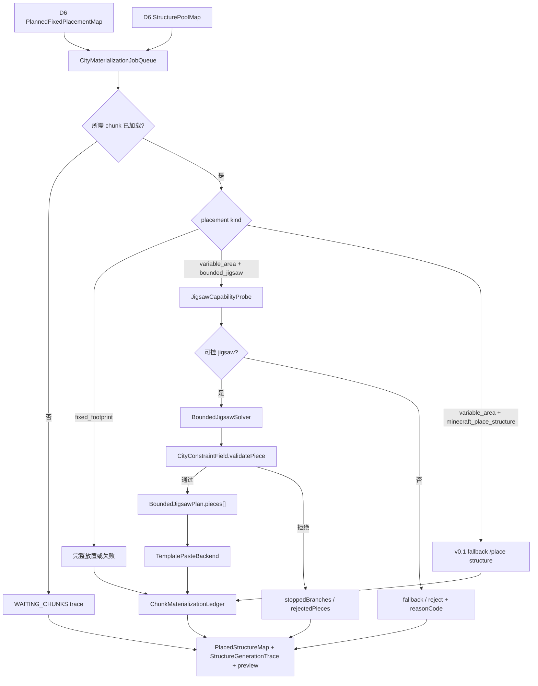

# City 系统 v0.3 开发计划：D7 计划驱动 Jigsaw 拓展

## Summary

City D6-D7 当前已经完成最小可玩闭环：D6 按 TerraSense 结构画像完成结构选择、固定结构落点规划和剩余结构比例预算；D7 在 chunk 覆盖达标后能够执行真实结构放置，固定结构完整落地，`variable_area` 至少能成功或给出结构化失败 / waiting trace。

v0.3 不是重做 D6-D7，也不是把每个外部结构改写成 `geomantia:*` 自有注册结构。v0.3 的目标是把 `variable_area` 从“只约束起点，然后委托 `/place structure` 黑盒展开”升级为“D7 按 CityPlanIndex 和 CityConstraintField 计划驱动展开 jigsaw piece，再按 chunk 生命周期真实写世界”。

核心方向：

```text
D6 StructurePoolMap
  -> D7 StartCandidateSet
  -> CityMaterializationJob
  -> 读取外部 configured structure / jigsaw pool / template
  -> BoundedJigsawSolver 逐 piece 生成计划
  -> CityConstraintField 校验道路、功能区、reserved、fixed、runtime occupied、面积预算
  -> chunk 加载达标后 paste accepted pieces
  -> ledger / trace / preview
```

本计划优先支持 vanilla-like jigsaw。Trek、Towns & Towers、原版或其他 mod 结构继续作为外部素材来源；Geomantia 只接管城市 D7 路径中的展开规则、冲突控制、预算控制和 trace，不全局替换 Minecraft / Forge 的自然结构生成器。

## 当前结论

| 议题 | 结论 |
| --- | --- |
| 是否继续只用 `/place structure` | 固定结构和不可控 fallback 可以保留；受控 `variable_area` 不能只靠 `/place structure`，因为它只能控制起点，不能控制后续 piece。 |
| 是否为每个外部结构注册一套 `geomantia:*` structure | 不作为主线。整合包结构来源会持续变化，不能要求每个第三方结构都手写 wrapper。 |
| 是否全局 mixin 原版 jigsaw / structure 生成器 | 不作为主线。全局拦截兼容性风险高，只适合作为后期城市保护区兜底。 |
| 是否直接拓展 jigsaw | 是，但只在 City D7 专用 materialization 路径中拓展。读取外部 jigsaw pool / template / connector，自己做 bounded solver 和 piece 级 validator。 |
| 是否仍然跟随 chunk 加载 | 是。D7 任务应等待玩家 TP、预加载 mod 或世界加载机制覆盖目标 chunk 后推进，不能为了城市一次性强行加载大范围世界。 |
| 是否要求变量结构完整生成 | 不要求。`variable_area` 可以少生成、停分支或 endcap，但必须 trace；`fixed_footprint` 仍必须完整放置或失败。 |

## 与 v0.2 的关系

`开发计划-v0.2-D7受控Jigsaw物化.md` 已经定义了 `CityJigsawJob`、`CityConstraintField`、`BoundedJigsawPlan`、`BoundedJigsawTrace` 等技术对象，并完成了 start pool / start piece 级受控物化切片。

v0.3 在 v0.2 之上补足工程路线：

- 把 D7 组织成计划驱动的 `CityMaterializationJob` / ledger / chunk scheduler。
- 明确外部 mod 结构的接入方式：能力探测、可控则 bounded jigsaw，不可控则 fallback / reject。
- 明确不为每个外部结构手写注册结构，不全局 mixin 原版 jigsaw。
- 明确测试和真实游玩验收应围绕 chunk-driven、piece 级约束、trace 和可重入执行。

## 非目标

- 不推翻 D6：D6 仍只做结构选择、固定结构落点规划和比例预算，不进世界。
- 不让 AI 选择坐标、重试、jigsaw 深度、半径、piece budget 或逐 piece 决策。
- 不把 jigsaw pool ID 或 NBT template 路径当作 D7 对外真实 `structureId`。
- 不要求首版支持所有第三方自定义 `Structure` 子类和自定义 pool element。
- 不把“生成后审计发现越界”当成受控生成能力。
- 不把后期城市保护区 mixin 当作主生成路线。

## 总体架构



## 核心对象增量

### CityMaterializationJob

D7 从固定结构计划和 variable 结构池派生出的可重入任务。它不是 AI 草案，而是程序执行计划。

| 字段 | 说明 |
| --- | --- |
| `jobId` | 稳定任务 ID，来自 cityId、zonePatchId、selectionId、structureId、placementKind。 |
| `cityId` / `zonePatchId` | 所属城市和功能区。 |
| `structureId` | D6 选择的 configured structure ID。 |
| `placementMode` | `fixed_footprint`、`minecraft_place_structure`、`bounded_jigsaw`。 |
| `sourcePlanRef` | 来源 `PlannedFixedPlacementMap` 或 `StructurePoolMap`。 |
| `anchorBlock` / `rotation` | 固定结构来自 D6 候选；变量结构来自 D7 `StartCandidateSet`。 |
| `requiredChunkRange` | 执行前必须加载的 chunk 范围。 |
| `status` | `pending`、`waiting_chunks`、`planned`、`applied`、`failed`、`skipped`。 |
| `retryBudget` | 程序推导的重试上限；AI 不填写。 |

### ChunkMaterializationLedger

D7 的真实写世界账本。只有真实执行成功的记录才能进入 ledger；dry-run 产物不能用来跳过真实执行。

| 字段 | 说明 |
| --- | --- |
| `ledgerId` | 城市级或 run 级账本 ID。 |
| `appliedJobs[]` | 已真实写入世界的 job。 |
| `appliedPieces[]` | bounded jigsaw accepted piece 的真实落地记录。 |
| `worldMutationApplied` | 是否真实写方块。 |
| `idempotencyKey` | 防止多次调用 D7 重复放置。 |
| `appliedAtChunkTick` | 可选，记录执行时 chunk 加载上下文。 |

### JigsawCapabilityReport

外部结构进入 bounded jigsaw 前的能力探测结果。

| 分类 | 处理 |
| --- | --- |
| `bounded_jigsaw_supported` | registry、start pool、template pool、template NBT、connector 可读取，进入 solver。 |
| `uncontrolled_delegate` | registry 存在但内部生成逻辑不可控，可按配置 fallback 或拒绝。 |
| `unsupported_structure_type` | 非 vanilla-like jigsaw，结构化失败。 |
| `unsupported_pool_element` | pool element / processor / projection 超出首版支持范围，结构化失败或降级。 |
| `template_missing` | template NBT 无法读取，结构化失败。 |

## 分期计划

### P0：计划冻结与边界同步

目标：冻结本计划和 v0.2 的分工，避免实现中把 wrapper、global mixin、`/place` fallback 和 bounded jigsaw 混成一条线。

产物：

- 本开发计划。
- README / function_map 增加入口。
- 后续实现前再按实际字段更新 `城市规划数据契约.md` 和 `测试入口.md`。

完成口径：

- 新计划明确“不为每个外部结构注册 wrapper、不全局 mixin、D7 专用受控 jigsaw”。
- chunk-driven materialization 和 ledger 作为后续工程主线。

### P1：CityMaterializationJob 与 ledger

目标：把 D7 执行从“一次调用里直接尝试所有结构”整理成可重入任务队列。

实现要点：

- 从 `PlannedFixedPlacementMap` 生成 fixed job。
- 从 `StructurePoolMap` + `StartCandidateSet` 生成 variable job。
- 每个 job 推导 `requiredChunkRange`，chunk 未加载时只写 waiting trace。
- 真实成功后写 `ChunkMaterializationLedger`，再次执行不重复写世界。
- dry-run 只输出 job / plan / preview，不写 ledger。

完成口径：

- fixed job、variable job 都能被 trace 索引。
- 同一输入重复执行稳定。
- chunk 未加载只 waiting，不算失败。
- 已 applied job 不重复执行。

### P2：Jigsaw 能力探测

目标：判断外部 configured structure 是否可被 bounded jigsaw 接管。

实现要点：

- 读取 MC configured structure registry，确认 `structureId` 存在。
- 判断是否 vanilla-like jigsaw。
- 读取 start pool、size、start height、terrain adaptation 等基本信息。
- 读取 template pool、fallback pool 和 element 列表。
- 将未知 structure type、缺 pool、缺 template、自定义 element 分别写 reasonCode。

完成口径：

- 原版标准 jigsaw fixture 能给出 `bounded_jigsaw_supported` 或明确 unsupported 原因。
- Trek / T&T / 其他 mod 的结构至少能被分类，不静默失败。
- 不把 jigsaw pool ID 或 template 路径当外部真实 `structureId`。

### P3：Template / connector / footprint 读取完善

目标：把可控 pool 中的 template 转成 solver 可消费的 piece 元数据。

实现要点：

- 读取 `StructureTemplateManager` 中的 `.nbt` template。
- 解析 jigsaw block 的 name、target、pool、final_state、朝向和局部坐标。
- 计算 template 在不同 rotation 下的 2D footprint。
- 标记 processor / projection 风险。
- 产出可复现 `PiecePrototype`。

完成口径：

- connector 读取结果稳定。
- rotation 后 footprint 稳定。
- 无 connector 的 template 可作为 terminal piece 或 unsupported，并写 trace。

### P4：CityConstraintField validator

目标：把 D4-D7 约束压缩成 piece 级硬校验。

实现要点：

- 从 `FunctionZoneMap` / `BuildableAreaMap` 构造 allowed / buildable cell。
- 从 D5 reserved cell 表达道路、边界、缓冲区和模板保留。
- 从 `PlannedFixedPlacementMap` / `PlacedStructureMap` 构造 fixed / runtime occupied footprint。
- 从 `StructurePoolMap` 推导 target visible area budget。
- 首版先做 2D footprint、reserved、occupied、budget；后续再补水体、坡度、道路接入和 3D clearance。

完成口径：

- 单元测试证明道路 / reserved、fixed footprint、功能区外、runtime occupied、预算超限分别被拒绝。
- validator reasonCode 稳定、结构化。

### P5：BoundedJigsawSolver 多 piece 最小闭环

目标：从 start pool 开始，按 connector 展开 accepted piece plan。

实现要点：

- seeded random 选择 start element。
- 根据 connector target 匹配下一个 pool element。
- 每个候选 piece 加入计划前计算 footprint 并调用 `CityConstraintField`。
- 维护 open connectors、piece count、depth、面积预算和 occupied footprint。
- 越界、冲突或预算达到时停分支。
- 有 terminal / endcap 时尝试收尾；endcap 也必须过 validator。

完成口径：

- 同一 seed 和输入输出相同 `BoundedJigsawPlan`。
- 人工构造越界分支不会进入 plan。
- branch stop / endcap / truncated 都写入 `BoundedJigsawTrace`。
- accepted piece 为空时结构化失败，不伪装成功。

### P6：Template paste 后端

目标：只把 `BoundedJigsawPlan.pieces[]` 中 accepted piece 写入世界。

实现要点：

- 执行前检查 `requiredChunkRange` 已加载。
- 按 rotation、mirror、template placement settings 写方块。
- 写入 ledger，形成 idempotency key。
- 失败时记录 `BOUNDED_JIGSAW_PIECE_PLACE_FAILED`。
- 首版不追求完整复刻原版 processor；超出支持范围先 warning / unsupported。

完成口径：

- dry-run 不修改世界。
- true-run 只 paste accepted piece。
- 再次执行不会重复 paste 已 applied piece。

### P7：D7 集成与 fallback 策略

目标：把 bounded jigsaw 接回 `city_execute_d7`。

规则：

- `fixed_footprint` 继续走完整放置或失败，不进入 branch stop / 裁切。
- `variable_area` 且 `materializationMode=bounded_jigsaw` 时先能力探测。
- `bounded_jigsaw_supported` 进入 solver + paste。
- `uncontrolled_delegate` 可按配置走 `/place structure` fallback、dry-run warning 或 hard reject。
- `unsupported_*` 必须结构化失败，不静默跳过。

完成口径：

- D7 trace 同时能表达 fixed、bounded variable、fallback variable。
- D6-D7 v0.1 最小闭环不被破坏。
- bounded 失败不会污染真实 ledger。

### P8：测试与真实游玩验收

目标：证明新能力不是只在数据上好看，而是真实世界里可控、可重入、可解释。

自动测试：

| 测试 | 通过口径 |
| --- | --- |
| job / ledger 测试 | dry-run 不写 ledger，true-run 成功后重复执行不重复落地。 |
| chunk waiting 测试 | required chunk 未加载时 waiting，不进入 failureSummary。 |
| capability 测试 | registry 缺失、pool 缺失、template 缺失、unsupported element reasonCode 可区分。 |
| connector 测试 | template jigsaw block 能解析为 connector，rotation 后稳定。 |
| validator 测试 | 道路 reserved、fixed、occupied、功能区外、预算超限都会拒绝。 |
| solver seeded 测试 | 同一 seed 生成同一 plan。 |
| branch stop 测试 | 越界分支停止，不写入 accepted piece。 |
| fixed 回归 | fixed_footprint 不进入裁切 / endcap 逻辑。 |

真实游玩验收：

1. 使用原版或尽量少依赖的测试存档，避免 RTF / 大型整合包地形差异干扰首轮定位。
2. 选一个 D6 已选择的 fixed_footprint，确认 chunk 覆盖后完整落地。
3. 选一个 vanilla-like `variable_area` jigsaw 结构进入 bounded 模式。
4. 人为让 allowed area 边界能挡住至少一个分支。
5. true-run 后世界里只出现 accepted pieces；被拒绝分支不落地。
6. `StructureGenerationTrace` 能看到 capability、acceptedPieces、rejectedPieces、stoppedBranches、failureSummary、ledger 结果。

## 兼容性策略

| 场景 | 策略 |
| --- | --- |
| 原版 / vanilla-like jigsaw | 优先 bounded jigsaw。 |
| 第三方结构使用标准 jigsaw pool / template | 尝试 bounded jigsaw；遇到 unsupported element 时结构化失败或配置 fallback。 |
| 第三方自定义 Structure 子类 | 首版不强接管，标记 `uncontrolled_delegate` 或 `unsupported_structure_type`。 |
| 城市外自然结构生成 | 不受 D7 bounded jigsaw 影响。 |
| 其他结构侵入城市核心区 | 后期可做 city protection mixin，只负责阻止 / 降低概率，不负责生成城市建筑。 |
| 大型地形 / 预加载 mod | D7 跟随 chunk loaded 事实推进，不主动替代预加载 mod。 |

## 风险

| 风险 | 处理 |
| --- | --- |
| 过早全局 mixin 导致兼容性问题 | 主线保持 D7 专用路径；mixin 只作为后期保护层。 |
| 外部 mod pool element 形态复杂 | 能力探测先分类，unsupported 不伪装可控。 |
| template footprint 与真实 paste 有差异 | 首版用 footprint + post trace 校准，后续引入 TerraSense 回扫。 |
| chunk 生命周期与 HTTP 调用不同步 | job / ledger / waiting trace 可重入，允许玩家 TP 或预加载后再次执行。 |
| processor / terrain adaptation 难复刻 | 首版只支持必要子集，复杂行为先 warning / reject。 |

## 下一步建议

下一轮实现优先级：

1. 先补 P1：`CityMaterializationJob` / ledger，把 D7 的可重入执行底座坐稳。
2. 再补 P4：抽出独立 `CityConstraintField` validator，让 `/place` fallback 和 bounded solver 都能共享同一套 hard rule。
3. 接着做 P5：connector 多 piece solver 和 branch stop。
4. 最后接 P6：accepted piece template paste 与真实游玩验收。

这条顺序能最大化复用当前已成功的 D6-D7 闭环：先让任务生命周期、等待和账本稳定，再逐步把 `variable_area` 从黑盒 `/place structure` 替换成受控 jigsaw piece 物化。
