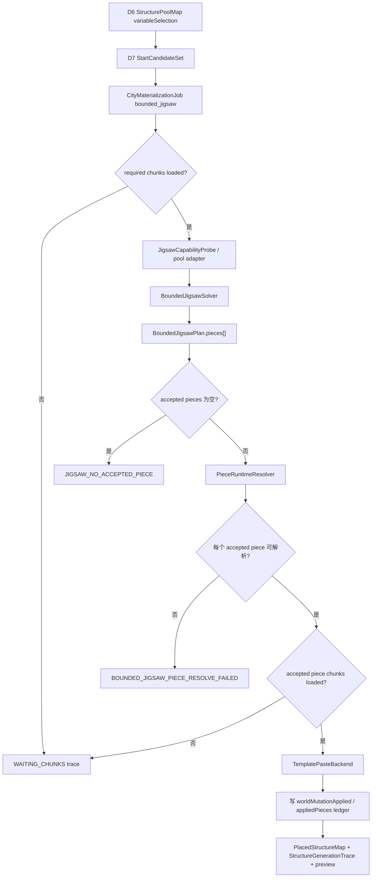

# City 系统 v0.4 开发计划：D7 受控 Jigsaw 真实粘贴与验收

## Summary

City v0.3 已经把 D7+ 的方向收束为“计划驱动 jigsaw 拓展”：D7 不全局 mixin 原版 jigsaw，不为每个外部结构手写 `geomantia:*` wrapper，而是在 City 专用物化路径里读取外部 configured structure / pool / template，先用 `CityConstraintField` 和 `BoundedJigsawSolver` 生成可解释的 accepted piece plan，再跟随 chunk 生命周期写世界。

当前实现切片已经具备：

- `CityMaterializationJob` / `ChunkMaterializationLedger` 的 trace 与可重入口径。
- `CityConstraintField` 的 piece 级 hard rule。
- `BoundedJigsawTemplateInspector` 对真实 MC template / connector 的读取。
- `BoundedJigsawPoolAdapter` 对 start pool 与 child pool 的归一和发现。
- `BoundedJigsawConnectorAligner` 对 child pool prototype 的首版 connector 对齐。
- `BoundedJigsawSolver` 在已解析候选输入下生成多 piece plan、rejected piece 和 stopped branch。

本计划建立时的核心缺口是：真实执行时，bounded jigsaw 后端仍是过渡模式 `start_piece_adapter`，只把 start piece 交给 MC element 放置；即使 plan / trace 中已经发现并接受 child piece，也不会真实 paste，也不会把 child piece 写入真实 ledger。当前实现切片已接入 `accepted_piece_template_paste`，剩余工作集中在 terrain adaptation / projection 高度细节、完整 endcap、partial mutation 复跑策略和真实游玩验收。

v0.4 的目标就是补上这一步：D7 只把 `BoundedJigsawPlan.pieces[]` / `acceptedPieces[]` 中通过 validator 的 pieces 真实写入世界，并把 chunk 等待、失败原因、piece ledger、复跑幂等和实机验收一起闭合。

## 核心决策

| 决策 | 说明 |
| --- | --- |
| 拦截的是 City D7 真实落地路径，不是全局原版生成器 | v0.4 只替换 `materializationMode=bounded_jigsaw` 的 City 任务后端，不影响城市外自然结构生成。 |
| D6 对外 `structureId` 仍必须是 configured structure | 不把 jigsaw pool ID、NBT template 路径或调试字符串当 D7 真实结构 ID。 |
| 真实写世界只允许 accepted piece | solver 拒绝、越界、预算停止或未对齐的 piece 不得 paste。 |
| fixed_footprint 不进入裁切逻辑 | 固定结构继续完整放置或失败，不能因为 bounded jigsaw 能少生成就裁切固定结构。 |
| chunk 未加载先 waiting，不强行大范围加载 | D7 跟随玩家 TP、预加载 mod 或世界加载事实推进；chunk 不足写 waiting trace。 |
| dry-run 只写计划，不写 ledger | dry-run accepted piece 不能用于跳过后续真实执行。 |
| true-run ledger 必须对应真实写方块 | 只有 `worldMutationApplied=true` 的 job / piece 能进入 `ChunkMaterializationLedger`。 |

## 非目标

- 不重写 Minecraft 原版 `JigsawPlacement` 的完整自然生成语义。
- 不全局 mixin 所有 vanilla / mod jigsaw 结构生成。
- 不为整合包里的每个外部结构维护一套项目自有 wrapper。
- 不要求首版支持所有自定义 `StructurePoolElement`、processor、projection 和 terrain adaptation 组合。
- 不让 AI 选择 piece、坐标、重试、深度、半径或 piece budget。
- 不把生成后审计发现越界当成受控生成能力。

## 当前基线

| 模块 | 当前状态 | v0.4 需要补足 |
| --- | --- | --- |
| D6 | 已按 TerraSense 画像输出 `PlannedFixedPlacementMap` 与 `StructurePoolMap`。 | 不改 D6 职责。 |
| D7 job / ledger | 已能表达 fixed / variable job，dry-run 不入 ledger，true-run 可复用 ledger。 | bounded 多 piece true-run 后写入所有真实 pasted pieces。 |
| bounded solver | 已能基于 start / child pool JSON 输入生成 accepted / rejected / stopped trace。 | true-run 后端消费同一份 accepted plan。 |
| MC pool adapter | 已能读取真实 start pool、发现 child pool、生成 child prototype。 | 为真实 paste 提供可解析的 runtime piece source。 |
| true paste | 已有 `accepted_piece_template_paste` 切片，逐 accepted piece 写世界；旧 `start_piece_adapter` 只作为过渡回归口径保留。 | 继续补 terrain adaptation / projection 高度细节、partial mutation 复跑策略和真实游玩验收。 |
| 实机验收 | 已验证固定结构与 fallback 路径；bounded 多 piece 仍未完成最终实机闭环。 | 原版 / vanilla-like 测试存档完成多 piece paste 验收。 |

## 目标产物

v0.4 完成后，D7 bounded 任务应输出：

- `BoundedJigsawTrace.worldPasteMode=accepted_piece_template_paste`。
- `BoundedJigsawPlan.pieces[]` 中每个 accepted piece 的 `pasteStatus` / `worldMutationApplied`。
- `StructureGenerationTrace.attempts[].boundedJigsawTrace`，包含 capability、poolAdapterReport、acceptedPieces、rejectedPieces、stoppedBranches、failureSummary、metrics。
- `PlacedStructureMap.chunkMaterializationLedger.appliedPieces[]`，只记录真实 paste 成功的 piece。
- `PlacedStructureMap.placedStructures[]` 的合并 footprint / clearance footprint。
- D7 预览图中能看到真实 applied footprint 与 stopped / rejected 证据。

## 流程设计



## 关键对象增量

### worldPasteMode

`BoundedJigsawTrace.worldPasteMode` 用来说明 bounded 后端真实写世界的方式。

| 值 | 说明 |
| --- | --- |
| `dry_run_plan_only` | 只生成 plan / trace，不修改世界，不写真实 ledger。 |
| `start_piece_adapter` | 过渡模式；只真实放置 start piece，child piece 不入真实 ledger。 |
| `accepted_piece_template_paste` | v0.4 目标模式；逐个 paste accepted piece，并写 piece ledger。 |

### accepted piece paste 字段

`BoundedJigsawPlan.pieces[]` / `acceptedPieces[]` 在 true-run 后应补充：

| 字段 | 说明 |
| --- | --- |
| `pasteStatus` | `planned`、`applied`、`failed`、`skipped_already_applied`。 |
| `worldMutationApplied` | 是否真实写方块。dry-run 必须为 false 或缺省。 |
| `pasteReasonCode` | 失败或跳过原因。 |
| `resolvedPoolId` | 真实解析到的 template pool。 |
| `resolvedTemplateId` | 真实解析到的 template 资源 ID。 |
| `idempotencyKey` | piece 级幂等 key，至少包含 jobId、pieceId、templateId、anchorBlock、rotation。 |

### 新增 reasonCode

```text
BOUNDED_JIGSAW_PIECE_RESOLVE_FAILED
BOUNDED_JIGSAW_PIECE_AMBIGUOUS
BOUNDED_JIGSAW_PIECE_CHUNK_NOT_LOADED
BOUNDED_JIGSAW_TEMPLATE_PASTE_FAILED
BOUNDED_JIGSAW_PARTIAL_WORLD_MUTATION
BOUNDED_JIGSAW_LEDGER_CONFLICT
```

## 分期计划

### P0：文档与边界同步

目标：冻结 v0.4 的实现边界，避免把过渡 `start_piece_adapter`、`/place structure` fallback 和 accepted piece paste 混成一个口径。

产物：

- 本开发计划。
- README / function_map 增加入口。
- 实现完成时同步更新 `城市规划数据契约.md`、`测试入口.md` 和 `代码导览.md`。

完成口径：

- 文档明确 `accepted_piece_template_paste` 是下一步目标。
- 文档明确 fixed 不裁切、D6 不进世界、D7 只 paste accepted piece。

### P1：PieceRuntimeResolver

目标：把 solver 输出的 JSON piece 解析回真实 MC runtime piece source。

实现要点：

- 对每个 accepted piece 读取 `poolId`、`templateId`、`rotation`、`anchorBlock` 和 `footprint`。
- 从 start pool / child pool registry 中查找对应 `StructurePoolElement` 或 template source。
- 解析时必须使用真实 template resource id，不允许使用 `StructurePoolElement.toString()`。
- 同一 pool 下出现多个同 template 候选时，用 rotation、anchor 后 bounding box / footprint 继续消歧。
- 仍无法唯一定位时写 `BOUNDED_JIGSAW_PIECE_AMBIGUOUS`，不得猜测 paste。

完成口径：

- start piece 和 child piece 都能被解析。
- pool 缺失、template 缺失、重复歧义分别有结构化失败。
- resolver 不接受 jigsaw pool ID / template 路径作为外部 `structureId`。

### P2：Accepted Piece Chunk Preflight

目标：真实写世界前先确认所有 accepted piece 覆盖 chunk 已加载，避免因后续 piece chunk 不足导致半执行。

实现要点：

- 从 accepted pieces 的 footprint 合并 `requiredPlacementBounds`。
- 推导 union `requiredChunkRange`。
- chunk 不足时返回 `status=waiting` / `STRUCTURE_CHUNK_NOT_LOADED` 或 `BOUNDED_JIGSAW_PIECE_CHUNK_NOT_LOADED`。
- waiting 不写 `failureSummary`，不触发 fixed failurePolicy，不写真实 ledger。
- 不主动替代预加载 mod 做大范围强制加载。

完成口径：

- 任意 accepted piece 缺 chunk 时，true-run 不进入 paste。
- 玩家 TP / 预加载后再次执行能继续推进。
- dry-run 和 waiting 都不污染 ledger。

### P3：TemplatePasteBackend

目标：把 accepted pieces 按计划顺序写入世界。

实现要点：

- 使用 MC runtime 可识别的 template / pool element 作为 paste source。
- 保持 solver 给出的 `anchorBlock`、`rotation` 和 piece bounding box。
- 只尝试 paste `validatorResult.passed=true` 的 piece。
- 每个 piece paste 后写 `pasteStatus`、`worldMutationApplied`、`pasteReasonCode`。
- 如果 paste 中途失败，记录 `BOUNDED_JIGSAW_TEMPLATE_PASTE_FAILED`；已经真实写入的 piece 必须保留 ledger 事实，未写入的 piece 不得伪装成功。
- 首版不承诺完整复刻 terrain adaptation / projection；超出支持范围时 warning 或 unsupported。

完成口径：

- true-run 不再只落 start piece。
- accepted child piece 能真实出现在世界里。
- rejected / stopped / alignment failed piece 不会出现在世界里。
- paste 失败不会被记录为成功。

### P4：Ledger 与幂等

目标：让 bounded jigsaw 多 piece 真实执行可以复跑，不重复放置。

实现要点：

- 对每个真实 paste 成功的 piece 写 `appliedPieces[]`。
- `appliedPieces[]` 使用 piece 级 `idempotencyKey`。
- 同一 job 全部 pieces 成功时，job 可进入 `appliedJobs[]`。
- 如果出现 partial paste，ledger 只记录成功 piece；后续复跑不得重复已成功 piece。
- dry-run accepted piece 不得进入 `appliedPieces[]`。

完成口径：

- D7 true-run 重复调用不会重复粘贴已 applied pieces。
- start_piece_adapter 过渡模式仍只记录真实 paste 的 start piece。
- accepted_piece_template_paste 模式可以记录多条 applied piece。

### P5：自动测试

目标：覆盖 v0.4 的行为边界，防止“看起来计划成功，实际上世界没写或 ledger 写假账”。

测试清单：

| 测试 | 通过口径 |
| --- | --- |
| piece resolver 测试 | missing pool、missing template、ambiguous piece 都结构化失败。 |
| accepted piece chunk preflight 测试 | 任一 accepted piece chunk 未加载时 waiting，且不 paste、不入 ledger。 |
| template paste trace 测试 | true-run 后 accepted piece 标记 `worldMutationApplied=true`，失败 piece 标记 reasonCode。 |
| multi-piece ledger 测试 | `worldPasteMode=accepted_piece_template_paste` 时多条 accepted piece 写入 `appliedPieces[]`。 |
| dry-run ledger 回归 | dry-run accepted piece 不写 `appliedJobs[]` / `appliedPieces[]`。 |
| start_piece_adapter 回归 | 过渡模式仍只记录真实 start piece，不把未 paste child piece 入账。 |
| fixed 完整性回归 | fixed_footprint 不进入 branch stop / 裁切 / endcap 逻辑。 |
| seeded random 回归 | 同一 seed 的 StartCandidateSet 和 BoundedJigsawPlan 稳定。 |
| template / jigsaw ID 拒绝回归 | D7 对外真实 `structureId` 仍拒绝 NBT template 路径和 jigsaw pool ID。 |

### P6：真实游玩验收

目标：在尽量原版的测试环境中完成一个 City D7 bounded 多 piece 落地闭环。

验收建议：

1. 使用原版或尽量少依赖的测试存档，避免 RTF / 大型整合包地形差异干扰首轮定位。
2. 选择一个 D6 已接入的 `fixed_footprint`，确认 chunk 覆盖后完整落地。
3. 选择一个 vanilla-like `variable_area` jigsaw 结构，设置 `materializationMode=bounded_jigsaw`。
4. D7 dry-run 输出 `BoundedJigsawPlan`，且 plan 中至少包含 start piece 和 1 个 child accepted piece。
5. 人为保留一个 allowed area 边界，让至少一个分支被拒绝或 stopped。
6. 玩家 TP 到目标范围，等待 chunk 加载完成，再执行 true-run。
7. 世界中只能看到 accepted pieces；被 rejected / stopped 的 piece 不得落地。
8. 再次执行 true-run，不应重复粘贴已 applied pieces。
9. `StructureGenerationTrace` / `PlacedStructureMap` / 预览图能对应世界结果。

通过口径：

- 至少 1 个 `fixed_footprint` 完整落地。
- 至少 1 个 `variable_area` bounded jigsaw accepted child piece 真实落地，或者因明确 unsupported / chunk waiting / paste failure 给出结构化可解释失败。
- trace 能解释 accepted、rejected、stopped、worldPasteMode、appliedPieces 和 failureSummary。

## 兼容性边界

| 场景 | v0.4 策略 |
| --- | --- |
| 原版 / vanilla-like jigsaw | 优先进入 accepted piece paste。 |
| 第三方标准 pool / template | 尝试解析；无法解析时 structured failure，不伪装成功。 |
| 第三方自定义 Structure 子类 | 首版可 `uncontrolled_delegate` 或 reject。 |
| 自定义 pool element / processor / projection | 能识别则 warning；不能稳定 paste 则 unsupported。 |
| 城市外自然结构生成 | 不受影响。 |
| 预加载 mod | D7 只消费 chunk loaded 事实，不替代预加载策略。 |

## 风险

| 风险 | 处理 |
| --- | --- |
| `StructurePoolElement.place` 与原版 jigsaw terrain adaptation 不完全一致 | 首版记录 warning / trace；必要时后续补 projection / terrain adaptation 子集。 |
| paste 中途失败导致 partial world mutation | ledger 只记录成功 pieces，trace 写 `BOUNDED_JIGSAW_PARTIAL_WORLD_MUTATION`；首版不承诺 rollback。 |
| 外部 mod 使用复杂 processor | 能力探测先分类，unsupported 不进入 accepted paste。 |
| piece footprint 与真实方块影响有差异 | 先用 template footprint + trace；后续可接 TerraSense 回扫校准。 |
| 多 piece 复跑幂等复杂 | 先做 piece-level idempotency key，再考虑 partial job resume。 |

## 下一步建议

实现顺序建议：

1. 先做 `PieceRuntimeResolver`，确保 plan piece 能稳定指向真实 MC piece source。
2. 再做 accepted pieces 的 chunk preflight，防止真实写世界前置条件不完整。
3. 接入 `accepted_piece_template_paste`，替换 bounded true-run 的 `start_piece_adapter`。
4. 补 ledger / trace / preview 的多 piece 口径。
5. 跑自动测试后，再进原版测试存档做真实游玩验收。

这条线保持 v0.3 的主判断：我们不是让原版 jigsaw 黑盒继续自由扩展，也不是全局修改 MC，而是在 D7 已经认可的 accepted plan 上，接管“真正写世界的那一下”。
