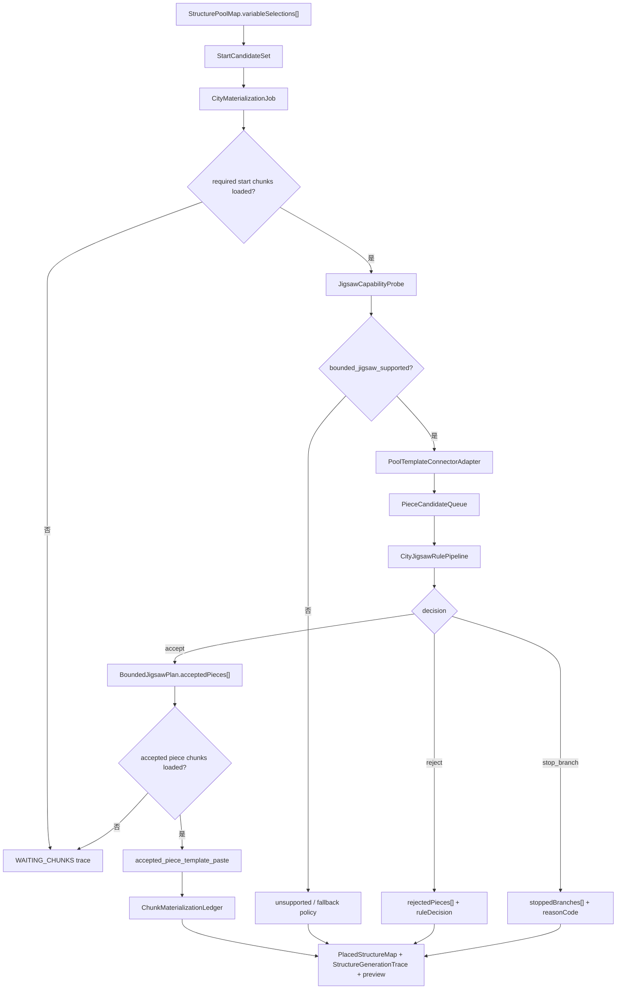

# City 系统 v0.5 开发计划：D7 Jigsaw 落地拦截与规则增强

## Summary

City v0.1-v0.4 已经把 D6-D7 的主链收束为：

```text
D6 选择 configured structure
  -> D6 为 fixed_footprint 规划固定候选落点
  -> D6 为 variable_area 输出 StructurePoolMap 和面积预算
  -> D7 生成 StartCandidateSet
  -> D7 在 chunk 覆盖达标后真实写世界
```

当前关键结论是：`variable_area` 不能长期只约束起点后交给 `/place structure` 黑盒展开。这样只能证明起点合法，不能证明后续 jigsaw piece 不会压道路、冲出功能区、吞掉 fixed footprint 或超出面积预算。

v0.5 的目标不是重做 D6-D7，也不是改成给每个外部结构注册一套 `geomantia:*` wrapper。v0.5 专门解决一件事：在 City D7 自己发起的 bounded jigsaw 物化路径里，把“真正写世界前的 piece 级规则判断”做成稳定、可测试、可 trace 的规则管线。

核心方向：

```text
D6 StructurePoolMap variableSelection
  -> D7 StartCandidateSet
  -> JigsawCapabilityProbe
  -> Pool / template / connector adapter
  -> PieceCandidate
  -> CityJigsawRulePipeline
  -> accepted / rejected / stopped decision
  -> accepted_piece_template_paste
  -> ledger / trace / preview
```

这仍然是 D7 专用执行路径，不接管城市外自然结构生成；仍然使用真实 configured structure ID，不把 jigsaw pool ID 或 NBT template 路径暴露成 D7 对外 `structureId`。

## 背景问题

### 现在已经验证了什么

- D6 可以消费 TerraSense 画像，区分 `fixed_footprint` 和 `variable_area`。
- fixed 结构只能让 AI 选 `structureId` 和 `landingCandidateId`，最终坐标由程序候选决定。
- D7 可以在 chunk 覆盖达标后执行 fixed 结构真实落地。
- D7 已经有 `materializationMode=bounded_jigsaw` 的专用路径，能读取 configured structure 的 jigsaw pool / template，生成 accepted piece plan，并以 `accepted_piece_template_paste` 写入 accepted pieces。

### 仍然缺什么

`/place structure` fallback 的 variable 结构只能验证起点；它不会把城市约束应用到后续每个 piece。

即使 bounded jigsaw 已能 paste accepted pieces，下一步仍要把规则增强为一等对象，否则会出现这些问题：

| 问题 | 风险 |
| --- | --- |
| 规则散在 solver / paste / validator 里 | 失败原因不稳定，回归测试难写。 |
| 只看起点，不看后续 piece | jigsaw 分支可能越界、压道路或压 fixed 结构。 |
| 只看 2D footprint，不看高度 / 水体 / 地形 | 结构可能悬空、插进河床或高度不合理。 |
| 失败后只知道放置失败 | 无法区分 unsupported、chunk waiting、规则拒绝、template paste 失败。 |
| 过早 mixin 原版全局生成器 | 兼容性和版本维护成本高，且无法优雅重试。 |

## 核心决策

| 决策 | 说明 |
| --- | --- |
| 主线仍是 City D7 专用 bounded jigsaw | 只处理 Geomantia 城市规划主动发起的结构任务，不全局替换 MC 自然结构生成。 |
| 不为每个外部结构手写 wrapper | 外部 mod 结构会持续变化，D7 运行时读取 configured structure / pool / template，按能力探测分类。 |
| 不把 `CityBuildingStructure` 作为当前主线 | 自定义 Structure 可作为未来“跟随 chunk 自然生命周期生成”的增强，但当前 D6-D7 已有计划驱动任务队列，优先补强这条路径。 |
| 拦截点是 accepted piece 写世界前 | D7 先把 jigsaw 展开成 piece candidates，逐 piece 过规则，只有 accepted piece 能 paste。 |
| fixed_footprint 不进入裁切逻辑 | fixed 结构必须完整放置或失败，不能因为 variable_area 可停分支而裁切 fixed。 |
| chunk 生命周期仍外部驱动 | D7 等玩家 TP、预加载 mod 或世界加载事实覆盖目标 chunk；chunk 不足写 waiting trace，不强行大范围加载。 |
| 失败必须结构化 | unsupported、规则拒绝、chunk waiting、paste 失败、partial mutation 都要有稳定 reasonCode。 |

## 非目标

- 不重写 Minecraft 原版 `JigsawPlacement` 的完整自然生成语义。
- 不全局 mixin `ChunkGenerator`、`Structure.findGenerationPoint` 或所有原版 / mod jigsaw 结构。
- 不要求整合包里的每个第三方结构都注册一套项目自有 wrapper。
- 不让 AI 选择坐标、piece、jigsaw 深度、重试策略、branch budget 或最终 paste 决策。
- 不把生成后审计发现越界当成受控生成能力。
- 不在首版承诺完整复刻所有 processor、terrain adaptation、projection 和自定义 pool element。

## 与 v0.4 的关系

v0.4 关注“accepted piece 能不能真实写进世界，并写对 ledger”。它回答的是：

```text
通过 validator 的 piece 是否真的被 paste 了？
dry-run 是否没有写假账？
true-run 是否把真实 applied pieces 记进 ledger？
```

v0.5 关注“piece 为什么被接受或拒绝”。它回答的是：

```text
每一个 candidate piece 在写世界前过了哪些城市规则？
被拒绝的分支为什么停止？
规则结果是否能稳定复现、测试和预览？
```

因此 v0.5 不替代 v0.4，而是在 v0.4 的 accepted piece paste 基线上，把规则层从“实现细节”升级成“D7 契约对象和测试对象”。

## 总体流程



## 新增核心对象

### CityJigsawRulePipeline

D7 bounded jigsaw 的 piece 级规则管线。它只消费程序事实和运行时 probe，不消费 AI 坐标或 AI piece 决策。

| 字段 | 说明 |
| --- | --- |
| `pipelineId` | 稳定 ID，来自 jobId、structureId、zonePatchId 和规则版本。 |
| `schemaVersion` | 例如 `city_jigsaw_rule_pipeline.v0.1`。 |
| `ruleSetVersion` | 当前规则集版本，便于 trace 和回归。 |
| `rules[]` | 启用的规则 ID 与参数。 |
| `hardRules[]` | 失败后必须 reject 或 stop 的规则。 |
| `softRules[]` | 只影响 score / riskFlags 的规则。 |
| `sourceRefs[]` | 引用 `CityConstraintField`、`BuildableAreaMap`、`PlannedFixedPlacementMap` 等输入。 |

首版规则不做成通用 worldgen 库，只服务 City D7 bounded jigsaw。

### PieceCandidate

solver 尝试加入计划前的 piece 候选。

| 字段 | 说明 |
| --- | --- |
| `candidateId` | 稳定候选 ID。 |
| `jobId` / `branchId` | 所属 D7 job 和 jigsaw 分支。 |
| `sourceStructureId` | D6 选择的 configured structure ID。 |
| `poolId` / `templateId` | 可解析的真实 pool / template resource id。 |
| `parentPieceId` / `parentConnectorId` | 分支来源；start piece 可为空。 |
| `anchorBlock` / `rotation` | 程序计算的世界位置和朝向。 |
| `footprint` | 2D footprint。 |
| `clearanceFootprint` | 包含 clearance 的保守 footprint。 |
| `heightEnvelope` | 首版可选；记录 template 高度、预估底面和顶部。 |
| `connectorRefs[]` | 候选 piece 的 connector 摘要。 |
| `visibleAreaCost` | 计入 variable_area 预算的面积成本。 |

### PiecePlacementDecision

每个 candidate piece 过规则后的判定结果。

| 字段 | 说明 |
| --- | --- |
| `candidateId` | 对应 `PieceCandidate.candidateId`。 |
| `decision` | `accept`、`reject`、`stop_branch`、`waiting_chunks`、`unsupported`。 |
| `reasonCode` | 主 reasonCode。 |
| `ruleResults[]` | 每条规则的 passed / failed / warning 结果。 |
| `riskFlags[]` | 可继续但需要记录的风险。 |
| `score` | 可选，软规则评分。 |
| `acceptedAsPieceId` | accept 后进入 `BoundedJigsawPlan.pieces[]` 的 pieceId。 |

### CityTerrainProbe

piece 级地形探测摘要。它不替代 TerraSense 结构画像；只在 D7 运行时判断候选落点是否能落。

| 字段 | 说明 |
| --- | --- |
| `probeId` | 稳定探测 ID。 |
| `candidateId` | 对应 piece candidate。 |
| `sampleMode` | `heightmap_corners`、`heightmap_grid`、`fluid_grid` 等。 |
| `chunkCoverage` | 探测所需 chunk 是否加载。 |
| `heightMin` / `heightMax` / `heightDelta` | footprint 范围内高度摘要。 |
| `fluidOverlapBlocks` | 水体或流体重叠估算。 |
| `solidSupportRatio` | 底面支撑粗估。 |
| `warnings[]` | 探测不完整或边界风险。 |

chunk 未加载时，探测应返回 waiting，而不是触发世界强加载。

## 规则集首版

| 规则 ID | 类型 | 通过口径 |
| --- | --- | --- |
| `city_boundary` | hard | piece footprint 必须在城市允许边界内。 |
| `zone_allowed_area` | hard | piece footprint 必须落在目标功能区 allowed area 内。 |
| `buildable_cells` | hard | piece 不能压 D5 扣除后的不可建 cell。 |
| `reserved_corridor` | hard | piece clearance 不能压道路、边界、缓冲区、模板保留区。 |
| `fixed_footprint_occupied` | hard | piece clearance 不能压已规划 fixed footprint。 |
| `runtime_occupied` | hard | piece clearance 不能压本轮已 accepted / applied 的 variable piece。 |
| `visible_area_budget` | hard | accepted 面积不得超过 variable_area 预算；达到预算可 stop branch。 |
| `connector_alignment` | hard | child piece 必须能和父 connector 几何对齐。 |
| `template_resolvable` | hard | pool element 必须能解析到稳定 templateId。 |
| `chunk_loaded` | hard/waiting | 执行 paste 前必须覆盖 required chunk；缺失则 waiting。 |
| `terrain_height_delta` | hard/soft | 高差超过阈值时 reject 或 warning，按结构标签配置。 |
| `fluid_overlap` | hard/soft | 普通建筑不得压水；港口 / 桥 / 码头类可按标签放宽。 |
| `road_access` | soft/hard | market / civic / residential 可要求接近道路或朝向道路。首版可先 warning。 |

首版必须先把 hard rule 做稳定；soft rule 可以先只写 `riskFlags` 和评分，不阻断生成。

## reasonCode 增量

```text
JIGSAW_RULE_CITY_BOUNDARY_VIOLATION
JIGSAW_RULE_ZONE_ALLOWED_AREA_VIOLATION
JIGSAW_RULE_BUILDABLE_CELL_CONFLICT
JIGSAW_RULE_RESERVED_CORRIDOR_CONFLICT
JIGSAW_RULE_FIXED_OCCUPIED_CONFLICT
JIGSAW_RULE_RUNTIME_OCCUPIED_CONFLICT
JIGSAW_RULE_VISIBLE_AREA_BUDGET_REACHED
JIGSAW_RULE_CONNECTOR_ALIGNMENT_FAILED
JIGSAW_RULE_TEMPLATE_UNRESOLVABLE
JIGSAW_RULE_TERRAIN_TOO_UNEVEN
JIGSAW_RULE_FLUID_OVERLAP
JIGSAW_RULE_ROAD_ACCESS_MISSING
JIGSAW_RULE_CHUNK_WAITING
JIGSAW_RULE_UNSUPPORTED_POOL_ELEMENT
```

已有 reasonCode 可以继续保留；v0.5 要求它们进入规则结果聚合，不再只散落在局部实现里。

## 分期计划

### P0：计划冻结与契约对齐

目标：确认 v0.5 只做 D7 bounded jigsaw 规则增强，不改 D6 职责，不走全局 mixin 主线。

产物：

- 本开发计划。
- README / function_map 新增入口。
- 实现前更新 `城市规划数据契约.md` 中 `CityJigsawRulePipeline`、`PieceCandidate`、`PiecePlacementDecision`、`CityTerrainProbe` 的字段。
- 更新 `40_tests/测试入口.md` 的规则管线测试清单。

完成口径：

- 文档明确“不为每个外部结构注册 wrapper、不全局 mixin、只在 D7 accepted piece paste 前拦截”。
- 文档明确 fixed 不裁切，variable 可以 stop branch 但必须 trace。

### P1：规则管线抽象

目标：把现有 `CityConstraintField` / bounded solver 中的判定收束成可测试的 `CityJigsawRulePipeline`。

实现要点：

- 定义 `PieceCandidate` 输入对象。
- 定义 `PiecePlacementDecision` 输出对象。
- 把 allowed area、reserved、occupied、budget、template resolvable 等现有判断迁入规则管线。
- 每条规则都输出 ruleId、status、reasonCode、details。
- solver 不直接“悄悄跳过” piece；必须通过 decision 写 trace。

完成口径：

- 单元测试可直接喂 `PieceCandidate`，不需要启动 MC 世界。
- 同一个 candidate 在同一个 ruleSetVersion 下输出稳定 decision。
- rejected / stopped piece 都有 ruleResults。

### P2：bounded solver 接入规则管线

目标：让 jigsaw 展开过程只通过规则管线决定 accept / reject / stop branch。

实现要点：

- start piece、child piece、endcap piece 统一走 `CityJigsawRulePipeline`。
- accept 后写入 `BoundedJigsawPlan.pieces[]`。
- reject 后写入 `rejectedPieces[]`。
- 达到预算、越界、无合法 connector 时写入 `stoppedBranches[]`。
- `variable_area` 可以少生成，但必须解释少生成原因。

完成口径：

- 越界 child piece 不会进入 accepted plan。
- fixed footprint 冲突会 reject 对应 variable piece。
- 预算达到会 stop branch，而不是继续生成后再裁掉。
- accepted piece 数、rejected piece 数、stopped branch 数稳定可测。

### P3：runtime occupied 与 ledger 协同

目标：防止同一轮或复跑时 variable piece 互相压占，也防止压到已经真实写入世界的结构。

实现要点：

- 从 `PlannedFixedPlacementMap` 导入 fixed occupied footprint。
- 从本轮 accepted pieces 动态维护 runtime occupied。
- 从 `ChunkMaterializationLedger.appliedJobs[]` / `appliedPieces[]` 导入已真实落地 footprint。
- 幂等跳过的 piece 仍应占用 runtime occupied，避免后续 piece 压上去。

完成口径：

- 两个 candidate footprint 重叠时，后加入的 piece 被拒绝或分支停止。
- 复跑时已 applied piece 不重复 paste，同时仍作为占用参与规则。
- trace 能区分 `fixed_footprint_occupied` 和 `runtime_occupied`。

### P4：地形与流体探测

目标：把“悬空、河床、水体、高差”从人工观感风险变成可解释的 D7 runtime probe。

实现要点：

- 只在目标 chunk 已加载时读取 heightmap / fluid state。
- 支持 corners 和 coarse grid 采样。
- 根据 structure profile / tags 决定普通建筑、港口、桥、码头的水体容忍度。
- 探测缺 chunk 时返回 waiting，不强行加载大范围 chunk。
- probe 结果写入 `PiecePlacementDecision.ruleResults[]` 或 `CityTerrainProbe`。

完成口径：

- 普通建筑压水可被拒绝。
- 高差超过阈值可被拒绝或 warning。
- 港口类结构能按标签放宽水体规则。
- chunk 不足时 D7 status 为 waiting，不写 failureSummary，不写 ledger。

### P5：road access 与朝向规则

目标：让城市语义开始影响 jigsaw piece，而不只靠区域 mask。

实现要点：

- 从 D5 `RoadIntent` / reserved corridor 中构造道路距离场或简化道路索引。
- market / civic / residential 可要求入口 connector 或主朝向接近道路。
- defense 可要求靠边界或高地；harbor 可要求靠岸线 / 水体方向。
- 首版可先作为 soft rule，只写 riskFlags；确定稳定后再升级 hard rule。

完成口径：

- trace 能解释“结构已落在 zone 内但没有道路接入”的风险。
- 同一输入下 road access score 稳定。
- 不因为道路规则未成熟而阻断 D6-D7 最小闭环。

### P6：paste 前总预检

目标：在 true-run 写世界前，确认所有 accepted pieces 的执行前置条件满足。

实现要点：

- 合并 accepted pieces 的 requiredPlacementBounds。
- 推导 union requiredChunkRange。
- 任何 accepted piece chunk 不足时整 job waiting，避免半执行。
- dry-run 不写 ledger。
- true-run 只 paste accepted pieces；rejected / stopped 不得写世界。

完成口径：

- chunk 不足不触发 paste。
- true-run 后 ledger 只记录 `worldMutationApplied=true` 的 piece。
- rejected / stopped piece 在真实世界中不可见。

### P7：外部结构兼容分类

目标：面向整合包结构来源，把“能控、不能控、可 fallback”分清楚。

实现要点：

- configured structure registry 缺失：hard reject。
- vanilla-like jigsaw：进入 bounded jigsaw。
- 标准 pool / template 但含 unsupported element：按元素级别 reject 或结构级 unsupported。
- 自定义 Structure 子类：`uncontrolled_delegate` 或 reject，不伪装 bounded。
- `/place structure` fallback 只能作为显式配置的临时路径，并必须标记“只约束起点”。

完成口径：

- 原版 / vanilla-like 结构能进入 bounded。
- 第三方结构不能控时给出稳定 reasonCode。
- 不需要为每个外部 structure 注册项目 wrapper。

### P8：城市保护层预研

目标：为后续阻止 vanilla / 其他 mod 随机结构侵入城市核心区预留方案，但不纳入 v0.5 主实现。

边界：

- 保护层可以考虑 mixin `ChunkGenerator.tryGenerateStructure` 或 `Structure.findValidGenerationPoint`。
- 它只负责阻止外部随机结构侵入 Geomantia 城市保留区。
- 它不负责生成 Geomantia 城市建筑。
- 它不参与 D6-D7 accepted piece paste 的主链验收。

完成口径：

- v0.5 实现时不依赖该层。
- 如后续进入实现，需要单独开发计划和兼容性测试。

## 自动测试计划

| 测试 | 通过口径 |
| --- | --- |
| rule pipeline 基础测试 | 给定 PieceCandidate，输出稳定 PiecePlacementDecision。 |
| allowed area 测试 | footprint 越出 zone allowed area 时 reject，reasonCode 稳定。 |
| reserved corridor 测试 | 压道路 / 边界 / 缓冲区时 reject。 |
| fixed occupied 测试 | 压 fixed footprint 或 clearance footprint 时 reject。 |
| runtime occupied 测试 | 后续 piece 压本轮已 accepted piece 时 reject。 |
| budget stop 测试 | 达到 visible area budget 后 stop branch，不继续 accepted。 |
| connector alignment 测试 | child piece 无法与父 connector 对齐时 stop branch。 |
| terrain probe 测试 | 高差 / 水体规则可给出 reject 或 warning；chunk 缺失返回 waiting。 |
| unsupported element 测试 | 无法解析 templateId 的 pool element 结构化失败。 |
| true-run paste 回归 | 只有 accepted pieces 会写世界和 ledger。 |
| fixed 回归 | fixed_footprint 不走 variable stop branch / 裁切逻辑。 |
| seeded random 回归 | 同一 seed、同一规则版本、同一输入输出相同 plan。 |

## 真实游玩验收

首轮验收仍建议使用原版或 vanilla-like 测试存档，避免大型地形 mod 和结构 mod 同时引入变量。

验收步骤：

1. 使用 TerraSense 导出的真实 `StructureProfileCatalog`，不要手填尺寸。
2. D6 选择至少 1 个 `fixed_footprint` 和 1 个 `variable_area` configured structure。
3. fixed 结构仍通过 `landingCandidateId` 落点，完整放置或失败。
4. variable 结构设置 `materializationMode=bounded_jigsaw`。
5. D7 dry-run 输出 `PieceCandidate`、`PiecePlacementDecision`、accepted / rejected / stopped trace 和预览图。
6. 人为选择一个边界较紧的功能区，使至少一个 jigsaw 分支被规则拒绝或停止。
7. 玩家 TP 到目标范围，等待 chunk 加载后执行 true-run。
8. 世界中只能出现 accepted pieces；rejected / stopped pieces 不得出现。
9. 再次执行 true-run，已 applied pieces 不重复 paste。

通过口径：

- 至少 1 个 fixed_footprint 完整落地。
- 至少 1 个 variable_area bounded jigsaw 结构出现 accepted piece，或给出可解释的 unsupported / waiting / rule reject / paste failure。
- `StructureGenerationTrace` 能解释每个 accepted、rejected、stopped 的规则原因。
- `ChunkMaterializationLedger.appliedPieces[]` 只包含真实写世界成功的 piece。

## 兼容性策略

| 场景 | v0.5 策略 |
| --- | --- |
| 原版 vanilla-like jigsaw | 优先 bounded jigsaw + rule pipeline。 |
| 第三方标准 pool / template | 尝试 bounded；unsupported element 结构化失败或显式 fallback。 |
| 第三方自定义 Structure 子类 | 不强行接管，标记 `uncontrolled_delegate` 或 reject。 |
| `/place structure` fallback | 可以保留为过渡，但 trace 必须说明只约束起点。 |
| 城市外自然结构生成 | 不受 v0.5 影响。 |
| 其他结构侵入城市核心区 | 后续用城市保护层单独处理，不混入 D7 主生成路线。 |
| 预加载 mod | D7 消费 chunk loaded 事实，不替代预加载策略。 |

## 风险

| 风险 | 处理 |
| --- | --- |
| 规则过多导致首版难收敛 | 先做 hard rule：边界、reserved、occupied、budget、chunk；地形和 road access 分阶段开启。 |
| 外部结构 pool element 复杂 | 能力探测先分类，unsupported 不伪装可控。 |
| 地形探测依赖 chunk 加载 | chunk 不足写 waiting，玩家 TP 或预加载后复跑。 |
| processor / terrain adaptation 难复刻 | 首版 warning / unsupported，后续按真实样本补子集。 |
| rejected piece 在真实世界仍出现 | true-run 只 paste accepted piece，并以 ledger / 实机截图回归验证。 |
| 与后续保护层混淆 | v0.5 不实现全局保护 mixin；保护层另开计划。 |

## 下一步建议

实现顺序建议：

1. 先补契约：`CityJigsawRulePipeline`、`PieceCandidate`、`PiecePlacementDecision`、`CityTerrainProbe`。
2. 再抽规则管线：把 allowed area、reserved、occupied、budget 从 solver 里拆成可测试规则。
3. 接 bounded solver：所有 start / child / endcap candidate 都通过规则管线。
4. 补 runtime occupied 和 ledger 协同，保证复跑不重复也不压占。
5. 最后做地形 / 流体 / road access 的渐进规则，并进原版测试存档验收。

这条路线回答当前问题的核心：我们不是让原版随机结构生成器继续自由展开，也不是为整合包每个结构手写注册类；我们是在 D7 已经计划好的城市结构任务里，接管 jigsaw piece 真正写世界前的决策和落地。
