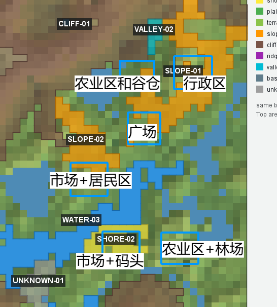

# City嵌套阵列与关系位置

## 需求原话

目前的一个group的阵列，是不是实际上只有一个簇呢。
以前agent loop的版本的时候，其实是能够实现阵列里阵列的对象是另一个阵列的，比如多个簇中心对称。

而且有时候是不是该规规整整的时候就该规规整整，比如那种一条主干道道路两旁都是林立的店铺的，目前我们根本做不到

感觉可以用点那种中心对称的

你觉得靠阵列能不能形成一个大型建筑呢。

就比如宫殿群之类的

还是说这玩意只能靠玩家自己捏一个大template

不需要贴死那种，我们的阵列本质上想解决的是建筑群问题。当然比如两栋商铺贴死也很简单吧

等等，D是选城市吗，D不是已经选好城市了吗，D不是开始设计建筑吗，我们设计建造目前是只支持单patch设计？

嗯其实我也差不多，我的话也是slope - 01中心落地一圈行政区，然后接下来可能会slope 01、02中间落地一个广场。

之后广场和行政区之间我觉得可以用我们的连接系统来铺设一点居民区
其他感觉和你说的差不多。

不过话说像沿岸阵列一批建筑需要吗，就比如市场+码头这里可能就可以做这个阵列。
但是我觉得建筑沿着地形的这种可以直接用限制条件来解决，就比如码头的结构只能在水里，而市场的只能在陆地

没，我是从我人工设计的角度来看，到底我们的阵列算法还缺少什么能力吗

1、我同意，我看看我理解对了吗，我觉得你的意思是阵列嵌套，比如可以轴对称阵列出一个中心的环形阵列，其他就是很多个建筑簇的阵列
2、我同意，不过像广场、码头可能确实也属于建筑，只不过目前我们还没录制相关结构而已吧
3、我同意
4、我同意

## 示意图

原始图片路径：`C:\Users\Rinsing\AppData\Local\Temp\codex-clipboard-daa841a0-b1ff-40f3-801a-efd27315793d.png`

## AI 需求总结

*阵列面向建筑群*：阵列的目标是组织**建筑群**，而不只是重复摆放单栋建筑，也不要求玩家预先把宫殿群或大型行政区录制成一个巨大 Template。简单场景仍可让两栋商铺贴近排列；复杂场景则由多个建筑簇共同形成一个更大的整体。

*正式阵列嵌套*：父阵列的排列对象既可以是单栋建筑，也可以是拥有自身布局的**子阵列**。例如父级中心对称阵列围绕中心主体布置多组成对建筑簇，每个建筑簇内部再独立使用庭院、网格、线性或其他阵列。父阵列按每个子阵列的**整体范围和中心**参与对称、间距、碰撞与落地判断，不能把子阵列重新拆成互不相关的单栋建筑。

*城市内部关系位置*：城市已经由 T 阶段选定，D 阶段使用局部 Patch 安排城市内部建筑和功能。阵列除选择一个 Patch 内的中心或方位外，还需要表达**位于两个 Patch 之间**、**沿 Patch 边界**和**位于两个建筑群之间**等关系位置。例如行政区位于 `SLOPE-01` 中心，广场位于 `SLOPE-01` 与 `SLOPE-02` 之间；这里不重新选择城市。

*广场与连接居民区*：广场和码头可以先作为已录制结构进入建筑主路径，不额外增加通用非建筑节点系统。行政区与广场成为两个明确端点后，连接系统可以在两者之间生成道路与居民建筑带，使连接部分成为实际街区，而不是只有一条空道路。

*异构子阵列与独立限制*：同一个父阵列可以包含承担不同功能的子阵列，每个子阵列分别选择建筑内容、阵列方式和地形限制。沿岸市场与码头可以组成一个父级建筑群：市场子阵列只在陆地侧落地，码头子阵列按岸线和水体条件落地，两者仍保持同组的相邻、朝向和对应关系。建筑跟随地形主要由这些限制条件解决，不要求为每种地形另做一套固定阵列形状。
