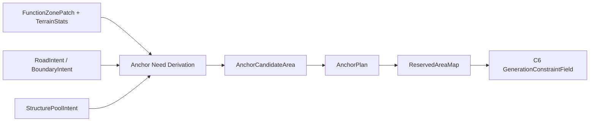

# City C5 案子：AnchorPlan 与保留区

## 定位

C5 承接 C1-C4.5 的城市规划结果，把“功能区 + 道路 / 边界意图 + 结构池预选”转成结构落地层可以消费的关键锚点需求和保留区。

C5 不放置真实结构，不调用 jigsaw / prefab，不决定最终结构坐标。它只回答：

- 哪些关键建筑或公共空间必须优先考虑。
- 它们应该落在哪个功能区、靠近什么道路 / 水岸 / 边界。
- 每个 anchor 的候选范围、优先级、失败策略是什么。
- 哪些区域需要被保留，避免普通结构抢占。

## 上下游

| 方向 | 输入 / 输出 | 说明 |
| --- | --- | --- |
| 输入 | `FunctionZonePatch[]` / `FunctionZoneMap` | C3 功能区实体。 |
| 输入 | `FunctionZoneTerrainStats` | C3 面积、高度、水深、坡度、岸线等统计。 |
| 输入 | `RoadIntent` / `BoundaryIntent` | C4 道路、边界和接入点意图。 |
| 输入 | `StructurePoolIntent` | C4.5 结构池预选和 placement rule 摘要。 |
| 输出 | `AnchorPlan` | 关键建筑 / 公共空间需求。 |
| 输出 | `ReservedAreaMap` | anchor、道路、公共空间和边界保留区。 |
| 下游 | C6 `GenerationConstraintField` | 把保留区和约束输入转成结构落地约束场。 |

## 核心取舍

- Anchor 是“优先需求”，不一定是一栋结构，也可以是广场、码头核心、城门口、桥头、矿井入口或结构群中心。
- C5 只输出候选范围和保留需求，不输出最终 block 坐标。
- C5 可以根据 pool 的 placement rules 过滤明显不合理的 anchor 候选，但具体结构能否落地仍由结构条目判断。
- 普通住宅、摊位、仓库等非关键结构不需要都变成 anchor。
- 必需 anchor 应优先保留空间，避免后续普通 jigsaw / prefab 抢占核心位置。

## 流程

| 步骤 | 目标 | 输出 |
| --- | --- | --- |
| Step 1 | 从功能区和主要建筑角色推导 anchor 需求。 | `anchorNeeds[]` |
| Step 2 | 结合道路、水岸、边界和地形统计生成候选范围。 | `anchorCandidateAreas[]` |
| Step 3 | 排序优先级、失败策略和降级方案。 | `AnchorPlan` |
| Step 4 | 将 anchor、道路核心、公共空间和关键边界写成保留区。 | `ReservedAreaMap` |
| Step 5 | 导出 C6 约束场输入。 | `ConstraintInputRefs` |

## Anchor 类型

首版支持少量高价值 anchor：

| anchorType | 典型来源 | 说明 |
| --- | --- | --- |
| `civic_core` | `civic_core` 功能区 | 村厅、广场、井、公告牌等中心公共空间。 |
| `harbor_core` | `harbor_or_waterfront` 功能区 | 码头核心、鱼市入口、船坞入口。 |
| `gate_or_entry` | `defense` / 入口道路 | 城门、关卡、入口广场。 |
| `market_core` | `market` 功能区 | 主市集、摊位中心、交易棚。 |
| `sacred_core` | `sacred_or_cultural` 功能区 | 神庙、祭坛、纪念碑或仪式平台。 |
| `production_core` | `production` 功能区 | 工坊核心、仓储入口、矿井入口。 |
| `bridge_or_crossing` | 水陆窄口 / 道路意图 | 桥头、渡口、栈桥接入点。 |

非必需功能区可以不生成 anchor，只通过 C6 / C7 普通结构预算消费。

## Anchor 候选范围

C5 不直接给最终坐标，而是输出候选范围。

候选范围来源：

| 来源 | 用途 |
| --- | --- |
| `FunctionZonePatch.cellShape` | anchor 必须属于哪个功能区。 |
| `FunctionZoneTerrainStats` | 面积、高度范围、水深、坡度、岸线长度。 |
| `RoadIntent.accessPoints[]` | 朝路、入口、核心连接点。 |
| `BoundaryIntent` | 水岸、城墙、软过渡、桥位或台阶边界。 |
| `StructurePoolIntent.requiredPlacementRules[]` | pool / 结构条目的关键需求摘要。 |

候选范围至少记录：

| 字段 | 说明 |
| --- | --- |
| `candidateAreaId` | 候选范围 ID。 |
| `zonePatchId` | 所属功能区。 |
| `geometry` | cell 或 block 级候选区域，不是最终结构 footprint。 |
| `areaBlocks` | 候选范围面积。 |
| `terrainStatsRef` | 地形统计引用。 |
| `accessPointRefs[]` | 关联道路 / 水岸 / 边界接入点。 |
| `placementRuleHints[]` | 来自结构池的关键落地条件摘要。 |
| `confidence` | 候选范围置信度。 |

## 优先级和失败策略

Anchor 必须有优先级和失败策略：

| 字段 | 说明 |
| --- | --- |
| `priority` | 数值越高越优先，核心公共空间和入口通常最高。 |
| `required` | 是否为城市成立的必要 anchor。 |
| `failurePolicy` | `block_city`、`degrade`、`skip_with_warning`。 |
| `fallbackAnchorTypes[]` | 可降级替代，例如 `town_hall` 降级为 `meeting_square`。 |
| `fallbackZoneRefs[]` | 可替代功能区。 |

建议首版：

| anchorType | 默认 required | failurePolicy |
| --- | --- | --- |
| `civic_core` | 是 | `block_city` 或 `degrade` |
| `harbor_core` | 港口城为是 | `degrade` |
| `gate_or_entry` | 边境要塞为是 | `degrade` |
| `market_core` | 否 | `skip_with_warning` |
| `sacred_core` | 宗教 / 首都倾向时为是 | `degrade` |
| `production_core` | 矿城 / 工业城为是 | `degrade` |
| `bridge_or_crossing` | 有水陆窄口才启用 | `skip_with_warning` |

## ReservedAreaMap

保留区的作用是把关键空间提前锁给 C6，避免普通结构抢占。

保留区来源：

| source | 说明 |
| --- | --- |
| `anchor` | anchor 候选范围或核心候选点周边。 |
| `road_core` | C4 主路和关键连接线。 |
| `public_space` | 广场、码头前场、市集中心等公共空间。 |
| `waterfront_access` | 码头、桥头、岸线接入带。 |
| `boundary_treatment` | 城墙、栅栏、水岸、台阶、软过渡等边界处理。 |

保留区字段：

| 字段 | 说明 |
| --- | --- |
| `reservedAreaId` | 保留区 ID。 |
| `source` | `anchor`、`road_core`、`public_space` 等。 |
| `sourceRef` | 来源 anchor / road / boundary ID。 |
| `geometry` | cell 或 block 几何。 |
| `hardness` | `hard` 或 `soft`。 |
| `priority` | 保留优先级。 |
| `reason` | 保留原因。 |

## 输出契约草案

### AnchorPlan

| 字段 | 类型 | 说明 |
| --- | --- | --- |
| `schemaVersion` | string | 例如 `city_anchor_plan.v0.1`。 |
| `cityId` | string | 城市 ID。 |
| `anchors[]` | object[] | anchor 需求。 |
| `candidateAreas[]` | object[] | 候选范围。 |
| `reservedAreaMapRef` | string | 保留区引用。 |
| `quality` | object | 完整性、冲突和 warning。 |

`anchors[]` 字段：

| 字段 | 说明 |
| --- | --- |
| `anchorId` | anchor ID。 |
| `anchorType` | anchor 类型。 |
| `zonePatchId` | 所属功能区。 |
| `mainBuildingRole` | 对应主要建筑角色。 |
| `candidateAreaRefs[]` | 候选范围。 |
| `poolIntentRefs[]` | 关联结构池预选。 |
| `priority` | 优先级。 |
| `required` | 是否必需。 |
| `failurePolicy` | 失败策略。 |
| `orientationIntent` | 朝路、朝水、朝广场等意图。 |
| `landformEvidenceRefs[]` | GIS 证据引用。 |

### ReservedAreaMap

| 字段 | 类型 | 说明 |
| --- | --- | --- |
| `schemaVersion` | string | 例如 `city_reserved_area.v0.1`。 |
| `cityId` | string | 城市 ID。 |
| `reservedAreas[]` | object[] | 保留区。 |
| `debugPreviewRef` | string | 保留区预览图。 |

## 验收设计

### synthetic 场景

| 场景 | 期望 |
| --- | --- |
| 小村中心 | `civic_core` 生成必需 anchor，并保留中心广场 / 村厅候选范围。 |
| 港口功能区 | `harbor_core` 候选范围必须关联水岸 access point 和对应 pool rules。 |
| 边境入口 | `gate_or_entry` 必须关联道路入口或边界处理意图。 |
| 矿业功能区 | `production_core` 可引用矿井入口 / 仓储结构池，但不直接给最终坐标。 |
| 水陆窄口 | `bridge_or_crossing` 只在 C4 有 crossing access point 时生成。 |

### 真实存档

从 C1-C4.5 已完成的小村镇运行一次：

1. 读取 `FunctionZonePatch[]`、`FunctionZoneTerrainStats`、`RoadIntent`、`BoundaryIntent`、`StructurePoolIntent`。
2. 生成 `AnchorPlan` 和 `ReservedAreaMap`。
3. 导出 `anchor_plan_preview.png`，图中显示 anchor 候选范围、道路核心和保留区。
4. 人工检查必需 anchor 是否落在合理功能区，且没有抢占主路 / 水岸接入。
5. 检查每个必需 anchor 都有失败策略。

## 风险与约束

- C5 不直接选择最终结构坐标；只输出候选范围。
- C5 不让普通结构抢占 anchor 保留区。
- C5 的 `hard` 保留区要少而明确，避免后续结构落地几乎无处可放。
- Anchor 失败必须可解释，不能静默跳过。
- C5 输出必须能回溯到 C3 功能区、C4 道路 / 边界和 C4.5 结构池预选。
