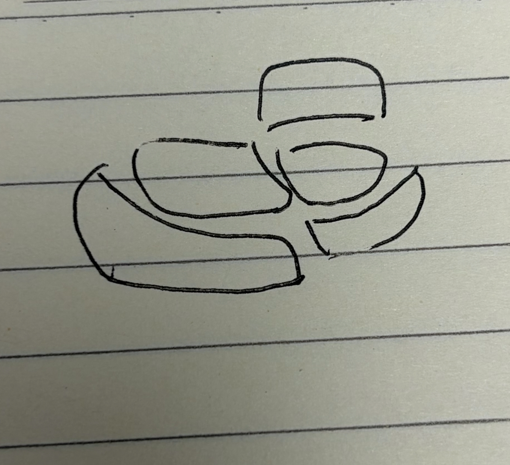

# City阵列主从骨架与街带

## 需求原话

我觉得走的：

```text
CENTER_SYMMETRIC 父阵列
├─ residential_cluster：COMPACT，4 栋
├─ capital_core：COMPACT，17 栋
└─ market_axis：LINEAR，4 栋
```

功能区之间隔很远
而且我觉得出格是很正常的，因为step太大了，全是方格会很恶心，正确做法我觉得是真实落地的占地面积小于设计目标就得了吧

是不是一个城市阵列应该分主次，才能有那种明确的街区划分的感觉

首先功能区内如何得到一片主次分明、甚至带街道的建筑群。就比如我发给你的两个示意图，一个是工整的建筑群+两个小住宅群，另一个则是农村这种的，各个田地之间有道路，但是各个田地的大小形状不规则

功能区内的路我觉得都是小的，所以应该是要算在阵列算法设计里的。
RoadWeaver因为他的道路是比较通用的，并且是带曲线的，应该是功能区和功能区离得太远的时候连接的。
所以现在我感觉，我们也得在算法里设计道路了，不然就很难做到这种城市感，不能一昧交给Road Weaver来缝合
主建筑不是早就有这个概念了吗，就是阵列里都有核心建筑的列表吧

算法里的“主”一个是AI填入的，另一个就是结构在形成整合包的时候，我会对每个结构都标记，有的建筑会标记为核心建筑，有的是填充建筑，这个现在已经有了吧

宽度我感觉是不是用参数会好点

在这个基础上，我还好奇阵列的嵌套有考虑吗，还有对于地形的适应性，
而且还有一个就是因为D3的功能区外形限制，我感觉这玩意和地形适应是相符的，但是和我们的阵列好像冲突啊

## 示意图


原始图片路径：`C:\Users\Rinsing\Desktop\725518DDCB1367E78BF7ABAAEA287DCC.png`



原始图片路径：`C:\Users\Rinsing\Desktop\C2B9CC2C6241561636F1D18A1C509A05.png`

讨论中确认的排版标注：

```text
            ┌────┐
            │ M  │  ← 主建筑坐镇轴端，朝向定轴
            └─┬──┘
   ┌──┐     ┌─┴─┐     ┌──┐
   │a1│ ──► │   │ ◄── │b1│   次建筑沿带两侧排队，门脸朝带
   └──┘     │带 │     └──┘
   ┌──┐     │ w │     ┌──┐    w = 街宽，用参数派生
   │a2│ ──► │   │ ◄── │b2│   纵向间距按密度派生
   └──┘     │   │     └──┘
   ░░░░     │   │     ┌──┐
   ░░░░     │   │ ◄── │b3│   不合法槽位留空，不硬塞
            └─┬─┘     └──┘
              ↓ 带延伸到功能区边界即止
```

```text
 功能区轮廓（地形扩张，不规则）：
       ┌─────────┐
       │         └────┐
       │  ┌──M──┐     │
       │  □ ║ □  │     │  ← 最小规则核心域：扩张必须能容纳
       │  □ ║ □  │     │
       │  □ ║ □       │
       │    ║   □  □  │  ← 轮廓其余部分：继续不规则
       └────╨─────────┘
           ║ 街带到轮廓边界即止
```

## 补充需求原话

这套算法是否有考虑到田野这种，田野、林场这类景观如果要很自然的，必须继续用之前的扩张算法，道路感觉只需要加点间隔就能自然长出来了，还是说这个写成另一个案子会好点？

我非常担心的一点就是田野和林场最终长出来的东西全都工工整整，并且不适配地形（以前的那套代码因为会在悬崖、水体截断，所以非常好看，很好做梯田这种）

## AI 需求总结

### 城市阵列分主次

城市阵列应当**分主次**，才能获得明确的**街区划分**感：主组团与卫星组团不应等大等距排版，槽位与间距按各组团的真实需要推导。功能区的**实际落地占地面积允许小于设计目标**，不追求铺满；**出格是正常结果**，不要求建筑群严格贴合采样格网，**全是方格的排版是要避免的**。现状三个组团被固定槽位等距撑开、功能区之间隔很远，属于要修正的排版结果。

### 功能区内主从建筑群与街带

功能区内要能得到**主次分明、甚至带街道**的建筑群。"主"有两个现成来源：**AI 填入**的核心建筑列表，以及**整合包导入时对每个结构的核心/填充标记**（已存在，排版应消费它）。主建筑先落位并**决定轴向**，次建筑沿轴两侧的**街带**排队、门脸朝街。街带是排版时显式保留的**负空间**，**宽度用参数**派生，不由 AI 提交数值。不合法或放不下的槽位**留空**，不硬塞、不补其他形状；住宅群可以是轮廓**不规则**的有界簇团，不要求对称。

### 区内道路由阵列算法设计

功能区内的路都是**小路**，必须在**阵列算法设计**里留出；**不能一味交给 RoadWeaver 缝合**，否则做不出城市感。RoadWeaver 的道路**通用且带曲线**，只用于**功能区之间离得太远**时的连接。

### 田野与林场的自然路网

田野、林场这类景观**不做规整骨架**，继续沿用**接力扩张**生长，在**断崖和水体自然截断**，并保留沿等高的带状农田与水渠以支持**梯田**；**禁止长成工工整整的固定图形**，也不得脱离地形。农村的路不是规划出来的，而是**长出来的**：同一片区的地块在扩张时保留**连通间隙**，间隙沿低代价地形走、允许**弯折断续**，间隙即成路；为此不再要求地块之间必须贴死生长。

### 嵌套保持两级

阵列嵌套维持现有两级：父阵列把**完整子组团**作为整体参与编排（对称、间距、碰撞），子组团内部再独立使用各自的阵列算法；骨架语言在城市级与功能区级之间递归。示意图下方的小住宅群这类次级组团作为**卫星组团**表达，不在组内再开一层嵌套。

### 地形适应分工

阵列骨架与地形适应共存：主建筑朝向定轴时应**参考地形**；次建筑槽位逐栋做地形检查，不合法即**留空**；街带是负空间，**不需要整平**，交由铺地沿地形铺设；台基只用于需要规整落地的**硬骨架**建筑，簇团与地形跟随组团不为填满形状而整平地形。

### 功能区轮廓与规整骨架的协调

D3 功能区外形的**不规则**与地形适应是相符的，冲突只出在规整骨架上。分治：硬骨架型（宫廷、行政等）把主建筑加街带加两侧槽位的**最小规则核心域**作为功能区扩张的硬约束，扩张必须先能容纳它，轮廓的**其余部分**继续保持**不规则**；软骨架型（簇团、地形跟随）维持轮廓优先，槽位超出轮廓就跳过。街带延伸到功能区边界即止；是否允许街带随地形**转折**（直带裁剪还是折带跟随）尚未拍板。
