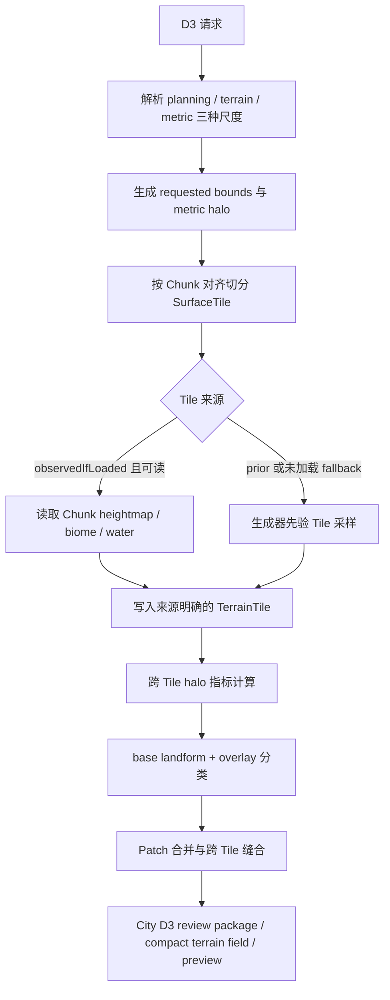

# 案子 00：D3 局部地形扫描重构

## 定位

本案是 `D4城市生成职责重构-v0.1` 的前置阻断项。

案子 01 的单次 `CityBlueprint`、案子 02 的程序化城市编译器和案子 04 的景观系统都把 D3 当作城市局部地形真值。如果 D3 仍以过大范围、过粗步长、错误坡度语义和逐点重复世界生成方式运行，后续 D4 即使完全程序化，也只会更快地消费错误且昂贵的地形事实。

本案同时归属 City 与 GIS：

- City 决定城市核心规划范围、D3 context padding、消费尺度和主流程预算。
- GIS 负责地表采样、指标计算、地貌分类、Patch、缓存和刷新执行。
- W / T 粗扫保持宏观职责，不因本案改成城市级精扫。

本案是开发计划，不立即切换当前 active path。进入实现时，必须同步更新 City / GIS 的 `20_contracts/`、`30_code_guide/`、`40_tests/` 和影响面。

## 已确认问题

### 1. 城市规划范围明显过大

当前 `CityScale.CITY` 默认规划半径为 `768+ blocks`，城市核心域约为 `1536 x 1536 blocks`。D3 再增加每侧 `128 blocks` padding，并按所有相交的 `512 x 512 blocks` GIS Region 完整刷新，实际采样范围可能继续扩大。

当前模板和真实 D4 产物表明：

- 50 栋城镇已有约 `333 x 400 blocks` 的实例。
- 52 栋城镇已有约 `385 x 529 blocks` 的实例。
- 200 栋建筑已经属于超大城市，常规核心域约 `768 x 768 blocks`，复杂地形或松散港城约 `896 x 896 blocks`。
- `planningRadiusBlocks=768` 给 200 栋建筑提供约 236 万方块的核心域，容易把城市构图和 D3 扫描同时拉得过散。

### 2. 规划步长错误地决定了地形采样步长

调用方即使请求 `cellStepBlocks=4`，`CityScale.CITY` 仍会把 City grid 和 D3 GIS step 一起夹到 `32`。

这把两个不同概念绑定成了一个字段：

```text
城市规划网格：用于 Group、关系、候选和预览组织
地形采样网格：用于高程、坡度、水体、地貌和 Patch 真值
```

32 格规划网格可以用于大城市的程序组织，但不能直接承担峭壁、水岸、局部坡折和结构落点附近地形事实。

### 3. 当前 prior 采样路径逐点重复构建噪声上下文

当前每个采样点顺序执行：

```text
getBaseHeight(WORLD_SURFACE_WG)
getBaseColumn
getBaseHeight(OCEAN_FLOOR_WG)
getUncachedNoiseBiome
```

前三项各自进入生成器的 `iterateNoiseColumn` 并建立独立 `NoiseChunk`。`getBaseColumn` 还会构造完整垂直状态数组。

JJThunder To The Max 当前覆盖的 Overworld 高度为 `2096`。在该生成器下，逐点完整 Column 和两次额外高度查询的成本被显著放大；相邻采样点之间也不共享 Chunk 级插值与密度缓存。

正常 Minecraft Chunk 生成则按 Chunk 建立并复用 `NoiseChunk`，一次计算 `16 x 16` 根柱，复用高度图并通过后台执行器并行推进。当前 D3 没有使用这条批量执行形态。

### 4. `observedIfLoaded` 只有枚举，没有真实执行分支

现有采样器没有按 `sampleMode` 分支。即使玩家附近 Chunk 已经加载并拥有真实 heightmap、biome 和 surface，D3 仍会重新调用生成器 prior 查询。

因此当前产物不能准确报告：

- 哪些 Cell 来自生成器先验。
- 哪些 Cell 来自已加载 Chunk 观测。
- 是否发生 fallback。
- 两种来源是否在同一 Patch 中混用。

### 5. 地形指标和目标地貌尺度不匹配

当前 `slope` 实际是邻域最大绝对高度差，没有除以水平距离，也不是角度。

在本次 JJThunder D3 探针中：

- 实际 step 为 `32`。
- `slopeRadiusCells=1` 表示轴向 32 格、对角约 45 格的原始高度差。
- `localReliefRadiusCells=2` 的窗口横跨 128 格。
- 一个连续缓坡点的 `slope=4`、`localRelief=22`、`roughness=6.17`，仍因第二条规则被判为 `cliff`。

这证明当前规则会把大范围山体起伏当成局部峭壁。

### 6. Region 边界没有提供真实指标 halo

当前每个 GIS Region 独立计算指标。`tpiLargeRadiusCells=12`，而 step 32 时一个 Region 只有 `16 x 16` Cell，任何 Cell 都无法获得完整大尺度邻域。本次探针中所有 Region Cell 都被标记为 `edgeDirty`，但分类仍继续执行。

`dependencyMarginCells` 当前主要存在于任务和文档语义中，没有形成跨 Region 指标输入闭包。

## 现场基线

本案以 `jjthunder_d3_probe_20260730` 作为首个真实回归基线：

| 项目 | 结果 |
| --- | --- |
| 请求 step | 4 |
| 实际 step | 32 |
| 核心范围 | 约 `1536 x 1536 blocks` |
| padding 后请求范围 | 约 `1792 x 1792 blocks` |
| 实际刷新范围 | `4 x 4` 个 GIS Region，约 `2048 x 2048 blocks` |
| 采样 Cell | 4096 |
| D3 耗时 | 约 14 分 22 秒 |
| Patch | 109 |
| cliff Patch | 19 |
| cliff Cell 占 Patch Cell | 约 62.3% |

该结果只作为问题复现基线，不作为正确分类基线。

### 视距 32 的同面积 Chunk 生成基线

标准 D3 context 为 `1024 x 1024 blocks`，覆盖 `64 x 64 = 4096` 个 Chunk。玩家视距设为 32 时，按以玩家所在 Chunk 为中心的方形口径，目标范围为 `65 x 65 = 4225` 个 Chunk，约 `1040 x 1040 blocks`。两者覆盖面积足够接近，可以把玩家正常探索新地形时的完整 Chunk 生成速度作为 D3 的黑盒参照。

阶段 0 必须在同一硬件、同一 JJThunder 配置和固定世界种子下建立三条墙钟时间基线：

| 基线 | 工作量 | 用途 |
| --- | --- | --- |
| `base_height_only` | 在 `1024 x 1024 blocks` 内按 step 4 执行 65,536 次 `getBaseHeight(WORLD_SURFACE_WG)`，不生成真实 Chunk。 | 测单一地表高度查询的实际吞吐。 |
| `d3_cold_prior` | 对同规模范围执行完整 D3 prior，包括所需水体、生物群系、指标、分类、Patch、预览和序列化。 | 测主流程真实成本。 |
| `view_distance_32_full` | 玩家进入经确认未加载、未生成、未落盘的新区域，统计目标 4225 个 Chunk 到达 `FULL` 的完成时间。 | 测正常游戏生成同等面积地形的黑盒吞吐。 |

`view_distance_32_full` 的正式计时边界为：先启动 tracker，再为玩家建立目标区域加载请求；当目标集合中 `50%`、`95%` 和 `100%` 的 Chunk 首次到达 `FULL` 时分别记录时间。客户端实际完成网格构建和渲染可以另做体验记录，但不混入服务端生成基线。

该基线必须满足：

- 客户端与服务端有效视距都为 32，并在报告中记录实际目标 Chunk 数。
- 使用没有其他玩家和预生成任务干扰的新区域；发现目标 Chunk 已在内存或磁盘存在时，本轮 cold generation 基线无效。
- JVM 完成固定预热后，在多个未生成坐标重复测量；记录硬件、线程数、世界种子、generator / datapack fingerprint 和运行顺序。
- tracker 只在内存累计状态，结束时输出一条汇总日志和 `chunk_generation_baseline_report.json`，禁止逐 Chunk 打日志污染结果。
- 汇总至少包含 `p50Ms`、`p95Ms`、`p100Ms`、`chunksPerSecond`、失败 / 超时 Chunk 数和完整目标 bounds。

若同面积 `view_distance_32_full` 已完成，而 `base_height_only` 或 `d3_cold_prior` 仍明显更慢，则直接证明 D3 的调用形态、批处理或调度存在主流程级性能问题。该结果优先用于阻断低效实现，不能通过放宽十分钟级预算解释为可接受。

首版 `view_distance_32_full` 调试切片已接入：服务端可用临时 Region Ticket 主动生成目标范围，按 Forge load event 区分新生成 / 磁盘加载，并在后续 server tick 确认 FULL 可用性；HTTP / MCP 提供启动与状态查询，最终写 `chunk_generation_baseline_report.json`。该切片只建立完整 Chunk 黑盒基线，`base_height_only` 与 D3 分项计时仍属于后续阶段 0 工作。

2026-07-31 首轮 JJThunder 运行态基线：世界种子 `1269623911921362524`，中心 block `(2100000,2100000)`，radius 32，目标 `4225` 个 Chunk；`newChunkCount=4225`、`existingChunkCount=0`、`coldBaselineValid=true`。`p50=155127 ms`、`p95=329582 ms`、`p100=338807 ms`，完整范围平均 `12.47 chunks/s`。旧 D3 探针为 14 分 22 秒，完整 Chunk 黑盒基线约为其 39.3%（约快 2.54 倍）；但旧 D3 实际范围与新标准 context 不同，最终性能验收仍必须补同中心 / 同面积的 `base_height_only` 与 `d3_cold_prior`。

同日补测生产 `city_plan_d3`：同世界种子、同中心，请求 planning radius 384 + padding 128，`patchContextBounds=2099488..2100512`，墙钟时间 `1,425,561 ms`（23 分 45.6 秒），为完整 Chunk 基线的 4.21 倍。该结果不是严格的 step 4 标准场景：请求 `cellStepBlocks=4` 被现有 City grid 夹为 16，约 1025 方块请求又因 Region 对齐刷新 `3 x 3` 个 512 方块 Region，实际覆盖约 `1536 x 1536`，共采样 9216 Cell；产出 114 Patch、2304 LandUse Cell，8640 Cell 为 edgeDirty。该实测直接证明阶段 1 必须同时拆除 City step 夹制、整 Region 扩扫和 Region 内独立 halo，不能只优化单次 `getBaseHeight`。

单柱优化第一版复测：`MinecraftPriorAtlasSampler` 将同一 Cell 的两次 `getBaseHeight` + 一次 `getBaseColumn` 合并为一次 `getBaseColumn`，再用原版 Heightmap 谓词从同一 Column 还原 surface 与 ocean floor。同 seed、中心、bounds、step 夹制和 9 Region 条件下，完整 D3 降至 `604,720 ms`（10 分 04.7 秒），相对旧路径加速 2.36 倍，但仍为完整 Chunk 基线的 1.78 倍。新旧 2304 个 LandUse Cell 文件 SHA-256 完全相同，114 个 Patch 逐项一致。该结果确认重复噪声链是主要瓶颈之一，也确认第一版仍不足以通过 300 秒阻断线；下一步优先消除整 Region 扩扫并建立共享 TerrainTile / halo。

## 目标

### 主目标

1. 标准 200 建筑城市的 D3 context 以约 `1024 x 1024 blocks` 为默认预算，不再默认扫描 1792 到 2048 格边长。
2. D3 使用 `terrainSampleStepBlocks=4` 建立城市局部地形事实。
3. City 规划网格与 GIS 地形采样网格彻底拆分。
4. D3 按 Chunk / Tile 批量采样，复用已有 Chunk 观测和生成器计算上下文。
5. 坡度改为带水平距离归一化的地形梯度或坡度角。
6. 山体主地貌和峭壁局部叠加事实分层表达。
7. 指标计算获得真实跨 Tile / Region halo，不再让全域 `edgeDirty` 进入正式分类。
8. D3 成为可缓存、可恢复、可取消、可度量的主流程任务。

### 主流程目标

- D3 不再成为一次城市生成中以十分钟计的黑盒阻塞阶段。
- D3 成功后，案子 01 的 AI 可以一次读取可信的局部地形摘要和预览。
- 案子 02 的程序化编译器可以使用稳定 Patch、局部陡坡和水岸事实自动落点。
- 案子 04 的景观系统可以使用连续面域和真实坡度，不继承旧 cliff 误判。

## 不做事项

- 不把 W 阶段改成 step 4；W 继续负责宏观世界粗扫。
- 不在默认 `prior` 模式主动生成或加载未生成 Chunk。
- 不通过提高 JVM 内存掩盖逐点重复计算。
- 不把 GPU 作为首版性能前提；坡度和 TPI 矩阵可后续评估 GPU，但不是当前主要瓶颈。
- 不在本案恢复 AI 逐候选、逐 slot 或逐轮 D4 决策。
- 不在本案实现案子 02 的城市编译器或案子 04 的景观内容生成。
- 不允许为了性能把未采样区伪装成平地、默认高度或高置信 Patch。

## 城市范围策略

### 首版建议档位

| 城市目标 | 核心半径 | 核心边长 | 默认 padding | D3 context 边长 |
| --- | ---: | ---: | ---: | ---: |
| 约 50 栋城镇 | 256 | 512 | 128 | 768 |
| 约 100 栋大城镇 | 320 | 640 | 128 | 896 |
| 约 200 栋标准城市 | 384 | 768 | 128 | 1024 |
| 复杂山地 / 松散港城 | 448 | 896 | 128 | 1152 |
| 显式超松散城市 | 512 | 1024 | 128 | 1280 |

`512` 不是新的无条件 city 默认值。超过该范围必须由蓝图规模、独立港区、大片农业景观或其他显式空间预算说明，不能仅凭 `role=capital` 自动扩大。

### 范围字段

后续契约应拆出：

| 字段 | 语义 |
| --- | --- |
| `planningRadiusBlocks` | City 核心规划半径。 |
| `planningBounds` | D4 Group 和结构候选可使用的核心域。 |
| `patchScanPaddingBlocks` | 核心域之外仅供地形上下文和边界消费者使用的 padding。 |
| `requestedTerrainBounds` | 调用方请求的核心域加 padding。 |
| `effectiveTerrainBounds` | Tile 对齐和指标 halo 后实际采样范围。 |
| `metricHaloBlocks` | 只用于指标闭包，不进入 City 候选域。 |

预览和 manifest 必须同时显示 requested / effective 范围，不能只报告相交 Region ID。

## 双尺度数据模型

### City 规划尺度

首版保留规模相关的规划 step，例如大城市 `16` 或 `32`。该网格用于：

- Group 关系和容量预算。
- AI 摘要与低分辨率预览组织。
- 程序化编译器的搜索分区。
- 城市级统计和进度展示。

建议字段名：`planningCellStepBlocks`。

### GIS 地形尺度

D3 标准地形 step 固定从 `4` 起步。该网格用于：

- 高程和水体采样。
- 坡度、曲率、局部起伏、TPI 和 roughness。
- base landform 与 overlay tag。
- 细粒度 Patch 边界和 D4 地形过滤。

建议字段名：`terrainSampleStepBlocks`。

### 指标尺度

指标窗口不再只保存 Cell 半径。配置真值应使用 block 单位，例如：

- `slopeBaselineBlocks`
- `localReliefRadiusBlocks`
- `roughnessRadiusBlocks`
- `tpiSmallRadiusBlocks`
- `tpiLargeRadiusBlocks`

执行时再根据 `terrainSampleStepBlocks` 换算为 Cell 半径，并在 manifest 同时记录 block / cell 值。

## 地貌语义重构

### 主地貌与叠加事实

D3 不再要求每个 Cell 在“山坡”和“峭壁”之间二选一。

建议拆分：

```text
baseLandform:
  plain / slope / ridge / valley / basin / terrace / water / shore / unknown

overlayTags:
  cliff / steep / rugged / water_edge / edge_dirty / low_confidence

regionalContext:
  lowland / hill / mountain / plateau 等大尺度上下文
```

同一位置可以表达为：

```text
baseLandform = slope
regionalContext = mountain
overlayTags = []
```

### 坡度

首版必须使用带水平距离的梯度，输出 `slopeDegrees` 或等价的明确单位字段。可采用 3 x 3 有限差分 / Horn 风格计算，但必须满足：

- X / Z 水平尺度进入公式。
- 对角距离不能按轴向距离处理。
- step 变化后同一连续平面的坡度角应基本稳定。
- 原始最大高度差只能作为补充证据，不能继续命名为 slope。

### 峭壁

正式 `cliff` overlay 至少要求局部证据组合：

- 短基线上的高坡度角。
- 足够的局部垂直落差。
- 陡变在相邻 Cell 上具有最小连续长度或面积。
- 可选的坡折 / 曲率证据。

`localRelief` 和 `roughness` 可以产生 `rugged`、`mountain` 或 `cliff_candidate`，不能在没有局部陡变证据时直接产生正式 `cliff`。

## 采样执行架构



### Tile 边界

- 首版 Tile 与 Minecraft Chunk 对齐，基础范围为 `16 x 16 blocks`。
- step 4 时每 Tile 只有 `4 x 4 = 16` 个采样柱。
- Tile 是调度、缓存、恢复和来源追踪单位；GIS Region 继续作为较大空间索引，不再强制每次完整重采样所有 512 x 512 方块。
- 指标 halo 可以读取相邻 Tile，但 halo Cell 不自动进入 City planning bounds。

### `observedIfLoaded`

- 先用不触发加载的方式确认 Chunk 已加载且达到所需状态。
- 读取现成 heightmap、biome 和水体事实，禁止再次调用 prior 噪声列。
- 记录 `sampleSource=observed_loaded`、Chunk 状态和观测时间。
- Chunk 未加载时按契约回退 prior，并记录 fallback 数量和原因。
- 不允许调用 `level.getChunk` 等会静默生成 / 加载 Chunk 的便捷入口。

### `prior`

首版至少完成：

1. 同一采样柱只建立一次生成器查询结果。
2. 从同一 Column / 共享结果派生 surface、ocean floor、水体和 surface type，删除三次独立 `iterateNoiseColumn`。
3. 复用稳定的 `RandomState`、generator settings 和 Chunk / Tile 上下文。
4. 对 `NoiseBasedChunkGenerator` 提供批量优化适配；其他生成器没有能力声明时走明确 fallback。
5. fallback 必须进入 manifest，不能伪装成优化路径。

后续可评估使用临时 ProtoChunk / Chunk 级 noise fill 获取完整 Tile，但必须保证：

- 不把临时 Chunk 注册到世界。
- 不推进真实 ChunkStatus。
- 不触发 structure、feature 或保存副作用。
- 与当前世界生成器和数据包设置一致。

### 并发与确定性

- 采样调度使用有界后台执行器，不在 server tick 内执行长循环。
- 最大并发由配置和运行时 CPU 决定，不能无界提交每个 Cell。
- Tile 提交、Patch ID 和 artifact 排序使用稳定空间键，不依赖线程完成顺序。
- 同一 world identity、配置、bounds 和 seed 的结果 hash 必须一致。
- 任何 Tile 失败都保留明确 partial 状态；不得把缺失 Tile 填成默认地形。

## 缓存与恢复

### Cache identity

TerrainTile cache key 至少绑定：

- dimension ID。
- world seed / world identity。
- generator / noise settings / datapack fingerprint。
- sample mode 和实际 sample source。
- terrain sample step。
- heightmap / water / biome 语义版本。
- Tile X / Z。
- sampler schema version。

任何 identity 变化都必须 stale，不能跨世界、跨地形 Mod 或跨 step 复用。

### 持久化形态

- 65,536 个 step 4 Cell 不应继续全部以重复字段的超大 JSON 对象保存。
- TerrainTile 使用 palette + 紧凑数组或等价压缩格式保存 elevation、biome index、水体和状态位。
- D3 review package 继续保存 AI / 人工需要的 Patch 摘要和引用。
- Patch member geometry 优先使用 RLE、Tile bitmap 或紧凑 Cell 引用；预览层不得要求展开全部冗余对象。
- 调试时可以导出小范围可读 JSON，但不把它当生产主缓存。

### Resume

- 每完成一个 Tile 就更新进度和可恢复索引。
- 任务取消、客户端退出或单 Tile 失败后，可以从已验证 cache identity 的 Tile 继续。
- resume 不允许跳过 metrics / classifier 版本失效的重算。

## 计划契约变化

进入实现时至少需要以下版本升级或新增契约：

| 文档 / 对象 | 计划变化 |
| --- | --- |
| `CitySiteContext` | 升级规划范围策略；拆出 `planningCellStepBlocks`，不再用 W step 或 City scale 强制决定 D3 step。 |
| `CityLandformReviewPackage` | 升级 target scale、requested / effective bounds、terrain profile、来源统计和 compact geometry 引用。 |
| `LandUseTerrainField` | 从单一粗格 JSON 升级为可引用细采样 Tile 的版本；旧 v0.1 不自动假装细精度。 |
| `RefreshJob` | 增加 Tile 进度、cache hit、phase timings、cancel / resume、requested / effective bounds。 |
| `AtlasRegion` | Region 保留空间索引；支持局部 Tile 刷新和跨 Region halo，不再要求所有相交 Region 全量重采。 |
| GIS 采样配置 | 拆 `terrainSampleStepBlocks` 与 block 单位指标窗口；登记 sampler profile 和并发预算。 |
| `city_plan_d3` | 用明确字段替代歧义 `cellStepBlocks`，并返回预计 / 实际采样柱数与性能报告。 |
| GIS MCP / HTTP | 增加 Tile / cache / profile 可观测字段，不让调试入口绕过正式采样语义。 |

计划字段示例：

```json
{
  "planningRadiusBlocks": 384,
  "planningCellStepBlocks": 32,
  "terrainSampleStepBlocks": 4,
  "patchScanPaddingBlocks": 128,
  "samplingProfile": "city_d3_fine_v2",
  "sampleMode": "prior"
}
```

旧 `cellStepBlocks` 在迁移期只允许显式 v1 debug 入口使用。v2 正式主链遇到歧义字段应拒绝或要求迁移，不能静默解释成规划 step 或地形 step。

## 阶段拆分

### 阶段 0：测量与基线

- 增加轻量 Chunk generation tracker，测量视距 32 的 4225 个新 Chunk 到达 `FULL` 的 `50% / 95% / 100%` 墙钟时间。
- 在同一 JJThunder 配置下运行 `base_height_only`、`d3_cold_prior`、`view_distance_32_full` 三组同面积基线。
- 给 surface height、full column、ocean floor、biome、metrics、classify、patch、preview 和 serialization 分别计时。
- 固定 vanilla 与 JJThunder 两套 seed / 中心 / bounds。
- 对比 current prior、observed loaded、单 Column 复用和 Tile 采样。
- 输出 CPU 时间、wall time、采样柱数、每秒采样数、Chunk 完成分位数、每秒 Chunk 数、内存峰值、cache hit 和 server tick 影响。

阶段门：没有分项计时和视距 32 同面积 Chunk 生成基线，不进入并发和缓存实现；若 D3 比同面积完整 Chunk 生成更慢，必须先定位重复查询、串行调度和批处理缺失，不能直接调整性能预算。

### 阶段 1：范围与尺度拆分

- 实现 building budget / spatial profile 驱动的 City 范围策略。
- 拆分 planning step、terrain step 和 metric block radius。
- D3 manifest 报告 requested / effective / halo bounds。
- 保持 D4 候选仍受 planning bounds 硬约束。

阶段门：请求 step 4 时，CityScale.CITY 不得再把实际 terrain step 改成 32。

### 阶段 2：正确实现采样模式

- 实现 `observedIfLoaded` 的非加载 fast path。
- prior 单柱去重，删除同坐标三次独立噪声计算。
- 每个 Cell 记录明确 sample source。
- 增加 prior / observed 对照报告。

阶段门：已加载 Chunk 不再进入 prior；未加载 Chunk 不被隐式生成。

### 阶段 3：Tile 调度、缓存与恢复

- 建立 Chunk 对齐 SurfaceTile。
- 使用有界后台并发和稳定提交顺序。
- 建立严格 cache identity、紧凑持久化和 resume。
- 支持任务取消和 partial reason。

阶段门：重复 D3 能命中缓存，结果 hash 不因并发顺序变化。

### 阶段 4：指标与分类修正

- 实现归一化坡度角。
- 指标窗口改成 block 尺度。
- 建立跨 Tile / Region halo。
- 拆 base landform、regional context 和 overlay tags。
- cliff 使用局部坡度、落差和连续性证据。

阶段门：连续宽缓山坡不再仅凭 128 格 local relief 被判为 cliff。

### 阶段 5：D3 产物与主流程接入

- 升级 D3 review package、terrain field、preview 和 performance report。
- 让 `city_run_workflow` 展示实时阶段、进度、预计剩余和 cache 情况。
- D3 成功重算继续令旧 D4 / D5 / D6 identity stale。
- D3 失败或 partial 时阻断案子 01 的 `CityBlueprint`。

阶段门：标准 profile 可稳定进入 D3 site review，不要求人工等待十分钟级黑盒任务。

### 阶段 6：D4 重构联调

- 案子 01 只读取 v2 D3 摘要、预览、Patch 和目录 hash。
- 案子 02 使用可靠 terrain overlay 做候选过滤和评分。
- 案子 04 使用细采样 TerrainTile 和连续面域，不重新发明景观高度采样。
- 案子 03 退役旧装饰时，不删除 D3 的通用地形事实层。

## 性能预算

首版标准性能场景：

```text
planningRadiusBlocks = 384
patchScanPaddingBlocks = 128
requestedTerrainBounds = 1024 x 1024 blocks
terrainSampleStepBlocks = 4
sampleColumns = 256 x 256 = 65,536
coveredChunks = 64 x 64 = 4,096
```

性能报告必须同时附带阶段 0 的 `view_distance_32_full` 结果。绝对秒数用于主流程验收，同面积完整 Chunk 生成时间用于识别明显不合理的 D3 执行形态；二者不能互相替代。

初始验收预算：

| 场景 | 目标 | 阻断线 |
| --- | ---: | ---: |
| 全部已加载、`observedIfLoaded` | 15 秒内 | 超过 60 秒 |
| JJThunder cold prior、缓存未命中 | 120 秒内 | 超过 300 秒 |
| TerrainTile 全命中，仅重算指标 / Patch / 预览 | 10 秒内 | 超过 30 秒 |
| 进度可见性 | 2 秒内首次进度，持续更新 | 10 秒无阶段或进度变化 |

阶段 0 可以基于真实测量收紧目标，但不得把十分钟级耗时重新定义为可接受。任何调整必须记录采样柱吞吐、硬件和生成器配置。

## 自动测试

### 算法测试

- 同一平面在 step 1、4、8 下得到近似相同坡度角。
- 对角坡度使用正确水平距离。
- 128 格内缓慢下降的山坡不产生 cliff。
- 短距离高落差且连续的人工崖壁产生 cliff overlay。
- base landform 与 overlay tag 可以同时存在。
- Tile 边界两侧的指标与无切片整图计算一致。

### 契约测试

- planning step 与 terrain step 分别必填并记录单位。
- requested / effective / halo bounds 可追溯。
- cache identity 缺 seed、generator fingerprint、step 或 schema 时拒绝复用。
- v1 `cellStepBlocks` 不被 v2 静默误读。
- D3 partial / stale 不允许进入 CityBlueprint。

### 运行时测试

- loaded fast path 不调用 generator prior。
- prior 不推进 ChunkStatus、不创建真实 Chunk、不写存档。
- 同一 Tile 单柱不会重复执行 surface / column / ocean 三条独立噪声链。
- 并发失败保留 Tile reason，其他 Tile 可安全完成并恢复。
- 同一输入多次运行 artifact hash 稳定。

### 真实地形回归

至少覆盖：

- vanilla 普通高度世界。
- JJThunder 2096 高度世界。
- 平原、宽缓山体、真实峭壁、水岸和复杂过渡区。
- `jjthunder_d3_probe_20260730` 中已人工检查的宽缓坡坐标。
- D3 preview 中 patch 数量、cliff 比例、edgeDirty 比例和抽样 TP 坐标。

### 主流程回归

- D2 -> D3 -> site review。
- D3 -> 案子 01 CityBlueprint 校验。
- D3 -> 案子 02 结构编译器 terrain filter。
- D3 -> D5 wall reservation。
- D3 terrain field -> LandUse / contour bands。
- D3 重算后的下游 stale 传播。

## 失败规则

- sampler profile 不支持当前生成器：明确失败或进入声明过的 fallback，不静默换算法。
- cache identity 不完整或失配：cache miss，禁止猜测兼容。
- requested bounds 超预算：要求显式 spatial profile 或拆分任务，不自动扩大 JVM 内存后继续。
- Tile 缺失：D3 产物为 partial，缺失区为 unknown，阻断正式 CityBlueprint。
- observed 与 prior 混用：必须按 Cell / Tile 记录来源，并在 Patch confidence 中体现；来源缺失 hard fail。
- halo 不完整：正式依赖该 halo 的指标为 unknown / dirty，不继续高置信分类。
- 后台线程访问不安全世界状态：停止该执行路径，不通过锁住 server tick 制造“并发成功”。

## 风险

### 生成器兼容性

不同地形 Mod 可能不是 `NoiseBasedChunkGenerator`。批量优化必须使用能力探测和适配器边界，不能把 JJThunder 的实现细节写死成 GIS 真值。

### prior 与 observed 语义差异

prior 表示自然生成先验，observed 可能包含 feature、结构、玩家修改或后续地表状态。两者不能只因数值相同就共享 cache identity。

### 文件体积

step 4 的 65,536 个 Cell 若继续用冗余 JSON，会把性能问题从采样转移到序列化和 D4 装载。紧凑 Tile 和摘要引用属于本案必要工作，不是可选优化。

### 主线程安全

Minecraft Chunk 与 registry API 并非全部允许后台访问。实现前必须列出每个调用的线程要求；读取已加载 Chunk 时优先建立主线程快照，再在后台做纯计算。

### Patch identity 迁移

step、分类模型和跨 Tile merge 改变后，旧 Patch ID 必然 stale。D4 选择凭证、CityBlueprint 和已生成候选不能跨版本复用。

## 实施顺序与四案关系

```text
00 D3 局部地形扫描重构
  -> 01 D4 单次城市决策
  -> 02 D4 程序化城市编译器
  -> 03 通用装饰系统退役
  -> 04 景观系统
```

- 00 未完成前，01 可以设计契约，但不能用旧 D3 结果做正式蓝图验收。
- 02 不得自行补一套结构候选地形扫描来绕过 00。
- 03 删除装饰系统时保留由 00 建立的通用 TerrainTile / D3 地形事实。
- 04 直接复用 00 的细采样地形、Patch ownership 和指标，不建立第二套景观 DEM。

## 完成口径

- 标准 200 建筑城市默认核心半径收敛到 384，超范围需要显式理由。
- D3 的 planning step 与 terrain step 已拆分，step 4 不再被 CITY 夹成 32。
- 65,536 柱标准场景具备可度量的性能预算、缓存、恢复和取消能力。
- 已加载 Chunk 可走真实 heightmap fast path，prior 不主动生成 Chunk。
- 同一 prior 柱不再执行三次独立噪声链。
- 坡度有明确单位，宽缓山体不再被 local relief 直接判为 cliff。
- 指标 halo 跨 Tile / Region 完整，正式分类不接受全域 edgeDirty。
- D3 v2 产物、接口、代码导览、自动测试、影响面和真实游玩报告全部同步。
- 案子 01 / 02 / 04 只消费统一 D3 真值，不各自重复采样。
