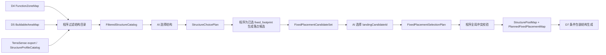

# City D6 案子：结构选择与固定落点规划

## 定位

D6 只做结构选择和固定大小结构的落点选择，不放置结构。

D6 的结构画像来源是 TerraSense 导出快照。TerraSense 还没完全实现时，D6 也要先预留导入接口：优先消费 `StructureProfile.jsonl`，可降级消费兼容层 `C3_5_StructureCatalog.preprocessed.json`，再归一成 D6 内部的 `StructureProfileCatalog`。

D6 的核心目标是：

1. 程序先按功能区和结构尺寸画像过滤结构目录，去掉大小肯定超出功能区的结构。
2. AI 从过滤后的结构中选择想使用的结构。
3. 固定大小结构不由 AI 填占比；它的可见面积消耗由 footprint 决定。
4. 非固定大小结构才由 AI 配置目标可见面积占比。
5. AI 选完固定大小结构后，程序只为这些已选固定结构生成预选落地点。
6. AI 只能从预选落地点中选择 `landingCandidateId`。

D6 不调用 `/place structure`，不解 jigsaw，不 paste template，不修改世界，不让 AI 自由填写最终坐标，也不直接读取 TerraSense 扫描工作区原始目录。真实放置和最终兜底校验留给 D7。

## TerraSense 消费接口

D6 不负责扫描结构。结构扫描、截图、硬事实提取和人工审核属于 TerraSense；D6 只读取 TerraSense 导出的冻结快照。

输入优先级：

| 优先级 | 输入 | 用途 |
| --- | --- | --- |
| 1 | `StructureProfile.jsonl` | 下一代结构画像，一行一个结构，首选输入。 |
| 2 | `C3_5_StructureCatalog.preprocessed.json` | 当前兼容层结构 catalog，作为过渡输入。 |
| 3 | debug structure id catalog | 开发期兜底，只能进入 `needs_review` 或低置信候选。 |

D6 必须把这些输入归一成 `StructureProfileCatalog`，后续主流程只消费归一后的 catalog。

归一映射首版只要求这些字段：

| `StructureProfileCatalog` 字段 | TerraSense 来源 |
| --- | --- |
| `structureId` | `structure_id` |
| `source` | 导出快照路径、run id、vocabulary snapshot id。 |
| `sourceProfileRef` | 单结构来源记录，例如 `StructureProfile` 行号或兼容 catalog 记录 ID。 |
| `profileType` | `profile_type`，例如 `single` / `jigsaw_system`。 |
| `sampleType` | `sample_type`，例如 `single_template`、`structure_assembly`、`jigsaw_assembly`。 |
| `placementKind` | 从 `sample_type` / `placement_command` 推导；D7 真实放置候选必须是 `minecraft_place_structure`。 |
| `placementCommand` | TerraSense `placement_command`；D7 trace 可引用。 |
| `functionTags[]` | `curation.function_affinity` 或兼容层 `function_candidates`。 |
| `styleTags[]` | `curation.style_affinity`。 |
| `placementTags[]` | `curation.placement_affinity`。 |
| `usageTags[]` | `curation.usage_affinity`。 |
| `qualityTags[]` | `curation.quality_tags`。 |
| `fixedFootprint` | `hard_facts.footprint` / `hard_facts.size`。 |
| `allowedRotations[]` | TerraSense placement / constraints；缺失时由 D6 默认策略补。 |
| `connectorsRef` | TerraSense `jigsaw_points` / `connectors` 引用；D6 不解析。 |

导入规则：

- 只默认消费 `review_state=approved` 且术语为 approved 的结构。
- `quality_tags` 包含 `reject` 的结构不得进入候选。
- `needs_review`、`pending`、`proposed` 术语只能在 debug 模式进入 `needs_review`，不得进入正式 `FilteredStructureCatalog`。
- TerraSense 的 `structure_assembly` 可作为整包画像进入 `variable_area` 或固定整包候选，但必须有可靠 footprint 才能进入 `fixed_footprint`。
- TerraSense 的 `jigsaw_assembly` 默认进入 `variable_area`；除非人工审核明确声明固定 footprint，否则不得作为 `fixed_footprint`。
- D7 真实放置候选必须使用 `/place structure` 等价入口，即 `sampleType=structure_assembly` 且 `placementKind=minecraft_place_structure`；`single_template` 和 `jigsaw_assembly` 只能作为画像 / debug 参考，不能作为真实 D7 `structureId`。
- D6 不解析 `jigsaw_points`、`connectors`、pool 或 max depth；这些字段只作为 D7 的引用真值保留。
- TerraSense 尚未完成时，接口可以先接受 mock / debug `StructureProfileCatalog`，但产物必须标记 `catalogMode=debug`，不能伪装成正式导出。

## 结构分类

D6 给 AI 看结构前，程序必须先读取结构画像。

首版只锁两类：

| 类型 | 说明 | D6 处理 |
| --- | --- | --- |
| `fixed_footprint` | 固定大小结构，例如固定广场、市政厅、城门、塔楼、固定码头平台，或经 `structure_assembly` 扫描确认 footprint 稳定的 configured structure。 | 程序过滤大小；AI 选择结构；程序生成落点候选；AI 选落点。 |
| `variable_area` | 非固定大小结构，例如 max depth jigsaw 街区、住宅组团、可变村庄式结构群。 | 程序过滤明显不适用项；AI 选择结构并配置目标可见面积占比。 |

没有可靠尺寸画像的结构不得进入 `fixed_footprint`。它只能作为 `variable_area` 进入候选，或进入 `needs_review`。

## 可见面积

D6 使用 `visibleBuildableArea` 作为结构预算分母：

```text
visibleBuildableArea = D5 BuildableAreaMap.buildableArea
  - 已选 fixed_footprint 的 footprint area
  - 已选 fixed_footprint 的 clearance area
```

固定结构只扣自己的 `visibleAreaCost`，不让 AI 配占比。  
非固定结构的 `targetVisibleAreaRatio` 只针对扣除固定结构后的剩余可见面积。

## 上下游

| 方向 | 输入 / 输出 | 说明 |
| --- | --- | --- |
| 输入 | `FunctionZoneMap` | 功能区类型、几何和面积。 |
| 输入 | `FunctionZoneTerrainStats` | 功能区高度、坡度、水岸和容量摘要。 |
| 输入 | `RoadIntent` / `BoundaryIntent` | 道路、水岸、边界和接入关系。 |
| 输入 | `BuildableAreaMap` | D5 扣除道路、边界、缓冲区和小模板后的可建区。 |
| 输入 | `TerraSenseStructureProfileSource` | TerraSense 导出快照位置和导入模式，可指向 `StructureProfile.jsonl` 或兼容 catalog。 |
| 输入 | `StructureProfileCatalog` | D6 归一后的结构画像目录，包含 footprintMode、尺寸、可见面积、旋转和 clearance。 |
| 输出 | `FilteredStructureCatalog` | 按功能区和尺寸过滤后的结构候选。 |
| 输出 | `StructureChoicePlan` | AI 选择的固定结构和非固定结构；非固定结构包含可见面积占比。 |
| 输出 | `FixedPlacementCandidateSet` | 程序为已选固定结构生成的预选落地点。 |
| 输出 | `FixedPlacementSelectionPlan` | AI 选择的固定结构落地点。 |
| 输出 | `StructurePoolMap` | D7 使用的非固定结构生成菜单和比例预算。 |
| 输出 | `PlannedFixedPlacementMap` | D7 必须优先完整放置的固定结构落点计划。 |

## D6 内部顺序

D6 内部按两轮交互执行，但不新增 D6.5。



### 第 1 轮：结构选择

程序先生成 `FilteredStructureCatalog`。

过滤规则：

- `fixed_footprint` 的 footprint 加 clearance 肯定超过功能区可见面积时，过滤掉。
- `fixed_footprint` 的任意允许旋转都无法完整投影进功能区可建形状时，过滤掉。
- 结构功能标签与功能区不匹配时，过滤掉或降为 `needs_review`。
- 缺少尺寸画像的结构不得作为 `fixed_footprint` 提供给 AI。
- `variable_area` 只做明显不适用过滤，不在 D6 判定最终 jigsaw 能否长满。

AI 在 `StructureChoicePlan` 中选择：

| 选择类型 | AI 可填 | AI 不可填 |
| --- | --- | --- |
| `fixed_footprint` | 选用哪个结构、数量、风格理由。 | 不填占比，不填落点坐标。 |
| `variable_area` | 选用哪个结构池、目标可见面积占比、风格理由。 | 不填 jigsaw 深度、半径、piece budget。 |

### 第 2 轮：固定结构落点选择

程序只为 AI 已选的 `fixed_footprint` 结构生成 `FixedPlacementCandidateSet`。

落点候选必须满足：

- footprint 完整落在目标功能区可建区域内。
- 不压 D5 道路、边界、缓冲区、小模板和 hard reserved cell。
- 大概地形合适：坡度、高差、水体策略通过首版采样。
- 尺寸不会超出功能区。
- 候选包含旋转和 clearance。

AI 只能在 `FixedPlacementSelectionPlan` 中引用 `landingCandidateId`，不能自由填写或修改 block 坐标。

程序在 AI 选择后做全局冲突校验：

- `landingCandidateId` 必须存在。
- 功能区和结构必须匹配。
- 多个固定结构 footprint / clearance 不得互相冲突。
- 不得压道路、hard reserved、功能区外区域。
- 冲突时 hard block，让 AI 重选；程序不自动替换落点。

## 数据草案

### StructureProfileCatalog

| 字段 | 类型 | 说明 |
| --- | --- | --- |
| `schemaVersion` | string | `city_structure_profile_catalog.v0.1`。 |
| `source` | object | TerraSense 导出快照或 debug catalog 来源。 |
| `catalogMode` | string | `official`、`compat`、`debug`。 |
| `structures[]` | object[] | 结构画像。 |

`structures[]` 关键字段：

| 字段 | 类型 | 说明 |
| --- | --- | --- |
| `structureId` | string | 原版、mod 或项目结构 ID。 |
| `sourceProfileRef` | string | 来源 TerraSense 结构画像或兼容 catalog 记录。 |
| `profileType` | string | TerraSense `single` 或 `jigsaw_system`。 |
| `sampleType` | string | TerraSense 样本类型，例如 `single_template`、`structure_assembly`。 |
| `placementKind` | string | D7 放置入口；真实放置候选必须是 `minecraft_place_structure`。 |
| `placementCommand` | string | TerraSense 实际放置命令；`structure_assembly` 候选建议保留。 |
| `footprintMode` | string | `fixed_footprint` 或 `variable_area`。 |
| `functionTags[]` | string[] | 适合功能区。 |
| `styleTags[]` | string[] | 风格标签。 |
| `placementTags[]` | string[] | 位置倾向，例如临路、临水、广场边。 |
| `usageTags[]` | string[] | 主建筑、装饰、地标、公共核心等用途。 |
| `qualityTags[]` | string[] | TerraSense 审核质量。 |
| `fixedFootprint` | object | 固定结构尺寸；仅 `fixed_footprint` 必填。 |
| `visibleAreaCost` | int | 固定结构可见面积消耗；程序计算。 |
| `allowedRotations[]` | string[] | 可用朝向。 |
| `clearanceBlocks` | int | 结构周边预留。 |
| `expectedAreaRange` | object | 可变结构的建议面积区间；仅 `variable_area` 使用。 |
| `connectorsRef` | string | TerraSense jigsaw / connector 真值引用；D6 不解析。 |

### StructureChoicePlan

| 字段 | 类型 | 说明 |
| --- | --- | --- |
| `schemaVersion` | string | `city_structure_choice_plan.v0.1`。 |
| `cityId` | string | 城市 ID。 |
| `zoneChoices[]` | object[] | 每个功能区的结构选择。 |

`zoneChoices[]`：

| 字段 | 类型 | 说明 |
| --- | --- | --- |
| `zonePatchId` | string | 功能区 ID。 |
| `functionType` | string | 功能区类型。 |
| `fixedSelections[]` | object[] | AI 选中的固定结构。 |
| `variableSelections[]` | object[] | AI 选中的非固定结构和目标占比。 |

`fixedSelections[]`：

| 字段 | 类型 | 说明 |
| --- | --- | --- |
| `selectionId` | string | 选择 ID。 |
| `structureId` | string | 必须来自过滤后的 `fixed_footprint` 候选。 |
| `count` | int | 数量；首版建议 1。 |
| `priority` | int | D7 放置优先级。 |
| `failurePolicy` | string | `block_city`、`degrade`、`skip_with_warning`。 |
| `reason` | string | AI 选择理由。 |

`variableSelections[]`：

| 字段 | 类型 | 说明 |
| --- | --- | --- |
| `selectionId` | string | 选择 ID。 |
| `structureId` | string | 必须来自过滤后的 `variable_area` 候选。 |
| `targetVisibleAreaRatio` | number | 占剩余可见面积比例。 |
| `minVisibleAreaRatio` / `maxVisibleAreaRatio` | number | 可接受范围。 |
| `weight` | int | 同功能区内抽选权重。 |
| `reason` | string | AI 选择理由。 |

### FixedPlacementCandidateSet

| 字段 | 类型 | 说明 |
| --- | --- | --- |
| `schemaVersion` | string | `city_fixed_placement_candidate_set.v0.1`。 |
| `cityId` | string | 城市 ID。 |
| `candidates[]` | object[] | 固定结构预选落地点。 |
| `previewRef` | string | 落点候选图。 |

`candidates[]`：

| 字段 | 类型 | 说明 |
| --- | --- | --- |
| `landingCandidateId` | string | 稳定候选 ID。 |
| `selectionId` | string | 来源 `fixedSelections[].selectionId`。 |
| `zonePatchId` | string | 功能区 ID。 |
| `structureId` | string | 固定结构 ID。 |
| `anchorBlock` | object | 程序候选中心点。 |
| `rotation` | string | 候选朝向。 |
| `footprint` | object | 投影 footprint。 |
| `visibleAreaCost` | int | footprint + clearance 面积消耗。 |
| `scoreBreakdown` | object | 内侧程度、平坦度、道路接入、水体风险等。 |
| `riskFlags[]` | string[] | 候选风险。 |

### FixedPlacementSelectionPlan

| 字段 | 类型 | 说明 |
| --- | --- | --- |
| `schemaVersion` | string | `city_fixed_placement_selection_plan.v0.1`。 |
| `cityId` | string | 城市 ID。 |
| `selections[]` | object[] | AI 对固定结构落点的选择。 |

`selections[]`：

| 字段 | 类型 | 说明 |
| --- | --- | --- |
| `selectionId` | string | 对应固定结构选择。 |
| `landingCandidateId` | string | 必须来自 `FixedPlacementCandidateSet`。 |
| `reason` | string | AI 选择理由。 |

### PlannedFixedPlacementMap

| 字段 | 类型 | 说明 |
| --- | --- | --- |
| `schemaVersion` | string | `city_planned_fixed_placement_map.v0.1`。 |
| `cityId` | string | 城市 ID。 |
| `placements[]` | object[] | 经程序全局校验后的固定结构落点。 |
| `remainingVisibleAreaByZone` | object | 扣除固定结构后的剩余可见面积。 |
| `quality` | object | hard block、warning 和指标。 |

## 产物目录

`run/realm_debug/<runId>/city_d6_<citySeedId>/`

| 文件 | 说明 |
| --- | --- |
| `structure_profile_catalog.json` | 结构画像目录或引用快照。 |
| `terrasense_profile_source.json` | TerraSense 导出快照来源和导入模式。 |
| `filtered_structure_catalog.json` | 按功能区和尺寸过滤后的候选结构。 |
| `structure_choice_plan.json` | AI 第一轮结构选择。 |
| `fixed_placement_candidate_set.json` | 程序生成的固定结构落点候选。 |
| `fixed_placement_selection_plan.json` | AI 第二轮落点选择。 |
| `planned_fixed_placement_map.json` | 程序校验后的固定结构落点计划。 |
| `structure_pool_map.json` | D7 使用的非固定结构生成菜单和比例预算。 |
| `structure_choice_preview.png` | 结构选择预览。 |
| `fixed_placement_preview.png` | 固定结构落点候选和 AI 选择预览。 |
| `quality_report.json` | hard block、warning、needs_review 和指标。 |

## D7 交接

D6 向 D7 交付两类内容：

| 产物 | D7 用途 |
| --- | --- |
| `PlannedFixedPlacementMap` | 优先完整放置固定大小结构；不允许裁切。 |
| `StructurePoolMap` | 在剩余可见面积中按比例和规则生成 `variable_area` 结构。 |

D7 不能改变 D6 选定的固定结构落点。固定结构在 D7 要么完整放置成功，要么按 `failurePolicy` 失败 / 降级 / 跳过。

## 非目标

- 不新增 D6.5。
- 不让 AI 自由填写固定结构坐标。
- 不让 AI 给固定结构填写可见面积占比。
- 不在 D6 解 jigsaw 或配置 jigsaw 深度 / 半径 / piece budget。
- 不在 D6 直接扫描 TerraSense workspace 原始目录；只消费导出快照或显式 debug catalog。
- 不在 D6 修改世界。
- 不让程序在固定结构落点冲突时偷偷自动替换 AI 选择。
