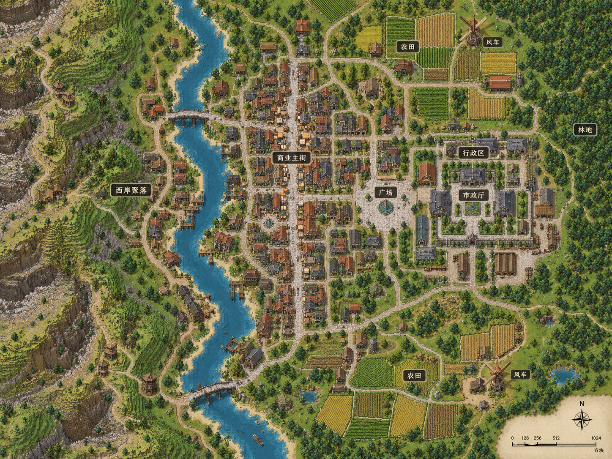

# City 意图驱动规模与嵌套设计

**职责身份：实现当前案（城市设计与生成衔接主线）。** 主责任为 D4。2026-09-17 用户确认并授权一次初版、整体性扩张与受控挤占，在本案继续收敛，不新建竞争案。景观生长与道路自身规则仍由各自职责链负责；本案的扩张挤占针对已设计结构建筑。

## 需求原话

2026-09-17 用户确认本次流程，优先于下方此前原话中允许初版反复修饰、要求连续贴靠的表述：

> 麻烦看看当前的D4流程，我个人感觉太罗嗦了
>
> 我打算简化为这样：
> 1、依旧是提交总览这种，总览时就可以标记
> 2、每个功能区做一次初版设计，只要不报错格式错误都给通过，地形这种是纯粹的程序兜底，除非全不通过否则其他的都不允许AI重试。
> 3、得到一个总览图，此时可以由AI标记一波，到底哪些功能区是打算连起来的，哪些是打算做为独立功能区的（这个非常严格，只有如边防哨塔、边缘矿区、郊区工业区等等类似的这种独立，才允许标记为独立）
> 4、开始准备让各个非独立功能区连为一个整体，进行以下流程
>      （1）看总览，检查各个功能区的位置关系，有没有不够近的，有就选择一个要扩大的功能区，这个是公共步骤
>      （2）标记这个功能区可以不允许挤占谁的位置，其他的则都可以挤占掉其他功能区已经设计的结构建筑。
>      （3）只允许两种改法，要么调整这个功能区的阵列，如增加嵌套、调大参数。要么就使用向外阵列，往目标方向扩张。
>      （4）此时查看总览，俩功能区的地理上临近得像一个整体了没，没有就继续处理这个功能区，临近了就直接结束。
>
> 重复步骤到agent满意，然后提交

> 嗯，但是挤占我觉得又不能给其他功能区给直接挤完，而且临近这个指标我觉得我们可以再精确点，没必要一定要相连这种，比如有时候可能隔着一条河这种，AI自己觉得有整体性了就行

在确认“程序阻止整区被清空、AI 看图判断有效功能主体；整体性允许隔河，不要求接触或固定距离”后，用户授权：

> 嗯，严格按照这个需求完整开发


关于规模约束、逐栋地形筛选与调用效率的最新确认：

> 所以你问的是这个分档硬要求是怎么确定吗
>
> 首先我觉得硬面积是和适应地形、适应建筑冲突的，所以我考虑的方向才是要求阵列算法的使用程度来限制AI的落地结构数量

> 我感觉不应该再用地形来决定失败了吧，阵列应该是能够落下，但是地形限制的区域直接不落就行了，如山脉这种，对于凹下去得看是小水坑、小土坑，还是真的是湖泊、峡谷部分，如果只是的做个台面就行了。
>
> 我感觉更合理的应该是把阵列的结果发给AI自己判断，到底合适不合适，而不是程序直接否定，我觉得程序要做的应该是否定掉的是建筑级别的单位，而不是整个阵列

> 嗯，这个方案是不是一个大城市也就最多20次调用，我感觉还是很好的，一座大城市设计5分钟以内感觉，我们这边程序要做的是拦截格式参数错误，然后返回预览结果防止出现那种地形不符合的情况而已。

在说明约 20 次调用、5 分钟属于效率目标而非失败门槛，且程序仍保留逐栋地形与碰撞安全检查后，用户确认：

> 嗯，写进案子里吧

上述确认取代后文旧原话中“局部地形失败必须修改方案”的解释：正常地形不适配按建筑筛选并返回结果，是否接受由 AI 看预览决定。

关于连接不补建筑与完整阵列相邻落位的最新澄清：

> 对的，因为就算是做连接，连接这个动作本身就是乱填建筑，本身就会冲淡结构的设计感

> 我不是在说自动的，我是说这个算法本身。
>
> 因为我的想法是在一个阵列旁边再挤一个阵列。这两个阵列其实是有种两个正方形的关系的，而这两个正方形的锚点很可能都是中间0.5，0.5的位置，我现在是想这个问题

> 对就是这个问题，我就是好奇现在的向外阵列的中心点是否也是中心，因为一个阵列的面积配好参数就确定了，所以应该是能够算出来是否挤得下的。
>
> 而且现在的阵列后用的形状是否是包围盒呢，还是说是多边形

> 规则图形是很好的，这个就是很适合城市设计的，甚至可以不局限于立方形以后还可以根据阵列调整图形，这都是后话了，那么这段讨论有什么值得加入案子的吗，如果现状就很好那就不用加了

在确认“连接不补建筑、完整阵列相邻落位”两点后，用户要求：

> 嗯改改

以下保留此前原话；其中“外扩只负责连接”按上述最新澄清执行，不再允许连接过程补建筑。

关于集中 review 规模控制：

> 嗯，我觉得集中写在一个地方我好review一点

> 感觉不能滥用外扩，而是应该硬性要求嵌套，这次城市和大城市是否遵守了嵌套的界限呢

> 我感觉是不是应该规定AI阵列的参数最大最小值？不然这样得到的城市仍是没有什么语言的。
>
> 这个参数感觉可以通过面积和本次选择的结构池的面积算出来。
>
> 比如大都市，程序要求某个功能区2000平方米的面积，那么我们手头有几个建筑就拿这几个建筑的面积，让AI估计一下要多少个建筑，引导他根据这个数量来设计阵列和阵列嵌套

> 感觉是不是应该做成类似skill的就好了，比如先设计并提交出几个功能区，交代各个功能区的设计意图。这样后面的agent就可以通过这个意图搜建筑，再推进到下一步预估数量。
>
> 但是我又想到了好像一开始无法估计面积啊，因为地形是有限制的

> 我觉得外扩只负责连接就行了，核心还是得又AI设计出来，尤其是鼓励他使用阵列嵌套，也就是我之前说的那种linear + grid的这种类型，这种才能保证规模和含义都有

> 嗯，确实应该取消，因为我感觉这种拓张是无意义的，效果还不如原本的村庄生成其实

> 但是我记得功能区的面积是取决于建筑的吧我记得，我们的功能区不是像国度那样用扩张力的

> 对的，写两个案子吧，一个是这个规模的，另一个是这个景观的

此前仍有效的用户原话：

> 先不急，我觉得限制地面工程的是对的，现在这样的限制就很好。
>
> 然后我觉得首都的这种是限制的问题，我觉得大规模城市必须使用阵列嵌套，这点是应该明确写进限制阀门并告诉AI的。
>
> 目前我们有几个规模呢，我觉得可以分档来调整城市的大小

> 确实，那么什么个尺度好呢，而且如果遇到地形冲突某个阵列落地不了，是不是这一块的子阵列直接不出现而不是让AI回退重写方案呢，还是说让AI可选？

> 嗯，话说这个地形，是不是沿岸长出东西来是最好看的呢？如果是我抛开一大堆限制进行设计的话，我会在河岸两侧做一簇一簇的商业街和农业区，一片一片的。然后下来就来一个linear，linear的俩侧都是grid，得到一个商业区。之后来一个大广场，这个广场的西侧连接上linear的干道东侧则是连接行政区，行政区整体采用grid，里面市政区自己来个院落阵列，里面还有大房子和仓储、马厩这些。再过去东侧则是林地。
>
> 你觉得呢，你会怎么设计，我们目前还缺什么

> 感觉其实差不多，主要现在还真是少了嵌套就显得很孤零零的。
>
> 还有沿岸这种，这个方式的还是很合适的

> 我怎么感觉一旦写了这玩意进到案子了绝对会又搞出枚举之类的

用户认可删除独立接口功能、沿用阵列布局和既有道路机制的调整方向，随后要求：

> 对的，你再检查一下，是不是有把需求无关的东西也写进案子的情况，已经有没有这种特殊化的内容

> 如果是这样，那也还是不管了吧，我们的台面也改改呗，如果遇到那种发现台面要建立起来需要超过一定高度的，那就建成类似桥一样的，比如设置最大高度是16，超过16就在底部生成个黑石栅栏表示像桥一样的设计吧。反正核心目的就是要用台面来保护D4的设计不被奇奇怪怪的地形恶心

关于道路与阵列先后关系：

> 那么这样的话就是先有路再有阵列？或者主路去调整阵列后的各个建筑的位置或者整个阵列的位置，往下的所有次级的则是由具体的建筑生成
>
> 你可以思考一下各种案例，比如什么北欧、瑞士农村，他就是比较美观的那种农村设计

用户纠正了将上述例子理解为固定村庄类型、先路后阵列的方向：

> 也不是这个意思，我举例北欧和瑞士是人家的村庄是因为我看到过那种沿山的设计，其实就是我们直接在一个slope上用compact阵列，中间以各个为端点就能形成S型的主路

写案后用户进一步纠正道路层级；上段原话保留，AI 总结按本次最新澄清区分城市主路与农村次级通路：

> 嗯？我们之前提到的主路设计呢，怎么只剩一个农村的了
> 农村这个不是全是次级道路吗

关于持续修订：

> 说实话agent loop相关的有必要就给只他三次吗，而且报错的时候到底有没有教他怎么改，我在E:\Mod_Dev\StructureBinder_designfirst_baseline的时候明明每报错一个，就跟着报错调一次参数，然后就自然过了啊，为什么现在我看GLM都改了五次了，连D4都过不了

关于能指导下一步的报错：

> 没有类似：
> 当前修改未通过；底图保留上次有效方案，红框为本次失败位置。 交界容量不足：8 个模板未排入；136 个候选受落位侧、地形、碰撞或作者旋转限制。可调整范围、素材、间距或选侧。 交界仅为 16 格采样轮廓；未验证水深、岸壁支撑、工作端或靠泊侧。朝向仅使用作者已标记入口。 &#x20;
>
> 这种的报错吗，这种报错一眼就知道下一个要改什么参数

关于现场不合格表现：

> 道路被截断，两个功能区意义不明，还出现了非常多大坑。同时整个城市就一个大平面，还垒得高高的，还不如9月2日版本的人家的台面，各个高度的台面互相能形成层次感

关于主路连接点与阵列接入空间的后续确认：

> 嗯这个方案试试，因为你让AI选一个点会很痛苦

> 感觉这样有点复杂了，尤其是阵列后还要挤建筑，我觉得应该是道路给建筑让步，因为他是后面来的

> 稍等一下，我感觉是不是有点问题现在，我之前测的时候，经常看到主路在一个阵列的外侧的，我觉得这个就是阵列前置的问题。
> 或者阵列里是不是感觉就在阵列的时候就已经计算好主路的接口，因为像linear就有道路的两头可以接，广场也可以接，院落也可以接，compact这种则是这种只要主路在附近就好了

> 嗯写进案子里吧，也就是阵列的时候就得给主路留空间
>
> 然后我们的agent loop重试也就是D4 submit的时候给到10次吧，不是那个消耗次数的，是格式相关的那种，给AI多试几次

## 示意图

```text
地形预览 → 功能区意图 → 搜索素材 → 空间与数量估算
                                      ↓
                           AI 组织阵列和嵌套
                                      ↓
                           一次初版 → 总览判断与受控扩张 → 完整 D4

组合示例：
   [GRID 街区]       [GRID 街区]
         │                 │
 ═══════════ LINEAR 主街 ═══════════
         │                 │
   [GRID 街区]         [院落组团]
```

示例表达主街组织街区的设计含义，不是所有城市必须套用的布局模板。

```text
AI 设计完整阵列 B → 计算 B 的整体占地 → 在已有阵列 A 旁寻找位置

┌──────────────┐       ┌──────────┐
│ 已有阵列 A   │ 间距  │ 新阵列 B │
│ 内部布局保留 │       │ 按设计排布│
└──────────────┘       └──────────┘
           道路按通行需求连接，不在间隙自动补建筑
```

矩形表达阵列的整体占地；不规定内部原点必须在中心，也不要求所有功能区紧贴排列。



概念图用于表达尺度与空间组织，不作为固定城市模板。


本次流程：总览及预标记 → 各区一次初版 → 实际总览确认主体/外围独立区 → 选一个区及保护名单 → 调整阵列或朝目标向外阵列 → 看总览判断整体性与功能保留 → 继续同一区或选择下一处 → 满意后提交。河流等合理间隔不需要填满。

## AI 需求总结

### 1. 总览先交代功能区和设计意图

AI 根据地形、城市规模与作者素材提出城市主题和功能区，总览时即可预标哪些属于城市主体、哪些是独立外围区。素材按需查询，数量与阵列嵌套服务具体功能，不以面积补量自动生成建筑。保留原有图中主体、道路、院落和沿岸布局的设计意图，不要求每座城市使用同一套构图。

### 2. 每个功能区只做一次有效初版

**各区一次初版，有有效落位就直接推进**。格式、参数和引用错误可修正；地形与碰撞由程序逐栋筛选，小坑由适当基础保护，山体、河湖与深沟不强行填平。部分建筑缺失不能让 AI 为美化、补数量或提高落位率重试；**只有当前功能区全部建筑和景观都无法落位才允许重做该区**。不再要求逐子阵列看图、登记评价或单独完成才进入下一区。

### 3. 普通区组成城市主体，独立例外严格限定

初版完成后看实际总览确认组织关系。**普通功能区默认属于同一城市主体**；只有边防哨塔、边缘矿区、郊区工业区等用途本身适合独立的外围区域，才可说明理由并标记独立。不能因难融合、地形裁减或距离较远就改标独立。独立是空间组织判断，不等于必须断开道路。

### 4. 一次只处理一个功能区的融合扩张

AI 看总览选择尚缺整体性的一处，决定扩大哪个非独立区、向哪里发展，并标记不能挤占的其他区。**只允许调整该区的阵列与嵌套，或向目标方向追加完整向外阵列**。新增建筑必须属于明确设计的阵列，不能随机填房、为连通自动补房或借道路代替城市主体。扩大后返回实际总览；本处尚未成立就继续处理同一区，成立后结束本次处理，再从全局选择下一处。

### 5. 允许局部挤占，但其他区必须保有功能主体

受保护区保持已有位置，其他区的部分结构建筑可退让。**不能把其他功能区挤空，也不能只剩与原用途无关的配套**，例如矿区不能只剩宿舍，市场不能只剩装饰。程序阻止整区被清空，AI 根据总览判断实际有效主体是否仍成立；不设统一保留比例。替换以完整建筑为单位，仅在新建筑可以有效落位后发生，其结果持续保留，不在下一轮恢复被替换建筑。

### 6. 整体性由 AI 判断，不要求地理接触

**是否像同一座城市，由 AI 看实际布局、尺度、朝向及中间空间判断**。两区隔道路、广场、绿带或河流仍可成立，不要求边界接触、道路连通或固定距离，不强制填满空隙，也不为证明整体性自动架桥。全城已经具有整体性且所有功能主体仍成立时可直接提交，不要求至少修改一次，不为完成流程凑动作。

### 7. 保留建筑、道路与自然地形的真实落地关系

阵列为自身通路与主路接入预留空间；城市主路服务真实目的地，程序选择实际入口与连接点。道路不能为后生成的路线移动或删除建筑，功能区融合不自动产生道路或桥梁。台面结合建筑、铺地需求和地形形成合理高差层次，农村和自然景观可以保留原地形；基础与架空处理不能抹平河湖、山体或峡谷。设计预览不等于实景美观及可达性已经验收。
