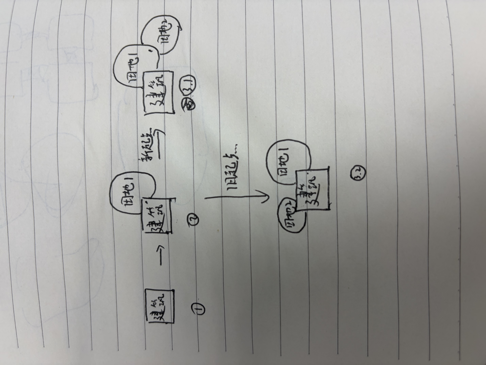

# City 景观独立空间与代价生长

**职责身份：实现当前案（景观规划与落地衔接）。** 主责任为 D4 景观空间设计，涉及真实地形落地。2026-09-14 用户确认采用粗地形设计、有限局部地表检查方案并接管实现。变更方向是让景观独立提出空间需求，并以有代价、可停止的生长代替为精确分割反复回退；不沿用建筑面积决定全部景观规模的前提。城市建筑主体设计由同批[意图驱动规模与嵌套设计案](../City意图驱动规模与嵌套设计-v0.1/README.md)负责。

## 需求原话

> D4我是觉得没必要像以前一样画面积的？反而可以直接让AI直接在D4就扩张，选一个点，然后设定的面积直接是几个cell？这个cell就从这个点开始扩张，这时候只需要配允许的地形、cell数量和景观的参数就可以了，如果达不到规定的数量也没必要报错，直接允许通过我感觉也挺好的？应该优先的是让ai看预览图的效果符不符合预期

> 尺度肯定要说明，但是这个从预览图就看得出来了吧，不过最后的编译后的景观该怎么走呢，我很担心几个情况，一个是变成区块为单位的一个个正方形的，一个是又开始出现那种只有俯瞰图能看的情况，田地会掉到峡谷里

> 嗯试试这个方案吧


> 嗯，那么还有另一个问题，就是景观还是太保守，要不我们景观直接做为功能区的一个配置？就是比如农业区、林场、花园这种，全都算成一个独立的功能区，目前景观是咋样设计的呢，是AI填面积吗

> 但是我记得功能区的面积是取决于建筑的吧我记得，我们的功能区不是像国度那样用扩张力的

> 是，所以我觉得好像确实得让景观独立点，可以抢空地但是不要抢其他功能区的地，感觉可以在D4的时候做点带代价的扩张，到了真实落地的时候再走带代价的落地。
>
> 说实话我之前一直想不通为什么在落地前景观会大量消耗，如果是有代价的，那么不应该是只需要判断当前生成的格子的地形，是否还足够cost吗，为什么会有各种各样的大消耗的搜索呢

> 对的，写两个案子吧，一个是这个规模的，另一个是这个景观的

此前仍有效的用户原话（节选）：

> 对，我觉得简单来说可以是
> 1、必须是扩张算法，严禁使用这种固定图形省事和保底
> 2、需要有多样性，这里就靠AI配权重配类型等参数

其中旧的强制区域接力要求已由本轮允许近似、局部停止的确认替代。

> 我最担心的问题是过渡设计，比如加了一大堆没必要的限制。我们的核心是美观和工整，是从城市设计角度来的，而且就几个要求，功能明确、界限分明、有主有次。

本次用户确认补充：

> 你先别急着改，我觉得可以解耦景观和建筑

> 而且这景观既没建筑又没道路连接，感觉很野生啊

> 嗯，你先改改景观呗

## 示意图

```text
农业功能区：大片农田为主体，农舍、粮仓等嵌入其中
林场功能区：林地为主体，伐木屋和堆场提供配套

D4：景观意图与规模 → 在可用空地上按代价生长
                         ├─ 其他功能区占用或预留：禁止进入
                         └─ 达到目标／预算耗尽／无可用空地：停止
                                      ↓
真实落地：在确定范围内检查精细地形，按代价局部适配
```

农业区、林场、花园是设计用途示例，不是新增的固定功能区类型。



保留不同大小地块与局部分支的视觉意图，不要求精确父子接力分割。

## AI 需求总结

### 1. 景观作为功能区的主体内容

功能区可以直接设计景观内容，允许农业区、林场、花园以景观为主体、建筑为配套；行政区内部的小花园等也可以作为区内景观。**景观可以独立提出规模与空间需求，不再只能由几栋建筑的占地乘比例决定大小。** 功能区实际范围由建筑、景观和通行空间共同形成，不改成国度式先扩张划地。AI 选择起点、目标 cell 数量、允许的地形和景观内容；明确每个 cell 的实际尺度。数量独立于配套建筑大小，不预设城市统一面积硬值。

### 2. 使用空地，保护其他功能区

景观可以向可用空地生长，**不能侵占其他功能区已经占用或预留的空间**；这些空间是禁止进入的边界，不是多付一些代价就能穿过的区域。区内配套建筑与通路仍可嵌入景观，景观裁让这些实际布局，不顶掉建筑。Patch 是地形分析标签，不是功能区硬边界；在不侵占其他功能区的前提下，可以使用相邻 Patch 的合适空地。所有设计继续限制在城市原预览范围内，外侧安全圈不能变成景观扩张用地。

### 3. D4 按地形代价形成景观范围

D4 根据当前可用地形信息、景观目标及预算决定景观向哪里生长；更难适配的地形消耗更多代价，禁止进入的地形与空间仍保持禁止。达到规模目标、预算耗尽或没有可用空地时，允许停止并展示实际规模与缺口，**不为了凑足面积无限寻找替代形状**。**数量是期望，不是通过门槛**；不足甚至零格也保留反馈，由 AI 看预览决定是否调整。

### 4. 真实落地按精细地形局部适配

真实落地在 D4 已确定的景观范围内，结合实际高度、水体等判断局部生成与地形处理的代价。超出限制的位置可以跳过或局部调整，并展示与设计的差异；不得越界抢地补量，也不因局部地形变化重新搜索整片景观。D4 的粗略判断不等于逐格落地保证。编译保存设计，区块正常生成时才在有限邻域检查实际地表；以设计参考高度防止田地落到峡谷底，浅小坑允许有限修补，深沟陡崖局部跳过。水体另查底部和侧面支撑。不能为了检查景观触发远处区块生成。

### 5. 比例允许近似，停止精确分割回退

树林、灌木、花草等内部比例用于指导外观，**允许近似，不要求精确凑齐每一种内容的格数**。普通景观可以形成几簇，不为了强制各类内容连续接力、精确占比或保持全部剩余空地连通而反复撤销重算。实际承担通行用途的路径保留必要的通行要求，但不能将这种要求扩展到所有装饰内容。景观应在合理工作量内形成可用结果，局部不足如实呈现，避免一小块景观导致整城长时间阻塞。

### 6. 保留不规则轮廓、内容多样性和自然地形

景观通过实际空地上的生长形成不同大小、方向和轮廓，不用同尺寸圆、菱形、矩形或固定图案重复铺设，也不以固定图形作为失败保底。AI 选择景观内容、候选权重以及作物、花种、树种的多样性，程序落实这些选择，而不是要求 AI 画逐格形状。农田、林场和牧场保留自然地形，不为二维连通强行跨过断崖，也不统一铺成城市平台。**整个景观共享同一设计轮廓，区块仅执行其中的部分**，不得每个区块单独画一个方田。

### 7. 区分归属，保留田块间隔与少量支路

区分整片功能区景观、单栋建筑地块绿化与道路沿线装饰，不能用大量建筑锚点替功能区景观撑面积。功能区景观不因某栋配套建筑缺失全部删除。**景观与建筑解耦不等于随意散落**：AI 应从实际总览判断其用途和与城市主体的关系，不能用零散景观掩盖城市主体不足；不因此要求每片装饰都接道路，或让程序自动补桥补路。相邻大型田块保留一格未耕作的田埂、小径或草带，不要求每条田埂接入正式道路；农业建筑可以使用阵列，但景观承担内部流线时只为建筑入口保留必要支路，不能每遇一行建筑就铺一条贯穿农田的城市街道。
