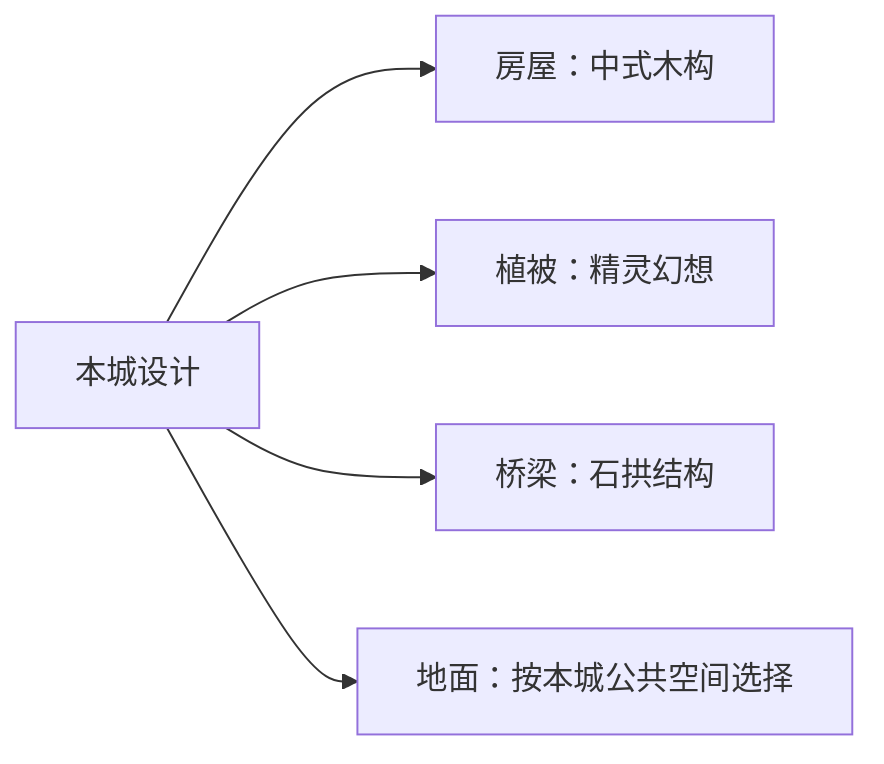

# 城市分项风格与换皮

**设计中案 · 2026-10-05**。[返回总览](../../../../../../../10_product/城市设计与完整落地/README.md)。本轮整理需求，尚未接管实现。

主责任是 D4 的全城设置，后续生成沿用设计选择。房屋、植被、地面和桥梁分别选表达，统一方案之下允许局部精修。

## 不同内容可以采用不同风格

<small>原话：“其实完全可以房子都是中式的，但是植被全部都是精灵的那种奇幻风树木或者草地设计”</small>

**AI 总结：** 建筑风格不包办全城。房屋、植被、地面和桥梁可分别选择素材方向，再组合成统一城市。公共区域和景观的选用、是否换皮在全城设置中交代，不要求逐栋重复填写。

例子说明可以混搭，不规定每座城市固定采用四项组合。

## 整体统一，局部只改一部分

<small>原话：“我原本设想的是换皮是有的可以统一风格换一次，同时各个结构也可以精修换一小部分”</small>

**AI 总结：** 先给所选范围一套统一材料方案，具体选结构时再调整少数部位。没有局部修改的部分继续继承整体方案；没有适用整体方案的部分使用素材原样。只改被标记可换的部位，不把屋顶换材连带施加到家具。

整体方案可以针对全城或所选风格分别设置；沿用全城默认、所属风格调整、单个结构精修的次序。结构未改的部位继续继承，不必反复填写整套方案。

## 材料变化与造型变化分开

<small>原话：“这些东西只需要换一下材质又能得到其他东西，因为我们配套的只是结构而已”</small>

**AI 总结：** 换皮复用已有形体；需要另一种桥型、树形或房屋组合时，另选结构或形体。可用部位及材料来自素材说明，未支持的效果要作为素材需求提出。
