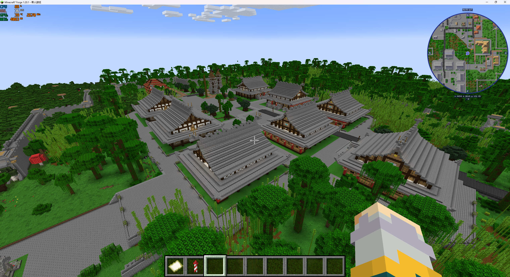
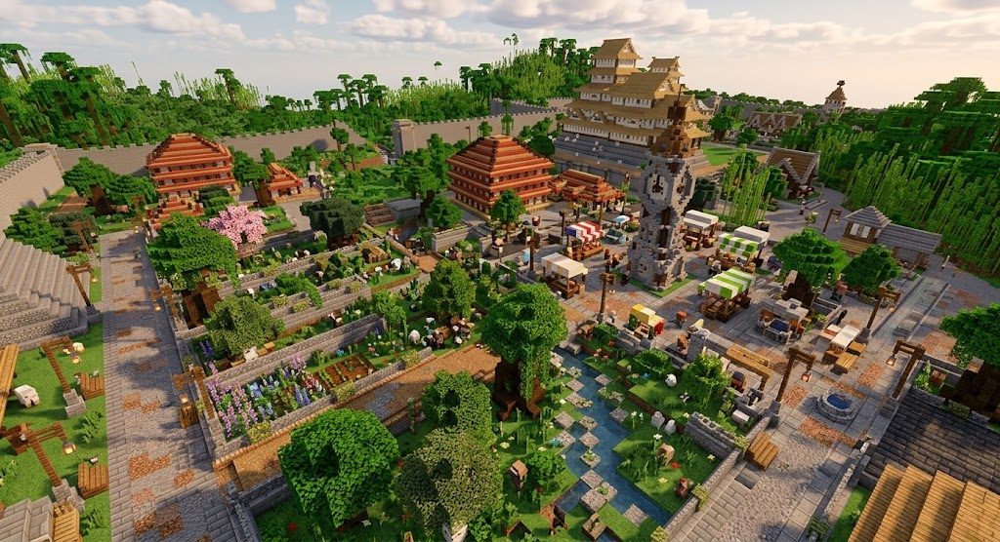

# 结构选材与阵列表达

**实现当前案（结构角色选材与核心组合审查升级）。** 2026-09-21 用户确认并授权完整开发。 属于[聚落空间与地表升级](README.md)。

## 需求原话

> 这样的话我感觉现在这方面反而应该提高的是我们标记的质量？也就是标记核心和填充的质量，现在是不是就是核心太多了或者把核心建筑也标记到填充里去了？

> 核心建筑必须使用阵列才能落地，这样的话就不会再出现这种大而空的情况了（在我们的填充和核心的标记得好的情况下）

关于配套未落下、只剩孤立核心时返工：

> 要不干脆先试试，看看到底会返工几次，我感觉返工率不一定高，先把这个需求也写进案子吧

## AI 需求总结

### 改善核心／填充标记与选材

核对并改善素材角色标记及填充候选池，避免主体结构被无差别重复填充，让已有小店铺、摊位、喷泉等能与主体形成**大小搭配**。核心不必最大，填充是否合适取决于重复使用和配套效果；具体重标标准与名单待定。

现状与效果参考：关注大小搭配，不要求复刻。

[现状原图](images/现状_建筑群.png)

[参考原图](images/参考_城区集市.png)

### 核心纳入阵列组合，孤立时返工

- **设计要求**：本次承担核心作用的结构必须纳入阵列，由 AI 同时安排配套结构或子阵列。
- **结果要求**：预览只剩孤立核心时，调整选材或布局，不能仅因核心落位就算完成。
- **素材复用**：素材自带的院落、花坛和座椅计入组合效果，不重复添加；四角加树等额外组合再用阵列。
- **试行方式**：先保留返工要求，观察实际返工次数，再决定是否放宽；沿用既有失败处理边界。

### 阵列算法改进待定

标记与选材改善后，再结合效果图判断主次和大小混排。COMPACT 允许全用小模板；具体间距、嵌套和随机组合方案尚未确定。不按广场、集市等场景新增专用生成系统，继续由 LLM 结合地形组织结构与阵列。

中心对称的米字形问题已单独确认改为围绕核心、偏十字方向组织，由[阵列当前案](../../30_D4蓝图编译/City阵列主从骨架与街带-v0.2/README.md)承接本次改进，不代表本设计案其余需求接管实现。

[参考原图](images/参考_中心钟楼与公共花园.png)
