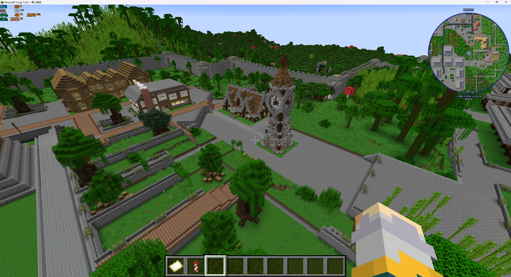
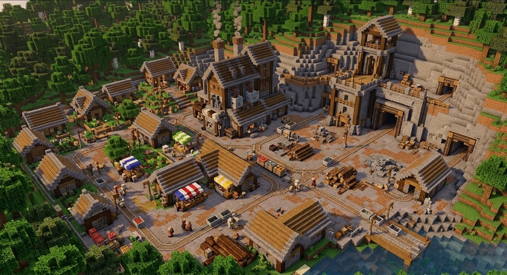

# 台地与贴地道路

**实现当前案（聚落台地适用与贴地道路升级）。** 2026-09-21 用户确认并授权完整开发。 属于[聚落空间与地表升级](README.md)。

## 需求原话

> 看了他的村子的图我感觉我们现在的村子有点滥用台地了，尤其是村庄这种，其实只需要让Structure使用地形兼容落地到地上就行

> 我觉得这种地方既然都没形成台地了，那么道路也应该退到村庄道路，也就是类似Road Weaver的那种直接在原地表上修改得到道路的

> 其他提到的村庄和原始地形暴露的问题我觉得还是得修的

## AI 需求总结

### 减少村庄逐栋垫台

普通村庄结构可依靠自身地形兼容直接落地，减少每栋建筑独占抬高台面的情况。**保留合理台地与高差**，不是禁止村庄使用台地。

现状：台地与相邻地面的关系。

[现状原图](images/现状_钟楼与台地.png)

参考：通过结构组合形成层次，不必全部垫台。

[参考原图](images/参考_矿业村.png)

### 非台地区域道路贴地

- **未形成台地**：道路在原地表修改生成，与直接落地的结构衔接，修正继续按台地逻辑架高的效果。
- **已形成台地**：道路使用台地高程，高差处保持通行衔接。
- **沼泽等地形**：避免零碎起伏、杂乱架高；具体水域处理方式待定。
