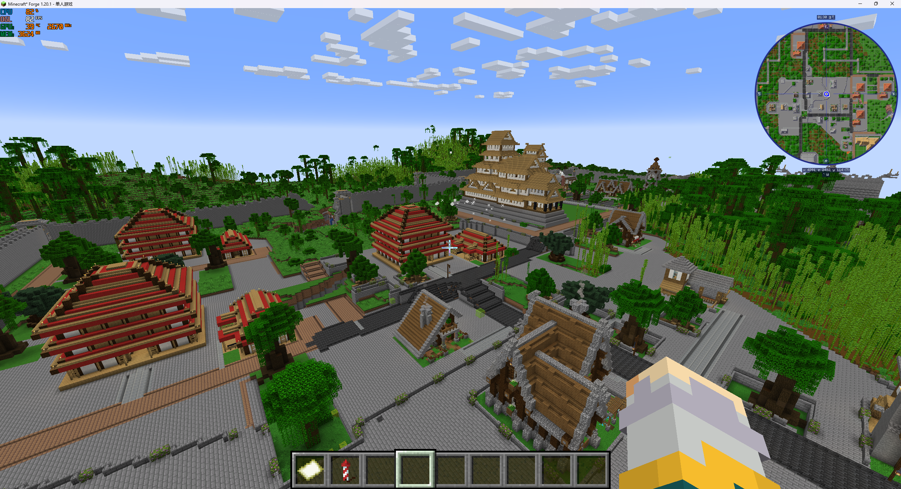
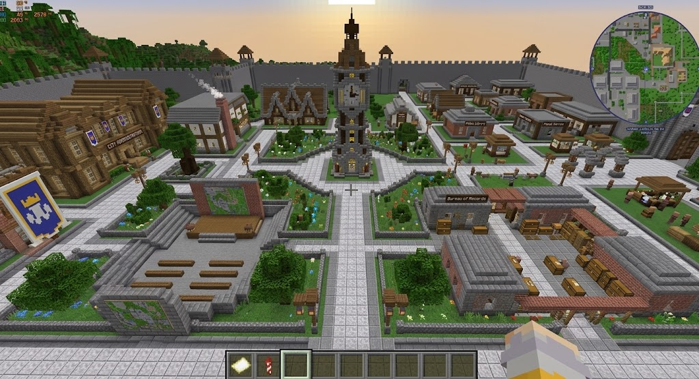

# 城区地表与公共绿化

**实现当前案（城区公共地表与绿化升级）。** 属于[聚落空间与地表升级](README.md)。2026-09-21 用户确认并授权完整开发。

## 需求原话

> 我们的城区里面会保留特别多的原始地表，就是台地周围的不知道是绿化带还是没形成台地的区域

> 应该改为我们生成的绿化带，我们可以用配置和预设让这些绿化带长得漂亮点，但是我感觉绝对不能用原始的群系植物来凑合

> 其他提到的村庄和原始地形暴露的问题我觉得还是得修的

## AI 需求总结

### 整理公共绿化候选素材

优先整理已有模板，复用现有结构落地能力，不因素材名字含“绿化”就直接纳入自动放置。

- **小型独立结构**：树木、花坛、树池等供程序在合适公共空地选用，按实际尺寸避让结构、入口和道路。
- **完整组合结构**：花园、喷泉庭院等保留自带装饰，由 AI 作为结构参与阵列设计，不自动塞入零碎间隙。
- **地表预设**：草地、花草、低矮灌木的搭配负责模板之间及不规则边缘，使用受控材料和密度。
- **素材判定**：核对实际占地、连带装饰、地基和高差要求，以及适合独立或成排使用的方式。道路树可共享适用素材。

### 处理城区间隙的原始地表

将城区内台地周围、结构群之间的间隙纳入公共地表处理，消除无意暴露的原始地面与群系植被。**没有台地也需要处理**，但不要求全部铺石地或抹平高差。

[现状原图](images/现状_建筑与铺地.png)

### 使用受控公共绿化

用自己的配置与预设组织植物搭配、绿化边界及视觉效果，与通路、结构和台地衔接，**不用原始群系植物凑合**。建筑自带装饰继续随素材使用，不逐栋自动补一圈绿化；素材内的装饰不能替代结构之间的公共地面处理。具体预设待定。

参考：绿化有边界，通路有留白，不要求复刻固定形状。

[参考原图](images/参考_中心钟楼与公共花园.png)
