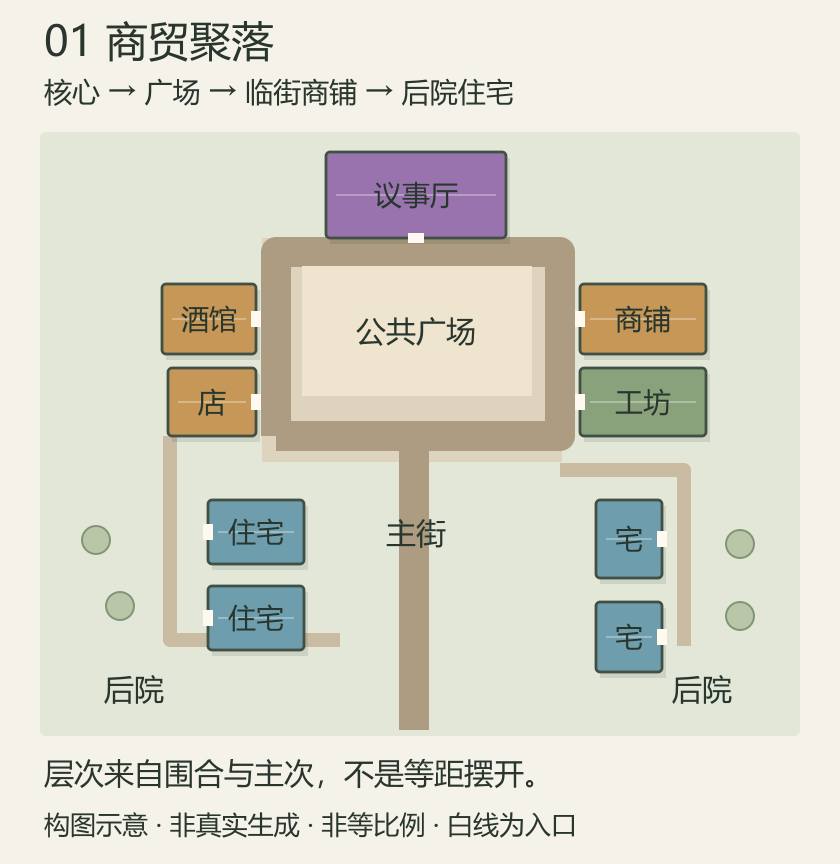
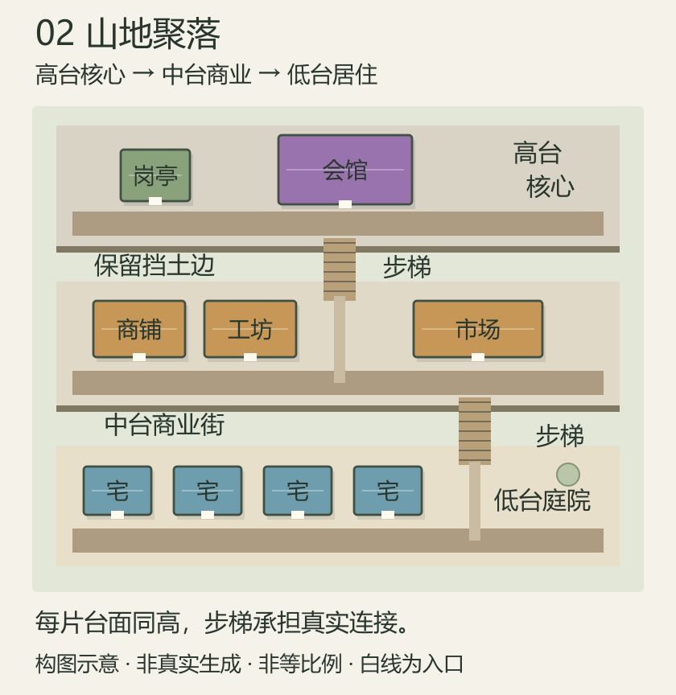
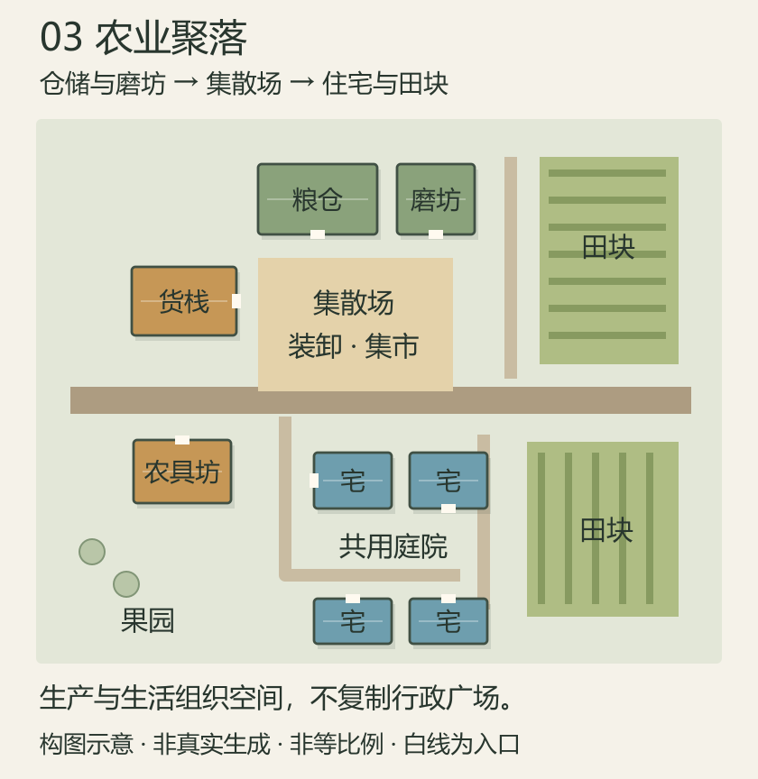

# 2d城市设计

**身份：实现当前案（仅离线城市空间设计原型职责链）。** 2026-09-07 用户确认“ok，开发这个原型吧”，本案作为独立原型的实现依据；涉及建筑、街道、公共空间和功能组织。未接管 Mod 正式 D4 与世界生成，不代表已授权大重构。

## 需求原话

> 你帮我画个示意图出来吧，到底咋样的东西城市才是层次分明的，美观的，并且设计多种功能的设计风格。
>
> 我们新建一个案子，就叫2d城市设计，自己一个文件夹吧。
>
> 此外开发一个原型如果成本很高的话那我不干了，吃力不讨好

前序讨论原话：

> 所以工作流是先把2D搞出来？3D不好看再另外慢慢修

> 你就先看看我的设计的价值吧，再看看还有没有救，最后再看看到底现在工作流有没有问题，感觉什么乱七八糟的都要启动这个MC去跑测试真的是啰啰嗦嗦的，又卡又慢，我真的觉得得先做点原型了

2026-09-07 关于人工设计、动态预览与 Java 对照的补充原话：

> 那么是不是在这里新开一个文件夹呢E:\Mod\_Dev

> 嗯，核心是什么目的呢，让我能先人工通过选择top patch、选择核心、填充建筑（用一个带筛选的搜索的选择框？），选择算法和参数，配置关系，配置面积占比后，得到一个功能区的预览图，然后比对这个预览图和我的设计预想是否完全一样吗

> 但是一方面我数理知识空间能力没有AI那么强，而且也没那么长的精确上下文，所以是不是得要加点预览之类的，就是配置参数的时候，每修改完一次参数就有动态预览出来？

> 那么算法和流程是要和我们JAVA这边保持一致吗，还是说阵列和道路这块已经能先引进我们刚刚对口过的新思路了

> 嗯写进案子吧

> ok，开发这个原型吧

关于行政区阵列的纠正原话：

> 而且我的行政区示意图要的是院落阵列

> 改掉吧

行政区默认示例按**院落阵列**理解：主楼位于一侧，两侧配楼围出前庭，对侧保留入口；不是把主楼放在中心，也不是用贯穿前庭的轴街替代围合。预览应可调整院落宽深与入口净宽，原轴端排布不能冒充该行政院落方案。

## 示意图

以下是**人工构图参考**，不是已有生成结果、真实 NBT 占地或所有城市必须套用的模板。用户已反馈这些图与原有设计大差不差，不能视为新方案优于旧方案的证据，也不替代原有行政区、农业区设计。颜色辅助辨认用途，白线表示入口；图形不按真实世界比例。图中建筑类别均为示意，实际选材必须来自作者标注。

原有主从建筑群与不规则田块的手绘参考继续保留在 [City阵列主从骨架与街带](../City阵列主从骨架与街带-v0.2/README.md#示意图)。后续验证应使用真实素材尺寸与地形，不以概念图代替排布结果。

### 商贸聚落：围合公共空间

议事厅形成主要视觉终点，商铺、酒馆和工坊面向广场与街道；住宅退到次一级街巷，留有后院。广场的价值来自周边建筑共同使用，而不是因为楼之间剩了空地。行政与商业相邻不等于行政填充池可以任意混入农业建筑。

### 山地聚落：空间主次与高程层级共同组织

核心、商业与居住沿不同台面展开，台面内统一高度。明确的步梯串联各层，其余边缘保留挡土关系。不是越多高度越美，也不是为了消除所有高差而铺一整块巨大平板。图中三层是形态例子，不是固定层数要求。

### 农业聚落：生产场所成为核心

仓库、磨坊和货栈围绕装卸与交易场组织；住宅有自己的共用庭院，田块和果园位于外缘。无需强塞行政中心，也不把农田变成石砖广场里的装饰孔洞。功能风格来自组织方式，而不只是屋顶或铺装颜色。

## AI 需求总结

### 人工先验证设计能否被正确执行

原型首先让用户**不经过 AI、不启动 Minecraft**，亲自配置设计意图并查看程序生成的二维结果，回答“给出正确设计后，执行器能否稳定生成认可的布局”。人工尚不能做出满意结果时先定位执行问题；人工验证成立后，再考虑让 AI 使用同一套设计输入。对照预想不是要求逐栋坐标照抄手绘，而是核心统领、配楼围合、入口朝向、街带组织和田间通路等**关键关系一致**；受真实地形限制无法满足时必须显示原因，不能悄悄换成另一种布局。

### 地形、建筑与参数的可视配置

用户可在真实地形预览中选择目标 Patch、起点与偏好位置，通过**带搜索和功能／风格筛选的选择框**选择核心、配楼、填充建筑或素材池，查看真实尺寸、作者标记、入口方向并配置数量，再选择阵列算法与间距、朝向、街宽等参数。功能和风格事实必须来自作者配置，不由 AI 或原型猜测。参数应使用人能理解的说明与必要的小示意，明确“墙间空隙”“模板边缘间距”“中心间距”等不同含义，不要求用户自行推算几何。

### 每次调整都有反馈，方案能够记忆与比较

以**左侧配置、右侧动态俯视预览**为基本交互。选材后显示实际大小和入口，修改参数后自动更新；轻量调整即时反馈，较重计算在停止拖动后刷新并提示计算状态，不要求每次手动提交。建筑、入口、道路、田地和基面可分层查看，碰撞与庭院范围按需开关；选中对象能识别其身份和占地。无法落位时保留并明确标注**上一次有效预览**，同时显示本次失败位置与原因，不能将旧结果冒充新结果或清空整图。支持撤销、重做、保留旧方案和同尺度前后对照；同一轮比较固定随机种子，避免无关变化掩盖参数效果。

### 功能区关系与面积占比

单个功能区先检查内部阵列；多个功能区再配置主次、靠近与连接关系及面积占比。延续用户确认的顺序：**各区初始阵列 → 阈值内相向扩张连接 → 核心区停止扩张并作为面积基准 → 其他区按占比向外补足**。不在开始时配死城市总面积，也不将 Patch 的全部面积直接当成占比分母。比如行政、农业、商业占比为 45%、30%、25% 时，以连接后的行政区实际面积作为 45% 的基准推导其他区目标；占比不是让每栋建筑周围平均摊出大片空白的理由。

### 真实数据一致，现有结果与新思路分开对照

原型与 Java 使用一致的**真实地形、素材尺寸、作者功能标签、入口及允许的旋转**。现有 Java 生成结果作为明确标注的对照，阵列与道路允许使用刚确认的新思路进行实验：**硬碰撞与可压缩庭院留白分离、街道空间允许共享；围绕核心入口、前庭和轴线组织配楼；建筑与街道共同排布，预留街带后面街布置并裁掉无用途路段**。不必复刻旧问题，也不能靠放宽真实约束生成游戏无法落地的漂亮图。实验结果不冒充正式编译结果；有效改法再进入 Java 正式实现，最终预览与游戏应共用正式排布规则，**不长期维护两套相互偏离的正式算法**。本次原型开工不代表已完成正式实现迁移，也不接管 Mod 生成职责链。

### 空间层次与功能含义都需要可见

二维结果应让人识别**核心、主要街道、次级巷道、公共空间和聚落边缘**，并理解建筑为何在此。主从关系不能退化为“一栋核心加同风格随机填充”；行政图应体现主楼与两侧配楼组织，农业图应体现田块顺地形生长及间隔通路。不同功能可以相邻、共享空间，不强制每城同一套分区。**平整、连通和不碰撞不等于美观**，连续基面也不等于所有空地统一铺砖；空间风格应体现围合、生产与生活关系和地形利用，而非给散点布局换素材。

### 二维先验证，不能冒充立体验收

二维先看真实建筑尺寸、入口、道路和空间关系；**二维通过不能替代三维观感与真实生成验收**。已有截图、建筑尺寸与高度帮助早期复核，之后按成本选择简易立体表达；发现空旷、压迫或体量失衡要返回空间设计调整，不全部留给后期装饰。本案人工图示只供审阅，**不表示算法已生成这些结果**；原型是否值得继续应依据真实输入下可重复的结果。

### 成本决定是否继续

原型必须服务于**低成本、快速比较设计结果**，不能为了原型再建庞大工具链。独立原型放在 `E:\Mod_Dev\CityLayoutPrototype`，本案仍在策划仓库维护。最小有用范围是**一个真实 Patch、一个功能区、真实素材选择及参数动态预览**，先验证间距与主从关系，再进入多区连接和占比。优先复用已有地形快照、模板目录、蓝图与规划产物，不以重做素材库、接 Hermes 或重写完整城市编译器作为前提。若必须先完成昂贵渲染器、大编辑器或核心重构才能看到有判断价值的结果，应说明成本并交用户决定，**不得自动扩大开发范围，也不预先承诺离线复用 Java 很轻松**。
