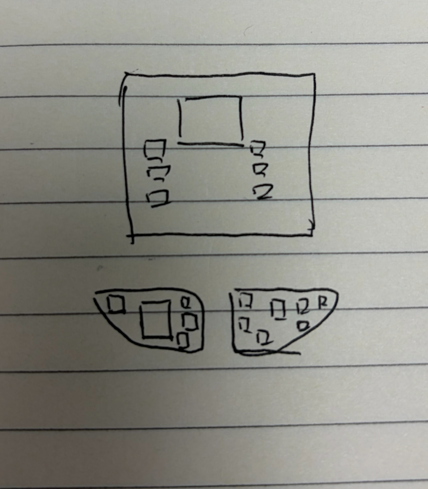

# City阵列主从骨架与街带

## 需求原话

以下是 v0.1 已确认并继续有效的需求原话：

我觉得走的：

```text
CENTER_SYMMETRIC 父阵列
├─ residential_cluster：COMPACT，4 栋
├─ capital_core：COMPACT，17 栋
└─ market_axis：LINEAR，4 栋
```

功能区之间隔很远
而且我觉得出格是很正常的，因为step太大了，全是方格会很恶心，正确做法我觉得是真实落地的占地面积小于设计目标就得了吧

是不是一个城市阵列应该分主次，才能有那种明确的街区划分的感觉

首先功能区内如何得到一片主次分明、甚至带街道的建筑群。就比如我发给你的两个示意图，一个是工整的建筑群+两个小住宅群，另一个则是农村这种的，各个田地之间有道路，但是各个田地的大小形状不规则

功能区内的路我觉得都是小的，所以应该是要算在阵列算法设计里的。
所以现在我感觉，我们也得在算法里设计道路了，不然就很难做到这种城市感。
主建筑不是早就有这个概念了吗，就是阵列里都有核心建筑的列表吧

算法里的“主”一个是AI填入的，另一个就是结构在形成整合包的时候，我会对每个结构都标记，有的建筑会标记为核心建筑，有的是填充建筑，这个现在已经有了吧

宽度我感觉是不是用参数会好点

在这个基础上，我还好奇阵列的嵌套有考虑吗，还有对于地形的适应性，
而且还有一个就是因为D3的功能区外形限制，我感觉这玩意和地形适应是相符的，但是和我们的阵列好像冲突啊

v0.1 的补充需求原话：

这套算法是否有考虑到田野这种，田野、林场这类景观如果要很自然的，必须继续用之前的扩张算法，道路感觉只需要加点间隔就能自然长出来了，还是说这个写成另一个案子会好点？

我非常担心的一点就是田野和林场最终长出来的东西全都工工整整，并且不适配地形（以前的那套代码因为会在悬崖、水体截断，所以非常好看，很好做梯田这种）

以下是 2026-08-22 验收六种阵列真实运行产物后的新增原话：

说实话我验收了一下好像这个grid也不是非常的工整啊，甚至看得像和compact几乎差不多。COURTYARD 我也没看出名堂来，感觉也差不多

LINEAR 和 CENTER_SYMMETRIC 是效果最好的

其他几个都看起来有点凌乱，之后道路呢，有连接起来吗目前，我这里说的道路不是road weaver的，而是我们阵列里的

我现在最不理解的是为什么每个建筑会有三个方框，第一个nbt大小，第二个防碰撞，第三个我忘记是啥了，结果我发现很多都建筑都是第三个方框不会和其他建筑的第二个方框相交的，又变得远远的，这是咋回事

你觉得怎么改才比较好呢，可以用ASCII描述一下各个算法该出现的样式吗

ok形成案子吧

2026-08-22 对 v0.2 的补充确认原话：

嗯确实，就按照你说的

那就改成5吧

就用 1block

嗯，按照你说的

2026-08-30 关于大型 GRID 建筑与道路净空的补充原话：

那么我们先着眼于第一个吧，我觉得第一个是不是grid的问题？之前我们有测试过grid的阵列算法吗

修复方案如何呢

道路先行会不会画出很多多余的路啊

预留后是怎么匹配呢，路网就近原则吗

ok，整理个案子吧

2026-08-30 关于农业景观不使用城市 GRID 道路的最新确认原话：

> 我觉得田野的道路不用像城市那样走grid，是不是只需要给整个田野的景观做处理就好了，也就是景观自己留有一格的间隔

## 示意图

v0.1 迁入的两张手绘示意图：



原始图片路径：`C:\Users\Rinsing\Desktop\725518DDCB1367E78BF7ABAAEA287DCC.png`


原始图片路径：`C:\Users\Rinsing\Desktop\C2B9CC2C6241561636F1D18A1C509A05.png`

v0.1 讨论中确认的排版标注：

```text
            ┌────┐
            │ M  │  ← 主建筑坐镇轴端，朝向定轴
            └─┬──┘
   ┌──┐     ┌─┴─┐     ┌──┐
   │a1│ ──► │   │ ◄── │b1│   次建筑沿带两侧排队，门脸朝带
   └──┘     │带 │     └──┘
   ┌──┐     │ w │     ┌──┐    w = 街宽，用参数派生
   │a2│ ──► │   │ ◄── │b2│   纵向间距按密度派生
   └──┘     │   │     └──┘
   ░░░░     │   │     ┌──┐
   ░░░░     │   │ ◄── │b3│   不合法槽位留空，不硬塞
            └─┬─┘     └──┘
              ↓ 带延伸到功能区边界即止
```

```text
 功能区轮廓（地形扩张，不规则）：
       ┌─────────┐
       │         └────┐
       │  ┌──M──┐     │
       │  □ ║ □  │     │  ← 最小规则核心域：扩张必须能容纳
       │  □ ║ □  │     │
       │  □ ║ □       │
       │    ║   □  □  │  ← 轮廓其余部分：继续不规则
       └────╨─────────┘
           ║ 街带到轮廓边界即止
```

讨论中确认的六种阵列目标样式标注（2026-08-22）。`C` = 核心建筑，`f` = 填充建筑，`W` = 主街/街带宽（参数），`w` = 巷宽（参数，小于 W）：

GRID（街区网格）—— 工整行列 + 阵列自产街巷网：

```text
        巷     巷     巷
        │      │      │
  ┌──┐  │ ┌──┐  │ ┌──┐  │ ┌──┐
  │f │  │ │f │  │ │f │  │ │f │     第1排
  └──┘  │ └──┘  │ └──┘  │ └──┘
 ═══════╪══════╪══════╪═════════   主街(宽W)
  ┌──┐  │ ┌──┐  │ ┌C ┐  │ ┌──┐
  │f │  │ │f │  │ │  │  │ │f │     第2排, C面朝主街
  └──┘  │ └──┘  │ └──┘  │ └──┘
 ───────┼──────┼──────┼─────────   排间巷(宽w)
  ┌──┐  │ ·空·  │ ┌──┐  │ ┌──┐
  │f │  │ ·地·  │ │f │  │ │f │     地形失败的槽→留空地
  └──┘  │ ···   │ └──┘  │ └──┘
```

COURTYARD（院落围合）—— 中心强制留空，建筑从环上开始：

```text
      ┌──┐  ┌C┐  ┌──┐
      │f │  │ │  │f │        北排, C居中, 全部面朝内院
      └┬─┘  └┬┘  └┬─┘
  ┌──┐ └──────────┘ ┌──┐
  │f │   ┌──────┐   │f │
  │  │   │ 内院  │   │  │    ← 中心不放建筑(空地/井/树)
  └──┘   └──────┘   └──┘
      ┌──┐          ┌──┐
      │f │   门洞   │f │       ← 南侧留 1 个开口, 宽=巷w
      └┬─┘ ⌜    ⌟  └┬─┘
        └──────────┘

  最小构成 = 北侧主建筑 + 东西两侧建筑 + 南侧两栋夹门洞，共 5 栋
```

LINEAR（沿街带）—— 现状保持，补主建筑锚点：

```text
 ┌──┐  ┌──┐  ┌──┐  ┌──┐  ┌──┐
 │f │  │f │  │C │  │f │  │f │      北排
 └┬─┘  └┬─┘  └┬─┘  └┬─┘  └┬─┘
 ═╪═════╪═════╪═════╪═════╪═════   街带(宽W, 硬骨架)
 ┌┴─┐  ┌┴─┐  ┌┴─┐  ┌┴─┐
 │f │  │f │  │f │  │f │            南排(可错位半格更自然)
 └──┘  └──┘  └──┘  └──┘
```

CENTER_SYMMETRIC（中心对称）—— 镜像精确成对，可选过中心的礼仪性轴街：

```text
           ┌──┐
           │f │         北对
           └┬─┘
   ┌──┐ ····│···· ┌──┐
   │f │·····│·····│f │     东西对(以C为镜面)
   └┬─┘ ····│···· └┬─┘
           ┌┴─┐
           │C │          ← 核心建筑锁死正中心
           └┬─┘
        ═════╪═════        可选: 过中心的南北轴街
           ┌┴─┐
           │f │          南对
           └──┘
```

COMPACT（紧凑簇）—— 保持错落，一条弯曲小巷穿簇：

```text
   ┌──┐  ┌──┐
   │f │  │f │
   └┬┘  └┬┘
     ≈≈≈≈┐                ← 一条弯巷(宽w)穿过, 建筑面巷
 ┌──┐  ≈ └─┐  ┌──┐
 │f │ ≈≈│C │≈ │f │
 └┬─┘   └──┘ ≈ └┬─┘
    ≈ ┌──┐  ≈≈
     ≈│f │≈
      └──┘
```

ORGANIC_COMPACT（有机簇）—— 不产正式道路，缝隙即路：

```text
 ┌──┐ ┌──┐
 │f │ │f │    ┌──┐
 └─┬┘ └┬─┘    │f │
   └────┐     └┬─┘
 ┌──┐   └──┐  │
 │C │      └─┘         ← 无几何规则, 抖动最大
 └─┬┘  ┌──┐ ┌──┐        建筑间缝隙自然成路(宽1-3不等)
 ┌─┴┐  │f │ │f │
 │f │──┘   └─┘
 └──┘
```

## AI 需求总结

### 核心规则型阵列按硬骨架落位

GRID、COURTYARD、LINEAR、CENTER_SYMMETRIC 是核心规则型阵列，它们的几何约束必须是**硬骨架**：每个阵列使用全阵列统一的**固定格距**（按组内最大模板跨度加间距参数推导一次，不随单栋模板变化）；阵列朝向**锁世界横纵轴**或显式给定，不随种子随机旋转（随机朝向只允许 ORGANIC_COMPACT）；**禁止 fallback 跳格**，槽位找不到精确合法位置就**留空**，真实落地占地面积小于设计目标是正常结果。落位只要求建筑的防碰撞范围完整落在功能区内部，**不被采样粗网格节点吸附**。验收中"建筑离得远"是排版间隙、跳格与粗网格吸附共同推出来的，与最外层地表保护框无关；**三个框的语义不变**（实际占地、防碰撞、地表保护），落位互斥只看防碰撞框。

### GRID 街区网格样式

GRID 要得到**工整行列**：所有槽位吸附到统一格距的**行列格点**，每 2 至 3 排夹一条**主街**、列之间留**窄巷**，主街与巷道都是阵列显式留出的负空间，**宽度用参数**派生。主建筑占**中心格或主街旁格**、门脸朝主街。地形不合法的槽位**留空地**，不重排、不跳到邻格；空格读作小广场或菜园是允许的自然结果。

### GRID 先预留道路净空，不先生成完整道路

GRID 在安排建筑时必须把街巷当作**不可被建筑占用的虚拟净空带**一同考虑，保证建筑一旦落下，所属行列仍有足够宽度形成街巷；这里的“道路先行”只表示先保留空间，**不表示提前把整张网格都铺成道路**。首栋核心建筑确定阵列原点后，后续建筑在这套局部网格关系中选择地块，大建筑可以占用更大的同侧地块，但不得横跨街巷净空。功能区范围仍由实际落地的建筑、最终保留的道路和景观形成，禁止把虚拟网格当成功能区预设面积。

### 建筑按入口匹配可用街巷

每栋实际落地建筑应从自身入口匹配相邻的可用街巷，采用**受约束的就近原则**：入口朝向能够面对街巷、不穿过其他建筑及其防碰撞范围、属于该 GRID 行列关系并且确实可达，均优先于单纯的直线距离；满足这些条件后才选择接入代价最低的道路。建筑不得为了连接最近道路而斜穿地块、背门接路或跨过另一栋建筑，也不得让彼此最近但没有正式入口关系的两栋建筑直接拉线相连。

### 只生成服务实际建筑的最小路网

全部实际建筑落位后，再从核心建筑或主街开始，沿预留网格把各建筑入口接入已有道路，优先复用已形成的公共路段，并综合新增长度、转弯、地形、水体和障碍选择连接。没有服务任何建筑的预留走廊必须裁掉；建筑入口所需的短支路可以保留，多栋建筑共同使用的路段自然成为区内主街。最终产物应是**服务实际入口的最小必要路网**，不得因为曾经预留过完整网格而留下大片无目的道路。

### 地形失败在地块内消化

建筑在理论地块遇到局部地形问题时，程序可先在**同一地块内有限微调**，再尝试不破坏入口与街巷关系的合法朝向；仍无法落地时才留空，并在需要继续补足阵列时向外增加新的行或列。可选填充建筑失败不得让整座城市失败；required 建筑只有在当前 GRID 的合法地块与允许调整均耗尽后，才记录明确的落位缺口。任何调整都不得跨越道路净空、破坏统一行列骨架，或把建筑搬到无关 Patch。

### COURTYARD 院落围合样式

COURTYARD 的院子是围出来的，不是算出来的：**中心强制留空**（空地、井或树），建筑从环上开始围合，环半径按固定格距推导，不被粗网格撑大。**最小 5 栋**，由北侧主建筑、东西两侧建筑和南侧夹门洞的两栋建筑形成基本围合，**不足 5 栋不生成院落**；南侧门洞宽度按巷宽参数。主建筑居**北排正中**、面朝内院；环外可绕一圈**环路**。

### LINEAR 与 CENTER_SYMMETRIC 保持并补强

这两种已验收为效果最好，几何语义保持：LINEAR 维持精确轴线和街带，主建筑锚在**街中或街端**；CENTER_SYMMETRIC 主建筑锁死**正中心**，其余建筑**镜像精确成对**，可沿对称轴加一条过中心的**礼仪性轴街**。两者的硬约束做法（不接受妥协位置）正是核心规则型阵列的统一标准。

### COMPACT 与 ORGANIC_COMPACT 的区内路

COMPACT 保持错落簇团，但要有一条**弯曲小巷**穿簇而过、建筑门脸面巷，否则出不了城市感；ORGANIC_COMPACT 不产正式道路，靠最大的抖动与不规则间隙让**缝隙即路**，形成农村感。两者的区别应该一眼可辨，不能像现在这样几乎长一样。

COMPACT 的理论槽位按首栋真实核心逐圈八方向生成，同一圈全部方向优先于外圈。单个理论槽位受水面、坡度或既有占位阻断时，程序可在**同一半径上沿切线方向做有限近移**，但不得径向跳到远圈、放宽最大连接间隔或搬动功能区。每个槽位依次尝试理论点、左右近移、左右稍远移；仍失败才留空。若首栋周围第一圈经过上述微调后仍没有任何跟随建筑，说明本地连续前沿已经封闭，程序必须停止该 COMPACT，不再扫描必然超过连接间隔的外圈位置。

### 区内道路全部归阵列算法

阵列内的路全由阵列算法设计并产出：GRID 必须产**街巷网**、COURTYARD 必须产**环路与门洞**、LINEAR 必须产**街带**、COMPACT 必须产**弯曲小巷**；CENTER_SYMMETRIC 的**礼仪性轴街可选**，启用时由阵列自身产出；ORGANIC_COMPACT **明确不产正式道路产物**，只保留自然缝隙。网格是功能区内部属性，巷道间距来自阵列格距，建筑入口统一朝向实际街巷。功能区的抽象关系和相向扩张不得自动生成区间道路；所有正式道路均由 City 自有规划与 SurfacePrint 执行，不得按距离自行连线。

上述规则只约束**由建筑阵列承担内部流线的街区**。农业区、林场等功能区若在 Blueprint 中声明由功能区景观的间隔带承担内部流线，即使建筑排版算法仍为 GRID，也 *MUST NOT* 生成城市式 GRID 主街和窄巷；其内部一格田埂、林间缝隙和小径由景观扩张负责，建筑阵列仅保留连接真实入口所需的少量正式支路。该最新口径覆盖“任何 GRID 一律必须产完整街巷网”的过宽表述。

### 阵列样式的视觉几何验收

阵列合不合格要看**视觉几何指标**，不能只查数量、碰撞和连接：GRID 使用全组统一格距，每栋相对理论格点的**行列误差不超过 1 block（方块）**，主街和窄巷必须按参数宽度连续贯通；COURTYARD **中心必须空置**、至少 5 栋、环上**围合率**达标，南侧门洞与可选环路必须连通；LINEAR 的**街带必须连通**；CENTER_SYMMETRIC 的建筑必须镜像成对，只有启用礼仪性轴街时才检查轴街连通；COMPACT 的弯曲小巷必须连续穿过簇团，建筑门脸朝巷；ORGANIC_COMPACT 不检查正式道路，但建筑间必须保留宽 **1–3 blocks** 的可通行连通缝隙。这些指标不进质量门禁，就会继续出现"检查全过、看着不像"的结果。
