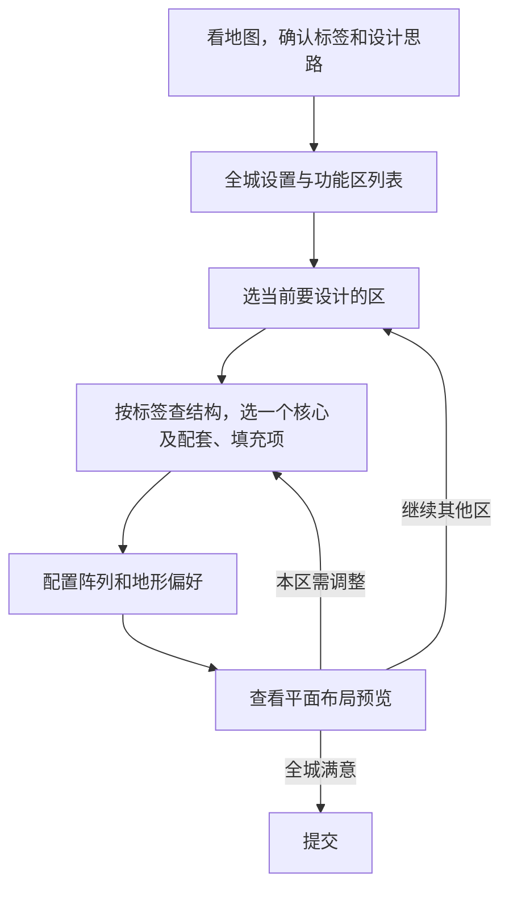

# 按功能区设计城市

**实现当前案 · 2026-10-07 接管 D4 功能区设计循环**。[返回总览](../../../../../../../10_product/城市设计与完整落地/README.md)。本批按用户授权接管选材、阵列编译、预览与逐区修订。

主责任是 D4。用简短的全城方向带动逐区选材和阵列设计，以实际预览判断是否形成整体。

## 先定方向，再列功能区

<small>原话：“决定锁定本次的结构选择决策和城市设计思路（比如建筑使用中式、植被选用精灵、地面桥梁使用xxxx，设计思路则是可以一句话带过）”</small>

**AI 总结：** 承接第二题，看局部地图后确定本城的选材标签与一句设计思路。配置公共区域、景观、整体换皮，再列功能区及主次。此时确定的是选材方向，不必提前挑完所有结构。

## 从主到次，边查素材边设计

<small>原话：“开始从主到次阵列，每次阵列的时候都会去根据我们锚定的tag去搜结构，看看有没有合适的”</small>

**AI 总结：** 每设计一个区，就结合它的功能和已选风格查询合适结构，再决定阵列方式、需要的组合和地形偏好。按当前任务提供候选和预览，缺合适素材就说明缺项，不为凑齐数量反复摆同一栋建筑。

## 每个功能区一个核心，同类区可以相邻组合

<small>原话：“我觉得只有一个核心是不是方便点，你觉得呢，我们只需要把多个同类功能区连起来就能得到一片很大的功能区了。并且这片地方还很有层次”</small>

**AI 总结：** 每个实际参与阵列的功能区只设**一个核心**，围绕它组织主要位置、朝向和配套。多个同类区相邻，形成更大的功能片区；不把这片区域再次合成一个巨型阵列或另设共同核心。同类区可选不同核心模型，避免重复整套组合。

## 必需与填充属于本次功能区

<small>原话：“哪些结构打算必须落地，哪些是用来填充充数的（阵列里的修饰项），甚至可以配一下地形偏好等等”</small>

**AI 总结：** AI 明确本区哪些内容必须保留，哪些用于配套、填充或修饰。素材的特色／通用不替代这个决定。唯一核心不等于其他建筑都可删除；承担必要功能的配套也要保留，不能只剩装饰却声称功能成立。具体适配见 [完整落地](../../40_D5至D7边界与激活/城市设计完整落地/README.md)。

## 看图修订，形成整体再提交

<small>原话：“然后就走D4的循环流程，也就是直到AI觉得预览图构成一个整体了，提交。”</small>

**AI 总结：** 提交阵列配置、看实际预览、调整并再次查看。D4 主要看平面构图，既看当前区域，也看各区与公共空间的整体关系。地图上的水域、高度和地形偏好仍供判断；少量水域或普通高差不直接否决布局，城市边界与建筑重叠仍须检查。具体高度、支撑和跨水衔接交给实际生成。实验调用实现中的同一套阵列能力，在设计过程中检验算法；不能用另一套排布生成示意图冒充结果。

本案已接管 D4 设计循环；每区初版完成后仍可看图重新选材与修订，其他已确认区保留。
