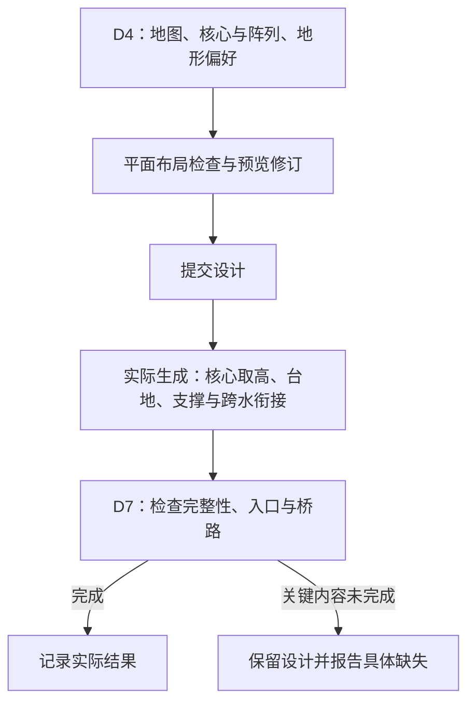

# 城市设计完整落地

**设计中案 · 2026-10-05**。[返回总览](../../../../../../../10_product/城市设计与完整落地/README.md)。本页阶段分工已确认，尚未接管实现。

D4 负责城市布局，具体地形适配交给实际生成；D7 核对生成结果。保护设计完整性，不用移除核心来掩盖适配失败。

## D4 放行水域与普通高差，保留布局检查

<small>原话：“地形适配D4里需要吗，我觉得这玩意是D7落地时时候采用吧，我们只需要D4放行就可以了吧，就是不要像以前有点水就阻断我感觉就还好了”</small>

**AI 总结：** D4 继续向 AI 提供地图上的水域、高度及地形偏好，用于选址和布局；**不因少量水域或普通高差直接拒绝结构**。城市边界、建筑互相重叠等布局检查仍保留。D4 不必提前算完精确台地、挖填和支撑，预览主要用于平面构图判断，不冒充实景验收。

## 实际生成处理高度、支撑和跨水衔接

<small>原话：“程序在后面应该保证AI的设计完整”</small>

**AI 总结：** 实际生成时按核心位置确定落地高度，结合地形偏好处理台地、挖填、支撑及跨水衔接。保留 D4 确定的核心位置和阵列关系，不能靠任意搬动或删除主体换取通过。

如果确实无法完成，报告哪个区、哪些内容没有兑现并保留设计；不能删掉核心或必要配套后仍标记完成。D7 核对实际结果，不把“D7”理解为所有适配都要等核验时才开始。

## 配套也要一起成立

<small>原话：“除此以外，我们更应该跟上的是景观和基础建设，比如地板、桥梁这种”</small>

**AI 总结：** 完整落地包括公共地面、景观、桥梁与高低连接，不只清点房屋。采用本城选定的结构和材料；生成后检查建筑是否完整、入口是否可达、桥路是否接通、高低关系是否协调。

2026-10-05 用户确认以上阶段分工，关闭“地形适配是否必须在 D4 完整求解”的讨论。具体工程参数留给后续实现，不另设本轮待答问题。
