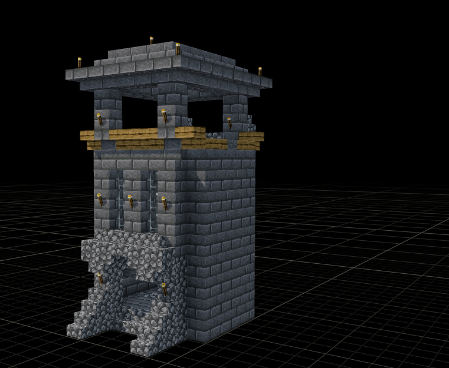
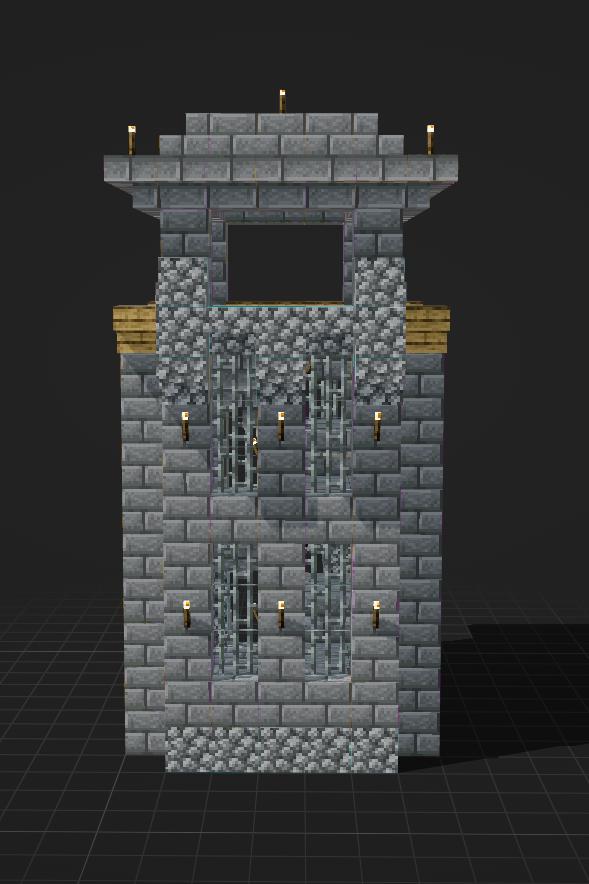

# City 城区边界与模块城墙

**职责身份：实现当前案（城市边界链）**。本次在原案内按用户最新确认修订：城墙完全重构，以城区主体围合和固定结构素材衔接为方向；**唯一模块实现已接入，游戏内验收未完成**；当前用共同墙顶与基础吸收可承接起伏，超阈值明确拒绝，自动绕河与大高差楼梯节点尚未完成。

## 需求原话

2026-09-27 最新确认：

> 我感觉顺便可以修一个bug，就是转角可以不可以不要烽火台了，我有点不想再为转角准备素材了，直接用城墙来连接
>
> 然后我们的烽火台现在有bug，就是他的所有的朝向都是固定的。图1是烽火台的正面，图2是参考系，正面应该向外，背面朝着我们城市内部

> 没，道路两旁的树排排队正常，我是担心全是同一种树导致很死板。
>
> 然后城墙完全重构，并且禁止这种v1\~v5的这种代码版本代码，我之所以要重启城墙，就是因为现在的landuse是建筑单位负责的，无法把整个城市构成一个整体，所以我们就得设计算法，设计“城区”部分该怎么归纳。
>
> 不过台面部分也头疼，台面有建筑的话好处理，没建筑的话就不太懂了，你觉得有必要都统一地板吗，其实一个城市用城墙围起来的地方也不用统一地板吧我看，只是建筑群之间得统一是真的，可能LandUse的范围得试着扩大点
>
> 墙我人工看过了，能用的，甚至自带一个冰船轨道

> 嗯，断头路那个先不管了，我们只需要能生成道路连接俩城市就可以了。
> 目前每个都有确定的结论了吗，我感觉城墙的设计还很模糊

> 嗯对，城墙就这个方向，塔楼你可以参考里面的，
> D:\BaiduNetdiskDownload\2026.9.5投影文件完整版(9010文件)\g构建包\城市,房屋\各种塔 构建包
>
> 这里D:\BaiduNetdiskDownload\2026.9.5投影文件完整版(9010文件)\g构建包\城市,房屋\哨塔的比较统一，但是像外面的防御塔，而且不够高
>
> 我发现这个ac3 城墙守卫塔.litematic更好做城墙啊，也就是D:\BaiduNetdiskDownload\2026.9.5投影文件完整版(9010文件)\g构建包\城市,房屋\各种塔 构建包这里面的，感觉这里的宝贝多一点

> 嗯嗯，城墙就这个方案，写案子呗

## 示意图

当前素材基准：`D:\BaiduNetdiskDownload\2026.9.5投影文件完整版(9010文件)\g构建包\城市,房屋\各种塔 构建包\ac3 城墙守卫塔.litematic`。同目录其他塔楼作为候选参考，不因名称或尺寸合适就认定可直接衔接。

先前参考过的冰道城墙位于 `D:\BaiduNetdiskDownload\2026.9.5投影文件完整版(9010文件)\h红石机械,功能性建筑等\便于建设使用类(地基,信标)\城墙.litematic`；最新确认转为以守卫塔组织整套城墙，**冰船轨道暂不作为硬性要求**。

## AI 需求总结

### 承接城区范围，围合城市主体

城区归纳、建筑群之间的建设面、自然空间保留及台面用途独立记录于《[City城区归纳与建设面](../60_LandUse与城市基面/City城区归纳与建设面-v0.1/README.md)》，已获用户授权接管实现，建设面与自然保留范围已接入 LandUse，游戏内验收待完成。城墙承接城区结果围合城市主体，不逐栋建筑描边；外围独立设施可以留在墙外。**城墙围合不要求墙内全部铺地或统一高程**，本案只负责外围墙线、城门、塔楼与墙体高差衔接。

### 城墙直接转角，塔楼用于直墙分段

城墙以**少量长直段**形成清晰外围轮廓，采用随城市主体变化的正交轮廓，不强制固定矩形，也不追随建筑边缘的细小凹凸。小凹口适当跨过，大河湾、山体等明显地形影响整体走向；墙体与建筑之间保留衔接空间。**转角不放烽火台，直接用城墙连接**，墙顶通道保持连通，无需另备转角塔素材。塔楼用于长墙分段，按需要出现，不机械等距，也不把整圈城墙变成密集塔楼。

### 烽火台正面朝外

保留的烽火台必须**正面朝向城外，背面朝向城内**，随所在墙段转向，不能整城固定一个朝向。下图为用户确认的正面及坐标参考。

[正面原图](images/守卫塔正面确认.png) · [坐标轴原图](images/守卫塔正面坐标轴.png)

### 守卫塔确定风格，墙段与塔楼真实连通

以用户选定的 **ac3 城墙守卫塔** 为风格与节点基准，连接墙段延续石砖墙身和顶部收边，墙顶步道接入塔楼的可通行楼层。重复使用连接墙段，塔楼保留自身造型。接合必须处理开口、通行高度和内部路线，不能只在外观上把墙贴到塔的侧面。其他塔楼或城门素材只有在风格、尺寸与通路匹配后才纳入组合，不能将整个素材直接拉伸来凑高度。

### 城门衔接真实出城道路，高差由基础与节点消化

城门位置结合**真实出城道路的来向**共同确定，门内预留连接空间并接到城内可用道路，门外能够衔接城际道路，禁止道路进门后撞上建筑。较长墙段上部保持连续高度，基础吸收局部地形起伏；明显高差通过调整墙线或明确节点分段处理，不能逐格随地形上下跳。基础或朴素墙身可以按衔接需要调整，顶部造型与可行走关系保持完整。冰道是否进一步接入以及如何连续通行，留待后续单独确认。

### 完全重构，唯一正式城墙实现

**禁止继续保留 v1～v5 式并行城墙算法分支**，新方案完成后只有一条正式实现，不能再以旧版本选择或固定矩形作为失败保底。遇到建筑冲突、无法接合的高差或不合适的城门位置，应明确问题并调整对应方案，不能强行穿过建筑补直墙。现有代码可复用的基础能力不改变这一要求，也不得用旧城墙规则覆盖本案。
