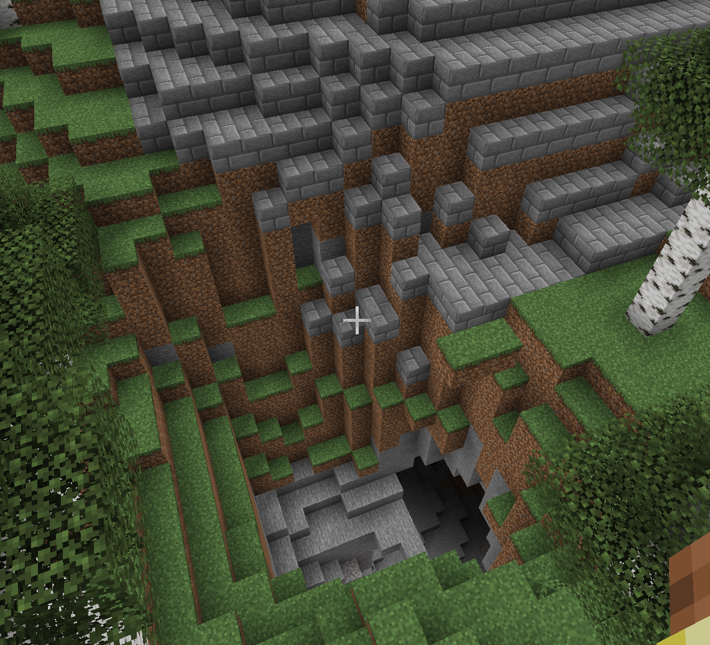
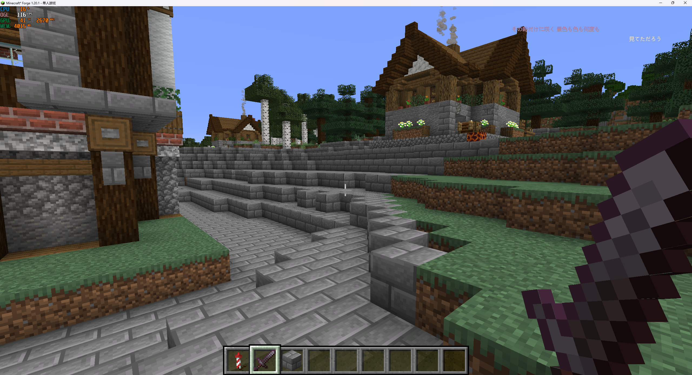
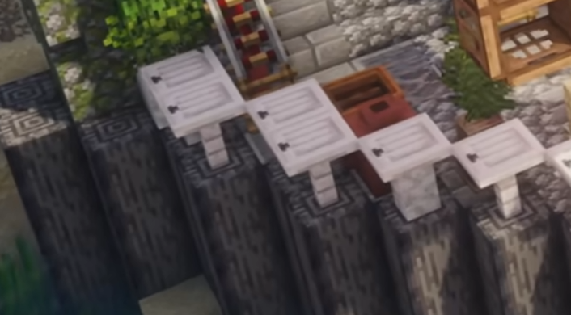

# City区域扩张高差边界优化

**设计中案 · 区域边缘收边。** 本案保留独立问题；[主建筑与分层台地](../主建筑与分层台地/README.md)讨论高度组织，尚不替代本案，也不将本案全部方案自动纳入新需求。

## 需求原话

检查一下这附近的石砖，这个台基好像和周围的石砖落差超过2格了，不过旁边确实有至少一块石砖超过2格

你如何评价呢，确实不会像以前一样一股脑的铺进最底下。但是依旧遇到土坡、山体就会非常难看

稍等，我看了好多个视频，貌似这种斜坡也就是原始的地形其实是一个很有层次感的设计。

但是假如整个城市都是这种的话我不确定能否形式一个边界分明的区域。

然后刚刚我们遇到的这种大坑的问题，是不是该做边界检查之类的。因为我们零星出去的几块，其实只是少数，是不是干脆就是我们的城墙/边界系统了

我发现别人边界会做点矮墙，就不用做特别复杂的城墙系统了，从崖边/海岸边长出来就行，那种海滩人家就自然保留，因为是高落差才用好像，这个我们在扩张的时候应该能检查到吧，也就是这种连续的高度差低于2

这个是最大差值吧，而不是最小插值，是用最大好还是最小好呢

也行，先写进案子里，也就是下一步的优化计划

这个不算是台基的案子的吧，我怎么觉得是优化里的呢

## 示意图

原始图片路径：`C:\Users\Rinsing\AppData\Local\Temp\codex-clipboard-7e10dfc4-11c3-4933-85be-6a7db5068105.png`

原始图片路径：`C:\Users\Rinsing\AppData\Local\Temp\codex-clipboard-63346923-e514-435d-aaf2-7e94708d16f8.png`

原始图片路径：`C:\Users\Rinsing\AppData\Local\Temp\codex-clipboard-fbf0fda9-9879-42c4-8319-b85a6e3d21b2.png`

## AI 需求总结

*优化目标*：现有扩张已经不会把硬质地面一股脑铺到最底下，下一步保留自然斜坡带来的城市层次，同时让每片已扩张区域拥有清楚、连续的收边。遇到土坡、山体、大坑或海岸时，禁止留下沿坡面或洞壁向外泄漏的零星石砖。

*逐边高差判断*：扩张判断当前区域格通向候选格的每一条相邻边，不用整片区域的最大高差或最小高差一票决定。相邻地表的连续高差**低于2格**时可以从该边继续扩张；达到或超过2格时从该方向停止并留下边界。最大值只用于表示风险，单个最小值也不能让区域从狭窄缺口钻出形成零星分支。

*高落差边界收缩*：大坑、悬崖、陡岸和山体边缘出现少量外伸格时，应把这些格从主体边界收回，保持区域轮廓连续；硬质铺装不得继续沿洞壁或陡坡逐格向下生长。

*矮墙自然生成*：连续高落差使扩张停止后，可以从区域内侧的崖边或陡岸自然长出矮墙、栏杆或石质收边。矮墙表达的是扩张遇到地形后的局部边界，不需要发展成复杂的完整城市城墙系统。

*自然坡地与海滩保留*：连续缓坡仍允许扩张，并通过台阶、分层铺装和局部平台保留原始地形的层次。平缓海岸和海滩自然保留，不因处在区域边缘就强制生成矮墙。

*优化范围*：本案只优化现有区域扩张的高差判断、零星边界收缩和高落差收边，不重新定义台基本体，也不处理不同功能区之间的边界。
