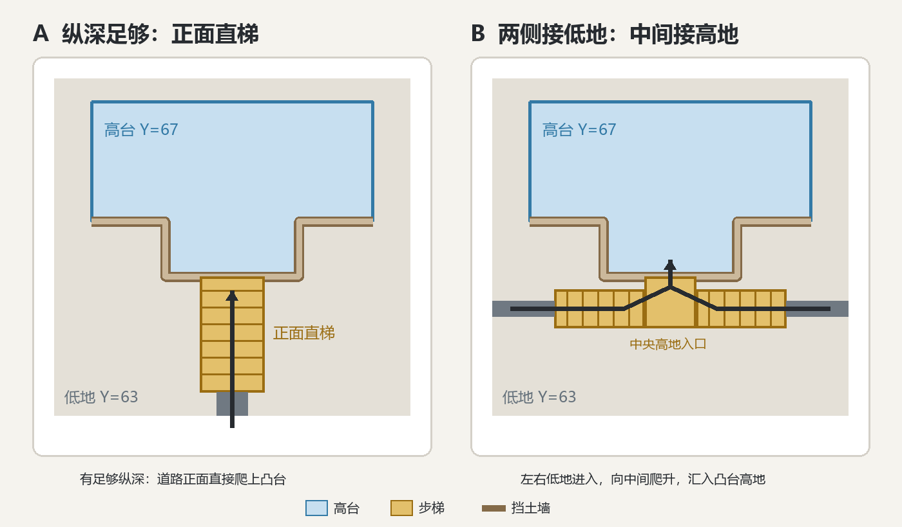

# City城市基面与路网形态

## 开发状态

截至 2026-08-27，本案原有的**城区平台基面、道路从真实交通需求生长、功能区内部网格、主路桥梁、道路与地板材质分级**已经开发完成并经过本轮真实城市验收；后续开发不得把这些内容当作尚未实现的整案重新开发。

截至 2026-08-28，追加的**建筑服从所属台地、封闭小水坑与干坑按连续图形闭合、台地直梯与左右分流梯**也已开发完成；其中建筑同高与两种步梯已经过新区块真实落地验证。本版实现方向正确但**台地划分用力过度**：建筑与台地过度追随原版地形，形成了过多连续小高程，城市虽然不再有零碎小土坡，却重新显出原版坡面轮廓；同时步梯触发过于保守，没有承担起主要的层级连接。

截至 2026-08-28，本案增量收口 **合并台地、设置独立成台地的门槛、主动生成楼梯** 已完成开发、全量自动回归和新区块真实游玩验收：最终台地按 4 格一级收敛，小于 64 格的独立台地并入相邻主台地；结构服从合并后的台地高度；楼梯从真实道路的全部相邻格主动寻找高低跃迁，不再依赖整条路的单一长轴。新区块 10 栋结构只形成 85/89 两级，实际落地的深板岩步梯同时出现南向与东向分支。建筑同高、孔洞闭合和两种步梯均保持有效。

截至 2026-08-30，全量农业 Catalog 大城真实 D7 验收暴露出两个此前未覆盖的缺口：当前独立台地只用 `64` 格面积门槛判断，不验证台地是否承载建筑、景观或其他真实用途，因此会保留空台面；主动楼梯只扫描正式道路跨越台地高差的位置，不能保证没有道路穿越的建筑台地具有可达入口。本次既有台地合并、孔洞闭合、建筑同高、道路直梯与左右分流梯仍保持已验证状态；新增缺口由设计中案《[City台地成立条件与可达性-v0.1](../City台地成立条件与可达性-v0.1/README.md)》负责，在开发完成前不得宣称所有独立台地均有用途或均可达。

截至 2026-08-31，三份新版真实预览验收确认**台地划分已基本成立**，但道路网仍然“意义不明”：巷在建筑缝隙间织成梳齿、主路沿空地绕圈、全城出现单一等级。根因不是道路到了执行期才生成，而是**全部填充建筑锚点先固定，道路随后只能在既有建筑缝隙中补线**，道路没有承担组织街区和后续建筑阵列的职责。本案因此新增修订：**街道骨架先于填充建筑切出街区、主干路由多项真实交通需求共享、路口主动设计、个别入口短巷补接兜底**。

截至 2026-08-31，**街区先行路网修订已开发，并通过全量自动回归与真实游戏服务中的 D4 复编/预览验收**：核心先落位，COMPACT 按计划跨度预留共享 T 形街带，填充建筑避让骨架；使用审查后保留 3 段骨架、生成 2 段可复用绕障支路和 7 段入口短巷，8/8 真实入口接入，路面及路缘与建筑实际 footprint 重叠为 0，warnings 为空。继续 D6 时目标 owner chunks 已由历史游玩生成，系统以 `STRUCTURE_CHUNK_ALREADY_GENERATED` 正确拒绝，因此**新区块 worldgen/D7 现场验收仍待新的干净 CitySeed 或测试存档**。

本案当前实现状态为：**台地与基面能力已开发并验证；街区先行路网已开发并完成 D4 真机规划验收；台地成立条件与可达性增量、街区路网的新区块 D7 现场验收仍待后续条件**。后续实现必须保留已经验证的台地合并和楼梯形态，不得用回退到原版缓坡的方式处理新增缺口。

## 需求原话

2026-08-27 验收 Trek 混合大城后的原话：

整个城市依旧有一个传统的小毛病，就是城市里会有很多奇奇怪怪的小土坡、小坑洼，这些因为直接铺地板上去所以基本上保持的是原貌，不好看这样。你觉得有什么算法能够解决

道路和地板的颜色一样，也就是我还是没看出层次感，而且道路好像不太合理啊，各种连接有点意义不明，尤其是垮河的那几个，我感觉有点意义不明

我希望是该网格就网格，有些时候正正方方的路网反而好看

我觉得你的地形设计方案是对的

不过艺术方面还是你来保留完全意见

背景口径（2026-08-25 已确认）：我们的核心是美观和工整，是从城市设计角度来的，而且就几个要求，功能明确、界限分明、有主有次。

2026-08-27 清理确认：新的那个案子是正确的。

2026-08-27 桥梁材质收口：明确为“独立桥面材质”。

2026-08-27 新区块实机验收原话：

1、XYZ:-4134.144/ 65.00080/-2653.708
Block:-4135 65 -2654 [9 1 21]
这里的这间房子被围起来了，查查是为什么呢，他的地面的一圈非常矮，远远低于他周围的城市地面

2、XYZ:-4145.068/ 63.43186/-2648.214
Block:-4146 63 -2649[14 15 71]这里被挖了一个坑，里面全是水，是不是我们地板不会铺水的原因，这里我觉得我们可以当作连续图形来处理，就是他的周围明明都是封闭图形了，那么这里感觉可以很自然的也封口

3、XYZ:-4154.481/ 64.00000/-2623.338
Block:-4155 64-2624 [5 0 0]
这里有一个奇怪的坑洞，也不是水，坑里甚至也铺了地板，只有两格这个坑

4、我们目前做成“凸”字形的地方，是否能用什么算法，和周围的不同高度的地面用台阶之类的处理呢，我觉得长度够可以做一个自然的步梯上去，长度不够的话也能做一个往两侧走的步梯，你觉得呢

2026-08-27 步梯示意确认原话：

右侧的我不是这个想法，我的想法是两侧连接的是低地，中间连接高地，正好反了

2026-08-28 新区块实机验收后的原话：

这版的楼梯我感觉保守了，而且好像又把土地带回来了，现在虽然没有小土坡了，但是好像又变回之前那种有明显的原版地形的坡了。

你觉得咋样好呢，原本那种“凸”确实就层次很分明，但是一个城市里没有坡的话又缺少连续性。但是我记得这种直接层级不一样的设计也是很多的，比如某个小山坡上的楼房和下方的城市区域，正常就是靠一个步梯走上去

嗯，简单来说就是**合并台地+ 合并门槛 + 主动楼梯吗**

2026-08-31 三份新版预览验收原话：

目前改了几版了，台面基本上ok了。麻烦看看这些预览的吧，道路好像现在还是有点意义不明

2026-08-31 街区方案讨论与确认原话：

但是这样不会全都变成grid阵列了吗，我们目前有很多种阵列算法的

也行，顺便你看看咱的案子的文件夹，换新的目录形式了，写进去吧

2026-08-31 对街区先行路网的收口确认原话：

嗯我觉得得按照你的口径改

## 示意图

城区平台基面（侧视，讨论中已确认）：

```
原地形:    ╱‾╲___╱╲__洼洼__╱‾╲____
                ↓ 每格取邻域主高程
规划基面:  ────────────‾‾‾‾‾‾─────────
                ↓ 削高填低，差 ≥2 格修挡土收边
落地:     ▔▔▔▔▔▔▔▔▔▔|挡土墙|▔▔▔▔▔▔▔▔
```

路网形态（俯视，讨论中已确认）：

```
住宅 GRID 区                缝              市场 LINEAR
┌──┬──┬──┐
│房│房│房│ 巷(土径 2 格)
├──┼──┼──┤        ╭─────────╮
│房│房│房│════════│ 广场/交汇 │════▓▓▓▓▓▓▓▓ 商业街
├──┼──┼──┤ 主路   ╰─────────╯      (建筑脸朝街)
│房│房│房│ (石砖 5 格)
└──┴──┴──┘
  区内部正交到底          两区网格相遇用        主路跨水才允许有桥，
  巷道间距=阵列格距        主路或广场调解，      桥=主路宽度与等级的
                          不许把两套网格        延续，桥墩落水
                          硬拧成一个朝向
```

台地步梯形态（俯视，讨论中已确认）：



其中右侧形态的方向不可颠倒：**左右两端连接低地，楼梯向内升高，中央连接凸台高地**。

街区先行顺序（2026-08-31 已确认）：

```
① 先放核心建筑（定各区朝向与大门）
② 按真实交通需求预留全城主路骨架（少数几条，多项需求共用）
③ 区内街道先把地切成一块块完整街区
④ 填充建筑往街区里填，入口统一朝街
⑤ 按实际临街使用裁掉、缩短或改道无用途路段
⑥ 少量个别入口用短巷补接，随后冻结唯一最终路网
```

空间关系、交通需求与道路的区别（2026-08-31 已确认）：

```text
空间关系：决定功能区相对位置，不自动造路
交通需求：说明哪些真实大门、广场或交汇点必须互相可达
最终道路：用一张共享路网同时满足多项交通需求，不要求每项需求各有一条直达线
```

街区形态归阵列语法（2026-08-31 讨论中已确认）：

```
GRID 区：           LINEAR 区：          COMPACT 区：
┌──┬──┬──┐          ║▓▓▓▓▓║              ~脊梁巷~
│街│街│街│          ║房房房║             ╱房 房╲
├──┼──┼──┤          ║▓▓▓▓▓║ 长条地块    │  房 房│ 沿巷的
│街│街│街│ 正交矩形   ║房房房║ 贴轴两侧   ╲房 房 ╱ 不规则块
└──┴──┴──┘          ║▓▓▓▓▓║              ~~巷~~

CENTER_SYMMETRIC / COURTYARD 区：
      │
   ┌──┼──┐        骨架是轴线和环路，
 ──┤  ○  ├──      切出来的是围合块、对称块
   └──┼──┘
      │
```

## AI 需求总结

### 城区平台基面

城区建设范围（建筑区与道路走廊）内先做整体整地，再铺任何地板：以**邻域主高程**为每格目标高度，孤立的小土包、小坑洼视为噪声直接削平填实；削填差较大的边缘不修缓坡，修垂直的**挡土收边**（石砌挡土墙或台阶）。整地的结果是分级平台，不是熨平的自然坡，保持工整的城市台地感。**禁止把地板直接铺在原始地形起伏上，也禁止把只有几格的低洼单独认成低层台地后在坑底铺装**。整地只发生在城区建设面内，农田、林场、保留地的地形一格不动。整地之后个别位置仍有小高差时，才由建筑台基消化——台基是兜底，不代替整地。

相邻建筑和建筑阵列形成的近似高度平台应优先**合并为少量、面积明确的大台地**，不能让每栋建筑各自追随原版地形，最后用密集的一格级高差重新描出自然坡面。只有高度差足够明显、且高地能承载完整建筑簇时，才允许独立形成新台地；零碎高度差继续并入邻近主台地。城市内部可以保留小山坡高地与下方城区的清晰层级，但连续性应由正式道路和步梯提供，而不是由铺装后的原版缓坡提供。

### 建筑同高与内部孔洞闭合

建筑与其周围城市地面必须使用**同一个台地高度**：先确定连续城区基面与分级平台，再让建筑落到所属平台，禁止建筑按原生地形单独选取更低高度，最后被周围城市地面围成深坑。建筑自带台基只处理平台上残余的小高差，不能让建筑与所属平台分离。

城市铺装闭合域内部如果只剩少量低位格，无论坑底是泥土、已铺地板还是水，都应按周围连续平台自然封口，不能因为坑底已经铺装或含水就保留成孤立孔洞。**显式规划的水景、与外部自然水体连通的水面和桥梁所跨水体继续保留**；没有水景意图、被城市铺装完全包围的偶发小水坑不属于保留水域。

### 台地高差使用步梯

不同高度的城市平台在真实通行位置用步梯连接，并保留其余挡土边缘。台地层级确定后，应沿存在建筑、道路或出入口通行需求的高低边界**主动布置步梯**，步梯是城市垂直交通的正式组成，不是偶然触发的保守兜底。正面纵深足够时，从低地道路向凸台中央修一条自然直梯；正面纵深不足但两侧有长度时，修左右分流梯，**左右两端分别连接低地，楼梯向内逐级升高，中央汇合并连接凸台高地**，禁止做成中央接低地、两侧接高地的反向形态。

执行口径固定为：**建筑阵列先形成初始台地，近似台地按门槛合并并锁定最终层级，随后闭合台地内部偶发孔洞，最后按真实通行需求主动生成直梯或左右分流梯**。禁止在最终台地尚未收敛前就逐栋跟随原始高程，也禁止用大量中间小台地代替应有的正式楼梯。

### 街区先行：街先切地、房填街区

道路的组织单位是**街区**，不是单栋建筑：街道骨架先把城区切成一块块完整地块，建筑再成片填进地块、入口统一朝街；俯视时先读到齐整的街区格子，建筑只是格子里的内容。执行顺序固定为：**第一批核心建筑先定各功能区的朝向、入口与中心 → 按真实交通需求预留全城共享主干路 → 区内街道骨架切出街区 → 填充建筑沿街区阵列 → 按实际临街使用裁掉、缩短或改道无用途路段 → 少量个别入口用短巷补接 → 冻结唯一最终路网**。主路在填充建筑落位前只是组织城市的**预留骨架**，不能提前冻结；**禁止建筑全部落位后再在缝隙里织路**，也禁止预留道路未经使用检查就直接落地。

**空间关系不等于交通需求，交通需求也不等于一条道路边**：功能区之间的相对位置、相向扩张和邻近关系只决定城市构图，不自动造路；只有明确要求互相可达的真实大门、广场或交汇点才形成交通需求。主干路数量少而连续，一张共享路网可以同时满足多项交通需求，不为每项需求单独寻一条直达线。主路只串真实目的地，禁止沿空地绕圈；**路口要主动设计**成十字、丁字或在确有多向汇流和空间时使用环岛，不允许路网铺成迷宫。

每段最终道路都必须能回答“谁从哪走到哪”：两端落在真实目的地或共享路网节点，城区段的大部分长度有建筑正面、公共设施或明确街区入口使用；桥面、必要地形过渡、滨水和功能区接缝可以没有连续临街建筑。两端无目的地、沿途无使用者、与已有道路重复平行或只在空地中绕行的路段必须删除、缩短或改道。个别入口短巷只是最后补接，必须保持短、少且只服务邻近入口；如果一个功能区需要大量短巷，说明街区骨架失败，必须重排街区，不能把所有失败都降级成短巷。

街区尺寸服从模板组合：在街道切地前已经知道 Blueprint 选中的填充模板、旋转后占地、数量、间距与阵列语法，因此应按本街区计划容纳的建筑组合计算容量范围，并允许剩余空间成为庭院、绿地或侧向间隔；**不要求街区边长严格整除所有模板，也禁止让建筑适配一套事先算死的统一街区尺寸**。

最终冻结的道路必须是一张**唯一、连通、可解释的路网**：主路、区内街、短巷、路口、桥和台阶街都从同一结果派生，预览、地形整平、SurfacePrint 和城墙开口不得各自维护另一套路。验收时必须能直接看出道路等级、街区边界和路口，并能识别孤立路段、重复平行路、无用途死胡同和未接入的必要目的地；存在这些问题时不得以“道路已经生成”判定通过。

### 街区形态归阵列语法

街区不全是矩形：**街区形状跟随本区阵列语法**——GRID 区切正交矩形地块、正交等距，建筑入口统一朝街；LINEAR 区切沿主轴的长条地块，贴轴两侧；COMPACT 区沿弯巷脊梁切不规则地块；CENTER_SYMMETRIC / COURTYARD 区由轴线与环路切出对称块、围合块。不变的是街先切地、房填进地块、地块边界就是街。两个朝向不同的街区相遇时，用主路或广场调解接缝，**禁止把两套网格硬拧成一个朝向**。区间主路只负责门到门，允许随地形做 L 形转弯，跨平台高差用台阶街。农田、林场不配路网，最多田埂级土径。

### 桥只服务主流通路

桥是主路的延续，不是连接的兜底：只有**已被确认的主流通路**（两岸都有正式道路出口）跨水时才修桥，桥延续主路的宽度与道路等级，但使用城市独立配置的桥面材质和护栏，桥墩落水；其余跨水的功能区关系只保留为空间关系，不修桥、不拉路。城区内桥梁的形态由 City 统一控制，包括直线或 L 形、桥墩与护栏。

### 道路与地板材质分级

道路按级别使用不同材质与宽度，让人一眼读出城市骨架：**主路**最宽、深色石材系并带路缘收边；**街**次之，碎石或砖石混合；**巷**最窄，土径质感。广场与功能区地板使用独立铺装，**不与任何一级道路共用同一配方**。桥梁使用独立的桥面材质与护栏。

### 与既有案子的关系

本案是**城区基面与交通路网链的实现当前案**。它接管并修订两处既有行为：主从路网中“由功能区关系自动生成区间道路和桥梁”的做法，改为道路只从真实交通需求长出；台基与地形适应中“地板直接贴原始地形”的做法，改为城区先整地、台基只做兜底。

仍然有效但不属于本职责链的旧要求已经分流：建筑自带绿化与住宅外溢由《City建筑驱动LandUseAreaPlan-v0.1》承担；农田、林场和牧场的自然地形适应由《City景观扩张与区域接力-v0.1》承担；各阵列内部街巷几何由《City阵列主从骨架与街带-v0.2》承担，本案的街区先行修订与其衔接：阵列骨架先长街、槽位贴街，街巷细节形态仍归该案。旧的混合案不再参与实现和验收。
